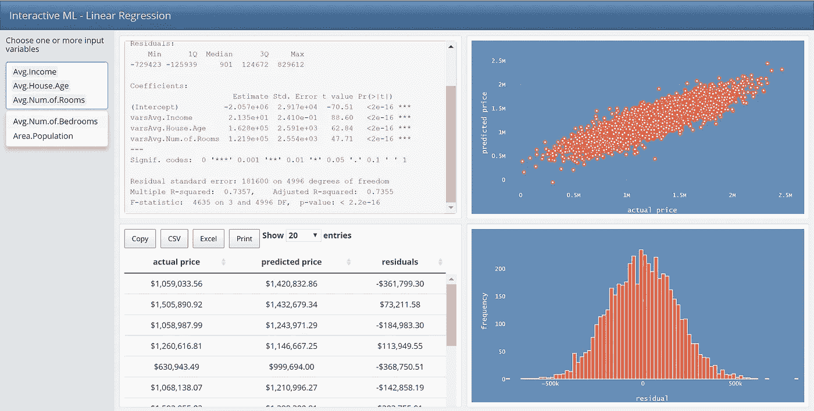

# 用 Shiny 和 Flexdashboard 构建交互式机器学习模型

> 原文：<https://towardsdatascience.com/build-an-interactive-machine-learning-model-with-shiny-and-flexdashboard-6d76f59a37f9?source=collection_archive---------25----------------------->

## **构建房价预测交互式仪表盘的分步指南**

作者图片

在这篇文章中，我们将介绍用 r 构建交互式机器学习仪表板的步骤。如果你不熟悉 flexdashboard 和 Shiny，请参见我以前的文章[这里的](/create-an-interactive-dashboard-with-shiny-flexdashboard-and-plotly-b1f025aebc9c)以获得如何使用 flexdashboard 和 Shiny 构建基本交互式仪表板的分步教程。

要开始使用，请确保您已经安装了`***shiny***` ***、*** `***flexdashboard***` ***、*** `***dplyr***` ***、*** `***plotly***` ***、*** 和`***DT***` ***。***

# 仪表板概述

我们将使用美国住房数据，通过线性回归来预测房价。用户将能够控制独立变量和监测结果的变化。

仪表板将有四种不同的输出。(1) **线性回归汇总**显示了模型的 R2 统计量和 F 统计量，以及参数的 p 值和标准偏差。(2) **实际与预测散点图**揭示了模型预测与实际结果的匹配程度。真实值和期望值之间的差异见(3) **残差直方图**；直方图的形状显示残差是否呈正态分布，以及线性回归模型是否适合该结果。用户也可以从**预测表**中导入数据。当更多的独立变量添加到模型中时，R 的平方增加，残差减少，所有点都更接近回归线。

# 让我们开始吧

# **步骤一。创建仪表板布局**

使用**文件>新文件> R 减价>创建空文档，从 R Studio 初始化空减价。**接下来，让我们复制[模板](https://gist.github.com/nataberishvili/cf2eb4301303bace372db9e864b44893)，保存它，并编织文档。

作者图片

这将创建一个带有侧栏、两列和两行的仪表板。

作者图片

# **第二步。收集和准备数据**

我们将使用[**的美国住房数据。**](https://www.kaggle.com/vedavyasv/usa-housing)**数据分为 7 列，包括 5000 次观察。变量包括房价、家庭地址和市场人口统计数据，包括人口、平均收入、平均房龄以及房间和卧室的平均数量。**

**让我们在仪表板的代码块下加载和准备数据。**

# ****第三步。创建用户输入****

**我们将在侧边栏中创建一个小部件，允许用户为线性模型选择一个或多个自变量。**

**SelectInput 小部件提供了一个基本的下拉菜单。指定了三个参数:(1) **Name** :对用户不可见，我们用它来访问小部件的值，(2) **label** :显示在下拉菜单上方，以及(3) **choices:** 用户选择的值列表。**

**仪表板在呈现时应如下所示:**

****

**作者图片**

# **第四步。创建反应式表达式**

**为了限制在不同的代码块中重复运行同一个函数，我们使用了一个反应表达式。我们第一次运行反应表达式时，它会保存输出。下次我们运行反应表达式时，它会返回保存的值，而不进行任何计算。**

**反应表达式**模型 1** 使用输入变量，运行线性回归模型，并保存输出。可以通过调用表达式的名称后跟括号来访问输出，例如 **model1()** 。可以从反应函数或渲染函数内部调用反应表达式。在下一节中，我们将使用渲染函数(renderPrint、renderPlotly 和 renderDataTable)来访问 model1 的值。**

# ****第五步。用户输出****

## **5.1 添加线性回归输出**

**使用一个简单的 **renderPrint** 函数来呈现和打印一个线性模型概要输出。我们在 render 函数中使用 **model1()** 反应表达式来访问我们在步骤 4 中创建的值。**

## **5.2 添加数据表**

**用 DT DataTable 包构建交互式表格。这个包的主要功能是 datatable()。它创建了一个 HTML 小部件，用数据表显示 R 数据对象。让我们显示实际价格、预测价格和剩余价格三列。残差是实际值和预测值之间的差值。**

## ****5.3 添加 Plotly 散点图:预测价格与实际价格。****

**让我们使用***renderPlotly****函数创建一个散点图，显示预测房价与实际房价。X 轴代表实际值，Y 轴代表预测值。***

## *****5.4 添加残差的 Plotly 直方图*****

***现在画出我们的线性回归模型的残差直方图。围绕零均匀分布的对称钟形直方图表明正态假设可能是正确的。***

***这是没有 CSS 的仪表板的样子。让我们设计仪表板的样式，调整线性回归汇总的字体和颜色以及表格格式。***

******

***作者图片***

# ***第六步。使用 CSS 的样式***

***有几种方法可以将 CSS 添加到 flexdashboard 中。因为我们只是做了一些小的调整，所以我们将 CSS 作为一个单独的代码块来添加。随着 CSS 文件变得越来越大，它会使代码更难阅读和调试，在这种情况下，最好将 CSS 作为一个外部文件。***

***您可以简单地在浏览器中打开仪表板，并检查它的 CSS 选择器。选择器是用来选择我们想要样式化的元素的模式。如果你不熟悉 CSS 选择器和基本的 CSS 属性，我将在参考部分为你提供一些额外的链接。***

## ***CSS 选择器***

*   ***`*.dt-center*` 选择器从仪表板中选择桌子。***
*   ***`*#section-section .shiny-bound-output*`选择器选择线性汇总模型的输出。***

## *****CSS 属性*****

*   ***属性设置元素的背景颜色。***
*   ***`*color*`属性定义了文本的颜色。***
*   ***属性指定了一个元素的字体。***
*   ***`*font-size*`属性设置字体大小。***

******

***第 6 步—最终仪表板。作者图片***

# ***结论:***

***Shiny 是一个强大的工具，用于将 R 的数据处理、可视化和机器学习功能集成到一个交互式 web 应用程序中。在构建高度个性化的基于 web 的解决方案时，Shiny 添加 CSS 代码的能力提供了一个很大的优势。Flexdashboard 提供了一个简单的框架，并且是用大家熟悉的 R markdown 编写的。Shiny 和 Flexdashboard 共同提供了一个优雅的解决方案。查看 [*闪亮画廊*](https://shiny.rstudio.com/gallery/) 中的一些精彩例子，获取更多灵感。

完成的仪表盘可以在下面的 [***页面***](https://nataberishvili.shinyapps.io/experiment/) 中找到。我希望你在制作仪表板的时候玩得开心。我欢迎并感谢您的建议和反馈！***

***谢谢大家！***

# ***参考***

*   ***[Plotly R 图形库| R | Plotly](https://plotly.com/r/)***
*   ***[使用闪亮的 Flexdashboard 和 Plotly 创建一个交互式仪表板| Nata Berishvili |迈向数据科学](/create-an-interactive-dashboard-with-shiny-flexdashboard-and-plotly-b1f025aebc9c)***
*   ***[flex dashboard:R(rstudio.com)的简易交互式仪表盘](https://rmarkdown.rstudio.com/flexdashboard/)***
*   ***【闪亮的 rstudio.com】T4***
*   ***[DT:数据表库(rstudio.github.io)的一个 R 接口](https://rstudio.github.io/DT/)***
*   ***[CSS 选择器— CSS:级联样式表| MDN(mozilla.org)](https://developer.mozilla.org/en-US/docs/Web/CSS/CSS_Selectors)***
*   ***[CSS 选择器(w3schools.com)](https://www.w3schools.com/css/css_selectors.asp)***
*   ***[引导样本:引导的免费主题](https://bootswatch.com/)***