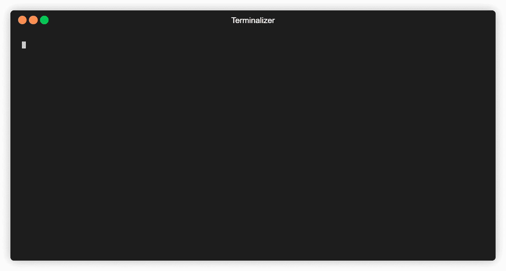

# 构建一个接口来解析任何类型文档中的文本

> 原文：<https://towardsdatascience.com/build-an-interface-to-parse-text-from-any-type-of-document-in-1-line-of-code-33f9dcf8003e?source=collection_archive---------21----------------------->

在 [Unsplash](https://unsplash.com/s/photos/factory?utm_source=unsplash&utm_medium=referral&utm_content=creditCopyText) 上由 [Clayton Cardinalli](https://unsplash.com/@clayton_cardinalli?utm_source=unsplash&utm_medium=referral&utm_content=creditCopyText) 拍照

## 使用面向对象的设计模式从 *txt* 、 *docx* 、 *pdf* 、html、 *pptx* 等文件中提取文本

这篇文章是关于将面向对象的设计原则应用到一个常见的数据科学任务中，从文档中提取文本。我们将构建一个可维护和可定制的接口*来从多种文件类型中提取文本。我所说的接口是指一个对象，即一个类的实例，它可以在一行中从文档中提取文本，而不管文件类型如何。如果您正在构建文本挖掘应用程序，并且希望从各种文件类型中提取文本数据，那么您将需要这个功能。*

有一种好的方法和一种不太好的方法来编写代码来执行这项任务。你不应该这样做:

一个很难维护的从不同文件格式中解析文本的代码示例。

该函数有多种用途:确定文件类型，选择使用 *if-elif-else* 结构执行哪个逻辑路径，最后执行该路径。从软件工程的角度来看，这是有问题的，因为它违反了单一责任原则[1]。

假设您想要添加新的逻辑路径或者改变现有的路径以提供更多的功能，或者因为一个包更新迫使您更改代码；为了做到这一点，你必须修改负责解析所有文件类型的代码。这增加了 bug 完全破坏应用程序的可能性，而不是部分破坏。此外，你可能很快就会得到一个包含数十条 elif 语句的巨大函数:你添加的越多，你就越有可能引入一个 bug，而且没有人(包括你自己)会喜欢试图理解在使用、修改或修复代码时发生了什么。我们需要把它分解成几个部分。

我们将通过使用*工厂方法模式*来重构这段代码，这是一种在 90 年代流行的面向对象的设计模式，用于生成一个类的新实例。在我们的例子中，我们想要生成的对象将是一个字符串，但是最初，我们并不确切地知道如何去做，因为这取决于我们想要读取的文件类型。

工厂模式方法定义了一个接受任何文件类型的接口，然后*将对象生成的实现委托给*一个子类或函数。为了澄清这个概念，让我们来谈谈下面的例子中发生了什么。

## 使用工厂方法模式重构

定义一个通用接口来解析 txt 和 docx 文件。

类 *DocParser* 有一个方法 *parse。*当用户用文件路径调用 *parse* 时，会发生一系列事件:

1.  路径传递给第 6 行中的函数 *get_format* ，返回值存储在变量*解析器中。*
2.  *get_format* 从路径中提取文件扩展名，并在其返回语句中将其传递给另一个函数 *get_parser，*。
3.  在 *get_parser* 内部，使用一个 *if-elif-else* 结构，根据文件扩展名执行三个逻辑路径之一。如果提供了有效的文件扩展名，则返回两个函数之一， *parse_txt* 或 *parse_docx* 。
4.  此时，第 6 行中定义的变量 *parser* 现在存储的是 *parse_txt* 或 *parse_docx。*第 7 行，将文件路径传递给存储在*解析器*中的函数，并将结果字符串对象返回给用户。

这就是为什么我们将 *DocParser* 的实例称为*接口*的原因，因为它唯一的职责是充当用户和生成用户所请求的对象的逻辑之间的接口。接收到文件类型后，接口将确定文件类型、选择解析函数和实际生成对象的责任传递给其他函数。这就是我们所说的接口*推迟了*类的实现的意思。

函数 *parse_txt* 和 *parse_docx* 被称为该类的*具体实现*，它们是为给定文件类型生成字符串对象的部分。

现在，最初的功能已经被分解为多个部分，每个部分都有一个单一的职责。为什么这样更好？

我们现在可以添加和更改我们接口的功能，而不必触及代码的其他部分，我们只需定义一个新的具体实现作为一个函数，并添加另一个 *elif* 语句到 *get_parser。*这更容易维护，尤其是当您想要解析的文件类型数量增加时，这意味着如果一部分停止工作，其余的代码将不受影响。下面是如何修改上面的例子来提供解析 *pdf* 、 *html、*和 *pptx* 文件的功能。

解析 pdf、html 和 pptx 文件的额外功能可以很容易地添加到界面中。

我们做的第一件事是向 *get_parser* 添加更多的 *elif* 语句，然而，由于我们在每个逻辑路径中只有一个 return 语句，函数仍然可读。然后我们定义了三个新函数 *parse_pdf、* *parse_html* 和 *parse_pptx* ，而原来的解析函数保持不变。很容易理解如何继续这种模式来解析任何类型的文件。

## 使用公共界面

通过将上述代码保存在一个文件中， *parse_file.py，*我们可以用一个简单的 *import* 语句*将接口导入到我们的应用程序中。*我们需要做的就是实例化一个 *DocParser* 对象，我们可以使用 *parse* 方法在一行中读取我们定义的所有文件类型的文本，如下面的第 17 行*所示。*

如何使用 DocParser 的实例来解析每个不同文件类型的文本。

在这个例子中，我们在一个循环中调用 *parse* 方法，路径指向 *txt、docx、pdf、html、*和 *pptx* 文件，并将结果打印到终端。你可以在项目 GitHub repo 访问测试文件，我在这里从[下载了 *html* 文本文件。输出如下面的动画所示。](https://www.webfx.com/blog/images/assets/cdn.sixrevisions.com/0435-01_html5_download_attribute_demo/samp/htmldoc.html)

每个测试文件中包含的文本被顺序打印到终端上(我添加了一个 2 秒钟的 sleep 命令，以使动画更容易观看)。作者的动画。

如您所见， *DocParser* 的单个实例可以解析我们传递给它的所有五种文件类型。 *pdf* 和 *html* 文件包含一些空白，所以如果你愿意，你可以去编辑 *parse_pdf* 和 *parse_html* 来移除这个，*安全地知道你的其他解析功能将保持不变。*

## 结论

我们已经介绍了如何使用工厂方法设计模式来构建可维护的接口，该接口可以解析许多不同类型的文档，使我们能够在文本挖掘项目中利用尽可能多的数据源。一旦构建了接口，我们就可以用它在一行代码中提取文本，保持应用程序文件的整洁。

请注意，这种模式是通用的，可以在任何用于生成对象的逻辑依赖于某些参数的情况下使用，这些参数通常由应用程序的用户决定。在其他地方，我发现这对于为 API 提供额外的功能非常有用，这样它就可以接受各种请求负载。稍加考虑，您可能会找到在自己的应用程序中使用这种设计模式的方法，保持它们的整洁、可维护性和通用性。

[1] [单一责任原则](https://blog.cleancoder.com/uncle-bob/2014/05/08/SingleReponsibilityPrinciple.html)

[2] [设计模式:可复用面向对象软件的要素](https://en.wikipedia.org/wiki/Design_Patterns)

我们连线: [Linkedin](https://www.linkedin.com/in/oliver-batey-084a75150/)