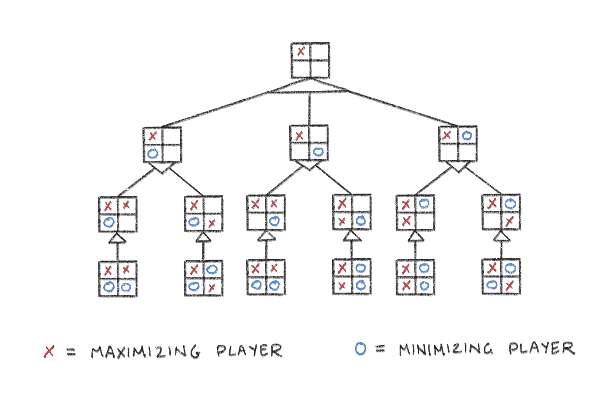
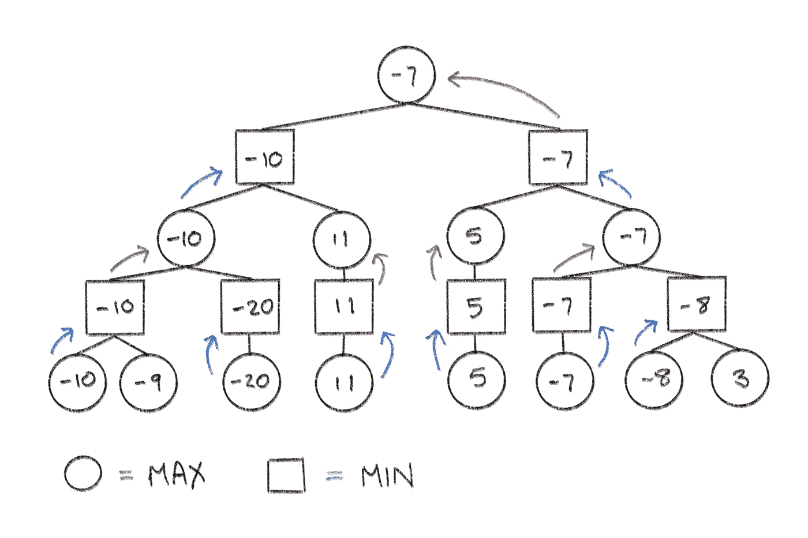
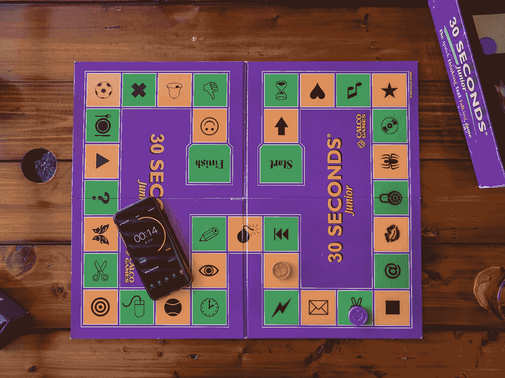

# 建立一个无与伦比的棋盘游戏人工智能

> 原文：<https://towardsdatascience.com/build-an-unbeatable-board-game-ai-68719308a17?source=collection_archive---------18----------------------->

## 一个详细的指南，以编码一个复杂的算法，掌握回合制战略游戏


阿瑟·奥西皮扬在 [Unsplash](https://unsplash.com?utm_source=medium&utm_medium=referral) 上的照片

# 介绍

如果你想尝试人工智能，甚至是一点博弈论，那么建造一台赢棋的机器是一个很好的项目。

我实现了这个 AI 来玩 Connect Four，但它适用于许多不同的游戏。不过，我还是推荐像 Connect Four 这样的游戏，因为游戏机制很简单。

以国际象棋为例:Minimax 可以下棋，但你有几个不同的棋子，可以走不同的棋，有捕捉，阉割，检查和将死等。而使用 Connect Four，您所能做的就是将一片放入一列中。这意味着每一步棋都非常简单，可以用一个整数来表示(棋子所在列的索引)，棋盘只是一个 2D 数组。

像井字游戏这样的游戏也是一个不错的选择，但是即使在那里，你也必须考虑列和行。

现在让我们来谈谈这个人工智能将如何实际工作:**极大极小算法。**

# Minimax 如何工作

在博弈论中，极大极小是一种递归算法，它最大化自己的机会，同时最小化对手的机会。因此，这个名字不言自明。

假设对手先动。一旦移动完成，Minimax 会查看游戏棋盘的状态，然后考虑它可能做出的每一步棋。对于每一个结果游戏状态，它会考虑对手可能采取的每一个可能的行动，等等…

这将一直进行，直到找到一个终端游戏状态(游戏获胜或棋盘已满)，或者直到达到某个深度。深度是有上限的，否则所有可能的游戏状态的树会快速增长，计算起来会变得非常慢。



最小最大算法考虑了所有可能的棋盘状态(所有图片由作者提供)

现在，在每个级别，这些棋盘状态中的每一个都将根据一组参数(由您定义)分配一个分数，以确定该状态对于最大化玩家或最小化玩家(无论轮到谁)在机会方面有多“好”或“坏”。例如，当前玩家的获胜棋盘将被分配极高的分数，而对手的获胜棋盘将被分配极低的分数。还必须分配中间分数，因为除了最简单的游戏，大多数棋都不是赢棋。

然后，算法选择最终导致 AI 得分最高而对手得分最低的棋盘状态。这就是它将要采取的行动。



选择最高和最低分数的极大极小算法

# 履行

## 设置

为了能够编写极大极小算法，你需要一些变量和函数，它们的实现取决于你的棋盘游戏:

```
npc => In my case, just a character that represents the AI's piece
opponent => Another character to represent the opponent's pieceisTerminalNode() => To determine if a board is terminal (boolean)
isWinningMove()  => To determine if a move wins the game (boolean)
getValidMoves()  => To get all possible valid moves (array)
score()          => To calculate a board state's score (integer)
tempBoard()      => To make a copy of the game board (2D array)
makeMove()       => Make a hypothetical move on the board (void)
```

因为我的游戏是 Connect Four，所以我的 *isTerminalNode()* 方法调用一系列帮助器方法来完成以下任务:

1.  检查一行中是否有四个(对角、垂直或水平)。
2.  检查棋盘是否已满，不能再移动了。

您需要 *getValidMoves()* ，因为一列可能会变满，因此 Minimax 不应该试图在该列中移动。

并且 *score()* 方法调用更多的帮助器方法，这些方法最终为当前棋盘分配一个分数。这是我如何分配分数的(这是你可以支付的——调整损失函数):

```
Current player gets 4 in a row                              => 100
Current player gets 3 in a row with an empty adjacent space => 5
Current player gets 2 in a row with 2 empty adjacent spaces => 2
Opponent has 3 in a row with an empty adjacent space        => -500
```

这将确保你的人工智能把它的棋子一个接一个地摆放，同时阻止对手连续获得 4 个。



照片由[真诚媒体](https://unsplash.com/@sincerelymedia?utm_source=medium&utm_medium=referral)在 [Unsplash](https://unsplash.com?utm_source=medium&utm_medium=referral) 上拍摄

## 该算法

我用 Java 编写了我的代码，但是我打算在这里把它翻译成一种 Java/Python 风格的伪代码，以保持这篇文章的语言不可知。

*   在第一部分中，检索所有可以进行的有效移动，并检查棋盘是否处于终止状态。
*   我们每次都会减少深度，所以当深度为 0 或者棋盘是终点时，检查游戏是 NPC(非玩家角色)赢了还是对手赢了。
*   如果是，分别返回一个很高或很低的分数。如果没有，返回该板的分数。

```
minimax(board, depth, maximisingPlayer)
    int[] validCols = *getValidMoves*(board)
    boolean isTerminalNode = *isTerminalNode*(board)
    if (depth == 0 || isTerminalNode)
        if (isTerminalNode)
            if (*isWinningMove*(board, *npc*))
                return null, 1000000000
            else if (*isWinningMove*(board, *opponent*))
                return null, -2000000000
            else
                return null, 0
        else
            return null, *score*(board, *npc)*
```

注意这个函数返回两件事:分数和移动。

*   创建两个变量:*移动*(有效移动列表中的随机移动)和*值*(分数)
*   现在检查当前回合是针对我们的 AI(我们想要最大化的玩家)还是对手(我们想要最小化的玩家)。这作为一个参数传递到函数中—检查上面代码块中的签名。
*   如果轮到最大化玩家，将*值*设置为非常低的值，比如负无穷大。
*   接下来，遍历有效走法的数组，对每个走法进行走法(在棋盘的副本上，以便不改变原始棋盘的状态——我定义了一个函数来浅层复制我的棋盘)，递归调用 *minimax()，*传入新的游戏棋盘，深度减 1 并为 false(因为现在我们要为最小化玩家走法)。调用末尾的[1]表示我们希望返回第二个东西，即分数。
*   如果 *minimax()* 返回的分数大于负无穷大，则给 value 赋值并移动。

```
 int move = validCols[(Math.*random*() * validCols.length)]
    double value if (maximisingPlayer)
        value = *NEGATIVE_INFINITY*;
        for (int validCol : validCols)
            char[][] tempBoard = *tempBoard*(board)
            *makeMove*(validCol, tempBoard, *npc*, *ROWS*)
            int newScore = *minimax*(tempBoard, depth - 1, false)[1]
            if (newScore > value)
                value = newScore
                move = validCol
```

最后，在为最小化玩家调用函数的情况下，进行完全相反的操作。

```
 else
        value = *POSITIVE_INFINITY*
        for (int validCol : validCols)
            char[][] tempBoard = *tempBoard*(board)
            *makeMove*(validCol, tempBoard, *opponent*, *ROWS*)
            int newScore = *minimax*(tempBoard, depth - 1, true)[1]
            if (newScore < value)
                value = newScore
                move = validCol return move, value
```

返回的移动是你最终想要的。就这么简单。


照片由[马库斯·温克勒](https://unsplash.com/@markuswinkler?utm_source=medium&utm_medium=referral)在 [Unsplash](https://unsplash.com?utm_source=medium&utm_medium=referral) 上拍摄

## 最佳化

你的人工智能对可能的棋盘看得越深，它就越复杂。然而，正如我前面提到的，这需要很高的计算成本。

当然，你可以通过一种叫做 alpha-beta 剪枝的方法来优化 Minimax 算法，我将在另一篇文章中讨论这一点，当它出来的时候在这里链接。

# 结论

你会注意到，有了这些简单的规则，人工智能开始表现出优秀玩家推荐的行为。例如，当我的 AI 第一个移动的时候，它总是把它的棋子放在中间。我从来没有明确地编程让它这么做，这只是让人工智能的可能性最大化的一步。

我已经把游戏发给了我的一个朋友，他认为自己是一个相当强大的 Connect Four 玩家，他是那个称人工智能为“不可战胜”的人。

这应该给你实现你自己的棋盘游戏-粉碎人工智能所需要的东西。如果你真的做了一些很棒的东西，请留下回复。

同时，祝您编码愉快！

# 资源

**凯斯加利**连接四个极小极大艾 https://www.youtube.com/watch?v=MMLtza3CZFM

**辉煌** *极大极小算法*[https://brilliant.org/wiki/minimax/](https://brilliant.org/wiki/minimax/)

**FreeCodeCamp***Minimax 算法*[https://www . FreeCodeCamp . org/news/playing-strategy-games-with-Minimax-4 ECB 83 b 39 B4 b/](https://www.freecodecamp.org/news/playing-strategy-games-with-minimax-4ecb83b39b4b/)