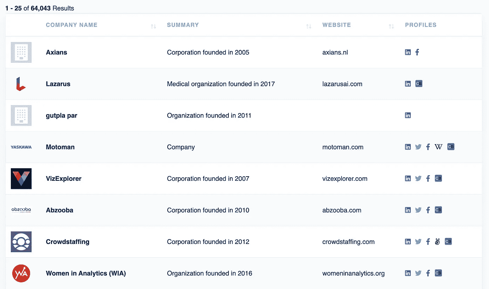

# 用 Diffbot 构建和分析知识图

> 原文：<https://towardsdatascience.com/build-and-analyze-knowledge-graphs-with-diffbot-2af83065ade0?source=collection_archive---------15----------------------->

## 如何用知识图谱回答疑难问题

# 动机

当你想进一步了解一个人的时候，你通常会怎么做？你可能会决定使用维基百科等网站来了解一个人。


作者图片

但是，文本可能会很长，您可能需要一段时间才能获得所需的信息。

既然我们更擅长吸收图像形式的信息而不是文本，那么如果你在搜索史蒂夫·乔布斯时能得到如下的图表岂不是很好？


作者图片

这时 Diffbot 就派上用场了。在本文中，您将学习如何使用 Diffbot 构建和分析知识图。

# 什么是知识图？

知识图表示实体的集合，这些实体是对象、事件、抽象概念，并说明它们之间的关系。谷歌使用知识图表来增强其搜索引擎的结果。


作者图片

## 用 Diffbot 访问知识图

[**Diffbot**](https://www.diffbot.com/) 是世界上最大的知识图，允许你访问网络上万亿个相关事实。

从 Diffbot 开始，[注册 14 天的免费试用。](https://app.diffbot.com/get-started/)这次免费试用将允许您搜索 Diffbot 的知识图谱。

登录后，单击搜索选项搜索 Diffbot 知识图。


作者图片

# 分析苹果的员工

你有没有想过:

*   苹果的员工去了哪所学校，
*   他们的专业是什么，
*   苹果公司最受欢迎的角色是什么？

我们可以使用 Diffbot 的搜索来回答这些问题。首先通过以下方式搜索苹果公司的 Diffbot ID:

*   选择“组织”
*   按“包含”apple 的“名称”过滤
*   点击“搜索”


作者图片

您将看到 61，820 个与苹果相关的结果。由于我们只对苹果公司感兴趣，请点击“苹果公司”


作者图片

您将被引导至显示 Apple Inc .具体信息的网站。复制该网站 URL 中的 ID。在下面的 URL 中找到的 ID 是“EHb0_0NEcMwyY8b083taTTw”。


作者图片

要搜索 Apple Inc .的所有员工，请单击查询选项卡，然后传递:

```
type:Person employments.employer.id:”EHb0_0NEcMwyY8b083taTTw”
```

…到搜索框。


作者图片

点击“搜索”后，Diffbot 将返回超过 200k 的结果。

## **获取知识图**

单击右上角的图表图标，查看结果的知识图表。


作者图片

而且你应该会看到如下的知识图！这张图表显示了苹果公司和其他实体之间的关系。与这些实体的关系可以是“城市”、“雇主”、“市区”、“机构”等


作者图片

请注意，此图仅显示了前 25 个结果。要获得接下来 25 个最重要结果的知识图表，请单击图表顶部的“更多”按钮。

为了更好地查看某个节点，可以将其移动到另一个位置。


作者 GIF

要查看每个实体的信息，请单击该实体。您应该会看到如下信息:


作者 GIF

## **获取 JSON**


作者图片

要获得 JSON 格式的结果，单击右上角的 JSON 选项卡。

## **寻找苹果员工的顶级技能**

苹果的员工有哪些技能？我们可以通过查看 JSON 文件中的技能部分找到答案。


作者图片

一个员工可以拥有多种技能，不同的员工拥有不同的技能。有没有一种方法可以总结这些技巧？这可以通过在前面的查询中添加`facet:skills.name`来轻松实现:

```
type:Person employments.employer.id:"EHb0_0NEcMwyY8b083taTTw" facet:skills.name
```

*   `facet`将显示关于指定字段的值的汇总数据
*   `skills.name`告诉 Diffbot 访问 JSON 文件中`skills`字段内的`name`字段。

苹果员工的 50 大技能:


作者图片


作者图片

## **获取专业**

苹果公司的员工在大学时都是学什么专业的？我们可以通过在查询中添加`facet:educations.major.name`来找出答案:

```
type:Person employments.employer.id:"EHb0_0NEcMwyY8b083taTTw" facet:educations.major.name
```

苹果员工最喜欢的 25 个专业是:


作者图片

从上图中，我们可以看到**热门专业**与**计算机科学、**和**工商管理**相关。这一结果并不令人惊讶，因为苹果是一家专门从事消费电子产品、计算机软件和在线服务的技术公司。

## **得到学校**

苹果的员工上过哪些顶尖的学校？这可以通过在查询中添加`facet:educations.institution.name`来找到:

```
type:Person employments.employer.id:"EHb0_0NEcMwyY8b083taTTw" facet:educations.institution.name
```


作者图片

苹果员工去过的前 5 所学校是:

*   斯坦福大学
*   加州大学伯克利分校
*   SJSU
*   哈佛大学
*   凤凰城大学

我们可以看到很多这样的大学都是全国顶尖的大学，而且都位于加州。这并不意味着你需要去这些顶尖大学才能被苹果录取。这确实意味着，如果你去这些大学，你可能有更高的机会被苹果公司录取。

# 分析人工智能公司

你有没有想过:

*   人工智能公司的收入是多少，
*   这些公司位于哪些国家，
*   这些公司有多少员工？

让我们用 Diffbot 来回答这些问题。从选择“组织”开始，然后按行业过滤搜索。单击下拉框并向下滚动，直到您看到“人工智能公司”选项。


作者图片


作者图片

搜索结果中显示的前 25 家公司的知识图表:


作者图片

## 热门描述符

这些人工智能公司排名前 50 的描述符是什么？让我们通过将`facet: descriptors`添加到前面的查询中来找出答案:

```
type:Organization industries:"Artificial Intelligence Companies" facet: descriptors
```


作者图片


作者图片

## 收入

这些公司的收入如何？

```
type:Organization industries:"Artificial Intelligence Companies" facet: revenue.value
```


作者图片


作者图片

这些公司中的大多数收入在**10 万到 100 万美元之间。**

要获取收入在特定范围内的公司，可以将以下内容添加到查询中:

```
type:Organization industries:"Artificial Intelligence Companies" revenue.value>=100000 revenue.value<500000
```



作者图片

## 与人工智能相关的公司数量最多的国家

另一件有趣的事情是，哪些国家拥有最多的人工智能公司。

```
type:Organization industries:"Artificial Intelligence Companies" facet: location.country.name
```

前 25 个国家的位置:


作者图片

人工智能公司数量最多的前 5 个国家的名称:


作者图片

## 雇员人数

这些公司的平均员工人数是多少？

```
type:Organization industries:"Artificial Intelligence Companies" facet: nbEmployees
```


作者图片

大多数公司的员工人数从 5 到 100 不等。员工超过 10 万人的公司只有 4 家。它们是什么？

让我们通过点击图表下方表格中的数字来找出答案:


作者图片


作者图片

全球只有 **4 家**公司**员工超过**10 万人，而且都是**日本公司**！这可能是因为许多日本工人忠于他们的公司。

这些结果很酷。但是，如果您想从 Diffbot 中导出数据以进行进一步分析，该怎么办呢？这可以使用 Python 或命令行来完成。

# 从 Diffbot 下载数据

## 使用 Python 下载

要使用知识图 API，请向以下端点发出 HTTP GET 请求:

```
https://kg.diffbot.com/kg/dql_endpoint?token=...&type=query&query=...
```

我们还可以创建一个返回端点的函数。该函数采用:

*   Diffbot 的 API 令牌
*   我们想要下载的 JSON 文件的 URL

您可以在控制面板的右上角找到该令牌。


作者图片

单击右上角的 JSON 选项卡可以找到 JSON 文件的 URL。


作者图片

使用您被定向到的页面的 URL 作为函数`get_diffbot_json`的第二个参数。

您将获得一个可下载的 URL:

```
[https://kg.diffbot.com/kg/dql_endpoint?token=your-token&type=query&query=type%3APerson+id%3A%22EyauXV2QZOW2fEP8Cb_Hoxg%22&from=0&size=25&output_format=](https://kg.diffbot.com/kg/dql_endpoint?token=c2887c50296c48408adef6ca12ce831c&type=query&query=type%3APerson+id%3A%22EyauXV2QZOW2fEP8Cb_Hoxg%22&from=0&size=25&output_format=)
```

要下载由`get_diffbot_json`返回的 URL 中的数据，使用请求库:

并且 JSON 文件将保存在您的本地机器中！

## 使用命令行下载

您也可以使用`wget`在您的终端上下载 JSON 文件:

```
wget [https://kg.diffbot.com/kg/dql_endpoint?token=your-tokenc&type=query&query=type%3APerson+id%3A%22EyauXV2QZOW2fEP8Cb_Hoxg%22&from=0&size=25&output_format=](https://kg.diffbot.com/kg/dql_endpoint?token=c2887c50296c48408adef6ca12ce831c&type=query&query=type%3APerson+id%3A%22EyauXV2QZOW2fEP8Cb_Hoxg%22&from=0&size=25&output_format=)
```

# 结论

恭喜你！您刚刚学习了如何使用 Diffbot 构建知识图和总结基本事实。希望这篇文章能给你动力去探索你感兴趣的其他话题。

我喜欢写一些基本的数据科学概念，并尝试不同的算法和数据科学工具。你可以在 LinkedIn 和 T2 Twitter 上与我联系。

星[这个回购](https://github.com/khuyentran1401/Data-science)如果你想检查我写的所有文章的代码。在 Medium 上关注我，了解我的最新数据科学文章，例如:

</pyvis-visualize-interactive-network-graphs-in-python-77e059791f01>  </how-to-sketch-your-data-science-ideas-with-excalidraw-a993d049f55c> [## 如何用 Excalidraw 勾画您的数据科学想法

towardsdatascience.com](/how-to-sketch-your-data-science-ideas-with-excalidraw-a993d049f55c) </top-6-python-libraries-for-visualization-which-one-to-use-fe43381cd658>  </how-to-create-bindings-and-conditions-between-multiple-plots-using-altair-4e4fe907de37> 