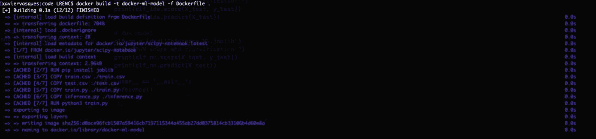
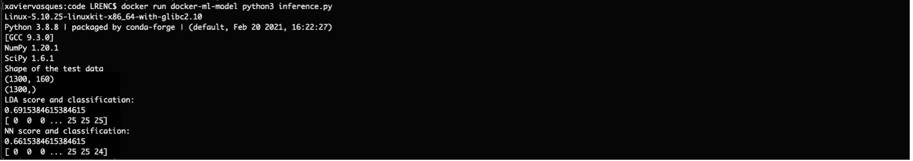
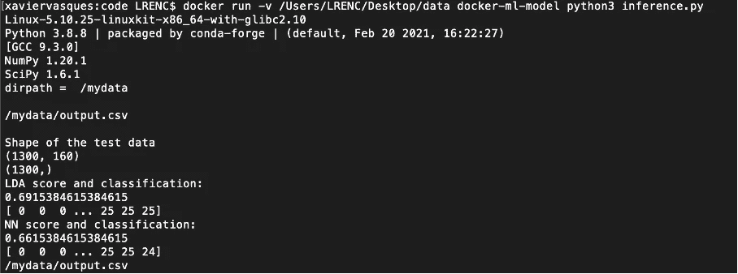

# 为你的机器学习模型构建并运行一个 Docker 容器

> 原文：<https://towardsdatascience.com/build-and-run-a-docker-container-for-your-machine-learning-model-60209c2d7a7f?source=collection_archive---------0----------------------->

## 使用简单的机器学习模型快速简单地构建 Docker 容器


Annamária Borsos 摄影

本文的想法是用一个简单的机器学习模型快速简单地构建一个 Docker 容器并运行它。在阅读本文之前，请务必阅读[为什么使用 Docker 进行机器学习](https://xaviervasques.medium.com/why-using-docker-for-machine-learning-74c927ceb6c4)和[Docker 的快速安装和首次使用](https://xaviervasques.medium.com/quick-install-and-first-use-of-docker-327e88ef88c7)。

为了开始为机器学习模型构建 Docker 容器，让我们考虑三个文件: **Dockerfile、train.py、inference.py.**

你可以在 [GitHub](https://github.com/xaviervasques/EEG-letters) 上找到所有文件。

**train.py** 是一个 python 脚本，它接收并规范化 csv 文件(train.csv)中的 EEG 数据，并训练两个模型对数据进行分类(使用 scikit-learn)。该脚本保存了两个模型:线性判别分析(clf_lda)和神经网络多层感知器(clf_NN)。

将调用 **inference.py** 通过加载之前创建的两个模型进行批量推理。该应用程序将对来自 csv 文件(test.csv)的新 EEG 数据进行标准化，对数据集进行推理，并打印分类准确性和预测。

让我们创建一个简单的 **Dockerfile** ，使用 **jupyter/scipy-notebook** 图像作为我们的基本图像。我们需要安装 **joblib** 来允许我们的训练模型的序列化和反序列化。我们将 train.csv、test.csv、train.py 和 inference.py 文件复制到映像中。然后，我们运行 **train.py** ，它将拟合和序列化机器学习模型，作为我们映像构建过程的一部分，这提供了几个优势，例如在过程开始时进行调试的能力，使用 Docker 映像 ID 进行跟踪或使用不同的版本。

为了构建映像，我们在终端中运行以下命令:

```
docker build -t docker-ml-model -f Dockerfile .
```

输出如下所示:



是时候对新数据执行推断了(test.csv):

```
docker run docker-ml-model python3 inference.py
```

输出如下所示:



我们可以做一些事情来改善我们的集装箱化体验。例如，我们可以使用 docker 文件中的 WORKDIR 绑定容器中的主机目录:

在**推论. py** 中，我们可以决定保存一个**输出. csv** 文件，其中包含 **X_test** 数据:

当您构建并运行它时，您应该能够在 **/mydata** 中看到 **output.csv** 文件:



我们还可以在 Dockerfile 文件中添加 **VOLUME** 指令，生成一个将创建新挂载点的映像:

使用我们指定的名称， **VOLUME** 指令创建一个挂载点，该挂载点被标记为保存从本地主机或其他容器外部挂载的卷，我们在这些容器中找到我们想要处理的数据。

对于未来的开发，可能有必要从一开始就设置环境变量，只需在构建时设置一次，以便持久化训练好的模型，并可能向特定位置添加额外的数据或元数据。设置环境变量的好处是避免在代码中到处都是必要路径的硬代码，并且在一个商定的目录结构上更好地与他人共享您的工作。

让我们再举一个例子，用一个新的 docker 文件:

我们需要给 **train.py** 添加环境变量:

和**推论. py** :

# 下一步是什么？

我们的目标是通过简单的机器学习模型，产生快速简单的步骤来构建 Docker 容器。构建就像做一个**docker build-t my-docker-image 一样简单。**。

从这一步开始，我们可以开始部署我们的模型，这将更加简单，并消除发布和扩展您的机器学习模型的恐惧。下一步是用一个 CI/CD 工具(持续集成/持续交付)产生一个工作流，比如 Jenkins。得益于这种方法，可以在任何地方构建和服务 docker 容器，并公开 REST API，以便外部利益相关者可以使用它。如果您正在训练一个需要高计算需求的深度学习模型，您可以将容器移动到高性能计算服务器或您选择的任何平台，如内部、私有或公共云。这个想法是，您可以扩展您的模型，但也可以创建弹性部署，因为您可以跨区域/可用性区域扩展容器。

我希望您能看到容器提供的极大的简单性和灵活性。通过容器化你的机器/深度学习应用，你可以让它对世界可见。下一步是在云中部署它并公开它。在某些时候，您需要借助 Red Hat open shift(Kubernetes 发行版)等技术来协调、监控和扩展您的容器，以便为数百万用户提供服务。

**来源**

[https://docs.docker.com/engine/reference/builder/](https://docs.docker.com/engine/reference/builder/)

[https://mlinproduction.com/docker-for-ml-part-3/](https://mlinproduction.com/docker-for-ml-part-3/)

[https://theaisummer.com/docker/](https://theaisummer.com/docker/)