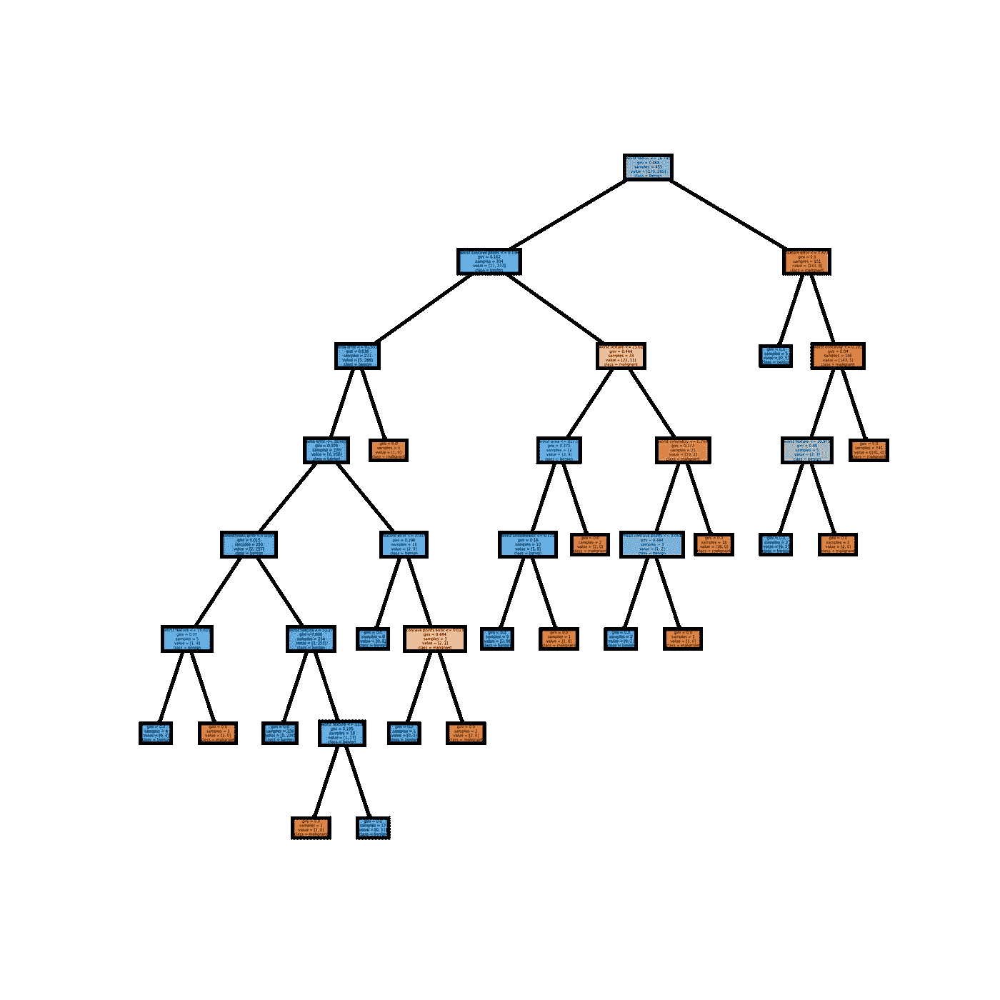

# 通过修剪构建更好的决策树

> 原文：<https://towardsdatascience.com/build-better-decision-trees-with-pruning-8f467e73b107?source=collection_archive---------3----------------------->

## 通过限制最大深度和修剪减少决策树的过度拟合和复杂性

作者:[爱德华·克鲁格](https://www.linkedin.com/in/edkrueger/)、[希德尔·邦戈尔](https://www.linkedin.com/in/sheetal-bongale/)和[道格拉斯·富兰克林](https://www.linkedin.com/in/dougaf/)。

照片由 Ales Krivec 在 Unsplash 上拍摄

***在另一篇文章*** *中，我们讨论了决策树或 CART 算法的基本概念，以及在回归或分类问题中使用决策树的优势和局限性。*

*点击这里阅读更多内容:*

 [## 了解决策树是如何生长的

towardsdatascience.com](/learn-how-decision-trees-are-grown-22bc3d22fb51) 

有关决策树的视频**介绍**，请查看本 **8 分钟课程**:

**在本文中，**我们将重点关注:

*   **决策树中的过度拟合**
*   **限制最大深度**如何**防止**决策树过拟合
*   **成本复杂性修剪**如何能够**防止过度适应**决策树
*   在 **Python** 中实现一棵**全树**、一棵**有限最大深度树**和一棵**修剪树**
*   修剪的**优点**和**限制**

*下面使用的* ***代码*** *在本* [***GitHub 资源库***](https://github.com/edkrueger/tree-demos) *中可用。*

# 过度拟合和决策树

决策树容易过度拟合。如果我们允许决策树增长到其最大深度，它将总是过度适应训练数据。

当决策树被训练为完全适合训练数据集中的所有样本时，该决策树是过度适合的。您可以调整一些参数，如 [min_samples_leaf](https://scikit-learn.org/stable/modules/generated/sklearn.tree.DecisionTreeClassifier.html) ，以最小化默认过拟合。这种类型的调整被称为**预修剪，**但是超出了本文的范围。

你让你的树长得越深，决策规则的序列就变得越复杂。给一棵树指定一个最大深度**可以简化它并防止过度拟合。**

让我们来看看一个没有使用 Python 修剪的**完整决策树**:

这些 ipynb 单元包含导入、数据文件的路径以及构建和交叉验证树模型所需的变量。

现在让我们用 scikit-learn 来种出我们的第一棵树。

在这里，我们创建了`full_tree`，一个 scikit-learns `DecisionTreeClassifier`的实例。然后，我们将模型与训练数据进行拟合。

接下来，我们使用 matplotlib 来确定可视化的大小，使用 scikit-learn 的`plot_tree`来绘制我们的树。

注意这棵树的大小。这个二元分类器中有多少规则？

如果你数的是“18”，你答对了。下面是这棵树遇到**测试数据**时的分类报告。

注意精确度，91。在我们构建下两棵树时，请记住这一点。

默认情况下，树会一直生长，直到每个叶节点中的所有点都来自同一个类。换句话说，直到每片叶子都**纯**。

怎样才能产生一个规则更少结果更好的树？

# **如何用最优最大深度简化决策树**

现在让我们建立一棵树，并限制其最大深度。

在上面的第一个单元格中，我们找到了整个树的深度，并将其保存为`max_depth`。我们这样做是为了从 1 → `max_depth`建立一个网格搜索。

这种网格搜索建立深度范围为 1 → 7 的树，并比较每棵树的训练精度，以找到产生最高训练精度的深度。

最精确的树的深度为 4，如下图所示。

这棵树有 10 条规则。这意味着它是一个比完整树更简单的模型。

它在测试数据上的表现如何？

看那个！规则更少，准确率更高。当我们限制我们的最大深度时，我们确实建造了一个更好的模型。

然而，有时设置一个最大深度可能会过于苛刻，导致拟合不足。

我们如何以更精确的方式调整我们的树模型？

# 什么是修剪？

**修剪**是一种用于减少过度拟合的技术。修剪还通过删除最弱的规则来简化决策树。修剪通常分为:

*   **预修剪**(提前停止)在树完成对训练集的分类之前停止树，
*   **后期修剪**允许树对训练集进行完美的分类，然后对树进行修剪。

在本文中，我们将重点关注**后期修剪**。

修剪从一棵未修剪的树开始，获取一系列子树(修剪过的树)，并通过交叉验证选择最佳的一棵。

修剪应确保以下几点:

*   子树是最优的，这意味着它在交叉验证的训练集上具有最高的准确性。(采油树可以针对对工程师最重要的任何参数进行优化，但并不总是精确的)
*   对最优子树的搜索在计算上应该是易处理的。

在 scikit-learns `DecisionTreeClassifier`中，`ccp_alpha`是**成本复杂度参数。**

本质上，修剪递归地找到具有“最弱链接”的节点最弱的链路由有效α来表征，其中具有最小有效α的节点首先被修剪。

数学上，树 T 的**成本复杂性度量**由下式给出:

*   **R(T)** —叶节点的总训练误差
*   **|T|** —叶节点数
*   **α** —复杂度参数(整数)

随着 alpha 的增加，更多的树被修剪，这增加了树叶的总杂质。

如果只是试图减少训练误差 **R(T)** ，会导致树相对更大(叶节点更多)，造成过拟合。

成本复杂性修剪生成一系列树，其中子树 **Tₜ** 的成本复杂性度量为:

参数 **α** 通过控制叶节点的数量来降低树的复杂度，最终减少过拟合。

> *最终选择哪个子树取决于α。如果****α= 0****，那么将选择最大的树，因为复杂度惩罚项实质上被丢弃了。当α接近无穷大时，将选择大小为 1 的树，即单个根节点。*

为了了解什么样的`ccp_alpha`值将有助于减小树的大小，scikit-learn 提供了一个函数`cost_complexity_pruning_path`，它返回修剪过程中每一步的有效 alphas 和相应的总叶子杂质。

让我们构建最终的树模型，看看它的表现如何。

上面的每个`ccp_alpha`代表一个最优子树。我们再次构建网格搜索来比较不同的树。这里，网格搜索比较每个最优子树的训练精度。

我们看到最准确的子树是由`ccp_alpha`，0.0059340658…

现在让我们画出这棵修剪过的树。

这个模型只包含 5 条规则！

与以前的决策树图相比，修剪后的模型不太复杂，更容易解释，也更容易理解。

使用最大深度限制树的一半规则，我们已经达到了相同的精度。我们又一次改进了我们的模型！这一次，我们在保持性能的同时降低了复杂性。

# 修剪决策树的优势

*   修剪降低了最终树的复杂性，从而减少了过度拟合。
*   可解释性——修剪过的树更短，更简单，也更容易解释。

# 修剪的局限性

类似于套索正则化，没有真正的劣势。然而，修剪带来了很高的计算成本。

## **资源**

*   scikit-学习文档为**c**[ost 复杂性修剪](https://scikit-learn.org/stable/auto_examples/tree/plot_cost_complexity_pruning.html#sphx-glr-auto-examples-tree-plot-cost-complexity-pruning-py) **。**
*   PennState STAT 508 |应用数据挖掘和统计学习[https://online.stat.psu.edu/stat508/lesson/11/11.8/11.8.2](https://online.stat.psu.edu/stat508/lesson/11/11.8/11.8.2)

## 进一步阅读

要继续学习相关概念，请查看这篇由 [Aliaksandr Kazlou](https://medium.com/u/a3b0b8410b61?source=post_page-----8f467e73b107--------------------------------) 撰写的关于随机森林和过度适配的文章。

 [## 关于随机森林和过度适应的一个常见误解

### 自举、多数投票规则和 100%训练准确率的悖论

towardsdatascience.com](/one-common-misconception-about-random-forest-and-overfitting-47cae2e2c23b)