# 用 LASSO 构建更好的回归模型

> 原文：<https://towardsdatascience.com/build-better-regression-models-with-lasso-271ce0f22bd?source=collection_archive---------10----------------------->

## 学习如何在 SciKit 中实现 LASSO 学习提高线性回归的可解释性和性能

由[爱德华·克鲁格](https://www.linkedin.com/in/edkrueger/)和[艾琳·欧菲琳](https://www.linkedin.com/in/erin-oefelein-3105a878/)

照片由[普里西拉·杜·普里兹](https://unsplash.com/@priscilladupreez?utm_source=unsplash&utm_medium=referral&utm_content=creditCopyText)在 [Unsplash](https://unsplash.com/s/photos/lasso?utm_source=unsplash&utm_medium=referral&utm_content=creditCopyText) 拍摄

**在本文**中，我们将介绍使用 LASSO 回归需要了解的基础知识:

*   我们将简要介绍拉索背后的**理论**。
*   我们将讨论为什么正确使用套索需要具有**相似比例**的特征。
*   我们将讲述**如何用**标准化特征**解释线性回归和套索回归中的系数**。
*   我们将介绍数据集，并给出一些见解**为什么 LASSO 帮助**。
*   我们将在 **SciKit-Learn** 中展示如何实现线性回归、**套索回归**和岭回归。

# 浏览理论的表面

在上一篇文章中，我们讨论了 LASSO 如何以及为什么提高广义线性模型的可解释性和准确性。我们将在这里重述基础知识，但是如果你有兴趣深入研究这个理论，可以看看下面的文章。

 [## LASSO 增加了线性模型的可解释性和准确性

### 了解套索的工作原理和原因

edkruegerdata.com](https://edkruegerdata.com/lasso-increases-the-interpretability-and-accuracy-of-linear-models-c1b340561c10) 

我们可以使用套索通过选择特征来改善模型中的过度拟合。它与线性回归，逻辑回归和其他几个模型。本质上，如果模型有系数，可以使用 LASSO。与其他特征选择技术不同，LASSO 中的特征选择是内生的。即，它出现在模型的算法内部。LASSO 不是查看要素的每个组合或实施逐步子集选择，而是在算法中选择要素，自动生成子集选择。

LASSO 的工作原理是对损失函数应用 L1 罚函数。由于 L1 罚函数所隐含的约束区域的形状，LASSO 可能选择系数的备用估计。即，一些系数可能被设置为 0，并且实际上，这些特征被移除。惩罚系数越大，趋势越明显。

具有较少的特征通常会减少模型中的过度拟合，这可能会提高模型的可解释性。提高模型的复杂性通常会减少测试误差。

# 数据集

我们将使用 SciKit-Learn 的糖尿病数据集演示 LASSO。你可以在这里找到数据集【1】。该数据集非常适合演示 LASSO，因为它的所有要素都是数值型的。当分类变量存在时，可以使用 LASSO，但当缩放时，它们可能很难解释。

数据集中的目标是对糖尿病进展的数值评估。这些特征包括年龄、性别、体重指数(身体质量指数)、血压和标记为“s1”到“s6”的六个血清测量值。

使用与`StandardScaler`使用的过程相同的过程对特征进行缩放。但是，整个数据集已被用于计算每个要素的平均值和标准差，因此从技术上讲，存在一些可能无害的数据泄漏。我们将使用管道中的`StandardScaler`来重新调整数据集，该管道将仅使用训练集来重新调整数据，以计算平均值和标准差。这将使我们的演示适用于尚未缩放的数据。

我们来看看特征之间的相关性。我们在下面包括相关矩阵和相关的绝对值。通过查看绝对值，可以更容易地看出相关性的强度。

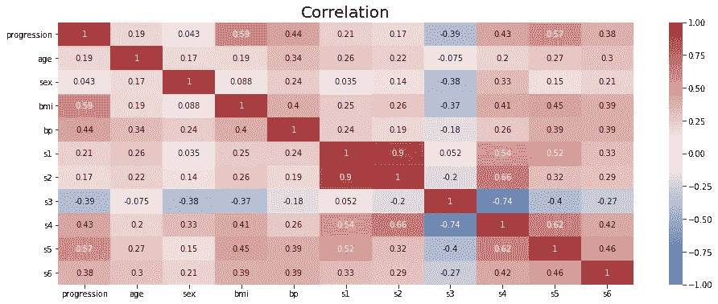

相关矩阵(来源:作者)

相关矩阵的逐元素绝对值(来源:作者)

查看特性之间的相关性，我们可以看到特性之间存在一些共线性。特别地，s3 和 s4 高度负相关，s2 和 s4 高度相关。所有的血清测量值都有显著的相关性。LASSO 更有可能移除相关要素集中的要素，因此如果 LASSO 移除要素 s2、s3 和 s4 中的一个或两个，也不会令人惊讶。另一方面，LASSO 基于交叉验证的度量选择正则化强度，即惩罚强度。因此，如果一个特征背后有一些额外的解释力，即使它与另一个特征密切相关，也可能不会被删除。

# 缩放对套索很重要

在我们进入代码之前，我们需要更深入地理解缩放。如果我们想在 SciKit-Learn 中正确地应用 LASSO，我们需要首先缩放我们的数据。与线性回归不同，LASSO 中的要素缩放至关重要。这是因为 LASSO 的罚函数包含了特征系数的绝对值之和。

为了更好地理解这一点，让我们来理解缩放是如何影响线性回归的。

## 线性回归的拟合不受线性变换的影响

虽然这并不能完全构成一个证明，但让我们看看为什么“*特征的线性变换不会影响线性回归做出的预测”*的说法是正确的。我们会看看一元线性回归，但是

给定一个特征“x”，对于任何数字“a”和“b”，该特征的线性变换可以写成如下形式。

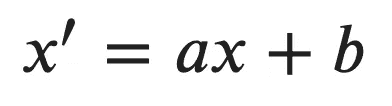

x 的线性变换(来源:作者)

回想一下，特征“x”的单变量线性回归的形式可以写成如下形式。优化选择系数，使平方和最小。

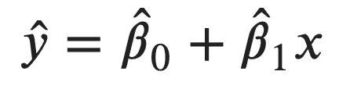

x 的线性回归形式(来源:作者)

对于转换后的特征，可以写成如下形式。再次选择系数以最小化平方和。

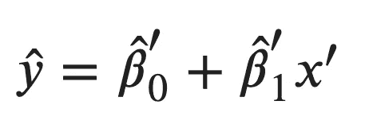

变换特征的线性回归形式(来源:作者)

在定义中代入转换后的特征，我们得到以下结果。

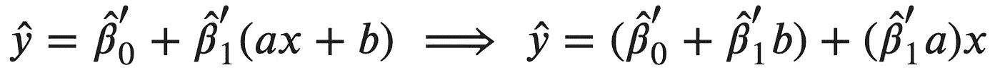

重写的变换特征的线性形式(来源:作者)

让我们看看分组术语。对于这两项，总项可以取任何值，并且我们已经从未变换的问题中知道了最佳系数。因此，实际上，转换后的形式等同于未转换的形式。

## 这是系数的变化

在其他条件不变的情况下，如果我们将一个特征除以 1000，那么系数会发生什么变化？举个更具体的例子，如果我们以“米”为特征，1 米对目标的作用是 1，那么 1 公里对目标的作用是什么？

看看上面的数学，或者咨询一下你的直觉。转换的效果是将系数乘以 100。

记住 LASSO 根据系数的大小增加了一个惩罚，现在看到缩放可以影响系数，我们可以看到不同的缩放会如何导致 LASSO 中最佳系数的不同选择。

## 标准化是一种线性转换

在 SciKit-Learn 中作为`StandardScaler`提供的标准化是一种线性转换。如果你想确定的话，看看 SciKit-Learn 文档中定义的[这里的](http://SciKit-Learn)缩放程序，并把它改写成线性变换的形式。`MinMaxScalar`也采用线性变换。

## 用比例特征解释线性回归

`StandardScaler`通过将每个观测值转换为一个新的尺度来单独转换每个特征，该尺度表示观测值相对于平均值的标准偏差。

# 让我们来看看代码

我们将跳过如何加载数据集并将其分成训练集和测试集。如果您想更深入地了解这一部分，可以在这里查看与本文[相关的资源库。](https://github.com/edkrueger/lasso-demo)

## 线性回归

为了预先用缩放步骤拟合线性回归，我们可以使用 SciKit-Learn `Pipeline`。SciKit-Learn 提供了一个简单的接口来创建一个带有`make_pipline`的`Pipeline`，我们将在下面使用。

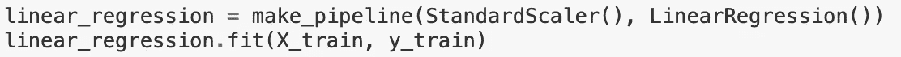

制作和训练线性回归管道(来源:作者)

因为以模型结尾的`Pipeline`——从技术上讲是`Estimator`的子类——行为就像模型一样。由于这条管道在一个模型实例`LinearRegression`中结束，我们可以用`.fit()`方法训练它。

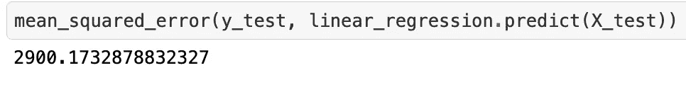

计算 MSE(来源:作者)

为了验证`Pipline`实例，我们可以使用它的 predict 方法来获得估计值并计算均方误差(MSE)。这里我们的 MSE 是 2900 左右。

为了得到系数，我们必须从流水线的最后一步提取它们。幸运的是，`Pipeline`中的步骤可以像数组元素一样被索引。我们使用`-1`索引糖来检索线性回归。

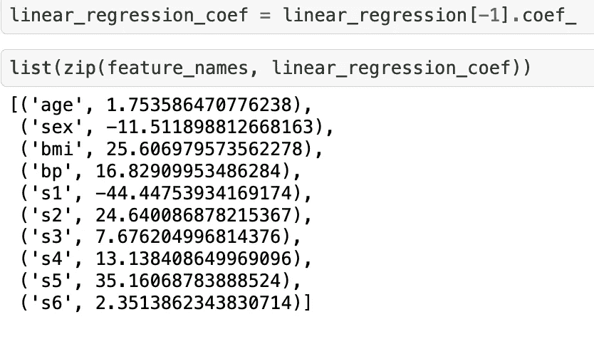

提取和显示线性回归系数(来源:作者)

为了解释这些系数，请记住，每个特征都经过缩放，因此一个单位的变化代表标准差的一个单位的变化。因此，对于每个特征，我们可以将每个系数解释为目标变化对平均值的一个标准差的影响。例如，以身体质量指数为例，身体质量指数值与平均值的一个标准差会使一个人的糖尿病进展增加 25.6 倍。

## 套索回归

sci kit-了解回归问题中 LASSO 的一些不同实现。最常见的两个`Lasso`和`LassoCV`。你可以在这里找到文档页面[这里](https://scikit-learn.org/stable/modules/generated/sklearn.linear_model.Lasso.html#sklearn.linear_model.Lasso)和[这里](https://scikit-learn.org/stable/modules/generated/sklearn.linear_model.LassoCV.html#sklearn.linear_model.LassoCV)。两者的区别在于`Lasso`希望您设置惩罚，而`LassoCV`使用交叉验证的 MSE (CV-MSE)执行网格搜索，以找到正则化强度的最佳选择。实际上，除非您以前处理过相同或非常相似的数据集，否则您永远不会知道罚超参数的理想值。因此，在实践中，您几乎总是会使用`LassoCV`——这里我们也是这样做的。

与使用管道时的情况一样，用于训练和验证的代码几乎是相同的——这是使用管道的优势之一。除了从`LassoCV`的实例中提取系数，我们还可以根据 CV-MSE 提取最优的正则化 str。让我们看看结果。

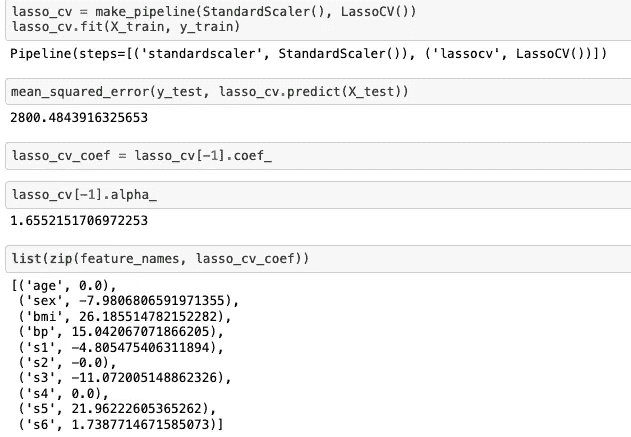

Lasso 回归的代码和结果(来源:作者)

请注意，MSE 略有下降，这意味着我们得到了一个更准确的模型。通过查看系数，我们可以看到线性回归和套索之间的变化。LASSO 将年龄 s2 和 s4 设置为 0，有效地将它们从模型中排除。

## 里脊回归

值得一提的是，有一种在计算上和理论上与 LASSO 非常相似的技术叫做岭回归。它将稍微不同的约束区域应用于损失函数，并且不是选择特征，而是收缩所有的系数。此外，SciKit-Learn 中的代码几乎是相同的，因此不涵盖它将是一个遗憾。那么，让我们来看看。

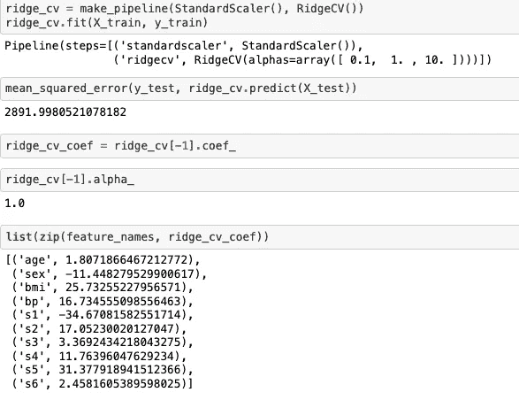

岭回归的代码和结果(来源:作者)

对于这个数据集，岭回归没有做得很好，但我们可以看到，一般来说，系数较小。

如果你想了解更多关于岭回归的知识，可以看看下面这篇由 [Qshick](https://medium.com/u/1fd952af85cc?source=post_page-----271ce0f22bd--------------------------------) 撰写的文章！

 [## 更好使用的岭回归

### 回答“什么是岭回归”这个问题的最简单方法是“线性回归的变异”。在…

towardsdatascience.com](/ridge-regression-for-better-usage-2f19b3a202db) 

## 比较系数

最后，让我们将三种不同技术的系数可视化！我们可以看到，岭回归发现几乎所有系数都更小，更接近于 0，其中 LASSO 将一些系数设置为 0。对于这个数据集，更稀疏的系数也导致具有更低 MSE 的更精确的模型。拥有更少的特征，它也更容易被理解。

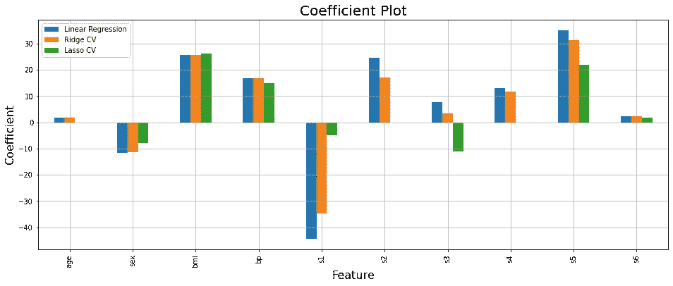

系数图(来源:作者)

我们希望你喜欢这篇文章！要了解更多关于数据科学、机器学习和开发的内容，请查看 [Edward 的 YouTube 频道](https://www.youtube.com/channel/UCmvdvjDaSjjMRIAxE5s7EZA)，并订阅我下面的邮件列表，成为第一个听到新文章的人！

 [## 每当爱德华·克鲁格发表文章时，就收到一封电子邮件。

edkruegerdata.com](https://edkruegerdata.com/subscribe) 

## 参考

[1][sci kit-learn:Python 中的机器学习](http://jmlr.csail.mit.edu/papers/v12/pedregosa11a.html)，Pedregosa *等人*，JMLR 12，第 2825–2830 页，2011 年。