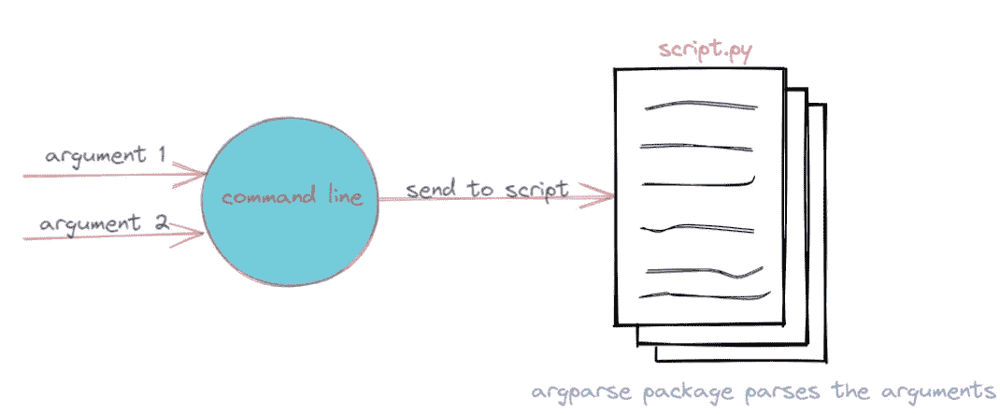
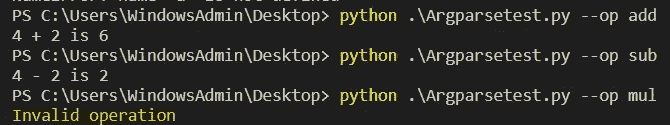
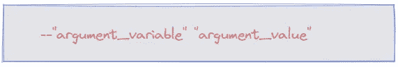
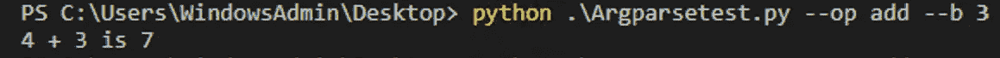
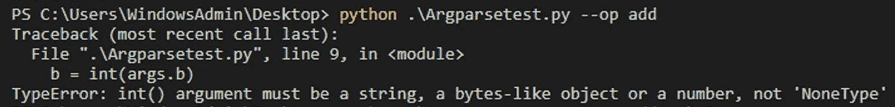
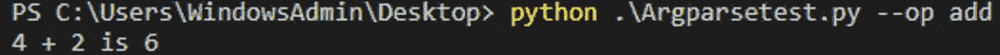
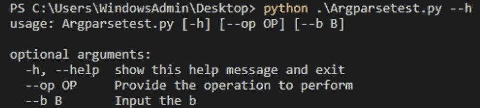
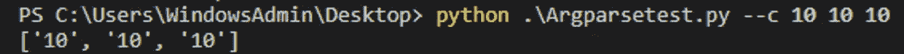
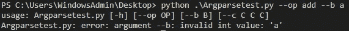

# 使用 Argparse 在 Python 中构建命令行界面

> 原文：<https://towardsdatascience.com/build-command-line-interfaces-in-python-using-argparse-6031daa28252?source=collection_archive---------24----------------------->

## 在 Python 中使用命令行授权！

Argparse 是一个内置的 Python 库，有助于在 Python 代码上构建命令行界面。Argparse 意味着*解析参数*。当我第一次听 Argparse 时，我感到害怕，但一旦我开始探索和学习，它就成为我的脚本中不可或缺的一部分。它为您的 Python 代码提供了额外的灵活性。您可以发送您修改的参数、参数选择等。通过命令行和 Argparse 会照顾它。下图解释了我对 Argparse 的理解:

作者创造的形象

为了实时解释这一点，让我们从一个基本的例子开始。让我们假设我们有下面的脚本 *argparsetest.py.* 该脚本可以根据用户输入执行两个变量的加法或减法。

在这里，我们只定义了两种可能性“add”或“sub”。如果用户两者都没有提供，它将作为无效操作返回(以黄色突出显示)，如下面的屏幕截图所示:

用户可以通过提及下面的语法来传递参数:

## 关于库的更多详细信息:

**💡位置参数:**您需要在每次执行脚本时指定这些参数。如果没有提到默认值，则不能跳过它们，因为默认值是必须提供的。例如，在我们之前提到的示例中，如果我们只是要求用户从命令行提供 b 的值，则需要对脚本进行如下微调:

显示位置参数的脚本

命令行中的命令如下所示:

带有位置参数的命令

如果我们不指定“b”输入，我们会得到类似下面这样的错误:

不带位置参数的命令

> 如果有多个位置参数，它需要按照脚本的特定顺序出现。试试看，看看效果如何！

**💡可选参数:**与 positional 相反，这些参数可以是可选的，不指定也可以。将默认值添加到位置参数会转换为可选参数，如以下脚本所示:

显示可选参数的脚本

如前所述，如果我们不指定参数，它将采用默认值并执行脚本，没有任何错误

不带参数的命令

**💡获得帮助:**如果你想知道脚本中需要/使用的参数，你可以通过添加“- h”获得帮助。下面的截图显示了如何做到这一点:

**💡设置值的数量:**如果您想为一个变量提供多个值作为输入，您也可以这样做。传递的值以列表的形式读取。例如，添加' **c** '作为参数，并将 **nargs** 定义为 **3，**，这意味着需要 3 个输入值。

带 nargs 的脚本

我们通过命令行将这些值传递给 **c** ，如下所示:

**💡设置输入参数的类型:**你可以明确地指出需要什么类型的输入。例如，我们只需添加' int '作为 b 的必需变量，如果用户未能提供所需输入类型的输入，脚本将抛出一个错误。该脚本将更改如下所示的内容:

如果我提供*字符串*而不是*整数*到 **b** 它将抛出如下错误:

总之，`argparse` library 是通过命令行界面提供用户友好方法的完美方式！这些只是开始使用 argparse 的基础。如果你有任何其他的诀窍/技巧，请随时评论。感谢您的宝贵时间！

在 [Twitter](https://twitter.com/pratikkgandhi) 或 [LinkedIn](https://www.linkedin.com/in/pratikkgandhi/) 上关注我。你也可以通过 pratikkgandhi@gmail.com 联系我