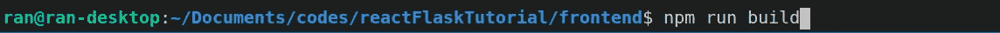

# 如何构建和部署 React + Flask 应用程序

> 原文：<https://towardsdatascience.com/build-deploy-a-react-flask-app-47a89a5d17d9?source=collection_archive---------0----------------------->

## 简单易懂的教程

## 简明指南


[Zan](https://unsplash.com/@zanilic?utm_source=medium&utm_medium=referral) 在 [Unsplash](https://unsplash.com?utm_source=medium&utm_medium=referral) 上的照片

当我试图弄清楚如何构建和部署我的 React + Flask 应用程序时，我设法在网上找到了各种教程。我所做的是，我首先谷歌并找出如何构建 React+Flask 应用程序，然后我试图搜索如何部署它。

可惜我好不容易找到的大部分教程都太复杂了(个人观点)。如果你谷歌“如何建立一个 React Flask App”，这里是我的前三个结果:[链接](https://blog.miguelgrinberg.com/post/how-to-create-a-react--flask-project)、[链接](https://developer.okta.com/blog/2018/12/20/crud-app-with-python-flask-react)、[链接](https://realpython.com/the-ultimate-flask-front-end/)。

它们可能是很棒的教程，但是如果你现在不想为 Nginx、各种配置和额外的包**(你只是想从 Flask 返回一些东西进行反应，然后开始在线查看它的部署)，你可能想试试这个教程。**

**它分为三个部分——后端(Flask)、前端(React ),最后是在 Heroku 上的部署。这是 GitHub 回购协议——https://github.com/Reine0017/reactFlaskTutorial。**

**我们开始吧！ʕ•́ᴥ•̀ʔっ**

## **第 1 部分—后端(烧瓶)**

**根据您自己的需求，您可能需要预先安装必要的 python 包。我使用 pip 安装了我需要的所有包，而**没有使用虚拟环境(尽管这是强烈推荐的)。要创建一个名为 venv 的新 python 虚拟环境(您可以将其命名为其他名称，只需将下面命令中的最后一个 venv 替换为您自己的 venv 名称)，请运行:****

```
python -m venv venv
```

**要激活 venv:**

```
source venv/bin/activate
```

**我们将首先从后端烧瓶设置开始。有许多方法可以构建您的项目，但是要稍后在 Heroku 上部署，Procfile 必须在根目录中公开(稍后将详细介绍 Procfile)。在根目录中，创建一个名为 app.py 的文件。**

****

**暂时忽略其他文件**

**这是我们运行 flask run 时运行的东西。我将我的命名为 app.py，但是你可以选择将它命名为除 flask.py 之外的任何名称，因为这将与 flask 本身相冲突。**

**在第 6 行，我们创建了 Flask 类的一个实例。参考官方的 [Flask 文档](https://flask.palletsprojects.com/en/1.1.x/quickstart/)，你会注意到在我的例子中还有两个参数(static_url_path 和 static_folder)。static_url_path 可用于为 web 上的静态文件指定不同的路径，它默认为 static_folder 文件夹的名称。static_folder 指向 react 项目的构建目录(因为我将子目录命名为 frontend，所以在我的例子中是 frontend/build——相应地更改它)。**

**第 10–12 行:@app.route decorator 告诉 Flask 哪个 URL 应该触发我们的 serve(path)函数。最后，send_from_directory 允许我们从“前端/构建”目录发送“index.html”文件。**

**第 3、7 行:这是为了消除我们在向不同的域发出 API 请求时经常遇到的恼人的 CORS 错误。在当前阶段(部署之前)，React 在端口 3000 上运行，Flask 在端口 5000 上运行。因此，当 React 向 Flask 后端发出请求时，会弹出这个 CORS 错误。关于 CORS 错误的更多信息，请查看[这个](https://www.telerik.com/blogs/dealing-with-cors-in-create-react-app)或[这个](https://medium.com/@dtkatz/3-ways-to-fix-the-cors-error-and-how-access-control-allow-origin-works-d97d55946d9)链接。**

**第 4、8、14 行:为了可读性，我将 HelloApiHandler.py 放在了一个名为 api 的子目录中。**

****

**在我的 HelloApiHandler.py 中只有两个简单的 GET 和 POST 函数来处理对这个 API 端点的 GET 和 POST 请求:**

**要检查一切是否正常，请键入**

```
$ flask run
```

**在您的终端中，然后转到 localhost:5000/flask/hello(上面 app.py 中的参考行 14 ),您应该会看到:**

****

**事情正在解决:')**

## **第 2 部分—前端(反应)**

**接下来，我们将在项目目录中为前端(React)创建一个文件夹。我把我的叫做“前端”。**

****

**cd 放入前端文件夹并运行**

```
npx create-react-app .
```

**这将创建一个新的 React 项目。**

**在您的 app.js 文件中，进行以下更改来测试我们对 flask 后端的 GET 请求。**

**如果一切正常，您应该会看到:**

****

**原谅偏心裁剪，只是想表明它在 localhost:3000 上**

**好极了，所以它在本地工作！让我们试着把它部署在 Heroku 上。**

## **第 3 部分 Heroku 上的部署**

**对于 Heroku，设置一个帐户，然后创建一个新的应用程序。在您的设置选项卡中，您可以向下滚动并看到如下内容:**

****

**[https://react-flask-tutorial.herokuapp.com](https://react-flask-tutorial.herokuapp.com)是你的用户访问你的应用的网址**

**[https://react-flask-tutorial.herokuapp.com/flask/hello](https://react-flask-158.herokuapp.com/flask/hello)是我们将从 React 前端发出请求的后端端点。因此，在 App.js(前端)中，将 axios . get(' http://localhost:5000/flask/hello ')更改为 axios . get(' https://react-flask-tutorial . heroku app . com/flask/hello ')。**

****我们必须做的另一个小编辑是在我们的后端(App.py)注释掉与 CORS 相关的内容。****

**接下来，在前端目录中，运行 npm run build:**

****

**这将创建我们的构建文件夹:**

****

**在根目录中，创建一个 Procfile，并在其中写入:**

```
web: gunicorn app:app
```

**记得记下空格！！**

**接下来，要生成 requirements.txt，将 cd 放入这个项目的根目录并运行:**

```
pip freeze >> requirements.txt
```

**我个人不得不在 requirements.txt 中注释掉 TBB 行，以使部署工作。不太清楚为什么。**

**因为我已经有了一个现有的 heroku 应用程序(我在 heroku 的网站上创建了一个新的应用程序)，所以我只运行了:**

****

**接下来，就像你将如何提交给 GitHub 一样，做通常的事情:**

```
git add .
git commit -m "first deployment"
git push heroku master
```

**注意最后一行是 heroku 而不是 origin。**

**然后等待并希望它能起作用:')**

****

**是的，它有效！！**

**好了，这就是本教程，让我知道你是否有任何问题或面临任何问题:)**

**快乐的通货膨胀！\_( ͡❛ ͜ʖ ͡❛)_/**

**我真的不喜欢无耻的插头，但如果你已经在考虑每月 5 美元获得中等会员资格，如果你能使用我的推荐链接来注册，我会非常感激-【https://reine-ran.medium.com/membership:】**