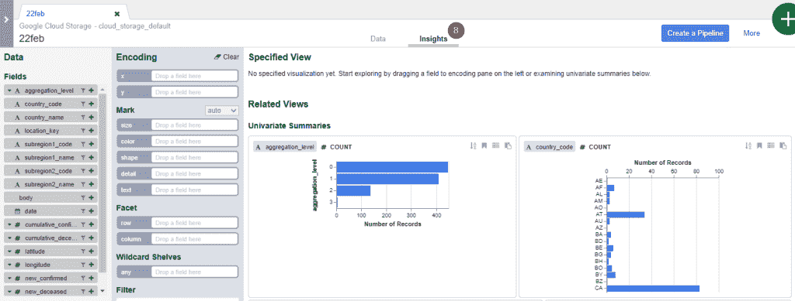
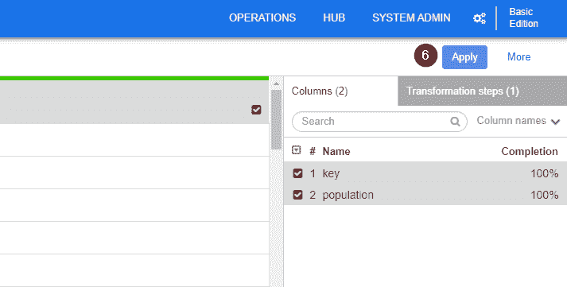
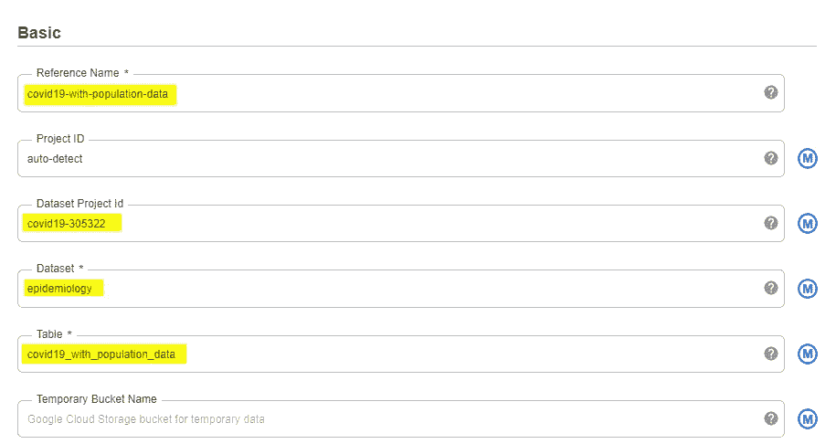

# 即使您不知道如何编码，也要构建 ETL 数据管道

> 原文：<https://towardsdatascience.com/build-etl-data-pipelines-even-when-you-dont-know-how-to-code-a6f09f60364d?source=collection_archive---------42----------------------->

## 当您想要的只是通过简单的步骤将分散在各处的良好数据集中到一个位置，以便快速洞察业务时，不要让编码和基础设施的复杂性阻碍您。


作者图片

了解如何整合各种来源的数据并执行简单的转换来解决数据质量问题是从大数据中获取洞察力的第一步。在这篇博文中，我们将探讨如何在谷歌云平台(GCP)上通过云数据融合构建和部署简单的 ETL 数据管道，而无需编码。

**你将了解:**

1.  为什么我们需要云数据融合？
2.  如何用云数据融合构建和部署 ETL 管道？

# 为什么我们需要云数据融合？

## 问题:你从大数据中获得深刻见解的第一个障碍

尽管复杂的数据分析和机器学习技术越来越受欢迎，但有些事情从未改变。**获得伟大洞察力的第一个障碍通常是数据集成，包括将分散在各处的相关数据收集到一个单一的统一位置，并执行许多预处理步骤以使其清晰可用。**

我们的数据集成需求可能非常简单，比如删除空值、将各种数据集连接在一起、删除不相关的列或者将所有数据放入数据仓库以供快速查询。然而，作为一个技术知识有限的业务用户，这样简单的需求可能会引发不适，因为您经常不得不考虑两个同样不方便的选项。

1.  你需要学习如何自己编写代码
2.  你必须等待一段时间，直到数据工程团队有足够的带宽来帮助你建立一个定制的数据管道(让我委婉地提醒你，在现实中，不是每个公司都有足够的预算来聘请数据工程师，更不用说资助数据工程团队了。)

怎么样，棕色的母牛？

## 解决方案:云数据融合如何提供帮助

> 由开源项目 CDAP 提供支持，云数据融合是一个完全托管的云原生企业数据集成服务，用于快速构建和管理数据管道。
> 
> —来自谷歌云

有了谷歌云平台上可用的云数据融合，你不必知道代码如何让简单的事情发生。简而言之，这就是你可以通过云数据融合做的事情。

*   构建数据管道，从多个来源收集数据，并将其放入一个位置进行查询和提取见解
*   转换数据以解决任何数据质量问题，或将数据转换成可用的格式
*   自动管理部署数据管道的所有方面，例如配置基础架构、集群管理和作业提交

这和你有什么关系？用外行人的话来说，这就是为什么它很重要。

无需编写任何代码，您不必成为每一个数据源的专家，就可以将所有数据整合在一起，获得快速的洞察力。在编码上花费更少的时间(并确保它一直工作)意味着有更多的时间来了解您的数据，回答更多关于业务绩效和如何做出更好决策的紧迫问题。有什么不喜欢的？

此外，**由于数据管道的部署是自动化和完全管理的，你不必担心 IT 基础设施。这意味着更快地获得您想要的结果，而不必担心后端的管理工作。**毕竟，为什么业务用户要费心去理解基础设施意味着什么，或者如何配置实例或管理集群呢？

# 如何才能使用云数据融合？

说得够多了，让我们看看如何构建和部署一个简单的 ETL 管道，结合两个不同的数据源。

## 初始设置

**先决条件**

这是你开始之前需要的。

*   [创建谷歌云项目](https://cloud.google.com/resource-manager/docs/creating-managing-projects)和[启用计费](https://cloud.google.com/billing/docs/how-to/manage-billing-account)
*   通过**导航菜单> IAM & Admin > IAM** 检查与您的帐户相关的角色和权限。您需要管理员权限来启用云数据融合 API

**创建云融合实例**

1.  在 GCP 控制台主页面上，在搜索框中键入“**云数据融合**”。

2.选择**云数据融合 API** 。


作者图片

3.看到下面的屏幕后，选择**启用**。


作者图片

4.刷新页面并选择导航菜单。向下滚动到**大数据**，选择**数据融合**。


作者图片

5.点击**创建一个实例**。


作者图片

6.按照屏幕上的说明输入实例的名称。选择**基本**作为版本类型，并将所有其他字段保留为默认值。点击**创建**。但是如果你看到创建按钮是灰色的(就像下面的截图)，确保先点击**授予权限**。


作者图片

7.单击创建后，实例创建过程可能需要大约 15–20 分钟。一旦创建完成，你会收到一个**通知**铃按钮在哪里。


作者图片

8.创建实例后，让我们授予与新数据融合实例相关联的服务帐户对项目的权限。要继续，请单击实例名称(不是视图实例)并将**服务帐户**复制到剪贴板。


作者图片

9.进入**导航菜单> IAM & Admin > IAM** ，点击**添加**。


作者图片

10.将复制的服务帐户添加为新成员。点击**选择角色**，在过滤框中输入 ***云数据融合*** 。在所有过滤选项中，选择**云数据融合 API 服务代理**角色。然后点击**保存**。


作者图片

11.在继续下一步操作之前，请确保与新创建的数据融合实例相关联的服务帐户作为您的项目的授予权限之一可见(类似于下图)。


作者图片

## 创建 ETL 数据管道

**计划**

为了比较和对比 COVID19 在不同国家传播的严重性，我们通常可以查看病例和死亡的总数。然而，如实地描述病例和死亡人数是行不通的，因为每个国家的人口规模都有很大的不同。

考虑到不同的人口规模，一个更常见的方法是比较每 100，000 人口中的病例和死亡总数。

**每 10 万人口总发病数=总发病数/人口* 10 万**

不幸的是，病例数和死亡数的信息不包括人口数据。因此，我们将构建一个 ETL 管道来使用云数据融合将一个 CSV 文件(包含病例和死亡总数)与一个 BigQuery 表(包含每个国家的人口)结合起来。

这篇博文使用的数据集摘自新冠肺炎公共数据集，该数据集可在[谷歌云平台](https://console.cloud.google.com/marketplace/product/bigquery-public-datasets/covid19-open-data?_ga=2.245002822.-2111520850.1609749908)或 [this GitHub](https://github.com/GoogleCloudPlatform/covid-19-open-data) 上获得。在我们使用流水线之前，下面是我们的计划。


作者图片

**加载 CSV 数据**

1.  从导航菜单中，进入**数据融合**并点击**查看实例**。


作者图片

2.按照屏幕上的提示，您应该能够看到如下所示的云数据融合 UI。由于我个人想从一些数据探索入手，点击**牧马人**。如果您想探索其他选项，请随意尝试 UI。


作者图片

3.让我们将 CSV 数据集加载到管道中，方法是选择左侧的**云存储默认值**，并单击包含每个国家一段时间内的病例数和死亡数的存储桶的名称。


作者图片

4.选择表名。


作者图片

5.一旦从 CSV 加载了数据，您可能会注意到所有属性都组合在同一个 body 列下。所以我们必须将 CSV 数据解析成适当的列。点击位于 body 栏左侧的**向下**箭头，选择**解析> CSV** 。


作者图片

6.选择适当的分隔符并勾选**框，选择第一行作为标题**。然后点击**应用**。


作者图片

7.随着不同的属性被拆分到各自的列中，我们现在可以开始研究我们的数据集了。看看下面的截图。您能猜出为什么有些列(如 country_name)全是绿色，而 subregion2 _ code 显示一点绿色，而大部分是红色吗？

**提示:**红色代表每列空值的比例。简单地说，**如果条形的大部分是红色的，您可以很容易地注意到，由于缺少许多值，数据属性对于分析可能不是很有用。**


作者图片

8.以更直观的方式探索数据的另一个有用功能是 **Insights** 。例如，在这里我可以很容易地观察到这个数据集包含从 0 到 3 的不同级别的聚合。这是我必须小心处理的事情，因为我只对国家一级的数字感兴趣，而不是次区域一级的数字。

提示:**不要急于下结论，因为这些见解是从数据集中的 1000 个样本中产生的。**这可能有助于初步理解，但并不代表整个数据集中的所有可用信息。



作者图片

**转换 CSV 数据**

在详细检查了 CSV 数据之后，下面是一些常见的数据转换步骤，我们可以通过这些步骤将原始数据清理和整形为可用的格式。

***按特定值过滤行***

如上所述，数据集包括每个国家的新冠肺炎病例和死亡人数(这是我们想要的)，以及每个次区域的数字(这是我们不想要的)。

要仅保留国家级别的数字，单击 *aggregation_level* 列旁边的**向下**箭头，并过滤以保留 aggregation_level = 0 的行


作者图片

***删除冗余列***

在右侧的菜单中，勾选方框以选择您想要保留的**列**。然后点击任一选定列旁边的**向下**箭头，并点击**保持选定列**。


作者图片

删除冗余列后，点击#旁边的**向下**箭头，并选择**清除所有**以返回正常数据视图，进行后续转换步骤。


作者图片

***将字符串转换为数值数据类型***

对于每个数字列(如 new_confirmed、new _ deceased、cumulative_confirmed、cumulative _ deceased)，点击**向下**箭头，选择**更改数据类型**，选择整数或小数。


作者图片

***解析字符串到日期***

要将字符串转换为适当的日期类型，对于每个日期列，单击向下的**箭头**，选择**解析>简单日期**。


作者图片

选择合适的日期格式，点击**应用**。


作者图片

***更改列名***

要将原来的列名更改为更直观的名称(例如从 cumulative_confirmed 更改为 total_case)，双击列标题，输入新名称并按回车键。


作者图片

对 CSV 数据的最终格式满意后，点击**创建管道**，然后选择批处理管道。


作者图片

但是请记住，我们还需要我们的人口数据，这些数据目前位于 Google BigQuery 表中。所以让我们把它带进来。

**加载包含人口数据的 BigQuery 表**

1.  从左边的菜单中，导航到**源**并选择您试图集成的数据源。这里我选择了**大查询**。


作者图片

2.一旦 BigQuery source 的新节点出现，将鼠标悬停在 BigQuery 节点上并单击**属性**。


作者图片

3.选择**浏览**。


作者图片

4.导航到您想要集成的 Google BigQuery 表


作者图片

5.要验证 BigQuery 表是否包含您正在寻找的正确信息，请单击**获取模式**。BigQuery 表的所有列都将出现在向导的右侧，供您查看。


作者图片

从模式中可以看出，我们不需要 BigQuery 表的每一列。所以让我们剔除我们不需要的。但是首先，我们需要退出 BigQuery 属性。

6.单击右上角的 **X** 按钮，退出 BigQuery 属性并返回数据管道。


作者图片

**转换 BigQuery 数据**

1.  为了消除多余的列，我们将需要使用牧马人。在左侧菜单中，导航至**变形**并选择**牧马人**。


作者图片

2.要将两个节点连接在一起，请拖动 BigQuery 节点右边缘的连接箭头，放在新的 Wrangler 节点上。将鼠标悬停在新的牧马人节点上，点击**属性**。


作者图片

3.为了避免与我们用来转换 CSV 数据的前一个 Wrangler 节点相混淆，让我们通过指定一个新标签给这个节点一个新名称。点击**辩论**配置清理和整形数据的步骤。


作者图片

4.导航并选择包含我们需要清理的人口数据的 BigQuery 表。


作者图片

5.对于这个人口数据集，我们只需要“key”和“population”列。因此，类似于我们如何消除 CSV 文件的冗余列，在右边的菜单中，勾选框以选择您想要保留的**列**。然后点击任一选定列旁边的**向下**箭头，并点击**保留选定列**。


作者图片

6.点击**应用**返回到属性视图。然后单击右上角的 **X** 按钮，退出 BigQuery 属性并返回到数据管道。



作者图片

**将两个数据源连接在一起**

是时候将新冠肺炎数据和人口数据结合在一起了。这一次，我们将需要使用 Joiner 节点，它位于分析部分之下。

1.  从左侧菜单中，导航至**分析**并选择**连接器**。


作者图片

2.一旦新的 Joiner 节点出现在屏幕上，通过拖放连接箭头将两个牧马人节点连接到 Joiner 节点。然后将鼠标悬停在 Joiner 节点上，单击**属性**来配置这两个表应该如何连接在一起。


作者图片

3.指定连接类型和连接条件。这里我们做了一个内部连接来匹配人口数据集中的“key”列和新冠肺炎数据集中的“location_key”。单击**获取模式**以验证输出列是否是您正在寻找的。


作者图片

4.对输出满意后，单击右上角的 **X** 按钮，退出连接器属性并返回数据管道。

**在 Google BigQuery 中存储最终数据集**

由于我们已经成功地将新冠肺炎数据和人口数据缝合在一起，ETL 管道的最后一步是将所有数据加载到一个存储位置(即一个接收器)，以便您可以随时回去分析数据。

在这里，我选择将最终数据集存储在 Google BigQuery 中，因为我可以轻松地使用 SQL 查询它来计算每 100，000 个国家的病例和死亡人数，或者将其与任何数据可视化工具(如 Tableau、Google Data Studio 等)相连接。

1.  从左侧菜单中，导航至**接收器**并选择**大查询**。


作者图片

2.将 Joiner 节点连接到新创建的 BigQuery 节点。将鼠标悬停在 BigQuery 节点上，点击**属性**来配置数据存储。


作者图片

3.指定您想要存储组合数据集的**引用名称、项目 ID、数据集**和**表**。



作者图片

4.为确保所有内容都被正确指定，点击**验证。**当您看到**未发现错误**时，单击右上角的 **X** 按钮退出 BigQuery 属性并返回数据管道。


作者图片

**查看 ETL 数据管道**

最后，我们已经完成了第一个 ETL 数据管道的构建，将新冠肺炎数据和人口数据结合起来计算每 100，000 人口中的病例数和死亡数。这是我们简单的 ETL 数据管道目前的样子。大家一起击鼓吧！


作者图片

在直接进入部署之前，我强烈建议花 15-20 分钟从头到尾回顾一下 ETL 管道，并给管道命名。

提示:**不要忘记给每个节点取一个有意义的名字**。你最不希望的是 3 个月后，你发现自己盯着 5 个不同的牧马人节点，挠头试图理解 Wranger3 和 Wranger5 之间的区别。让我们善待自己，善待任何可能继承这个 ETL 管道的人，好吗？

## 部署 ETL 管道

好吧！是时候看看我们的 ETL 管道在运行了。你准备好了吗？

1.  在页面右上角，点击**部署**。


作者图片

2.看到以下屏幕后，点击**运行**立即启动数据整合过程。或者，您可以点击**计划**来设置该 ETL 数据管道的每日或每周执行，或者监控**状态**。请注意，需要一段时间才能完成，状态将变为*成功*。


作者图片

## 在 BigQuery 中计算每 100，000 人口的病例和死亡总数

一旦 ETL 管道运行完成，下面是您可以在 BigQuery 中看到的组合数据集。


作者图片

由于新冠肺炎数据和人口数据现在很好地结合在一起，编写一个 SQL 查询来计算一段时间内每 100，000 人口的病例和死亡总数再简单不过了。

```
SELECT 
EXTRACT(DATE FROM date) AS record_date, 
country_name, 
new_case/ population*100000 AS new_case_per_100k_pop, 
new_death/ population*100000 AS new_death_per_100k_pop, 
total_case/ population*100000 AS total_case_per_100k_pop,
total_death/ population*100000 AS total_death_per_100k_pop 
FROM `covid19-305322.epidemiology.covid19_with_population_data`;
```


作者图片

# 包扎

面对现实吧！在编码和管理基础设施上花费更少的时间意味着有更多的时间来了解您的数据，回答更多关于业务绩效和如何做出更好决策的紧迫问题。云数据融合只是市场上许多其他数据集成解决方案中的一种，这些解决方案可以帮助业务用户将分散在各处的良好数据集中到一个位置，而不必担心编码或管理基础架构的复杂性。现在是时候为业务用户提供工具和功能，将大数据快速转化为业务洞察力，同时保持简单的事情简单。

感谢您的时间，如果您觉得这篇文章有用，请在 LinkedIn 和 T2 Twitter 上关注我，了解关于数据、商业和这两者之间的任何令人兴奋的故事。下一集再见！

*原载于 2021 年 2 月 22 日 http://thedigitalskye.com*<http://thedigitalskye.com/2021/02/23/build-etl-data-pipelines-even-when-you-dont-know-how-to-code/>**。**