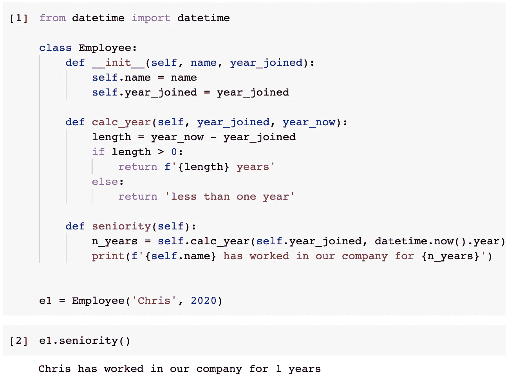
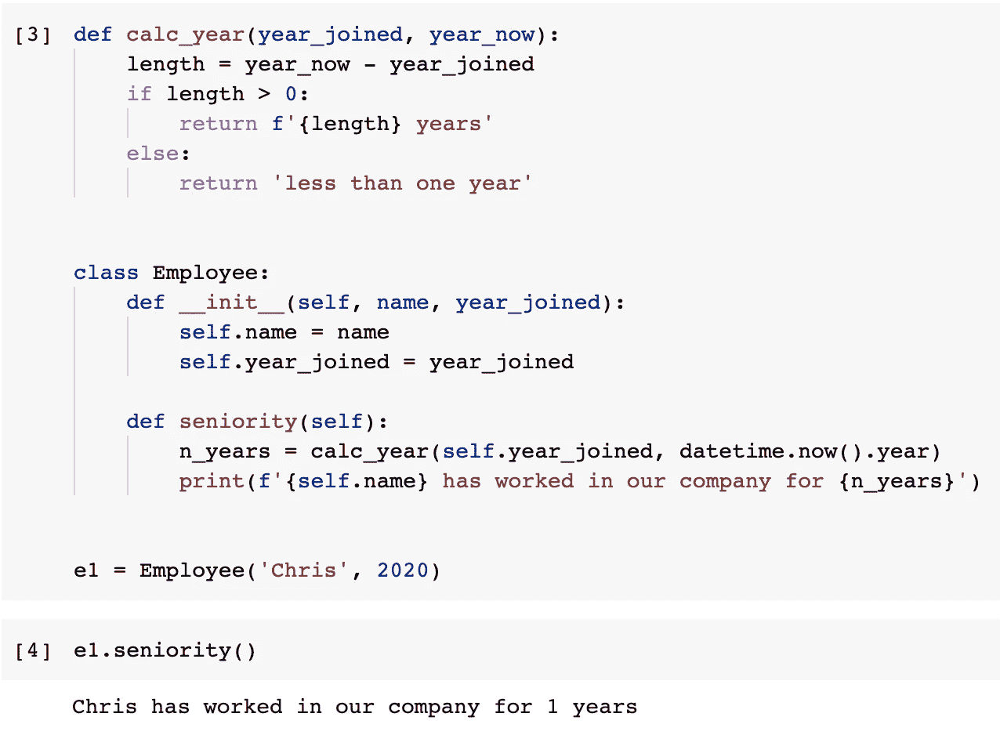
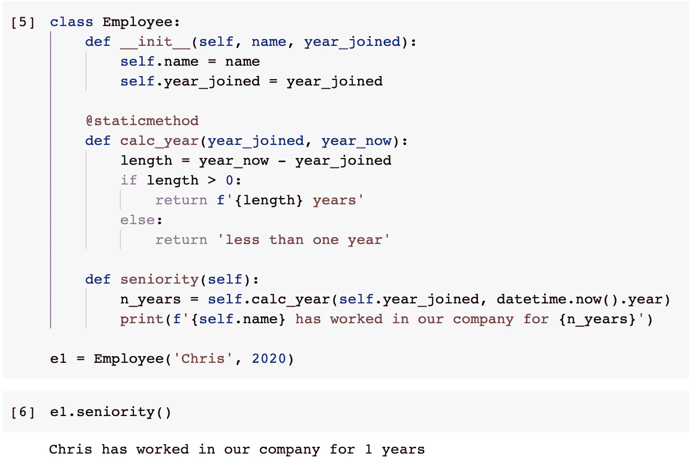
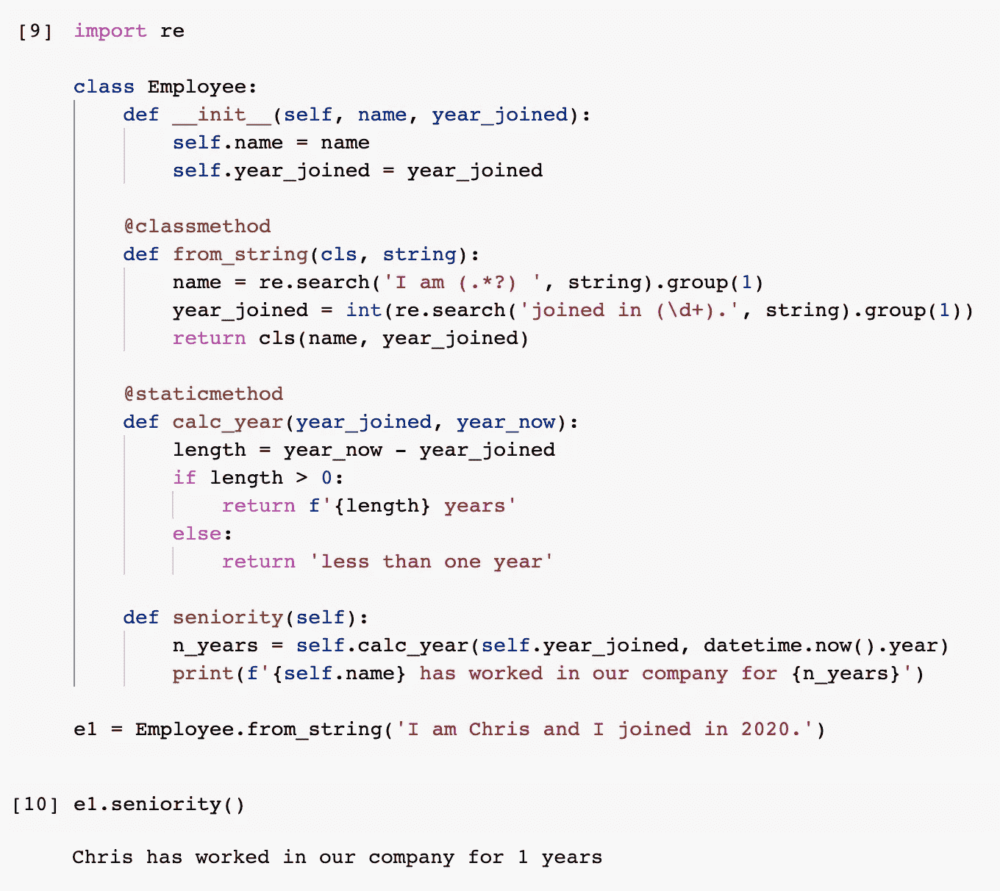
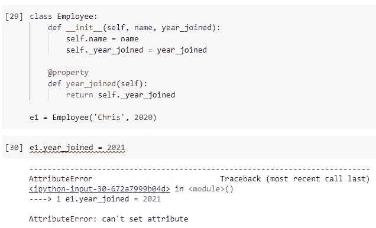
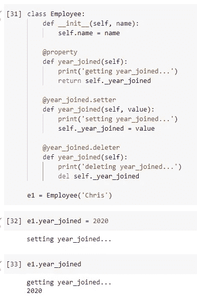
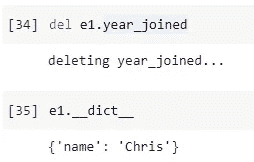

# 在 Python 类中构建“工厂”和“工具”

> 原文：<https://towardsdatascience.com/build-factory-and-utility-in-your-python-classes-ea39e267ca0a?source=collection_archive---------9----------------------->


图片由 [arturo meza olivares](https://pixabay.com/users/arturomezaolivares-18910861/?utm_source=link-attribution&utm_medium=referral&utm_campaign=image&utm_content=6724229) 从 [Pixabay](https://pixabay.com/?utm_source=link-attribution&utm_medium=referral&utm_campaign=image&utm_content=6724229) 拍摄

## 三个内置的 Python 类装饰器

如果您曾经使用过其他面向对象的编程语言，如 Java 或 C++，您可能对“静态方法”、“类方法”、“getter”和“setter”等概念很熟悉。事实上，Python 也有所有这些概念。

在本文中，我将介绍 Python 类的三个内置装饰器。他们会帮助我们

*   创建类范围的实用工具方法
*   为我们的类创建工厂设计模式
*   保护类中的重要属性

现在我们应该开始了。

# 1.静态法


图片来自 [Pixabay](https://pixabay.com/?utm_source=link-attribution&utm_medium=referral&utm_campaign=image&utm_content=1380134)

让我们跳过所有概念性的干货，直接从例子开始。假设我们需要定义一个名为“Employee”的类。我们应该保留员工的姓名，以及这个人是什么时候加入我们公司的。此外，我们希望通过显示该员工为我们工作的年数来检查资历。

最初，我们可以这样写。

这里我们仅有的逻辑是`calc_year()`方法。它获取当前年份并减去该员工加入的年份。这应该是大于或等于零的整数。如果为零，则输出“不到一年”，而不是确切的年数。

**declaration**:这个逻辑很不理想，只是作为一个例子。不要误会:)

它会把工作做好的。

```
e1 = Employee('Chris', 2020)
e1.seniority()
```



然而，这是一个小问题。您注意到了吗,`calc_year()`方法实际上并不需要类的实例才能工作。这也意味着“自我”作为一个论点是不必要的，因为它不需要这样的依赖。

因此，我们可以将函数从类中取出，如下所示。

这个也很好用。



好的。如果`calc_year()`方法甚至可以被重用用于其他目的，那就更好了。然而，如果我们不需要它做其他用途呢？还有，在类之外有这样的函数是很难看的，如果它只服务于这个类的话。

因此，该方法被认为是该类的“实用方法”。换句话说，它应该被定义为一个静态方法。

如上面的代码所示，在 Python 中定义一个静态方法非常容易。当我们向方法添加装饰符`@staticmethod`时，我们不再需要添加`self`参数，因为静态方法不需要现有的实例起作用。



使用静态方法，我们可以在一个类中定义我们的实用方法，并保持代码整洁。

# 2.分类方法


图片来自 [Pixabay](https://pixabay.com/?utm_source=link-attribution&utm_medium=referral&utm_campaign=image&utm_content=1137993) 的 [falco](https://pixabay.com/users/falco-81448/?utm_source=link-attribution&utm_medium=referral&utm_campaign=image&utm_content=1137993)

那么，Python 中的类方法是什么？同样，比起解释概念，我更喜欢用例子来演示。

你用过 Python 中的`datetime`模块吗？通常，我们可以使用`datetime.datetime()`来创建一个`datetime`对象。然而，还有更多不同的方法可以创建这样一个带有不同参数的对象。

*   日期时间.今天()
*   datetime.now()
*   datetime.utcnow()
*   datetime.fromtimestamp()
*   datetime.utcfromtimestamp()
*   datetime.strptime()
*   …

为什么它们可以接受不同的参数，但像`__init__()`构造函数那样返回一个 datetime 对象？那是因为它们是类方法。类方法可以将当前类的引用作为参数，这样它就可以调用`__init__()`构造函数。

让我们用一个例子来证明这一点。假设我们想用一个字符串来创建一个雇员对象。该字符串必须是固定的模式，因此我们可以使用 regex 提取雇员的姓名和加入年份。然后，我们使用构造函数创建一个 employee 对象并返回它。

代码如下。

如上面的代码所示，我们已经将装饰器`@classmethod`添加到方法`from_string()`中，并将变量`cls`传递给该方法。所以，我们可以使用变量`cls`来创建一个当前类的对象。

该方法提取雇员的姓名和加入年份，然后利用构造函数`__init__()`创建对象。

让我们试一试。

```
e1 = Employee.from_string('I am Chris and I joined in 2020.')
e1.seniority()
```



这种方法就像一个“工厂”，可以使用不同的“组件”来生产相同的产品。这也是为什么称之为“**工厂法**”的原因。工厂方法是使用类方法装饰器的非常典型的用例。

# 3.类别属性


来自[像素库](https://pixabay.com/?utm_source=link-attribution&utm_medium=referral&utm_campaign=image&utm_content=1867187)的[像素](https://pixabay.com/users/pexels-2286921/?utm_source=link-attribution&utm_medium=referral&utm_campaign=image&utm_content=1867187)的图像

Python 类的最后一个重要装饰是属性。

Python 是一种动态语言，它给予开发者最大的灵活性去做他们想做的事情。然而，有时，一些限制是必要的。

例如，更改员工的加入年份是没有意义的，因为那应该是固定的。这条需求与大多数其他编程语言中的“私有属性”概念相匹配。如何在 Python 类中保护一个属性？装潢师会帮忙的。

让我们简化前面的例子，因为这些静态/类方法在这种情况下无关紧要。在下面的代码中，我们使用`@property`装饰器将`year_joined`定义为 Python 中的一个属性。

```
class Employee:
    def __init__(self, name, year_joined):
        self.name = name
        self._year_joined = year_joined @property
    def year_joined(self):
        return self._year_joined
```

现在，如果我们创建一个对象并试图设置属性，它不允许我们这样做。

```
e1 = Employee('Chris', 2020)
e1.year_joined = 2021
```



这是因为`@property`装饰器保护属性不被修改。

你可能也知道我在变量前面加了下划线，所以它变成了`_year_joined`。这里没有什么神奇的，但是按照 Python 的惯例，为了可读性，我们应该为任何私有属性加上下划线。如果你想知道更多，请查看我以前的一篇文章，如下所示。

[](/why-python-loves-underscores-so-much-de03cf7bdcdd) [## 为什么 Python 如此喜欢下划线

### 使用下划线的一些技巧可以改进您的 Python 代码

towardsdatascience.com](/why-python-loves-underscores-so-much-de03cf7bdcdd) 

那么，现在如果我们想实现 setter 和 getter 呢？使用`@property`装饰器，我们可以很容易地将它们定义如下。

```
class Employee:
    def __init__(self, name):
        self.name = name @property
    def year_joined(self):
        print('getting year_joined...')
        return self._year_joined @year_joined.setter
    def year_joined(self, value):
        print('setting year_joined...')
        self._year_joined = value @year_joined.deleter
    def year_joined(self):
        print('deleting year_joined...')
        del self._year_joined
```

如图所示，我们只是继续使用装饰器

*   Getter:带有`@property`装饰的方法将成为 getter
*   设定者:`@<attr_name>.setter`
*   删除者:`@<attr_name>.deleter`

删除器在 Python 中是非常独特的。这是因为 Python 允许我们在运行时从对象中移除属性。因此，删除器将使我们能够对一个受保护的属性这样做。



当然，在 getter 和 setter 中，当属性被获取或设置时，我们可以做其他事情。我刚刚添加了一个打印的消息来通知这一点。

删除程序将删除该属性。因此，在我们删除属性后，它将不再存在于对象中。



# 摘要


图片来自 [Pixabay](https://pixabay.com/?utm_source=link-attribution&utm_medium=referral&utm_campaign=image&utm_content=6212218) 的 [RayMark](https://pixabay.com/users/raymark-2255846/?utm_source=link-attribution&utm_medium=referral&utm_campaign=image&utm_content=6212218)

在本文中，我介绍了 Python 面向对象编程中使用的三个重要的装饰器:类。我们通常将静态方法用于类中的实用程序，将类方法用于工厂设计模式，将属性用于我们希望防止被随机修改的任何属性。

[](https://medium.com/@qiuyujx/membership) [## 通过我的推荐链接加入灵媒-陶

### 作为一个媒体会员，你的会员费的一部分会给你阅读的作家，你可以完全接触到每一个故事…

medium.com](https://medium.com/@qiuyujx/membership) 

**如果你觉得我的文章有帮助，请考虑加入灵媒会员来支持我和成千上万的其他作家！(点击上面的链接)**