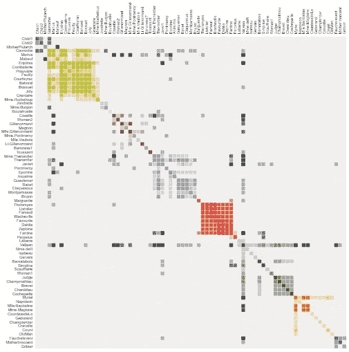
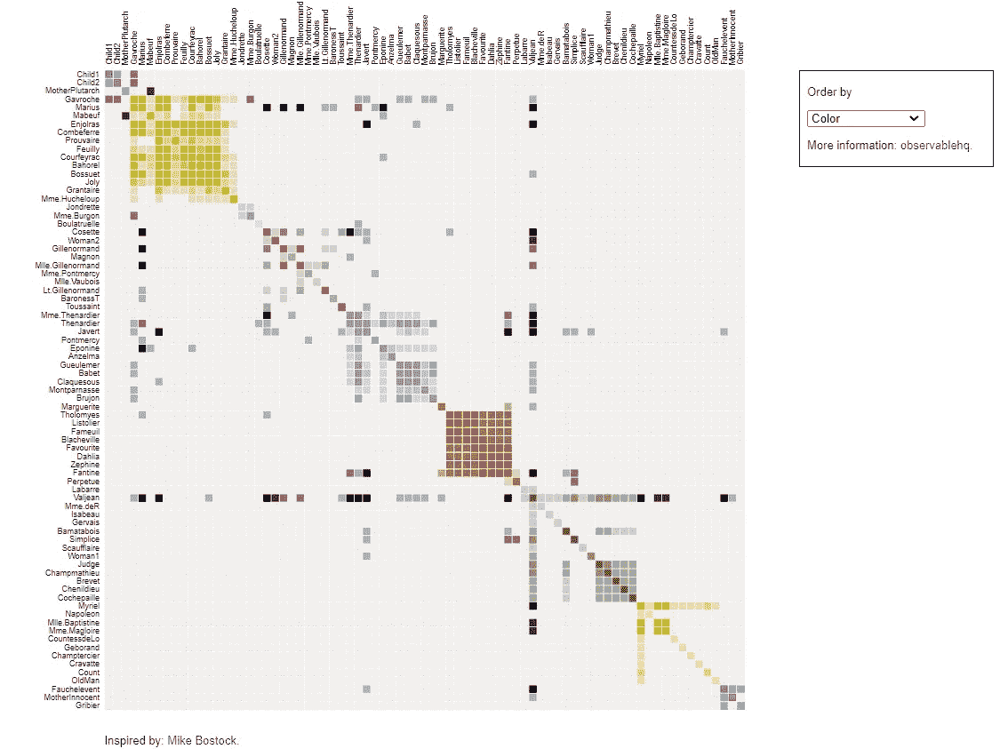
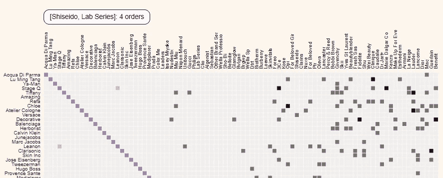

# 使用 Flask 和 D3.js 构建交互式图表

> 原文：<https://towardsdatascience.com/build-interactive-charts-using-flask-and-d3-js-70f715a76f93?source=collection_archive---------16----------------------->

## 为电子商务销售分析设计交互式 D3.js 可视化，并支持业务决策


劳拉·乔伊特在 [Unsplash](https://unsplash.com?utm_source=medium&utm_medium=referral) 上拍摄的照片

# 可视化的力量

## 失意的天才

您是一位自豪的数据科学家，展示了您使用优化代码、花哨的库、高级线性代数和复杂的统计概念设计的新解决方案。

和[…]

与前一天新实习生展示的简单 PowerBI 仪表板相比，您的解决方案没有得到管理层的兴趣、认可或热情。

*你遇到过这种挫折吗？*

## 你需要发展你的视觉化技能

简单花哨的可视化比非常复杂的模型更有影响力，尤其是对非技术观众而言。

本文将给你一个在没有 **javascript** *(或者很轻)*的先验知识的情况下，使用 **D3.js** 设计*花式*可视化的菜谱。

先决条件

*   **HTML** 的基础知识
*   **Python** 中级知识，包括**烧瓶框架**
*   找到一个你想要设计的可视化的例子

💌新文章直接免费放入你的收件箱:[时事通讯](https://www.samirsaci.com/#/portal/signup)

# 从 D3.js 的例子中获得灵感

## 示例:悲惨世界人物矩阵图

你正在浏览[*http://bl.ocks.org*](http://bl.ocks.org/)*/，*一个很棒的网站来获取 D3.js 的教程，你看着**迈克·博斯托克**的这个矩阵图找到了灵感。



《悲惨世界》同现，迈克·博斯托克&让·丹尼尔·费科特，[链接](https://bost.ocks.org/mike/miserables/)

《悲惨世界》是法国著名历史小说，作者维克多·雨果，出版于 1862 年。

这个矩阵显示了字符的共现

*   1 个彩色单元格=同一章中出现的两个字符
*   深色单元格:出现频率**高**的字符
*   浅色单元格:出现频率**低的字符**

## 将这种可视化应用到您的业务案例中

您有一个订单行级别的**奢侈品化妆品在线销售**的数据集。

你想要建立一个矩阵来显示品牌的共现

*   1 个彩色单元格=两个品牌出现在同一个客户订单中
*   深色单元格:**与许多其他品牌一起出现的品牌**
*   光细胞:**与其他品牌很少出现的品牌**

> 你可以在我的 Github 资源库中找到共享的源代码:[萨米尔萨奇](https://github.com/samirsaci/matrix_brands)
> 我与其他项目的作品集:[萨米尔萨奇](https://samirsaci.com/)

[](http://samirsaci.com) [## 萨米尔·萨奇

### 数据科学博客，专注于仓储，运输，数据可视化和机器人流程自动化…

samirsaci.com](http://samirsaci.com) 

# 使用 Flask 构建您的解决方案

## 在用 Flask 渲染的模板上复制这个例子

让我们先通过渲染一个例子发现 b.locks [*(链接)*](http://bl.ocks.org/jdfekete/a8828c88060a1883b3f4) 下面的结构

```
app.py
/templates
    index.html
/static
    /data
      miserables.json
    /js
      /Libs
      matrix.js
    /css
```

*   /templates:index.html 仪表板页面的 HTML 源代码([链接](http://bl.ocks.org/jdfekete/raw/a8828c88060a1883b3f4/))
*   /js/libs:用于呈现 D3.js 的 javascript 库
*   /js/matrix.js:用于使用 **miserables.json** 呈现您的仪表板的脚本
*   /static/Miserables . json:matrix . js 用来渲染 *(L* [*墨迹*](https://bost.ocks.org/mike/miserables/miserables.json) *)* 的 JSON 文件
*   /CSS:用于呈现页面的 CSS 文件

**全部代码上传在我的 Github 资源库(** [**链接**](https://github.com/samirsaci/matrix-miserables) **)使用过**

1.  将 Github 资源库复制到您的本地文件夹中
2.  下载 requirements.txt 中列出的库
3.  启动 app.py



您的示例使用 Flask [(链接)](https://github.com/samirsaci/matrix_chart_duplicate.git)——(图片由作者提供)

现在，您已经使用 Flask 和 D3.js 构建了第一个可视化解决方案。

接下来的步骤是

*   **用你的数据集替换***Miserables . JSON*
*   ****改编** matrix.js 以显示品牌共现**
*   ****改编** HTML 页面代码以**

**[](http://samirsaci.com) [## 萨米尔 Samir 供应链组合的数据科学

### 🏭使用高级数学概念的供应链网络优化👨‍🏭仓储的持续改进…

samirsaci.com](http://samirsaci.com)** 

# **将原始数据集处理成最终的 JSON**

****从 *miserables.json* 开始****

**第一步是分析 miserables.json**

```
**1\. Nodes: Characters distributed in different groups**"nodes": {"name"  : Character Name,
          "group" : Group Number}2\. Links: Listing pairs of characters"nodes": {"source"  : Character Name 1,
          "target"  : Character Name 2,
          "value" : Number of Co-occurence}
```

****获取 brands.json****

**我们想要什么？**

```
**1\. Nodes: Brands are distributed in groups depending on the number of different brands that are ordered with it**"nodes": {"name"  : Brand Name,
          "group" : Group Number}2\. Links: Listing pairs of brands that with number of orders they appear together"nodes": {"source"  : Brand Name 1,
          "target"  : Character_name2,
          "value" : Number of Orders they appear together}
```

****构建节点****

**第一个函数 *order_brand* 将为 *create_nodes* 函数准备所需的数据帧和列表，该函数将构建您的节点字典。**

**评论**

*   ****n_groups** :将要拆分的品牌组数**
*   ****第 35 行:**降序
    {第 1 组:与许多其他品牌一起订购的品牌，
    第 n 组:与少数其他品牌一起出现的品牌}**

## **建立链接**

****导出 JSON 中的所有内容****

**决赛成绩**

**评论**

*   ****json_to** :该函数将返回 json，通过向页面'/get-json '发送 get 请求来检索该 JSON**

**你的 JSON 已经可以被 matrix.js 使用了(经过一些调整)。**

**[](http://samirsaci.com) [## 萨米尔·萨奇

### 数据科学博客，专注于仓储，运输，数据可视化和机器人流程自动化…

samirsaci.com](http://samirsaci.com)** 

# **调整 Matrix.js 以适应您的品牌**

## **添加工具提示以显示悬停时选择的品牌对**

****

**品牌对与订单数量一起显示在左上角—(图片由作者提供)**

**我在 mouseover 函数中添加了这几行来显示所选择的品牌对。**

****下载 JSON 文件****

**该函数将向 flask 页面'/get-json '发送一个 GET 请求，该页面将使用 *create_json* 函数返回 *json_to* 。**

# **最后一击**

## **改编 HTML 代码以添加标题**

**最终渲染**

*   **/CSS: bootstrap 和 styles.css 来改进页面的呈现**

****

**您的奢侈品牌在线销售矩阵的最终效果图—(图片由作者提供)**

# **结论**

***关注我的 medium，了解更多与供应链数据科学相关的见解。***

**你可以在我的作品集里找到这个矩阵图的静态版本:[矩阵图](https://samirsaci.github.io/matrix.html)**

**这是一个简单的 4 步过程**

1.  **找到一个你想用于你的商业案例的好的可视化**
2.  **下载 HTML 代码、javascript、CSS、JSON 文件和所有构建页面所需的文件**
3.  **用**烧瓶**在本地渲染该页面**
4.  **分析 JSON 格式并构建函数来适应你的输入数据**
5.  **调整 javascript 以适应您的数据框格式**
6.  **自定义 HTML 页面以添加有关数据集的信息**

# **关于我**

**让我们连接上 [Linkedin](https://www.linkedin.com/in/samir-saci/) 和 [Twitter](https://twitter.com/Samir_Saci_) ，我是一名供应链工程师，正在使用数据分析来改善物流运营和降低成本。**

**如果你对数据分析和供应链感兴趣，可以看看我的网站**

**[](https://samirsaci.com) [## Samir Saci |数据科学与生产力

### 专注于数据科学、个人生产力、自动化、运筹学和可持续发展的技术博客

samirsaci.com](https://samirsaci.com) 

# 参考

*【1】—*迈克·博斯托克&让-丹尼尔·费科特，《悲惨世界》共现，[链接](https://bost.ocks.org/mike/miserables/)

*【2】—*[*萨米尔萨奇*](https://medium.com/u/bb0f26d52754?source=post_page-----70f715a76f93--------------------------------) *，初始示例为烧瓶渲染，* [*Github*](https://github.com/samirsaci/matrix-miserables)

*【3】—*[*小萨奇*](https://medium.com/u/bb0f26d52754?source=post_page-----70f715a76f93--------------------------------) *，最终解决，* [*Github*](https://github.com/samirsaci/matrix-ecommerce)

*【4】—*[*小萨奇*](https://medium.com/u/bb0f26d52754?source=post_page-----70f715a76f93--------------------------------) *，我的作品集中一个最终渲染的例子，* [*最终渲染*](https://samirsaci.com/matrix.html)**