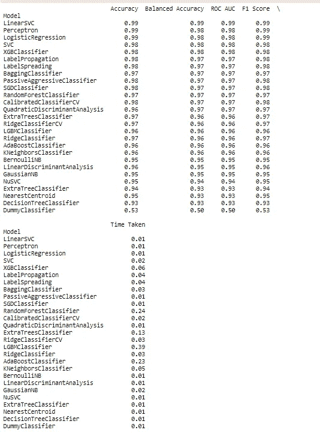
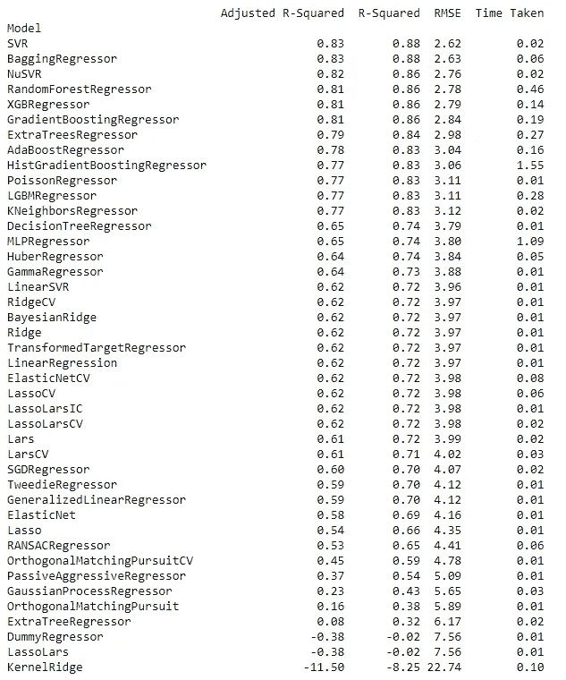

# 轻松构建多个机器学习模型

> 原文：<https://towardsdatascience.com/build-multiple-machine-learning-models-easily-54046f022483?source=collection_archive---------28----------------------->

## 使用 lazy predict 仅用 2 行代码创建多个机器学习模型


由 [Unsplash](https://unsplash.com?utm_source=medium&utm_medium=referral) 上的 [Pietro Jeng](https://unsplash.com/@pietrozj?utm_source=medium&utm_medium=referral) 拍摄

创建机器学习模型并找出最佳模型是一项令人厌倦的任务，因为这将花费大量的时间和精力。Lazy predict 有助于在短短两行代码中构建多个机器学习模型。

它不仅创建多个模型，而且有助于了解哪些模型适用于给定的数据。以便我们可以使用该模型并执行超参数调整以使其更加精确。它易于使用并且是开源的。它创建了大部分用于回归和分类的机器学习模型。

在本文中，我们将学习如何使用 lazy predict 并使用它创建多个机器学习模型。

让我们开始吧…

# 安装所需的库

我们将从使用 pip 安装来安装 lazy predict 开始。下面给出的命令将使用 pip 安装 lazy predict。

```
pip install lazypredict
```

# 导入所需的库

在本文中，我们将讨论分类和回归问题。在这一步中，我们将加载所需的库。我们将使用著名的糖尿病数据集进行分类，使用波士顿数据集进行回归分析。

```
from lazypredict.Supervised import LazyClassifier
from sklearn.datasets import load_diabetes
from sklearn.model_selection import train_test_split
from lazypredict.Supervised import LazyRegressor
from sklearn import datasets
from sklearn.utils import shuffle
import numpy as np
```

# 创建机器学习模型

这是最后一步，我们将对数据进行预处理，并创建多个机器学习模型。

# 1.分类

```
data = load_breast_cancer()
X = data.data
y= data.targetX_train, X_test, y_train, y_test = train_test_split(X, y,test_size=.5,random_state =123)clf = LazyClassifier(verbose=0,ignore_warnings=True, custom_metric=None)
models,predictions = clf.fit(X_train, X_test, y_train, y_test)print(models)
```



模特表演(来源:作者)

在这里，我们可以清楚地分析不同的分类模型以及它们的性能，这仅仅是由两行代码创建的。

# 2.回归

```
boston = datasets.load_boston()
X, y = shuffle(boston.data, boston.target, random_state=13)
X = X.astype(np.float32)offset = int(X.shape[0] * 0.9)X_train, y_train = X[:offset], y[:offset]
X_test, y_test = X[offset:], y[offset:]reg = LazyRegressor(verbose=0, ignore_warnings=False, custom_metric=None)
models, predictions = reg.fit(X_train, X_test, y_train, y_test)print(models)
```



模特表演(来源:作者)

在这里，我们可以分析不同的模型及其对回归数据集的性能。

这就是我们如何使用 Lazy Predict 轻松、毫不费力地创建多个机器学习模型。

继续尝试不同的数据集，并让我知道您在回复部分的评论。

本文是与[皮尤什·英加尔](https://medium.com/u/40808d551f5a?source=post_page-----54046f022483--------------------------------)合作完成的。

# 在你走之前

***感谢*** *的阅读！如果你想与我取得联系，请随时通过 hmix13@gmail.com 联系我或我的* [***LinkedIn 个人资料***](http://www.linkedin.com/in/himanshusharmads) *。可以查看我的*[***Github***](https://github.com/hmix13)**简介针对不同的数据科学项目和包教程。还有，随意探索* [***我的简介***](https://medium.com/@hmix13) *，阅读我写过的与数据科学相关的不同文章。**