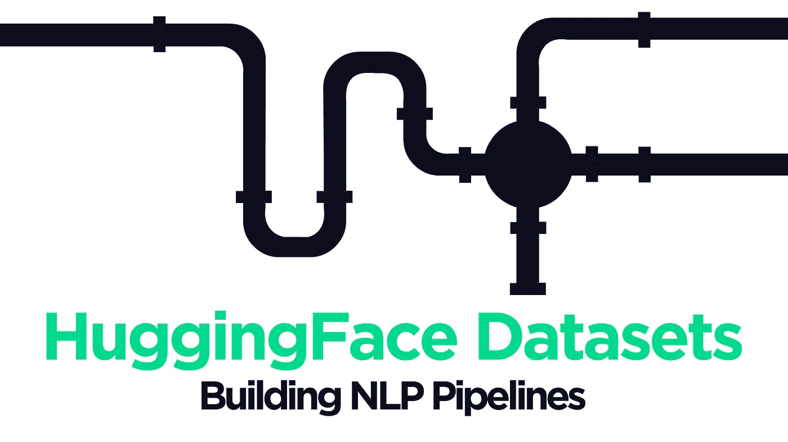

# 使用 HuggingFace 数据集构建 NLP 管道

> 原文：<https://towardsdatascience.com/build-nlp-pipelines-with-huggingface-datasets-d597ff5f68ad?source=collection_archive---------13----------------------->

## NLP 实践者的宝库和无与伦比的管道工具

作者图片

H F Datasets 是 NLP 从业者的必备工具——托管超过 1.4K *(主要是)*高质量的以语言为中心的数据集和易于使用的函数宝库，用于构建高效的预处理管道。

本文将研究可用的大规模数据集存储库，并探索该库出色的数据处理能力。

# 数据集

我们将从探索数据集开始。正如我们所说的——有大量的数据集可用，其中许多是由社区上传的。我经常使用的两个数据集是 OSCAR 和 SQuAD 数据集。

SQuAD 是一个用于训练问答变压器模型的出色数据集，通常无与伦比。HF 数据集实际上允许我们从跨越几种语言的几个不同的队数据集中进行选择:

当微调问答的 transformer 模型时，我们只需要这些数据集中的一个。

另一个数据集 OSCAR 可能是现有的最令人印象深刻的语言数据集之一。它由超过 166 种不同的语言数据集组成，包含从网络上搜集的非结构化文本。

其中一些数据集很小，如 11KB 的 Nahuatl 语言，但其他数据集很大，如 106GB 的日语或 1.2TB 的英语。这使得 OSCAR 成为预训练 transformer 模型的理想选择。

## 访问和查看数据集

在查看哪些数据集可用时，我们可以采用两种方法。使用[在线数据集查看器应用](https://huggingface.co/datasets/viewer/)或直接使用 Python。

在线数据集查看器相当简单，因此我建议您点击了解它是如何工作的。在这里，我们将重点放在 Python 方面。

我们希望从导入和查看所有可用的数据集开始。有很多，所以如果你在寻找一个特定的数据集——比如`squad`——提前知道会很有帮助。

为了加载数据集，我们使用了`datasets.load_dataset`函数。默认情况下，这会将整个数据集下载到文件中，这对于小队来说是可以的。但如果我们考虑到 1.2TB 大小的英语奥斯卡，这可能是一个糟糕的想法…😅

因此，我们可以不使用默认行为，而是通过设置`streaming=True`，在需要时迭代下载数据集的大块内容。

我们可以看到，`squad`数据集包含两个子集，`train`和`validation`。如果愿意，我们可以指定只使用其中的一个:

尽管我们将坚持使用整个数据集。要查看数据集的大小、描述和特性，我们可以分别访问`dataset_size`、`description`和`features`属性。

如果使用`streaming=False`，可以使用像`dataset['train'][0]`这样的语法来访问数据集中的特定记录——但是因为我们有`streaming=True`，所以我们必须遍历数据集。

这意味着，如果我们想查看记录以了解内容的类型(除了由`dataset['train'].features`显示的内容之外)，我们可以写:

这样，我们对可用的数据集有了一个很好的概念，并理解了它们的目的和内容。在下一节中，我们将继续讨论`datasets`提供的处理方法。

# 数据集预处理

而`datasets`值得使用，因为它可以方便地访问如此多的高质量数据集。它还附带了许多令人惊叹的预处理功能。当使用`streaming=True`时，这些变得更加有用，因为我们可以迭代地转换我们的数据，而不需要下载所有东西。

## 修改特征

我们将从修改队伍数据中的`answers`特征开始。在 Q & A 中，我们通常需要一个答案*起始位置*和*结束位置*。小队已经包含了`answer_start`，但是我们必须使用这个和答案`text`长度来创建我们自己在`answers`特征中的`answer_end`值。

修改现有特征(和创建新特征)最常用的方法是`map`功能。

> 请注意，当`streaming=True`时，我们必须将*中的每个*特征都包含在`map`中，否则它们会在映射后消失。当`*streaming=False*`时情况并非如此，我们将在后面看到。

当我们定义这个转换时，它不会立即执行。相反，它是作为调用数据集时要执行的*‘指令’*添加的。这意味着我们仍然没有在内存中存储任何数据集。

该指令用于在需要时仅转换数据集样本*——也称为*惰性加载(一个通用术语，不特定于 HF 甚至 ML)* 。如果我们再次遍历几个样本，我们会看到转换得到了应用。*

*我们还可以看到，如果我们故意在`map`函数中创建一个错误，这是延迟加载的，因为在我们遍历数据集之前，错误不会出现。*

*我们将在后面介绍`filter` w 方法，它只能在`streaming=False`时使用——所以我们将在没有流的情况下重新加载我们的数据*,并在本文的剩余部分使用它。**

> *使用`streaming=False`,我们可以使用列表索引直接访问数据集中的记录。*

*我们不再需要在`map`函数中包含每一个特性。当`streaming=False`时，我们只包括我们正在修改(或创建)的特征。*

## *定量*

*我们几乎总是会执行的另一个操作是将文本标记化为标记 id。对于 SQuAD，这要求我们将`question`和`context`字符串传递给一个记号赋予器，记号赋予器将输出三个张量(对于 Bert)——`input_ids`、`token_type_ids`和`attention_mask`。*

*一般来说，这个过程在批量执行时要快得多。幸运的是，`map`方法允许我们使用`batched=True`批量转换，甚至指定`batch_size`。*

## *重命名功能*

*有时我们可能需要重命名特性，通常是为了将特性名称与模型所期望的输入名称对齐。*

*在这种情况下，我们只是迂腐。我想将主题功能从`title`重命名为`topic`。*

## *过滤*

*这是一个非常漂亮的特性。我们可以根据样本是否满足某种条件来过滤掉数据集中的样本。*

*我们已经返回了数据集的前几个样本，都是关于`University_of_Notre_Dame`的主题——假设我们不想在我们的数据集中包含`University_of_Notre_Dame`样本。*

*我们需要做的就是把它们拿出来:*

*这样，我们只保留了*中`topic`不等于*和`University_of_Notre_Dame`的样本。另外需要注意的是，我们*不能用* `*filter*` *当* `*streaming=True*`。*

## *删除功能*

*我们已经完成了处理，并且我们决定——实际上——我们不需要大多数特性。事实上，对于问答推理，我们只需要`input_ids`、`token_type_ids`、`attention_mask`。*

*因此，对于我们的最终转换，让我们继续前进，并删除所有这三个功能。*

*我们到了。我们已经学会了如何找到并下载(或流式传输)一些在线可用的最佳数据集。然后，我们探索了 HF 的`datasets`中打包的一些最重要的数据处理功能。*

*我希望你喜欢它！如果你有任何问题，请通过[推特](https://twitter.com/jamescalam)或者在下面的评论中告诉我。如果你想要更多这样的内容，我也会在 YouTube 上发布。*

*感谢阅读！*

*[🤖《变形金刚》课程 NLP 的 70%折扣](https://bit.ly/nlp-transformers)*

***所有图片均由作者提供，除非另有说明**