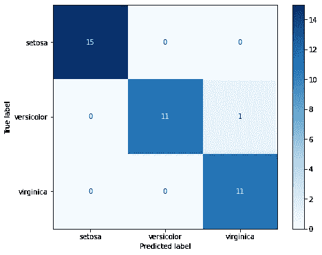
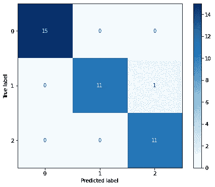

# 使用 Python 和 Flask-RESTful 为机器学习模型构建 REST API

> 原文：<https://towardsdatascience.com/build-rest-api-for-machine-learning-models-using-python-and-flask-restful-7b2cd8d87aa0?source=collection_archive---------1----------------------->

## 数据科学家可以遵循的最小工作示例


[Marcin Jozwiak](https://unsplash.com/@marcinjozwiak) 在 [Unsplash](https://unsplash.com/) 上拍摄的照片

[1。简介](#a199)
[2。环境设置](#73c5)
∘ [2.1 使用 conda](#22b9)
∘ [2.2 使用 pip](#3053)
∘ [2.3 为它创建一个 conda 环境](#15ba)
[3 .培养一个最小 ML 模型](#73d4)
[4。构建 REST API](#6672)
∘ [4.1 理解代码](#83e8)
∘ [4.2 旋起 REST API](#5ff4)
[5 .测试 API](#ba08)
[结论](#b913)
[关于我](#0df6)
[参考文献](#1d89)

**注**:本帖提到的所有代码和结果都可以从我的 [GitHub 页面](https://github.com/zhouxu-ds/ds-tools/tree/master/flask/flask_api)访问。

# **1。简介**

作为数据科学家，我们不仅需要构建模型，还需要部署它们，并使它们在完整的系统中有用。在许多情况下，我们需要与其他开发人员合作，将模型保存在单独的位置并使用 API 将模型提供给其他应用程序几乎总是一个好主意。

应用程序编程接口(API)是一种 web 服务，它允许访问其他应用程序可以通过标准 HTTP 协议访问的特定数据和方法，而表述性状态转移(REST)是 web 服务最流行的 API 架构风格之一。另一方面，Python 是数据科学家最喜欢的语言，有两种流行的 web 框架:Django 和 Flask。与 Django 相比，Flask 以轻量级和快速开发著称。它也有许多扩展来为 vanilla Flask 应用程序添加特定的功能，Flask-RESTful 是一个完美的选择，可以让构建一个功能完整的 REST API 变得非常容易。

在这里，我将带你通过一个例子和你需要遵循的所有代码，来了解如何使用 Flask-RESTful 构建一个最小可行的 REST API。这篇文章有三个主要部分:

*   **制作一个 ML 模型**:一个使用玩具数据集的简单模型
*   **构建一个 REST API:**post 的主要部分。为刚做好的 ML 模型服务
*   **测试 API** :通过调用 API 使用模型进行预测

# 2.环境设置

因为这是一个最小的例子，所以不需要很多包。可以用`conda`也可以用`pip`。对于下面的 2.1 到 2.3，选择任何一种你感兴趣的方法。完成这些之后，你可以直接跳到第三部分。

## 2.1 使用 conda

如果您安装了 conda，您可以运行:

`conda install -c conda-forge numpy scikit-learn flask-restful requests`

## 2.2 使用画中画

如果没有安装 conda，`pip`也可以通过运行:

`pip install numpy scikit-learn flask-restful requests`

## 2.3 为 it 创造康达环境

有时，为不同的项目保留不同的环境是有益的，因此如果您想创建另一个虚拟环境，可以运行以下命令:

`conda create --name flask_api -c conda-forge numpy scikit-learn flask-restful requests`

它将创建另一个名为`flask_api`的环境，安装了这些软件包，您可以通过运行以下命令切换到新环境:

`conda activate flask_api`

你也可以使用`pip`创建虚拟环境，但是我将跳过这一步，因为你可以很容易地在网上找到教程。

# 3.训练最小 ML 模型

东西摆好之后，我们先来搭建一个玩具 ML 模型。要获得更完整的代码和结果，请参考 [Jupyter 笔记本](https://github.com/zhouxu-ds/ds-tools/blob/master/flask/flask_api/train_model.ipynb)，但以下是该部分的最低可行代码，也可以从[这里](https://github.com/zhouxu-ds/ds-tools/blob/master/flask/flask_api/train_model.py)下载。我们把它命名为`train_model.py`，你可以使用`python train_model.py`来运行

如果你熟悉机器学习，并且有过一些使用`scikit-learn`的实践经验，那么代码应该对你有意义。

基本上，我们首先加载一个玩具数据集`iris`，如下所示:


有 150 条记录。它们中的每一种都有 4 个特征，并被标记为 3 类中的一类(刚毛藻、杂色藻和海滨藻)。

在此示例中，我们直接训练模型并跳过微调部分，然后使用模型对测试集进行预测:

```
[0 2 0 1 2 2 2 0 2 0 1 0 0 0 1 2 2 1 0 1 0 1 2 1 0 2 2 1 0 0 0 1 2 0 2 0 1 1]
```

其中数字代表 3 类中的每一类。通过与真实标签比较，我们发现准确率为 97%，混淆矩阵如下所示:



图 1:测试集上模型预测的混淆矩阵(直接来自模型对象)

我们的表现已经足够好了(可能现实生活中太好了)。然后，我们通过在 pickle 文件中序列化来保存训练好的模型。

# 4.构建 REST API

## 4.1 理解代码

现在，一个简单的模型已经准备好了，让我们构建一个 REST API。同样，下面是代码，我会一步一步地解释它。也可以从[我的 GitHub](https://github.com/zhouxu-ds/ds-tools/blob/master/flask/flask_api/api.py) 下载。我们把这个命名为`api.py`

```
app = Flask(__name__)
api = Api(app)
```

首先，我们导入模块，上面的两行应该几乎总是存在于代码的顶部，以初始化 flask app 和 API。

```
*# Create parser for the payload data* parser = reqparse.RequestParser()
parser.add_argument(**'data'**)
```

上面的代码块创建了一个请求解析器来解析将随请求一起发送的参数。在我们的例子中，由于我们服务于 ML 模型，我们通常以 JSON 序列化格式发送数据，并将键命名为`data`，因此我们要求解析器查找请求中包含的数据。

```
*# Define how the api will respond to the post requests* class IrisClassifier(Resource):
    def post(self):
        args = parser.parse_args()
        X = np.array(json.loads(args[**'data'**]))
        prediction = model.predict(X)
        return jsonify(prediction.tolist())

api.add_resource(IrisClassifier, **'/iris'**)
```

然后我们通过继承从`flask-restful`导入的`Resource`类来创建一个名为`IrisClassifier`的类，它已经定义了处理不同类型请求的各种方法，包括`get` `post` `put` `delete`等等。我们的目标是重写`post`方法，告诉它如何使用模型对给定数据进行预测。因为我们的 API 的目的是服务于 ML 模型，我们只需要`post`方法，不用担心其他的。

在`post`方法中，我们首先调用刚刚定义的解析器来获取参数。数据(最初是 np.array)在 JSON 中被序列化为字符串格式，所以我们使用`json.loads`将其反序列化为一个列表，然后返回到一个 NumPy 数组。预测部分和`scikit-learn`模型一直做的一样。在最后一步，我们需要将预测的标签(np.array)放回列表，并调用从`flask`导入的`jsonify`函数再次序列化它，以便它们以正确的格式返回给应用程序。

在定义了类之后，我们将我们的`IrisClassifier`(本质上是一个修改过的`resource`类)连同访问它的相对路径一起添加到我们的 API 中，在我们的例子中是`/iris`。如果我们只是在本地运行 flask，那么 ML 模型的整个 URL 将类似于`[http://127.0.0.1:5000/iris](http://127.0.0.1:5000/iris)`。

```
if __name__ == **'__main__'**:
    *# Load model* with open(**'model.pickle'**, **'rb'**) as f:
        model = pickle.load(f)

    app.run(debug=True)
```

在`api.py`代码的最后一部分，我们加载从上一节保存的模型，以便应用程序知道如果需要任何预测，从哪里获取模型。然后，我们在调试模式下运行 flask 应用程序，如果发生任何错误，它只允许在浏览器中直接执行任意代码。

## 4.2 启动 REST API

如果您有保存为`api.py`的代码，您可以使用:

`python api.py`

将会出现如下信息:

```
* Serving Flask app "api" (lazy loading)
 * Environment: production
   WARNING: This is a development server. Do not use it in a production deployment.
   Use a production WSGI server instead.
 * Debug mode: on
 * Running on [http://127.0.0.1:5000/](http://127.0.0.1:5000/) (Press CTRL+C to quit)
 * Restarting with stat
 * Debugger is active!
 * Debugger PIN: 117-609-315
```

那你就可以走了！

# 5.测试 API

如果您遵循了前面的章节，那么您应该已经在本地机器上运行了 REST API。现在是测试的时候了，看看是否有效。同样，下面是您需要复制、粘贴和运行的所有代码(最少)。更多完整的代码和结果，请参见 [Jupyter 笔记本](https://github.com/zhouxu-ds/ds-tools/blob/master/flask/flask_api/test_api.ipynb)，或者下面的代码，您可以在这里访问[。](https://github.com/zhouxu-ds/ds-tools/blob/master/flask/flask_api/test_api.py)

然后我会一步一步地解释代码。我们把它命名为`test_api.py`，你可以通过调用`python test_api.py`来运行它

```
*# Load data* iris = load_iris()

*# Split into train and test sets using the same random state* X_train, X_test, y_train, y_test = \
    train_test_split(iris[**'data'**], iris[**'target'**], random_state=12)
```

导入相关模块后，首先要做的是获取一个数据子集(仅特性)来测试 API 返回的预测。为了便于比较，我们可以使用我们在第 3 节中拆分的相同测试集。我们可以加载 iris 数据集，并使用相同的随机状态(12)来获得数据的确切子集`X_test`。

```
*# Serialize the data into json and send the request to the model* payload = {**'data'**: json.dumps(X_test.tolist())}
y_predict = requests.post(**'http://127.0.0.1:5000/iris'**, data=payload).json()
```

然后，我们创建一个`payload`变量，将`X_test`的列表序列化为 JSON 格式，key 为`data`，就像我们在`api.py`中定义的那样，这样我们的 API 就知道在哪里可以找到输入数据。然后，我们将有效负载发送到我们定义的端点，并获得预测结果。

```
*# Make array from the list* y_predict = np.array(y_predict)
print(y_predict)
```

最后一步是可选的，但是我们可以将数据返回到 NumPy 数组并打印出预测，这与我们之前在第 3 节中创建模型时得到的结果完全相同。混淆矩阵也完全相同:

```
[0 2 0 1 2 2 2 0 2 0 1 0 0 0 1 2 2 1 0 1 0 1 2 1 0 2 2 1 0 0 0 1 2 0 2 0 1 1]
```



图 1:测试集上模型预测的混淆矩阵(来自 REST API)

在 REST API 端，在使用了`post`方法之后，我们可以看到显示响应为 200 的消息，这意味着请求已经被成功处理:

```
127.0.0.1 - - [01/Nov/2021 17:01:42] "POST /iris HTTP/1.1" 200 -
```

因此，我们已经测试了刚刚构建的 REST API，并获得了与原始模型对象返回的结果完全相同的结果。我们的 API 管用！

# 结论

我们刚刚介绍了使用 Python 和 Flask-RESTFul 构建一个全功能 REST API 所需的基本知识和步骤。如果我们只看 API 构建部分(第 4 节)，它确实非常简单——不到 30 行代码，其中大多数只是标准语句。修改代码也非常容易:您所需要做的就是替换您想要使用的模型，指定`post`方法如何工作，并给出访问 API 的正确路径。

为了进一步利用我们刚刚构建的 REST API 来为其他应用程序提供我们的机器学习模型，我们可以将它部署在服务器上，或者使用任何流行的云 web 托管服务:AWS、Google Cloud、Heroku 等。通过适当的配置，任何获得许可的人都可以从世界上的任何地方访问我们的模型。

感谢您的阅读！如果你喜欢这篇文章，请**关注我的频道**和/或 [**成为我今天的推荐会员**](https://zhouxu-ds.medium.com/membership) (非常感谢🙏).我会继续写下去，分享我关于数据科学的想法和项目。如果你有任何问题，请随时联系我。

[](https://zhouxu-ds.medium.com/membership) [## 通过我的推荐链接加入 Medium 周(乔)徐

### 阅读周(Joe)徐(以及媒体上成千上万的其他作家)的每一个故事。您的会员费直接支持…

zhouxu-ds.medium.com](https://zhouxu-ds.medium.com/membership) 

# 关于我

我是赛诺菲的数据科学家。我拥抱技术，每天都在学习新技能。欢迎您通过[媒体博客](https://zhouxu-ds.medium.com/)、 [LinkedIn](https://www.linkedin.com/in/zhouxu-ds/) 或 [GitHub](https://github.com/zhouxu-ds) 联系我。我的观点是我自己的，而不是我雇主的观点。

请看我的其他文章:

*   [利用空气质量传感器数据进行时间序列模式识别](/time-series-pattern-recognition-with-air-quality-sensor-data-4b94710bb290)
*   [理解分类问题中的 Sigmoid、Logistic、Softmax 函数和交叉熵损失(对数损失)](https://medium.com/@zhouxu-ds/understanding-sigmoid-logistic-softmax-functions-and-cross-entropy-loss-log-loss-dbbbe0a17efb)
*   [使用 Elasticsearch (AWS OpenSearch)进行实时类型预测搜索](/real-time-typeahead-search-with-elasticsearch-aws-opensearch-88410d5b31a1)
*   [利润最大化的贷款违约预测](/loan-default-prediction-for-profit-maximization-45fcd461582b)
*   [使用 Berka 数据集进行贷款违约预测](/loan-default-prediction-an-end-to-end-ml-project-with-real-bank-data-part-1-1405f7aecb9e)

# 参考

[1]如何将 Python 请求模块与 REST API 一起使用:[https://www . nylas . com/blog/Use-Python-Requests-Module-REST-API/](https://www.nylas.com/blog/use-python-requests-module-rest-apis/)

[2] Python REST API 教程—构建 Flask REST API:[https://www.youtube.com/watch?v=GMppyAPbLYk&t = 3769s&ab _ channel = TechWithTim](https://www.youtube.com/watch?v=GMppyAPbLYk&t=3769s&ab_channel=TechWithTim)