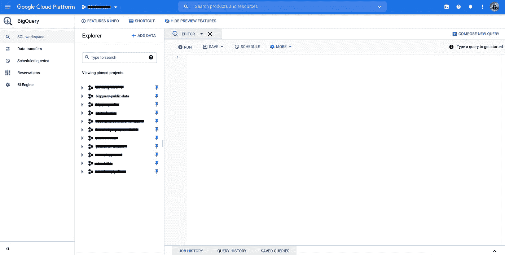
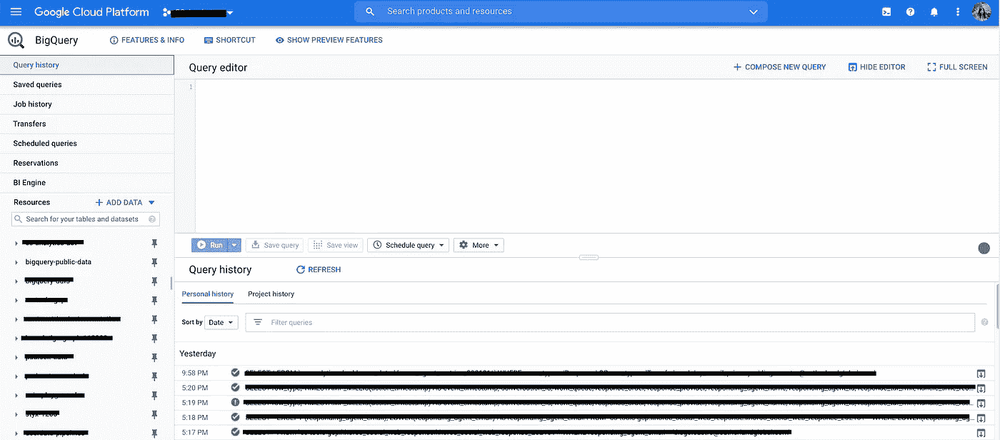

# 用 Python 构建健壮的 Google BigQuery 管道:第一部分

> 原文：<https://towardsdatascience.com/build-robust-google-bigquery-pipelines-with-python-part-i-1ac8ca11391a?source=collection_archive---------8----------------------->

## 谷歌云平台

## Apache Beam 与 Google BigQuery API


弗兰基·查马基在 [Unsplash](https://unsplash.com/s/photos/data?utm_source=unsplash&utm_medium=referral&utm_content=creditCopyText) 上拍摄的照片

这是关于在 Python 中与 BigQuery 交互以构建数据管道的三篇文章系列的第 1 部分。

*   第一部分. Apache Beam 与 Google BigQuery API
*   第二部分。Python 中的 BigQuery 结构
*   第三部分。BigQuery 和 Google Sheet:隐藏的复杂性

# 摘要

在 Spotify，我们有许多软件工程师和数据工程师团队，他们使用 Scala 或 Java 来帮助将大量数据带入我们的谷歌云平台(GCP)生态系统，供用户和研究人员使用。然而，大部分数据还不能立即使用。为了正确地进行分析，需要进行清洁和整形步骤。对于我们来说，重要的是拥有一个强大的管道，可以处理日常的数据清理需求，同时应用业务逻辑和机器学习方法。Python 有一个独特的优势，即既敏捷又强大。这就是为什么我在过去的一年里投入了大量的时间和精力来提出一个优化的解决方案，用 Python 构建 BigQuery 数据管道。感谢开源社区，那里有很多资源提供了很好的提示和指导。然而，经过几轮反复试验，我还是花了一些时间找到了正确的信息。因此，我希望这篇文章能让你的生活变得更简单，如果你也想在 Python 中使用 BigQuery 的话。

在这篇文章中，我将简要介绍 BigQuery，并讨论可以与 BigQuery 交互的两个最常用的 Python APIs。

## **目录**

1.  BigQuery 概述
2.  Apache Beam BigQuery Python I/O:实现、利弊
3.  Python 中的 Google BigQuery API:实现、优缺点

# BigQuery 概述

> BigQuery 是一个完全托管的、无服务器的数据仓库，能够对数 Pb 的数据进行可扩展的分析。它是一个平台即服务，支持使用 ANSI SQL 进行查询。它还内置了机器学习功能。BigQuery 于 2010 年 5 月发布，并于 2011 年 11 月正式发布。(维基百科)

在 GCP，两个最常见的存储数据的地方是 BigQuery 和 GCP 桶。GCP 桶更像一个存储场所，而 BigQuery 允许用户在 UI 上立即进行分析。有许多方法可以与 BigQuery 交互。最简单和最明显的方法是通过 BigQuery 的交互式 UI 控制台。BigQuery 控制台允许用户使用[标准 SQL](https://cloud.google.com/bigquery/docs/reference/standard-sql/functions-and-operators) 或[遗留 SQL](https://cloud.google.com/bigquery/docs/reference/legacy-sql) 来查询表。在云控制台和客户端库中，标准 SQL 是默认的。在`bq`命令行工具和 REST API 中，遗留 SQL 是默认的。您可以在查询设置中或者通过在 API 调用中传递参数来轻松地在两者之间切换。

谷歌最近发布了一个新的视图，增加了一些功能，比如允许**多个标签**供编辑使用，这是一个受用户欢迎的变化。但是，有几个 bug 需要修复。首先，对于每日分区，只能查看最新的模式——早期分区的模式和预览功能不起作用。再比如 delete table 函数只允许用户删除最近的分区，看起来会像是用户删除了数据集中的所有东西！幸运的是，事实并非如此；刷新将显示只有最新的分区被删除。



BigQuery 控制台当前视图



BigQuery 控制台旧视图

# Apache Beam BigQuery Python I/O

我最初是通过其 [Google BigQuery I/O 连接器](https://beam.apache.org/documentation/io/built-in/google-bigquery/)使用 Apache Beam 解决方案开始旅程的。当我了解到 Spotify 数据工程师在 Scala 中使用 Apache Beam 进行大部分管道工作时，我认为它也适用于我的管道。事实证明并非如此，但我并不后悔，因为一路上我学到了很多关于 Apache Beam 的知识。

Beam SDKs 包含内置函数，可以从 [Google BigQuery](https://cloud.google.com/bigquery) 表中读取数据和向其中写入数据。要安装，请在您的终端中运行`pip install apache-beam[gcp]`。

## 导入包

```
import apache_beam as beam
import json
from apache_beam.io.gcp.bigquery_tools import parse_table_schema_from_json
```

## 从 BigQuery 读取

要从 BigQuery 读取数据，您可以选择。Apache Beam 不是我最喜欢的从 BigQuery 读取数据的方法。我更喜欢使用 Google BigQuery API 客户端，因为它可以下载数据并将其转换为 Pandas 数据框架。但作为参考，您可以直接从表中读取:

```
*# project-id:dataset_id.table_id*
table_spec **=** 'YOUR_PROJECT:YOUR_DATASET.YOUR_TABLE_ID'my_column = (
 p
 | ‘ReadTable’ >> beam.io.ReadFromBigQuery(table=table_spec)
 # Each row is a dictionary where the keys are the BigQuery columns
 | beam.Map(lambda elem: elem[‘my_column’]))
```

或者传递一个 SQL 查询:

```
my_column = (
 p
 | ‘QueryTableStdSQL’ >> beam.io.ReadFromBigQuery(
 query=’SELECT my_column FROM ‘\
 ‘`YOUR_PROJECT.YOUR_DATASET.YOUR_TABLE_ID`’,
 use_standard_sql=True)
 # Each row is a dictionary where the keys are the BigQuery columns
 | beam.Map(lambda elem: elem[‘my_column’]))
```

## 数据格式编排

现在您已经检索了数据，您可以用 Python 对它们做各种有趣的事情。你可以操作数据，应用 ML 模型等。但是在将这个表上传到 BQ 之前，这里有一些最终处理的指针。

*   **时间戳** 格式*时间戳*列如下:

```
my_table[‘my_timestamp’] = my_table[‘my_timestamp’].apply(lambda x: x.strftime(‘%Y-%m-%d %H:%M:%S’)))
```

*   **数据类型** 将 *Float* 、 *Integer* 、 *Timestamp* 或 *Date* 数据类型转换为 *String* 首先在 Beam 中传递，然后在 schema 文件中指定数据类型。请注意*时间戳/日期*数据类型不接受空字符串。

```
my_table = my_table.applymap(str)
```

*   **数据结构**这使得 beam 能够分离列表，如果是一个巨大的数据集，就将数据传回。

```
my_table = my_table.to_dict("records")
```

*   **空值**
    None (Null)类型不能作为除了 ApacheBeam 中的*字符串*之外的任何内容传递。当作为*字符串*类型传递时，您将在 BigQuery 中看到一个实际的‘None’字符串，这是 Python 中的 NULL 值。尽管令人困惑，但将其转换为空字符串将解决问题，并在 BigQuery 中获得实际的空值。

一旦为数据类型准备好数据框，并根据需要将其转换为字典列表，就可以将对象上传到 BigQuery 了。

## 上传到 BigQuery

为了将数据上传到 BigQuery，我们需要首先定义模式。下面是一个用 JSON 生成模式文件的模板。

```
def make_sink_schema():
    mapping = {
        "string":    ["STRING", "This is my string."],
        "timestamp":  ["TIMESTAMP", "This is my timestamp."],
        "numeric":    ["FLOAT", "This is my float."],
    } mapping_list = [{"mode": "NULLABLE", "name": k, "type": mapping[k][0], "description": mapping[k][1]} for k in mapping.keys()]

    return json.JSONEncoder(sort_keys=True).encode({"fields": mapping_list})
```

你也可以在 Avro 中生成模式文件。但是这里我们以 JSON 为例。一旦准备好模式，就可以使用下面的模板将表上传到 BigQuery。

```
def run_beam(my_table, table_name, dataset_name, project_name, my_schema):

    argv = [
        '--project={0}'.format('YOUR_PROJECT'),
        '--job_name=YOUR_JOB_NAME',
        '--staging_location=gs://{0}/staging/'.format('YOUR_BUCKET'),
        '--temp_location=gs://{0}/temp/'.format('YOUR_BUCKET'),
        '--region=YOUR_REGION',
        '--service_account = YOUR_SERVICE_ACCOUNT'
        '--runner=DataflowRunner'
    ]

    p = beam.Pipeline(argv=argv)

    # write table to BigQuery
    (p
     | 'Create Data' >> beam.Create(my_table)
     | 'Write to BigQuery' >> beam.io.Write(
                beam.io.WriteToBigQuery(
    # The table name is a required argument for the BigQuery sink.
    # In this case we use the value passed in from the command line.
    table=table_name, dataset=dataset_name, project=project_name,
    # JSON schema created from make_sink_schema function
    schema=parse_table_schema_from_json(my_schema),

    # Creates the table in BigQuery if it does not yet exist.
    create_disposition=beam.io.BigQueryDisposition.CREATE_IF_NEEDED,

    # Deletes all data in the BigQuery table before writing.
    write_disposition=beam.io.BigQueryDisposition.WRITE_TRUNCATE))
     )

    return pp = run_beam(my_table, table_name, dataset_name, project_name, my_schema)p.run().wait_until_finish()
```

## 赞成的意见

在处理大量数据时，ApacheBeam 的优势是显而易见的。因为它在行级别处理数据，所以数据集可以分成多个部分，以便不同的工作人员可以并行处理它们。

## 骗局

对我来说，Apache Beam 的最大问题是它在数据类型和空值方面的不灵活性。有太多的细微差别，没有太多的变通办法。

# Python 中的 Google BigQuery API

当我在应对 Apache Beam 的缺点时，我决定尝试一下 [Google BigQuery API](https://cloud.google.com/bigquery/docs/reference/libraries) ，我很高兴我这么做了！如果你不想运行一个有大量数据的大任务，Google BigQuery API 是一个很好的选择。要安装，请在您的终端中运行`pip install — upgrade google-cloud-bigquery`。

## 导入包

```
from google.cloud import bigquery
import pandas as pd
```

## 从 BigQuery 读取

要从 BigQuery 读取数据，您可以决定是使用自己的凭据还是使用服务帐户凭据来读取。如果您想使用自己的凭证，第一步是通过在您的终端中运行`gcloud auth login command`来授权您的 Google 帐户。然后，您可以继续使用您最喜欢的 Python 编辑器:

```
# Construct a BigQuery client object.
client = bigquery.Client(project=YOUR_PROJECT)query = """
    SELECT name, SUM(number) as total_people
    FROM `bigquery-public-data.usa_names.usa_1910_2013`
    WHERE state = 'TX'
    GROUP BY name, state
    ORDER BY total_people DESC
    LIMIT 20
"""
query_job = client.query(query).result().to_dataframe() # Make an API request and convert the result to a Pandas dataframe.
```

如果您选择使用服务帐户凭证，首先将其保存为本地 JSON 文件，然后按如下方式构造客户端对象:

```
client = bigquery.Client.from_service_account_json(
json_credentials_path=PATH_TO_YOUR_JSON,
project=YOUR_PROJECT)
```

## 数据格式编排

Google BigQuery API 在数据类型上也有一些怪癖，但我喜欢的是它更好地处理 NULL 值，并且允许所有数据类型中的 NULL 值。以下是一些额外的提示:

*   **时间戳
    格式**时间戳*列如下:*

```
my_table[‘my_timestamp’] = my_table[‘my_timestamp’].apply(lambda x: x.strftime(‘%Y-%m-%dT%H:%M:%S’)))
```

*   **日期
    格式**日期*列如下:*

```
my_table['my_date'] = pd.to_datetime(my_table['my_date'], format='%Y-%m-%d', errors='coerce').dt.date
```

*   **String**
    空字符串在 BigQuery 上将作为空字符串返回。所以用`np.nan`来代替他们。

```
my_table = my_table.replace(r'^\s*$', np.nan, regex=True)
```

## 上传到 BigQuery

您可以选择在将数据上传到 BigQuery 时自动检测模式，也可以使用下面的函数定义您自己的模式。请注意，列的顺序无关紧要。BigQuery 客户端将按名称查找列。

```
def make_schema():
    schema = [
        bigquery.SchemaField(name="string", field_type="STRING",      description="This is my string."),
        bigquery.SchemaField(name="numeric", field_type="FLOAT", description="This is my float."),
    ]

    return schema
```

一旦准备好模式，就可以使用下面的模板将表上传到 BigQuery。

```
def run_bigquery(my_table, table_id, project_name, my_schema, table_description = None):
    *"""
    Upload a dataframe to BigQuery
    """* client = bigquery.Client(project=project_name)

    job_config = bigquery.LoadJobConfig(schema=my_schema,    destination_table_description=table_description,
write_disposition='WRITE_TRUNCATE')

    job = client.load_table_from_dataframe(
            my_table, table_id, job_config=job_config)

    return jobjob = run_bigquery(YOUR_TABLE, table_id, project_name, make_schema(), table_description)

job.result()
```

## 赞成的意见

Google BigQuery API 比 Apache Beam 更容易实现。它在数据类型方面也更加灵活，并且可以更好地处理 Python 中的空值。

## 骗局

如果数据量很大，这不是一个合适的解决方案。在这种情况下，考虑 Apache Beam。

所以给你！我希望这篇文章能给你一些关于在 Python 中使用 BigQuery 的想法。本系列的下一篇文章将讨论 BigQuery 中的一个特定结构——Struct，以及 Python 环境中由于当前限制而产生的变通方法。回头见！:)