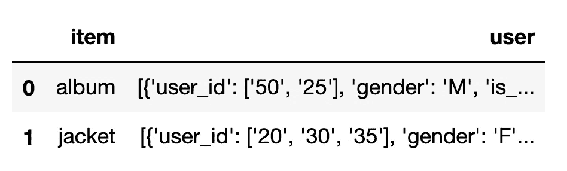
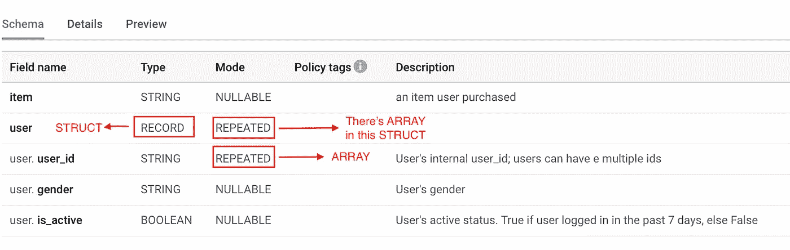
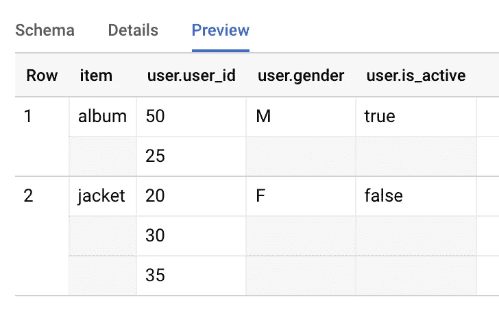

# 用 Python 构建健壮的 Google BigQuery 管道:第二部分

> 原文：<https://towardsdatascience.com/build-robust-google-bigquery-pipelines-with-python-part-ii-2883423a1c8a?source=collection_archive---------26----------------------->

## 谷歌云平台

## Python 中的 BigQuery `STRUCT`


由 [Joseph Barrientos](https://unsplash.com/@jbcreate_?utm_source=medium&utm_medium=referral) 在 [Unsplash](https://unsplash.com?utm_source=medium&utm_medium=referral) 上拍摄的照片

这是关于在 Python 中与 BigQuery 交互以构建数据管道的三篇文章系列的第二部分。

*   [第一部分:Apache Beam 与 Google BigQuery API](/build-robust-google-bigquery-pipelines-with-python-part-i-1ac8ca11391a)
*   第二部分。Python 中的 BigQuery `STRUCT`
*   第三部分。BigQuery 和 Google Sheet:隐藏的复杂性

# 什么是 STRUCT？

> `STRUCT`是有序字段的容器，每个字段都有一个类型(必需的)和字段名称(可选的)。—谷歌云

在 BigQuery 中，一个`STRUCT`就像一个数据帧，因此它可以包含多个具有不同列名和数据类型的子列。相比之下，一个`ARRAY`就像 Python 中的一个`LIST`，你可以在一个`ARRAY`中嵌套一个`STRUCT`，也可以在一个`STRUCT`中嵌套一个`ARRAY`。

`STRUCT`使用尖括号(`<`和`>`)声明类型。`STRUCT`的元素类型为**所需的**，可以任意复杂。字段名**可选**，允许重复字段名。当缺少字段名时，该字段被认为是匿名的。

使用`STRUCT`的好处是在连接表时减少了重复的麻烦。然而，它确实增加了访问的难度——特别是对于那些不太懂技术的用户。

要阅读更多关于构建`STRUCT`的内容，Google Cloud 有一个非常好的关于这个主题的[文档](https://cloud.google.com/bigquery/docs/reference/standard-sql/data-types#struct_type)。

# 查询结构

`DOT`注释将允许您查询包含在`STRUCT`中的项目。`UNNEST`是在需要展平嵌套结构时使用的函数，例如 BigQuery 中的`STRUCT`或`ARRAY`。

```
SELECT
  user.user_id, -- ARRAY
  user.gender, -- STRING
  user.is_active, -- BOOLEAN
FROM
  `my-project.my_dataset.user_info`,
  UNNEST(user) user
```

值得一提的几个怪癖:

*   当字段是嵌套在`STRUCT`中的`ARRAY`时，`NOT NULL`功能不起作用(即`WHERE user.user_id IS NOT NULL`)。`NULL`仍将返回值行。在`WHERE`子句中使用`LENGTH(user.user_id) > 0`——这将达到目的！
*   有时`UNNEST`函数会导致重复行。这是因为`UNNEST`正在对表中的所有字段执行`CROSS JOIN`。为了避免这种情况，可以考虑在`STRUCT`中创建一个`ARRAY`，或者仅对子查询中需要的字段使用`UNNEST`。

# 用 Python 下载`STRUCT`

当一个`STRUCT`在 Python 中没有任何`UNNEST`被下载时，它将在`DataFrame`中被呈现为`DICTIONARY`的一个`LIST`。



将结构下载到数据帧中

# 用 Python 将结构上传到 BigQuery

由于`Pyarrow`中的序列化限制，BigQuery I/O 不支持将`STRUCT`结构上传到 Pandas `DataFrame`中的 BQ。据我所知，在`Pyarrow 2.0`发布后，这仍然是一个正在进行的问题(见这个[线程](https://github.com/googleapis/python-bigquery/issues/19))。但我建议定期检查这个问题，因为这个问题是由谷歌云工程师提出的，看起来他们正在解决这个问题。

解决方法是将表转换成基于行的数据结构，比如`JSON`或 Python `DICTIONARY`。我可以使用`JSON`上传带有`STRUCT`的表格。如果您想将一个数据类型为`STRUCT`的表上传到 BigQuery，这里有一个例子，希望对您有所帮助。

## 导入包

```
from google.cloud import bigquery
import pandas as pd
```

## 数据结构

为了上传一个`STRUCT`到 BigQuery，该列的数据结构需要是`DICTIONARY`的`LIST`。想象一下，你正在建造一个`DICTIONARY`的`LIST`来转换成一个`DataFrame`。

```
data = pd.DataFrame([
{‘item’: ‘album’, 
 ‘user’: [{‘user_id’: [‘50’, ‘25’], ‘gender’: ‘M’, ‘is_active’: True},]
}, {‘item’: ‘jacket’,
 ‘user’: [{‘user_id’:[‘20’, ‘30’, ‘35’], ‘gender’: ‘F’, ‘is_active’: False}]
},])# convert DataFrame to the list of dict format
data_json = data.to_dict('records')
```

一旦您准备好了`DataFrame`，这里有一个`STRUCT`的模式示例:

```
schema = [
    bigquery.SchemaField(name="item", field_type="STRING", description="an item user purchased"),

    bigquery.SchemaField(
        "user",
        "STRUCT",
        fields=[
            bigquery.SchemaField("user_id", "STRING", mode="REPEATED", description="User's internal user_id; users can have e multiple ids"),
            bigquery.SchemaField("gender", "STRING", mode="NULLABLE", description="User's gender"),    
            bigquery.SchemaField("is_active", "BOOLEAN", mode="NULLABLE", description="User's active status.  True if user logged in in the past 7 days, else False"),    
        ],
        mode="REPEATED",),
]
```

在 BigQuery 控制台上，你会看到 a `STRUCT`有**类型** ' `RECORD`'，而 a`ARRAY`有**模式** ' `REPEATED`'。

如果`STRUCT`中有类型为`ARRAY`的字段，则将`STRUCT`的模式标记为`REPEATED`。如果没有，您可以将模式保留为“`NULLABLE`”。



BQ 控制台上的结构模式

现在我们已经准备好了模式，我们可以通过使用来自`client`对象的`load_table_from_json`函数来上传表。

```
client = bigquery.Client(project=your_project_name)

job_config = bigquery.LoadJobConfig(
    schema=your_schema,     
    destination_table_description=your_table_description, 
    write_disposition='WRITE_TRUNCATE'
)job = client.load_table_from_json(
    data_json, table_id, job_config=job_config
)job.result()
```

这是表上传到 BigQuery 后的样子。



具有嵌套数组的结构示例

希望这个关于使用 BigQuery `STRUCT`的简单例子对您有所帮助。如果您有任何问题，请随时评论或联系我:)

参考:

1.  [在表模式中指定嵌套和重复的列](https://cloud.google.com/bigquery/docs/nested-repeated)
2.  [数据类型—](https://cloud.google.com/bigquery/docs/reference/standard-sql/data-types#struct_type) `[STRUCT](https://cloud.google.com/bigquery/docs/reference/standard-sql/data-types#struct_type)`