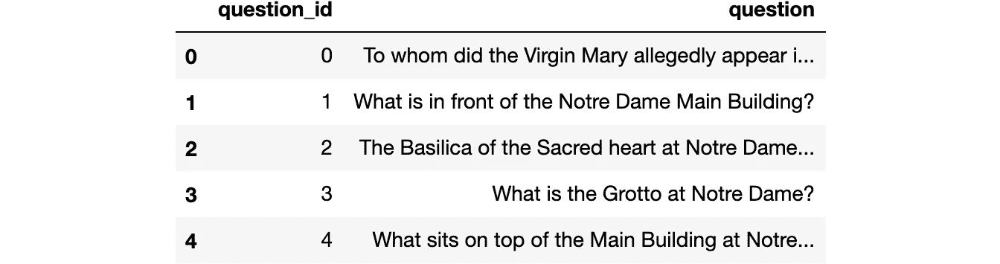

# 使用 Vespa 从 python 构建句子/段落级问答应用程序

> 原文：<https://towardsdatascience.com/build-sentence-paragraph-level-qa-application-from-python-with-vespa-9ec61fb43d2?source=collection_archive---------29----------------------->

## 使用稀疏和密集排序功能检索段落和句子级别的信息

我们将通过必要的步骤来创建一个问答(QA)应用程序，它可以基于语义和/或基于术语的搜索的组合来检索句子或段落级别的答案。我们首先讨论使用的数据集和为语义搜索生成的问题和句子嵌入。然后，我们将介绍创建和部署 Vespa 应用程序以提供答案的必要步骤。我们将所有需要的数据提供给应用程序，并展示如何结合语义和基于术语的搜索来查询句子和段落级别的答案。


布雷特·乔丹在 [Unsplash](https://unsplash.com/s/photos/ask-for-help?utm_source=unsplash&utm_medium=referral&utm_content=creditCopyText) 上拍摄的照片

本教程基于 Vespa 团队的[早期工作](https://docs.vespa.ai/en/semantic-qa-retrieval.html)来复制 Ahmad 等人的论文 [ReQA:端到端答案检索模型的评估](https://arxiv.org/abs/1907.04780)的结果。使用斯坦福问答数据集(SQuAD)1.1 版数据集。

## 关于数据

我们将使用斯坦福问答数据集(SQuAD)1.1 版数据集。数据包含段落(这里表示为上下文)，每个段落都有问题，这些问题在相关的段落中有答案。我们已经解析了数据集，并组织了将在本教程中使用的数据，以使其更容易理解。

## 段落

每个`context`数据点包含一个唯一标识段落的`context_id`、一个保存段落字符串的`text`字段和一个保存问题 id 列表的`questions`字段，这些问题 id 可以从段落文本中得到回答。如果我们想在应用程序中索引多个数据集，我们还包括一个`dataset`字段来标识数据源。

```
{'text': 'Architecturally, the school has a Catholic character. Atop the Main Building\'s gold dome is a golden statue of the Virgin Mary. Immediately in front of the Main Building and facing it, is a copper statue of Christ with arms upraised with the legend "Venite Ad Me Omnes". Next to the Main Building is the Basilica of the Sacred Heart. Immediately behind the basilica is the Grotto, a Marian place of prayer and reflection. It is a replica of the grotto at Lourdes, France where the Virgin Mary reputedly appeared to Saint Bernadette Soubirous in 1858\. At the end of the main drive (and in a direct line that connects through 3 statues and the Gold Dome), is a simple, modern stone statue of Mary.',
 'dataset': 'squad',
 'questions': [0, 1, 2, 3, 4],
 'context_id': 0}
```

## 问题

根据上面的数据点，可以用`context_id = 0`来回答带`id = [0, 1, 2, 3, 4]`的问题。我们可以加载包含问题的文件，并显示前五个问题。



## 段落句子

为了构建更精确的应用程序，我们可以将段落分解成句子。比如下面第一句话来自带`context_id = 0`的段落，可以用`question_id = 4`回答问题。

```
{'text': "Atop the Main Building's gold dome is a golden statue of the Virgin Mary.",
 'dataset': 'squad',
 'questions': [4],
 'context_id': 0}
```

## 嵌入

我们希望结合语义(密集)和基于术语(稀疏)的信号来回答发送给我们的应用程序的问题。我们已经为问题和句子生成了嵌入以实现语义搜索，每个嵌入的大小等于 512。


```
[-0.005731593817472458,
 0.007575507741421461,
 -0.06413306295871735,
 -0.007967847399413586,
 -0.06464996933937073]
```

这里是[脚本](https://github.com/vespa-engine/sample-apps/blob/master/semantic-qa-retrieval/bin/convert-to-vespa-squad.py)，包含我们用来生成句子和问题嵌入的代码。我们当时使用了 [Google 的通用句子编码器](https://tfhub.dev/google/universal-sentence-encoder)，但是可以随意用您喜欢的模型生成的嵌入来替换它。

## 创建和部署应用程序

我们现在可以基于上述数据构建一个句子级的问答应用。

## 保存上下文信息的模式

`context`模式将有一个包含数据部分描述的四个相关字段的文档。我们为`text`字段创建一个索引，并使用`enable-bm25`来预先计算加速使用 BM25 进行排名所需的数据。`summary`索引指示所有字段都将包含在所请求的上下文文档中。`attribute`索引将字段存储在内存中，作为排序、查询和分组的属性。

默认字段集意味着默认情况下查询标记将与`text`字段匹配。我们定义了两个等级配置文件(`bm25`和`nativeRank`)来说明我们可以定义和试验尽可能多的等级配置文件。您可以使用[可用的等级表达式和功能](https://docs.vespa.ai/en/ranking-expressions-features.html)创建不同的等级。

## 保存句子信息的模式

`sentence`模式的文档将继承`context`文档中定义的字段，以避免相同字段类型的不必要的重复。此外，我们添加了定义用来保存大小为 512 的浮点数的一维张量的`sentence_embedding`字段。我们将把字段作为属性存储在内存中，并使用`HNSW`(分层可导航小世界)算法构建一个 ANN `index`。阅读[这篇博文](https://blog.vespa.ai/approximate-nearest-neighbor-search-in-vespa-part-1/)以了解更多关于 Vespa 实现 ANN 搜索的历程，以及[文档](https://docs.vespa.ai/documentation/approximate-nn-hnsw.html)以了解更多关于 HNSW 参数的信息。

对于`sentence`模式，我们定义了三个等级配置文件。`semantic-similarity`使用 Vespa `closeness`排名功能，该功能被定义为`1/(1 + distance)`，因此嵌入问题嵌入更近的句子将比相距较远的句子排名更高。`bm25`是基于术语的等级配置文件的示例，而`bm25-semantic-similarity`结合了基于术语和基于语义的信号，作为混合方法的示例。

## 构建应用程序包

我们现在可以通过创建一个应用程序包来定义我们的`qa`应用程序，这个应用程序包包含了我们上面定义的`context_schema`和`sentence_schema`。此外，我们需要通知 Vespa，我们计划发送一个名为`query_embedding`的查询排名特性，其类型与我们用来定义`sentence_embedding`字段的类型相同。

## 部署应用程序

我们可以在 Docker 容器中部署`app_package`(或者部署到 [Vespa Cloud](https://cloud.vespa.ai/) ):

```
Waiting for configuration server.
Waiting for configuration server.
Waiting for configuration server.
Waiting for configuration server.
Waiting for configuration server.
Waiting for application status.
Waiting for application status.
Finished deployment.
```

## 输入数据

部署完成后，我们可以使用`Vespa`实例`app`与应用程序进行交互。我们可以从输入上下文和句子数据开始。

## 句子级检索

下面的查询通过`ranking.features.query(query_embedding)`参数发送第一个问题嵌入(`questions.loc[0, "embedding"]`)，并使用`nearestNeighbor`搜索操作符检索嵌入空间中最近的 100 个句子，使用`HNSW`设置中配置的欧几里德距离。返回的句子将按照在`sentence`模式中定义的`semantic-similarity`等级配置文件进行排序。

```
{'id': 'id:sentence:sentence::2',
 'relevance': 0.5540203635649571,
 'source': 'qa_content',
 'fields': {'sddocname': 'sentence',
  'documentid': 'id:sentence:sentence::2',
  'questions': [0],
  'dataset': 'squad',
  'context_id': 0,
  'text': 'It is a replica of the grotto at Lourdes, France where the Virgin Mary reputedly appeared to Saint Bernadette Soubirous in 1858.'}}
```

## 句子级混合检索

除了发送查询嵌入之外，我们可以通过`query`参数发送问题字符串(`questions.loc[0, "question"]`)，并使用`or`操作符检索满足语义操作符`nearestNeighbor`或基于术语的操作符`userQuery`的文档。选择`type`等于`any`意味着基于术语的操作符将检索至少匹配一个查询标记的所有文档。检索到的文档将按照混合等级-配置文件`bm25-semantic-similarity`进行分级。

```
{'id': 'id:sentence:sentence::2',
 'relevance': 44.46252359752296,
 'source': 'qa_content',
 'fields': {'sddocname': 'sentence',
  'documentid': 'id:sentence:sentence::2',
  'questions': [0],
  'dataset': 'squad',
  'context_id': 0,
  'text': 'It is a replica of the grotto at Lourdes, France where the Virgin Mary reputedly appeared to Saint Bernadette Soubirous in 1858.'}}
```

## 段落级检索

对于段落级检索，我们使用 Vespa 的[分组](https://docs.vespa.ai/en/grouping.html)特性来检索段落而不是句子。在下面的示例查询中，我们按`context_id`分组，并使用段落的最大句子分数来表示段落级别分数。我们将返回的段落数限制为 3，每段最多包含两句话。我们返回每个句子的所有概要特征。所有这些配置都可以更改，以适应不同的使用情况。

```
{'id': 'group:long:0',
 'relevance': 1.0,
 'value': '0',
 'children': [{'id': 'hitlist:sentences',
   'relevance': 1.0,
   'label': 'sentences',
   'continuation': {'next': 'BKAAAAABGBEBC'},
   'children': [{'id': 'id:sentence:sentence::2',
     'relevance': 0.5540203635649571,
     'source': 'qa_content',
     'fields': {'sddocname': 'sentence',
      'documentid': 'id:sentence:sentence::2',
      'questions': [0],
      'dataset': 'squad',
      'context_id': 0,
      'text': 'It is a replica of the grotto at Lourdes, France where the Virgin Mary reputedly appeared to Saint Bernadette Soubirous in 1858.'}},
    {'id': 'id:sentence:sentence::0',
     'relevance': 0.4668025534074384,
     'source': 'qa_content',
     'fields': {'sddocname': 'sentence',
      'documentid': 'id:sentence:sentence::0',
      'questions': [4],
      'dataset': 'squad',
      'context_id': 0,
      'text': "Atop the Main Building's gold dome is a golden statue of the Virgin Mary."}}]}]}
```

```
{'id': 'group:long:28',
 'relevance': 0.6666666666666666,
 'value': '28',
 'children': [{'id': 'hitlist:sentences',
   'relevance': 1.0,
   'label': 'sentences',
   'continuation': {'next': 'BKAAABCABGBEBC'},
   'children': [{'id': 'id:sentence:sentence::188',
     'relevance': 0.5209270028414069,
     'source': 'qa_content',
     'fields': {'sddocname': 'sentence',
      'documentid': 'id:sentence:sentence::188',
      'questions': [142],
      'dataset': 'squad',
      'context_id': 28,
      'text': 'The Grotto of Our Lady of Lourdes, which was built in 1896, is a replica of the original in Lourdes, France.'}},
    {'id': 'id:sentence:sentence::184',
     'relevance': 0.4590959251360276,
     'source': 'qa_content',
     'fields': {'sddocname': 'sentence',
      'documentid': 'id:sentence:sentence::184',
      'questions': [140],
      'dataset': 'squad',
      'context_id': 28,
      'text': 'It is built in French Revival style and it is decorated by stained glass windows imported directly from France.'}}]}]}
```

## 结论和未来工作

这项工作使用谷歌的通用句子编码器来生成嵌入。将评估指标与最新的[脸书密集段落检索](https://github.com/facebookresearch/DPR)方法生成的嵌入进行比较会很好。这篇 [Vespa 博文](/efficient-open-domain-question-answering-on-vespa-ai-72562121dcd8)使用 DPR 在一个可扩展的生产就绪型应用程序中重现了基于检索的问答系统的最新基线。