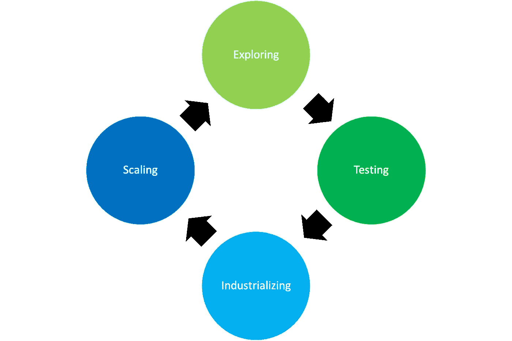

# 建立正确的机器学习团队，而不是最好的

> 原文：<https://towardsdatascience.com/build-the-right-machine-learning-team-not-the-best-2a1f2f889d73?source=collection_archive---------45----------------------->

## 了解在建立一个通过机器学习提供高级分析能力的团队时的陷阱

商业问题解决高级分析。图由[照片混合](https://www.pexels.com/@wdnet)而成。

由机器学习(ML)驱动的高级分析正在风靡一时。大大小小的公司都在提出预测、推荐、分类等等。并创建团队，在不同的问题领域解决这些概念。

需要回答的一个关键问题是如何建立这样一个团队。通常，团队的目标是开发和/或管理软件系统和围绕系统的过程。在他们的核心，他们管理数据、代码、模型和洞察力。我已经看到团队一有机会就跳起来解决高度专业化的问题。因此，他们需要多名数据科学家、机器学习工程师、数据分析师等。，尽快加入这个团队。这是解决未知问题和建立团队的正确方法吗？

我们生活在一个没有两个相同挑战的环境中。对于在同一个国家经营的两家食品连锁店来说，试图为他们的产品找到合适的折扣价格可能不是同样的挑战。一个食品杂货渠道可能会吸引富裕的顾客，而另一个渠道可能更适合寻找便宜货的人。对于同一家杂货店，长期货架产品的优化订购经验可能不容易转化为季节性产品。可能很容易想到技能，如零售、数据分析、算法、数据和建模管道等方面的经验。，就足够了。事实上，拥有这样的专业人士是一个优势，但还不够。交付价值超越了做技术工作的技能。弄清楚如何在正确的时间以正确的方式将这些经历联系起来是很重要的。

就我个人而言，我觉得我正处于学习如何做的初级阶段。然而，我已经学到了一些东西，我想与社区分享。在本文中，我将解释团队在交付高级分析时所经历的阶段。每个阶段都有独特的需求，团队需要解决这些需求来交付期望的结果。正确处理需求是建立正确团队的核心。

# 机器学习团队的阶段

图 1:ML 产品团队的阶段。作者图。

图 1 展示了 ML 产品团队的五个主要阶段。我们在下面描述了这些阶段和技能要求。

*   **探索**:在这个阶段，团队需要隔离要解决的关键问题。与此同时，团队需要找出可以提供更多关于近似问题场景的洞察力的数据，这将激发解决方案的设计。在这个阶段，重要的是扫描和保持广度，而不是深入。此外，每天在团队中交流发现和后续想法以及定期与涉众交流也很重要，但不要太频繁。这一阶段的结果是，团队已经对已识别的问题提出了一些数据驱动的公式。这个阶段需要的技能包括问题领域的知识、与问题领域相关的数据知识、数据分析和可视化、需求分析、设计思维、沟通等。请注意，这些技能中有一些是在创业环境中应用的企业家技能，可能来自产品所有者或项目经理以及数据或业务分析师。
*   **测试**:在这个阶段，团队应该专注于实现公式化问题的解决方案，允许他们测试一些关键的假设。显然，测试开发应该与解决方案开发并行，这样就可以立即识别错误。一旦解决方案在测试环境中运行，它就可以在目标市场的有限范围内进行测试。随着时间的推移，范围可以分阶段扩大。一个阶段中成功的测试应该加强下一个测试阶段的解决方案的改进。一个阶段中测试的失败应该鼓励对问题的形成进行更深入的研究，并对解决方案和测试场景进行可能的调整。此阶段的结果是团队已经确定了应该用于常规价值交付的解决方案。除了探索阶段的技能，一个团队至少需要几个有经验的数据科学家和一个数据工程师才能正常工作。这个团队还需要一些假设检验和实验方面的知识和经验。在这个阶段，重要的是技术解决者要紧密合作并保持广阔的视野。
*   工业化:在这一阶段，团队应该集中精力改进主要解决方案，以达到适当的效率和自动化水平。目标是获得足够的技术深度，以确保定期向中小型目标区域投放。在这个阶段，解决方案可能会遇到在运行过程中出现的边缘情况。因此，解决方案的假设和设计应该到处都有。因此，解决方案的技术复杂性不应妨碍对解决方案进行实验的能力。除了前两个阶段的技能，团队还需要用软件和机器学习工程师来补充数据工程师。团队中每个数据科学家或分析师至少要有两名工程师，这一点很重要。团队也可以有一些没有经验的成员。团队认真对待运营责任是很重要的，即，为即将到来的运行做好充分准备，并愿意放下手头的任何事情以使运行畅通无阻。此外，重要的是将任务委派给个人贡献者，强烈鼓励偶尔的联合工作。为了确保有人需要站出来成为一名技术领导者，他将促进架构和算法设计和实现以及团队文化的讨论。在这个阶段，技术角色需要保持宽泛，然后深入挖掘。
*   **扩展**:在这个阶段，所有的一切都是为了将系统的能力增强到一个更大的范围，以支持业务的大部分份额。解决方案设计的一部分可能需要重新构思，以便与秤配合使用。此外，在自动化、效率和透明度方面，解决方案的技术复杂性需要非常高。同样重要的是，开发、测试和生产环境应该相似，以便于转移解决方案。一旦一个团队在这个阶段成熟了，开发活动相对于运营支持应该会减少很多。除了早期阶段需要的技能，团队需要增加所有角色的人数。此外，团队应该专注于获得大数据、云、数学建模、软件开发等领域的一些专家。，至少是兼职。

理想情况下，团队会线性地经历这些阶段。然而，我们并不是生活在一个理想的世界中，因此，这样的叙述并不真正合适。业务设置将会发生变化，这将会导致解决方案不断地发生变化。实际上，随着一个团队的成熟，它在不同的阶段会有不同的工作流。

# 组建合适团队的十项实践

一直招到有特定资质的人是很难的。团队和组织争夺同一个人才库，从而蚕食市场。此外，团队成熟度越低，他们在招聘方面就越差。最后，招聘预算总是落后于候选人的期望。当团队被招募时，开始考虑 ML 系统交付类似于交付一部几十年的肥皂剧。你需要很多人做更多的工作。你需要晋升的人。你经常需要新面孔。你需要多个人来承担大量的责任并协调这个过程。除了技能和经验，获得正确的心态是必须的。

虽然分享什么是应该的方式是很诱人的，但让我分享一些让我和我的团队进入正确心态的技巧。

1.  **早点招几个忍者通才**:刚招的几个需要自己做所有的事情。这几个人必须有能力与整个堆栈一起工作。这几个人将成为团队的核心，因此需要高度协作。
2.  **招聘喜欢指导和/或良好文化的专家:**雇佣躲在角落里做自己的事的专家是不好的。这个人应该激励和帮助他人在他们的技能领域做得更好。重要的是，这些人推动重大的有影响力的事业，例如，减少技术债务、增加透明度、进行实验等。
3.  **碰碰运气**:招聘要求通常与潜在雇员不完全匹配。在这种情况下，只要有足够的态度和愿望来弥补差距，就要抓住机会。例如，如果这个职位是 Python 软件开发人员，但是候选人有 Java 经验并且愿意学习其他语言，那就去争取吧。
4.  目标多样化:避免让你的团队充满超级资深的志同道合者。机器学习是关于优化的，这通常发生在考虑全局或大范围的时候。在这种情况下，如果解决方案不够健壮，那么它再复杂也没用。重要的是，除了大众需求之外，它还有能力覆盖利基市场。当一个团队保持同质的时间太长时，它可能会很难转向，而一个多样化的团队可能会因为其思维的多样性而朝着正确的方向前进。试着把招聘看成一个拼图，需要不同颜色的积木来代表经验水平、教育程度、性别、种族等等。
5.  **鼓励敏捷:**实现敏捷需要自由思考、学习和反应的时间。交付时，团队必须为提升技能和惊喜留出空间。计划不超过团队能力的百分之七十，鼓励团队花更多的时间结对编程、学习和讨论。鼓励低年级学生从事更有雄心的工作，鼓励高年级学生领导，鼓励人们超越自己的典型职责。最终，这将使个人对自己的工作拥有更多的自主权，从而获得更快反应的心态和能力。
6.  **减少部落知识:**总是不停地问我们能不能在容错的同时做我们做的事情。否则，无论工作有多复杂，都要减少对个人的高度依赖。一旦团队找到了稳定的解决方案，轮换以增加知识，将责任交给一个团队而不是个人，使文档和演示成为强制性的。
7.  **追求一个良好的生态系统:**避免仅仅运行一个交付成果的团队。走充分的弯路，比如参加团队内外的黑客马拉松，加入论坛，支持实习生，跑边项目，拯救其他团队。我们不可能一直通过花钱来摆脱危机。为此，我们需要社会化，让社区解决社区的问题。从生态系统的角度考虑挑战，而不是你的团队。如果你有意识或无意识地受益于另一个团队，你应该有意识地回报。
8.  **为分享建立一个安全的空间:**分享和奖励成就对我们来说很常见。这样的事情激励我们做得更好。然而，这还不够好。通过积极的反馈来奖励和鼓励好习惯也很重要。例如，如果有人写了很好的文档或者用大量的测试覆盖了代码，在代码评审期间公开表扬这个人。此外，团队应该强调从错误中学习，并真正尝试找到根本原因，而不是责怪个人。例如，如果有人因为缺乏知识而犯了错误，这是团队的失败，因为他们没有考虑到团队成员的教育。犯错误是常见的，不应该受到惩罚。重要的是团队在发现错误后会做什么。分享根本原因并建议补救过程不仅对团队有益，对其他团队也有益。
9.  **努力成为学习型组织:**鼓励主动学习和分享。为人们从事各种学习活动提供足够的空间、预算和手段，如上课、探索新技术和方法、组建学习小组、组建学习委员会、鼓励认证和学位。能力成长具有滚雪球效应，这种效应来自于友好的环境和临界质量。尽管没有立竿见影的效果，但有必要从早期阶段就朝着这个方向努力。
10.  **创造一个轻松的氛围:**最重要的是，采取行善，善良，减少不良行为。创造一个稳定的地方，在那里大部分时间都不会有压力。诱发事件，使之容易做到这一点。在我工作的瑞典文化中，鼓励人们每天喝咖啡、喝茶、吃面包、吃香蕉，一天几次随意闲聊。我强烈推荐给大家。

# **备注**

我已经试着以某种能力处理每一项实践，并观察到了改进。我不是这方面的研究者，也没有数据来支持我的观点。如果你有更有力的证据支持或反对我的论点，请分享。我会感激这些知识。如果你有其他建议，也请分享。