# 用 PyCaret 构建，用 FastAPI 部署

> 原文：<https://towardsdatascience.com/build-with-pycaret-deploy-with-fastapi-333c710dc786?source=collection_archive---------6----------------------->

## 这是一个循序渐进、初学者友好的教程，介绍如何使用 PyCaret 构建端到端的机器学习管道，并将其作为 API 进行部署。

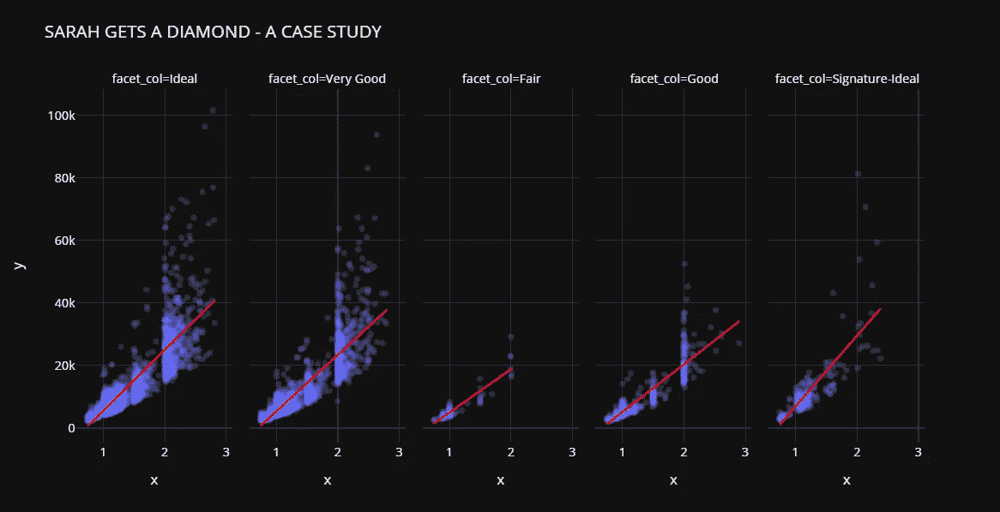

py caret——Python 中的开源、低代码机器学习库

# 👉介绍

这是一个循序渐进、初学者友好的教程，介绍如何使用 [PyCaret](https://www.pycaret.org) 构建端到端的机器学习管道，并使用 [FastAPI](https://fastapi.tiangolo.com/) 将其作为 web API 部署到生产中。

## 本教程的学习目标

*   使用 PyCaret 构建端到端的机器学习管道
*   什么是部署？我们为什么要部署机器学习模型
*   使用 FastAPI 开发一个 API 来生成对未知数据的预测
*   使用 Python 向 API 发送以编程方式生成预测的请求。

本教程将在较高层次上涵盖整个机器学习生命周期，分为以下几个部分:

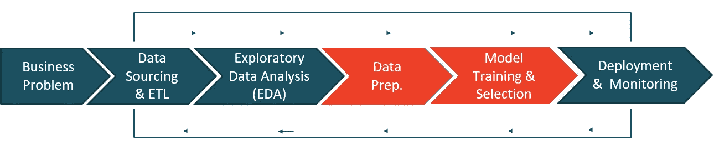

PyCaret —机器学习高级工作流

# 💻在本教程中，我们将使用哪些工具？

## 👉PyCaret

PyCaret 是一个开源的低代码机器学习库和端到端的模型管理工具，内置于 Python 中，用于自动化机器学习工作流。它因其易用性、简单性以及快速有效地构建和部署端到端 ML 原型的能力而广受欢迎。

PyCaret 是一个替代的低代码库，可以用几行代码代替数百行代码。这使得实验周期成倍地快速和有效。

py caret**简单** **好用**。PyCaret 中执行的所有操作都顺序存储在一个**管道**中，该管道对于**部署是完全自动化的。**无论是输入缺失值、一键编码、转换分类数据、特征工程，甚至是超参数调整，PyCaret 都能实现自动化。

要了解更多关于 PyCaret 的信息，请查看他们的 GitHub。

## 👉FastAPI

FastAPI 是一个现代、快速(高性能)的 web 框架，用于基于标准 Python 类型提示用 Python 3.6+构建 API。主要特点是:

*   **快**:非常高的性能，与 **NodeJS** 和 **Go** 不相上下(感谢 Starlette 和 Pydantic)。[最快的 Python 框架之一](https://fastapi.tiangolo.com/#performance)。
*   **快速编码**:将开发特性的速度提高 200%到 300%左右。
*   **易**:设计为易于使用和学习。减少阅读文件的时间。

要了解 FastAPI 的更多信息，请查看他们的 [GitHub](https://github.com/tiangolo/fastapi) 。

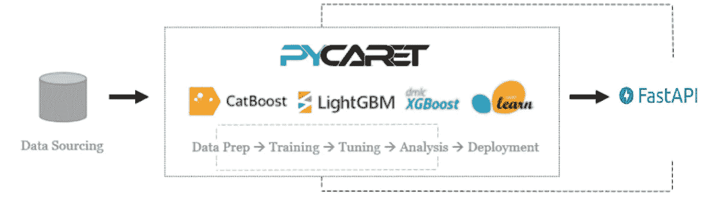

PyCaret 和 FastAPI 的工作流

## 👉正在安装 PyCaret

安装 PyCaret 非常容易，只需要几分钟。我们强烈建议使用虚拟环境来避免与其他库的潜在冲突。

PyCaret 的默认安装是 pycaret 的精简版本，只安装这里列出的硬依赖项。

```
**# install slim version (default)** pip install pycaret**# install the full version**
pip install pycaret[full]
```

当您安装 pycaret 的完整版本时，这里列出的所有可选依赖项[也会被安装。](https://github.com/pycaret/pycaret/blob/master/requirements-optional.txt)

## 👉安装 FastAPI

您可以从 pip 安装 FastAPI。

```
pip install fastapi
```

# 👉商业问题

对于本教程，我将使用一个非常受欢迎的案例研究，由达顿商学院发表在[哈佛商学院](https://hbsp.harvard.edu/product/UV0869-PDF-ENG)。这个案子是关于两个未来将要结婚的人的故事。名叫*格雷格*的家伙想买一枚戒指向一个名叫*莎拉*的女孩求婚。问题是找到莎拉会喜欢的戒指，但在他的密友建议后，格雷格决定买一颗钻石，这样莎拉就可以决定她的选择。然后，格雷格收集了 6000 颗钻石的价格和切割、颜色、形状等属性数据。

# 👉数据

在本教程中，我将使用一个数据集，该数据集来自达顿商学院的一个非常受欢迎的案例研究，发表在[哈佛商业](https://hbsp.harvard.edu/product/UV0869-PDF-ENG)上。本教程的目标是根据钻石的重量、切割、颜色等属性来预测钻石的价格。您可以从 [PyCaret 的存储库](https://github.com/pycaret/pycaret/tree/master/datasets)下载数据集。

```
**# load the dataset from pycaret** from pycaret.datasets import get_data
data = get_data('diamond')
```

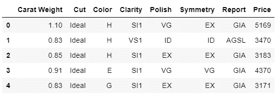

数据中的样本行

# 👉探索性数据分析

让我们做一些快速可视化来评估独立特征(重量、切割、颜色、净度等)之间的关系。)与目标变量即`Price`

```
**# plot scatter carat_weight and Price**
import plotly.express as px
fig = px.scatter(x=data['Carat Weight'], y=data['Price'], 
                 facet_col = data['Cut'], opacity = 0.25, template = 'plotly_dark', trendline='ols',
                 trendline_color_override = 'red', title = 'SARAH GETS A DIAMOND - A CASE STUDY')
fig.show()
```

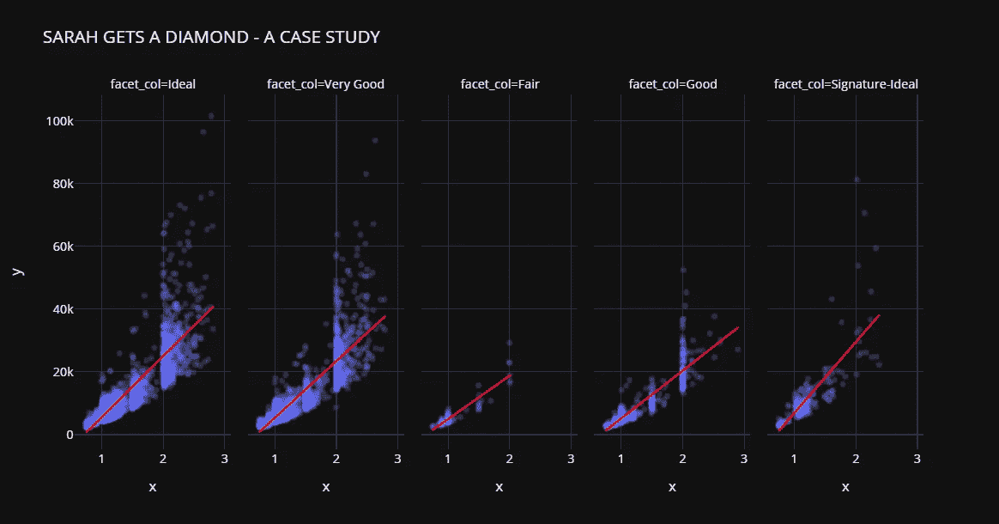

莎拉得到了一份钻石案例研究

让我们检查目标变量的分布。

```
**# plot histogram**
fig = px.histogram(data, x=["Price"], template = 'plotly_dark', title = 'Histogram of Price')
fig.show()
```

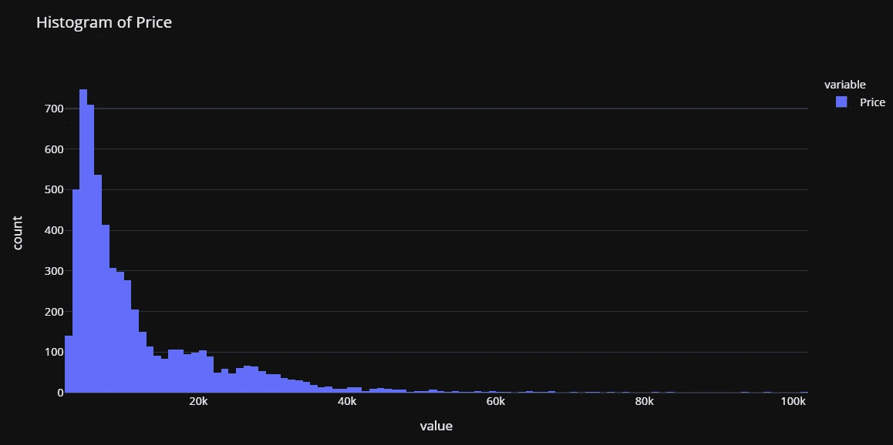

请注意，`Price`的分布是右偏的，我们可以快速查看对数变换是否可以使`Price`接近正态，从而给假设正态的算法一个机会。

```
import numpy as np**# create a copy of data**
data_copy = data.copy()**# create a new feature Log_Price**
data_copy['Log_Price'] = np.log(data['Price'])**# plot histogram**
fig = px.histogram(data_copy, x=["Log_Price"], title = 'Histgram of Log Price', template = 'plotly_dark')
fig.show()
```

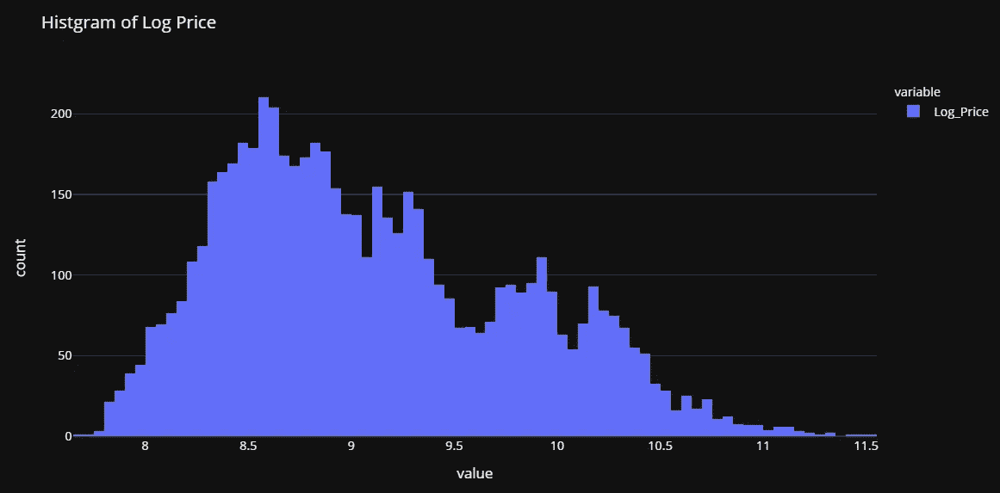

这证实了我们的假设。这种转换将帮助我们摆脱偏态，使目标变量接近正态。基于此，我们将在训练我们的模型之前转换`Price`变量。

# 👉数据准备

对于 PyCaret 中的所有模块来说，`setup`是在 PyCaret 中执行的任何机器学习实验中的第一个也是唯一一个强制步骤。该功能负责训练模型之前所需的所有数据准备。除了执行一些基本的默认处理任务，PyCaret 还提供了一系列预处理功能。要了解 PyCaret 中所有预处理功能的更多信息，您可以查看这个[链接](https://pycaret.org/preprocessing/)。

```
**# init setup**
from pycaret.regression import *
s = setup(data, target = 'Price', transform_target = True)
```


pycaret.regression 模块中的设置函数

每当在 PyCaret 中初始化`setup`函数时，它都会分析数据集并推断所有输入要素的数据类型。在这种情况下，你可以看到除了`Carat Weight`所有其他特征都被推断为分类，这是正确的。您可以按 enter 键继续。

注意，我在`setup`中使用了`transform_target = True`。PyCaret 将使用 box-cox 变换在后台转换`Price`变量。它以类似于日志转换*(技术上不同)*的方式影响数据的分布。如果你想了解更多关于 box-cox 变换的知识，你可以参考这个[链接](https://onlinestatbook.com/2/transformations/box-cox.html)。

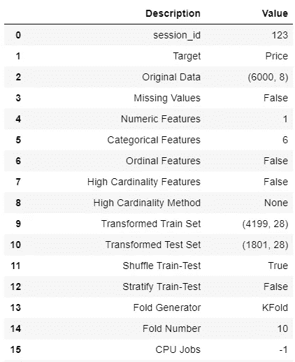

设置的输出—为显示而截断

# 👉模型训练和选择

现在数据准备工作已经完成，让我们使用`compare_models`功能开始训练过程。此函数训练模型库中可用的所有算法，并使用交叉验证评估多个性能指标。

```
**# compare all models**
best = compare_models()
```

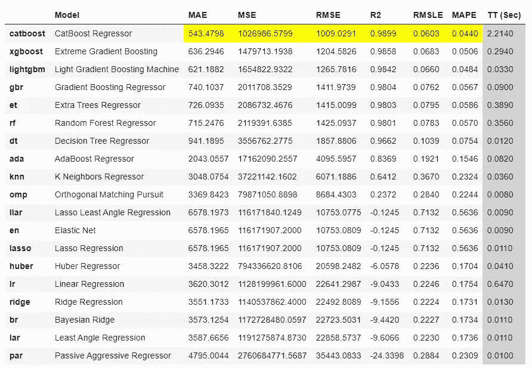

compare_models 的输出

基于*平均绝对误差*的最佳模型是`CatBoost Regressor`。使用 10 倍交叉验证的 MAE 为 543 美元，而钻石的平均价值为 11，600 美元。这还不到 5%。对于我们到目前为止所付出的努力来说还不错。

```
**# check the residuals of trained model**
plot_model(best, plot = 'residuals_interactive')
```

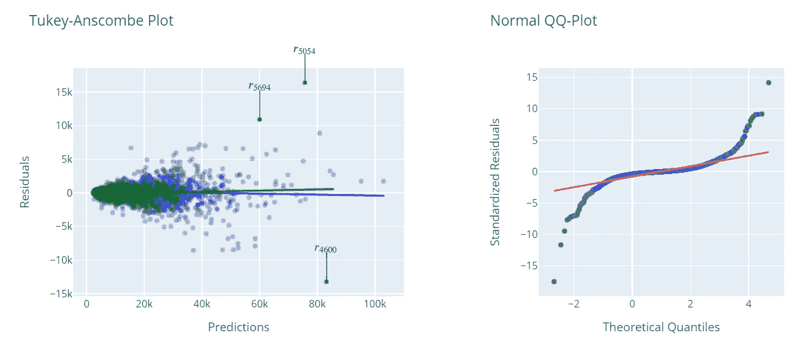

最佳模型的残差和 QQ 图

```
**# check feature importance**
plot_model(best, plot = 'feature')
```

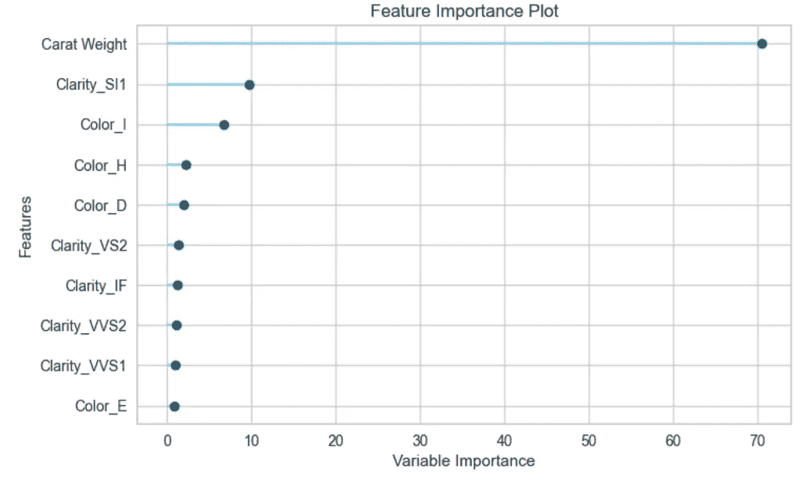

最佳模型的特征重要性

# 完成并保存管道

现在让我们最终确定最佳模型，即在包括测试集在内的整个数据集上训练最佳模型，然后将管道保存为 pickle 文件。

```
**# finalize the model**
final_best = finalize_model(best)**# save model to disk** save_model(final_best, 'diamond-pipeline')
```

# 👉部署

> ***首先，我们来了解一下为什么要部署机器学习模型？***

*机器学习模型的部署是使模型在生产中可用的过程，其中 web 应用程序、企业软件和 API 可以通过提供新的数据点和生成预测来使用经过训练的模型。通常建立机器学习模型，以便它们可以用于预测结果(二进制值，即用于分类的 1 或 0，用于回归的连续值，用于聚类的标签等)。生成预测有两种主要方式(I)批量预测；以及(ii)实时预测。本教程将展示如何将您的机器学习模型部署为 API 以进行实时预测。*

既然我们已经理解了为什么部署是必要的，并且我们已经具备了创建 API 所需的一切，即*作为 pickle 文件*的训练模型管道。使用 FastAPI 创建 API 非常简单。

[https://gist . github . com/moe zali 1/4bd 5312d 27884d 7 b 07 f 66 bef CDC 28 CCF](https://gist.github.com/moezali1/4bd5312d27884d7b07f66befcdc28ccf)

代码的前几行是简单的导入。第 8 行正在通过调用`FastAPI()`初始化一个 app。第 11 行从您的磁盘加载训练好的模型`diamond-pipeline`(您的脚本必须与文件在同一个文件夹中)。第 15–20 行定义了一个名为`predict`的函数，它接受输入，并在内部使用 PyCaret 的`predict_model`函数来生成预测，并将值作为字典返回(第 20 行)。

然后，您可以通过在命令提示符下运行以下命令来运行该脚本。在执行此命令之前，您必须与 python 脚本和模型 pickle 文件位于同一目录下。

```
uvicorn main:app --reload
```

这将在本地主机上初始化一个 API 服务。在您的浏览器上键入[http://localhost:8000/docs](http://localhost:8000/docs)，它应该显示如下内容:

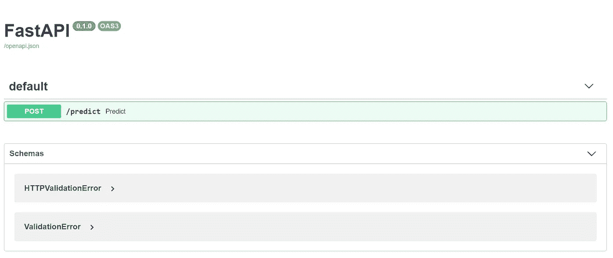

http://本地主机:8000/docs

点击绿色的`**POST**` 按钮，会打开一个这样的表单:

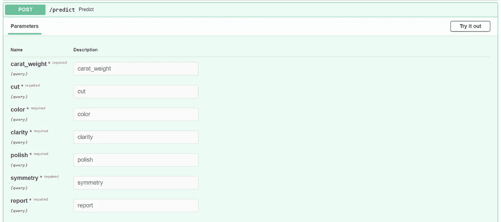

[http://localhost:8000/docs](http://localhost:8000/docs)

点击右上角的**“试用”**，在表格中填写一些值，然后点击“执行”。如果您做了所有正确的事情，您将看到以下响应:

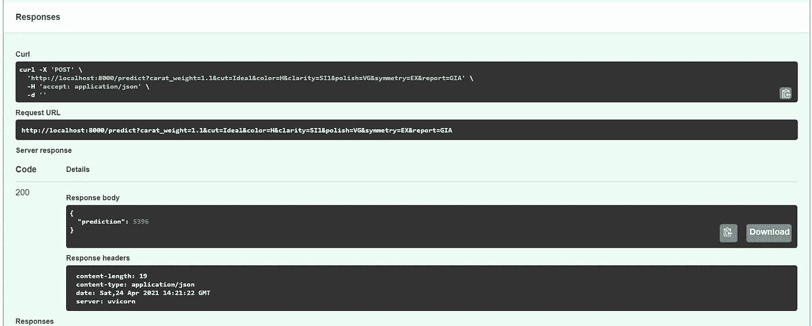

来自 FastAPI 的响应

请注意，在响应主体下，我们有一个预测值 5396(这是基于我在表单中输入的值)。这意味着，考虑到您输入的所有属性，这颗钻石的预测价格为 5396 美元。

这太好了，这表明我们的 API 正在工作。现在我们可以使用 Python 或任何其他语言中的`requests`库来连接 API 并生成预测。我为此创建了如下所示的脚本:

[https://gist . github . com/moe zali 1/545 be 5743 b 61 aa 5477228 b 8727 e 40 b 59](https://gist.github.com/moezali1/545be5743b61aa5477228b8727e40b59)

让我们来看看这个函数的运行情况:

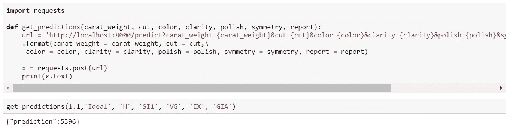

为进行 API 调用而创建的 get_prediction 函数

请注意，预测值是 5396，这是因为我在这里使用了与上表中相同的值。(1.1，“理想”，“H”，“SII”，“VG”，“EX”，“GIA”)

我希望你会喜欢 PyCaret 和 FastAPI 的易用性和简单性。在不到 25 行代码和几分钟的实验中，我使用 PyCaret 训练和评估了多个模型，并使用 API 部署了 ML 管道。

# 即将推出！

下周我将写一篇教程来推进部署到下一个级别，我将在下一篇教程中介绍像容器化和码头工人这样的概念。请关注我的[媒体](https://medium.com/@moez-62905)、 [LinkedIn](https://www.linkedin.com/in/profile-moez/) 、 [Twitter](https://twitter.com/moezpycaretorg1) 获取更多更新。

使用 Python 中的这个轻量级工作流自动化库，您可以实现的目标是无限的。如果你觉得这很有用，请不要忘记给我们 GitHub 库上的⭐️。

要了解更多关于 PyCaret 的信息，请关注我们的 LinkedIn 和 Youtube。

加入我们的休闲频道。此处邀请链接[。](https://join.slack.com/t/pycaret/shared_invite/zt-p7aaexnl-EqdTfZ9U~mF0CwNcltffHg)

# 您可能还对以下内容感兴趣:

[使用 PyCaret 2.0](/build-your-own-automl-in-power-bi-using-pycaret-8291b64181d)
[在 Power BI 中构建您自己的 AutoML 使用 Docker](/deploy-machine-learning-pipeline-on-cloud-using-docker-container-bec64458dc01)
[在 Azure 上部署机器学习管道在 Google Kubernetes 引擎上部署机器学习管道](/deploy-machine-learning-model-on-google-kubernetes-engine-94daac85108b)
[在 AWS Fargate 上部署机器学习管道](/deploy-machine-learning-pipeline-on-aws-fargate-eb6e1c50507)
[构建和部署您的第一个机器学习 web 应用](/build-and-deploy-your-first-machine-learning-web-app-e020db344a99)
[使用 AWS Fargate 无服务器](/deploy-pycaret-and-streamlit-app-using-aws-fargate-serverless-infrastructure-8b7d7c0584c2)
[构建和部署机器](/build-and-deploy-machine-learning-web-app-using-pycaret-and-streamlit-28883a569104)

# 重要链接

[文档](https://pycaret.readthedocs.io/en/latest/installation.html)
[博客](https://medium.com/@moez_62905)
[GitHub](http://www.github.com/pycaret/pycaret)
[stack overflow](https://stackoverflow.com/questions/tagged/pycaret)
[安装 PyCaret](https://pycaret.readthedocs.io/en/latest/installation.html) [笔记本教程](https://pycaret.readthedocs.io/en/latest/tutorials.html) [投稿于 PyCaret](https://pycaret.readthedocs.io/en/latest/contribute.html)

# 想了解某个特定模块？

单击下面的链接查看文档和工作示例。

[分类](https://pycaret.readthedocs.io/en/latest/api/classification.html) 回归 聚类
[异常检测](https://pycaret.readthedocs.io/en/latest/api/anomaly.html)
[自然语言处理](https://pycaret.readthedocs.io/en/latest/api/nlp.html) [关联规则挖掘](https://pycaret.readthedocs.io/en/latest/api/arules.html)