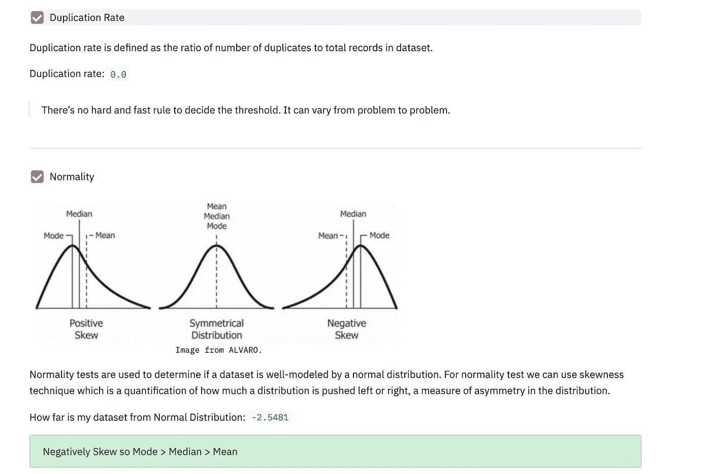
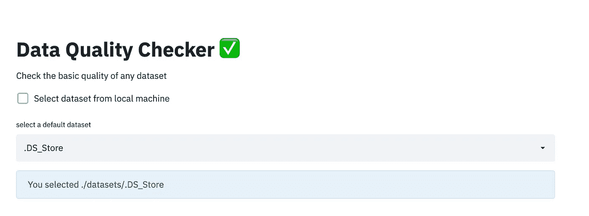
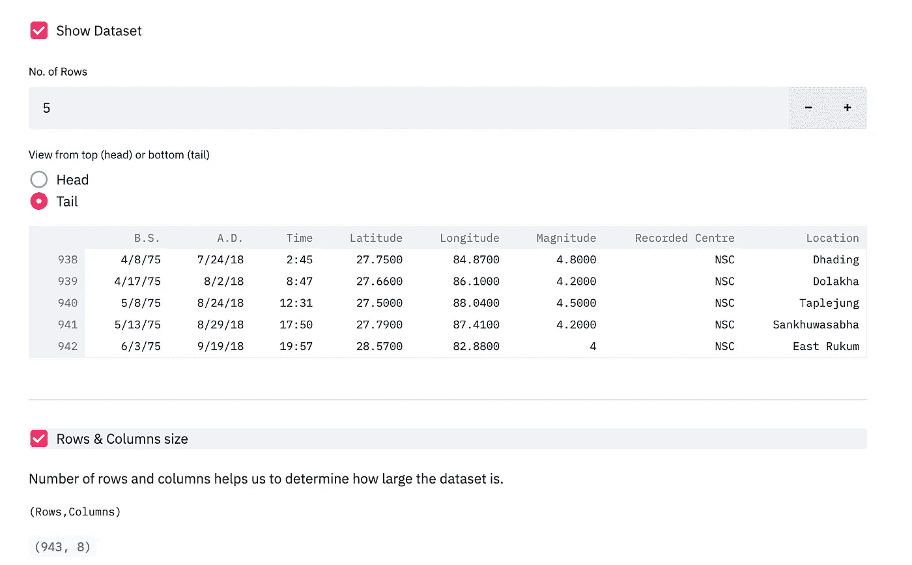
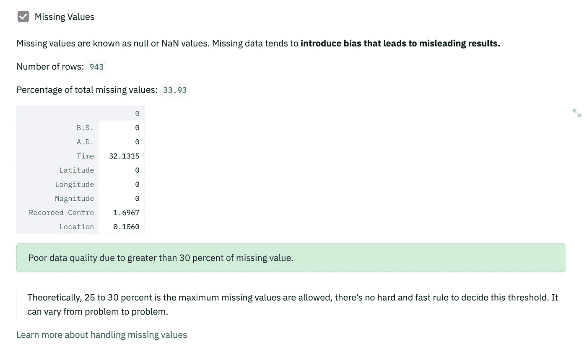
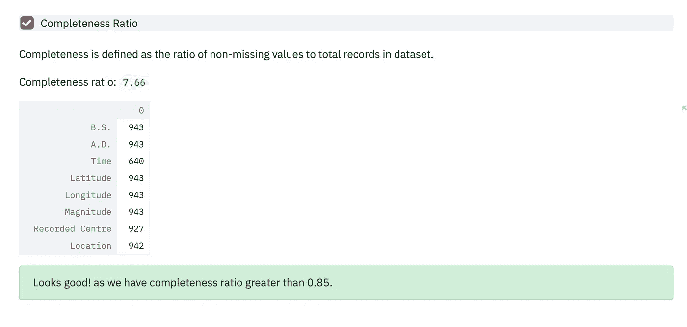
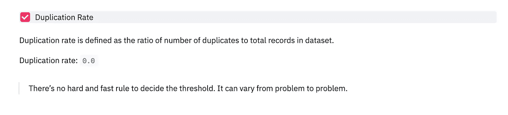
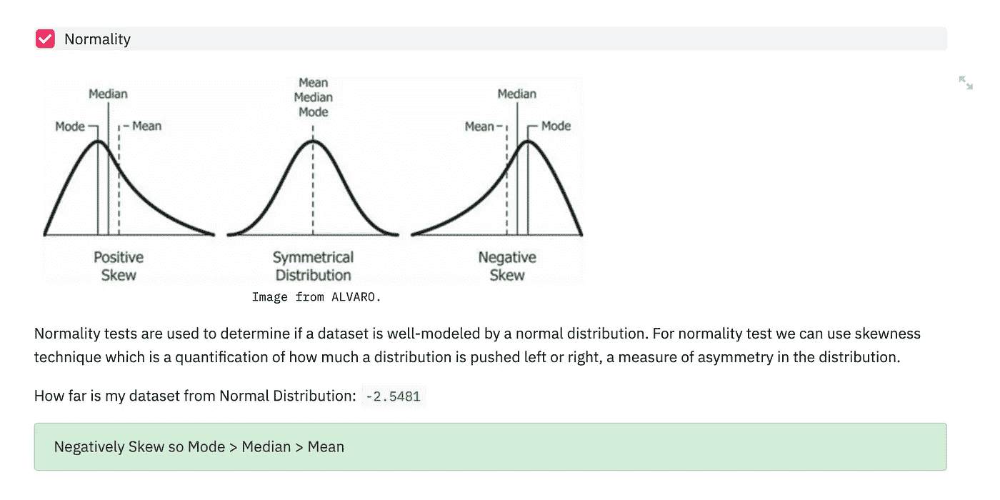

# 使用 Streamlit 构建您的第一个 Python 数据质量检查 Web 应用程序

> 原文：<https://towardsdatascience.com/build-your-first-data-quality-checking-web-app-in-python-using-streamlit-5f2ab6d1126a?source=collection_archive---------28----------------------->



最终产品快照。点击查看 app [。](https://data-quality-checker.herokuapp.com/)

> 质量从来不是偶然；它总是高度的意图、真诚的努力、明智的指导和熟练的执行的结果；它代表了多种选择中的明智选择。

M 保持数据集的质量不是一项简单的任务。众所周知，数据质量的下降通常会引入偏差，导致误导性结果，最终对业务产生不利影响。根据 [Gartner research](https://www.gartner.com/smarterwithgartner/how-to-create-a-business-case-for-data-quality-improvement/) 的调查，数据质量差给组织带来的平均经济影响为每年 970 万美元。类似地，来自 IBM 的[数据表明，仅在美国，由于数据质量低下，企业每年损失 3.1 万亿美元。数据质量低不仅仅是一个货币问题；这也有可能损害公司的声誉。](https://www.ibmbigdatahub.com/infographic/extracting-business-value-4-vs-big-data)

数据质量是一个普遍的问题。[Forrester](https://www.forrester.com/report/Build+Trusted+Data+With+Data+Quality/-/E-RES83344)的研究表明，在进入决策流程之前，分析师三分之一的时间中有近 40%用于筛选和确认分析数据。

数据质量是业务运营、规划和发展的关键。然而，数据质量是由不同的因素定义的，有些是主观的，有些是客观的。因此，积累数据质量的所有参数是一个十亿美元的问题。

在这篇博客中，我们将学习创建一个 [Streamlit](https://www.streamlit.io/) python 应用程序，根据以下指标检查数据的基本质量:

1.缺失值/ NaN
2。完成率
3。重复率
4。正规性检验

[*这里是这个 tutoria*](https://github.com/maladeep/data-quality-checker) *l 的完整代码，如果你想跟随你的教程，这里是* [*演示*](https://data-quality-checker.herokuapp.com/) *。*

## 导入库

```
import os
import streamlit as st
import pandas as pd
import numpy as np
import matplotlib.pyplot as plt
import matplotlib
from PIL import Image 
```

导入库后，我们将自定义文本和表格的宽度。此外，我们将隐藏默认的页脚文本。

```
def main():
    def _max_width_():
        max_width_str = f"max-width: 1000px;"
        st.markdown(
            f"""
        <style>
        .reportview-container .main .block-container{{
            {max_width_str}
        }}
        </style>
        """,
            unsafe_allow_html=True,
        )# Hide the Streamlit header and footer
    def hide_header_footer():
        hide_streamlit_style = """
                    <style>
                    footer {visibility: hidden;}
                    </style>
                    """
        st.markdown(hide_streamlit_style, unsafe_allow_html=True)# increases the width of the text and tables/figures
    _max_width_()# hide the footer
    hide_header_footer()
```

现在，我们将创建一个选项来选择准备好的数据集或允许用户上传他们自己的文件。

```
st.markdown("# Data Quality Checker ✅")
    st.markdown("Check the basic quality of any dataset")
    st.markdown("---")st.subheader(" [Read full tutorial at Medium.]([https://medium.com/@maladeep.upadhaya](https://medium.com/@maladeep.upadhaya)) |  [Complete code at GitHub]([https://github.com/maladeep](https://github.com/maladeep))")
    st.markdown("---")
    def file_select(folder='./datasets'):
        filelist=os.listdir(folder)
        selectedfile=st.selectbox('select a default dataset',filelist)
        return os.path.join(folder,selectedfile)if st.checkbox('Select dataset from local machine'):
        data=st.file_uploader('Upload Dataset in .CSV',type=['CSV'])
        if data is not None:
            df=pd.read_csv(data)
    else:
        filename=file_select()
        st.info('You selected {}'.format(filename))
        if filename is not None:
            df=pd.read_csv(filename)
    st.markdown("---")
```

直到这段代码，我们有了以下结果。现在我们将开始实现探索数据质量的必要部分。



图片作者。点击查看应用[。](https://data-quality-checker.herokuapp.com/)

## 数据集和形状的快照

```
#show data
    if st.checkbox('Show  Dataset'):
        num=st.number_input('No. of Rows',5,10)
        head=st.radio('View from top (head) or bottom (tail)',('Head','Tail'))if head=='Head':
            st.dataframe(df.head(num))
        else:
            st.dataframe(df.tail(num))

    st.markdown("---")

    if st.checkbox('Rows & Columns size'):
        st.markdown("Number of rows and columns helps us to determine how large the dataset is.")
        st.text('(Rows,Columns)')
        st.write(df.shape)st.markdown("---")
```



图片作者。点击查看 app [。](https://data-quality-checker.herokuapp.com/)

## 检查缺少的值

缺失值称为空值或 NaN 值。在大多数情况下，缺失数据会导致偏差，从而导致模糊的结果。

```
#check for null values
    if st.checkbox('Missing Values'):
        st.markdown("Missing values are known as null or NaN values. Missing data tends to **introduce bias that leads to misleading results.**")st.write("Number of rows:", len(df))
        dfnull = df.isnull().sum()/len(df)*100
        totalmiss = dfnull.sum().round(2)
        st.write("Percentage of total missing values:",totalmiss)
        st.write(dfnull)
        if totalmiss <= 30:
           st.success("Looks good! as we have less then 30 percent of missing values.")

        else:
           st.success("Poor data quality due to greater than 30 percent of missing value.")st.markdown(" > Theoretically, 25 to 30 percent is the maximum missing values are allowed, there’s no hard and fast rule to decide this threshold. It can vary from problem to problem.")
        st.markdown("[Learn more about handling missing values]([https://medium.datadriveninvestor.com/easy-way-of-finding-and-visualizing-missing-data-in-python-bf5e3f622dc5](https://medium.datadriveninvestor.com/easy-way-of-finding-and-visualizing-missing-data-in-python-bf5e3f622dc5))")
```

理论上，[25%到 30%](https://discuss.analyticsvidhya.com/t/what-should-be-the-allowed-percentage-of-missing-values/2456/11)是允许的最大缺失值，没有硬性规定来决定这个阈值。它可能因问题而异。



图片作者。点击查看 app [。](https://data-quality-checker.herokuapp.com/)

## 完整率

完整性定义为数据集中非缺失值与记录总数的比率。实际上，大于 0.85 的完全率是可接受的。

```
#check for completeness ratio 
    if st.checkbox('Completeness Ratio'):
        st.markdown(" Completeness is defined as the ratio of non-missing values to total records in dataset.") 
        # st.write("Total data length:", len(df))
        nonmissing = (df.notnull().sum().round(2))
        completeness= round(sum(nonmissing)/len(df),2)
        st.write("Completeness ratio:",completeness)
        st.write(nonmissing)if completeness >= 0.80:
           st.success("Looks good! as we have completeness ratio greater than 0.85.")

        else:
           st.success("Poor data quality due to low completeness ratio( less than 0.85).")
```



图片作者。点击查看 app [。](https://data-quality-checker.herokuapp.com/)

## 复制率

重复率定义为数据集中的重复记录数除以记录总数。没有硬性规定来决定门槛。它可能因问题而异。

```
#check dupication rate
    if st.checkbox('Duplication Rate'):
        st.markdown(" Duplication rate is defined as the ratio of  number of duplicates to total records in dataset.") 

        duplicated = df.duplicated().sum()
        dupratio= round(duplicated/len(df),2)
        st.write("Duplication rate:",dupratio)
        st.markdown(" > There’s no hard and fast rule to decide the threshold. It can vary from problem to problem.")
```



图片作者。点击查看 app [。](https://data-quality-checker.herokuapp.com/)

## 正规性检验

正态性检验用于确定数据集是否由正态分布很好地建模。对于正态性检验，我们可以使用偏斜度技术，这是一种量化分布被向左或向右推的程度，是分布不对称性的一种度量。

```
#check for normality test
    if st.checkbox('Normality'):images=Image.open('images/n.png')
        st.image(images,width=600, caption="Image from ALVARO.")st.markdown("Normality tests are used to determine if a dataset is well-modeled by a normal distribution. For normality test we can use skewness technique which is a quantification of how much a distribution is pushed left or right, a measure of asymmetry in the distribution.")
        aa= pd.DataFrame(df).skew()
        normalityskew= round(aa.mean(),4)
        st.write("How far is my dataset from Normal Distribution:", normalityskew)if normalityskew == 0 :
           st.success("Your dataset is in  Normal Distribution i.e mean, mode and median are all equal ")

        elif normalityskew > 0:
           st.success("Positively Skew so Mean  >  Median  >  Mode")elif normalityskew < 0:
            st.success("Negatively Skew so Mode  >  Median  > Mean")
```



图片作者。点击查看应用[。](https://data-quality-checker.herokuapp.com/)

这就完成了我们用 Streamlit 构建的基于 python 的数据质量检查 web 应用程序。这只是理解数据集质量的一个小方法。维护和验证数据的质量是关键所在，应该承担很大的责任。

引用亨利·福特的话作为结束语:

> 质量意味着在没人看的时候做对。

[点击此处，了解关于从 DataCamp 免费创建 python 应用程序的更多信息](https://bit.ly/3hNtmBj)。*(附属链接)*

GitHub 提供完整代码:

<https://github.com/maladeep/data-quality-checker>  

> 想进一步讨论这个吗？请在 Linkedin 上发表评论或与我联系。

# 推荐读物

</surprisingly-effective-way-to-name-matching-in-python-1a67328e670e>  <https://www.datapine.com/blog/data-quality-management-and-metrics/>  </little-known-ways-to-make-your-data-visualization-awesome-890d71b6e365>  </how-to-measure-data-quality-815076010b37>  </build-your-first-data-visualization-web-app-in-python-using-streamlit-37e4c83a85db> 