# 使用 Streamlit 构建您的第一个 Python 数据可视化 Web 应用程序

> 原文：<https://towardsdatascience.com/build-your-first-data-visualization-web-app-in-python-using-streamlit-37e4c83a85db?source=collection_archive---------8----------------------->

## 在不到 20 分钟的时间内，使用 Streamlit 视觉表达功能进行自我探索式可视化

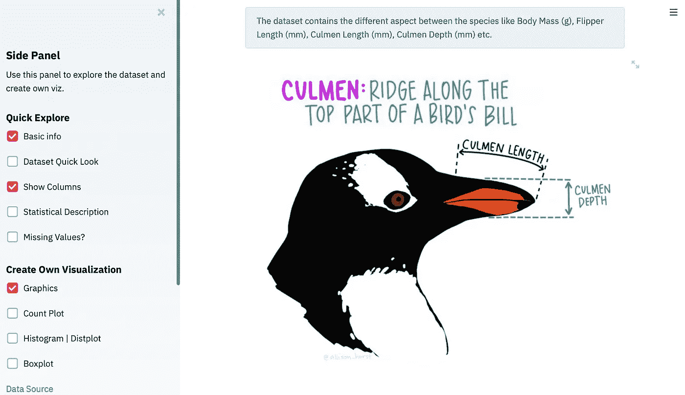

最终产品快照。图片作者。Allison Horst 的作品。

作为数据科学弟子，我以前更多的工作是在 jupyter 笔记本上，进行 [EDA](https://medium.com/analytics-vidhya/exploratory-data-analysis-for-beginner-7488d587f1ec) ，设计开发模型，只在笔记本上展示结果。有时，我试图连接 [Flask](https://flask.palletsprojects.com/en/1.1.x/) 模型，并为观众提供一个工作视图，但连接和开发一个具有前端的模型似乎既耗时又繁琐。然后我开始探索 alternative 并来到 Streamlit，这是一种分享机器学习/数据科学模型、分析和可视化的好方法，完全不用担心前端。

> " Streamlit 是 ML 和数据科学工具的下一步."—来自 Vega-Lite 的张秀坤·莫提兹

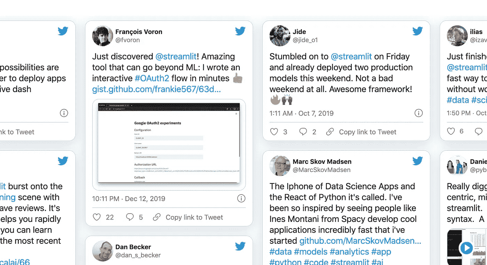

社区喜欢它。图片来自 Streamlit 网站。

[Streamlit](https://www.streamlit.io/) 是一个发展迅速的开源 Python 库，可以轻松地为数据科学及其子领域制作漂亮的定制 web 应用。它也是一个优秀的工具，允许我们创建高度交互式的仪表板。Streamlit 最大的优点是，它不需要任何 web 开发知识。如果你懂 Python，你就可以开始了！

我喜欢 streamlit，因为它为非技术团队带来了一些高级模型和视觉效果。它可以让你从 [jupyter 笔记本](https://jupyter.org/)变成一个时尚的网络应用，值得以最小的努力提供给观众。

在这里，我们将学习通过使用 Streamlit visual expression 的强大功能来构建自我探索的可视化，我假设您对使用 jupyter notebook 有很好的理解。

> [这是本教程的完整代码](https://github.com/maladeep/palmerpenguins-streamlit-eda)如果你想继续学习本教程，这是最终产品[。](https://explore-palmer-penguins.herokuapp.com/)

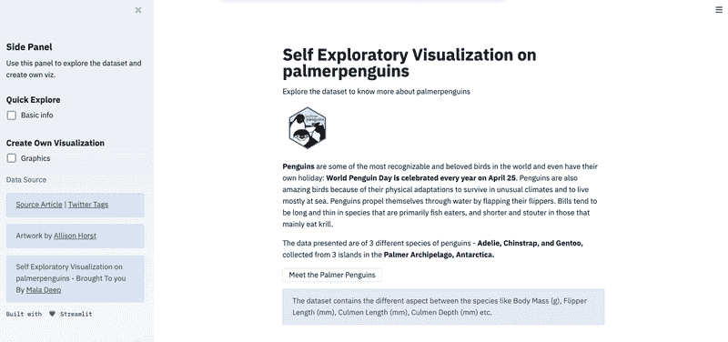

最终产品。作者 Gif。

## 要求

*   Python 3.7 版本或更高版本
*   Streamlit 0.60 版本或更高版本
*   熊猫图书馆
*   数字图书馆
*   Seaborn 图书馆
*   Matplotlib 库
*   Python 脚本的升华文本编辑器

## 我们开始吧

让我们首先通过 Mac 的终端或 windows 的命令提示符将 Streamlit 安装到我们的系统中。这里我使用终端。

```
$ pip install streamlit
```

一旦完成，让我们运行 Streamlit。

```
$ streamlit hello
```

运行上述命令后，localhost 服务器将在您的浏览器中打开，自动显示包含少量演示内容的 Streamlit 主页。


本地服务器上细流的主页。图片作者。

对于这个演示，我使用的是[帕尔默企鹅数据](https://github.com/allisonhorst/palmerpenguins)。数据由[克里斯汀·戈尔曼](https://www.uaf.edu/cfos/people/faculty/detail/kristen-gorman.php)博士和[LTER 南极洲帕尔默站](https://pal.lternet.edu/)收集并提供。在这里，我们将数据保存为“Penguin data.csv”

<https://github.com/allisonhorst/palmerpenguins>  

## 目标

在[帕尔默企鹅](https://allisonhorst.github.io/palmerpenguins/articles/intro.html)上创建自我探索可视化，用户可以
1。探索 daw 数据
2。参见统计描述
3。创建自己的图形(计数图、箱线图和显示图，根据用户的选择)

一旦我们下载了数据，让我们在任何文本编辑器中打开一个新文件(这里我使用的是 [sublime 文本编辑器](https://www.sublimetext.com/)，并将其命名为 *app.py*

正在导入核心包，请注意我们正在使用*‘ST’*作为 Streamlit 命令。

```
import streamlit as st 
from PIL import Image 
```

导入数据可视化和数据操作包

```
import matplotlib.pyplot as plt 
import matplotlib
matplotlib.use("Agg")
import seaborn as snsimport pandas as pd 
import numpy as np
```

正在连接数据。

```
DATA_URL = ("Penguin data.csv")
```

到目前为止，我们的代码是这样的

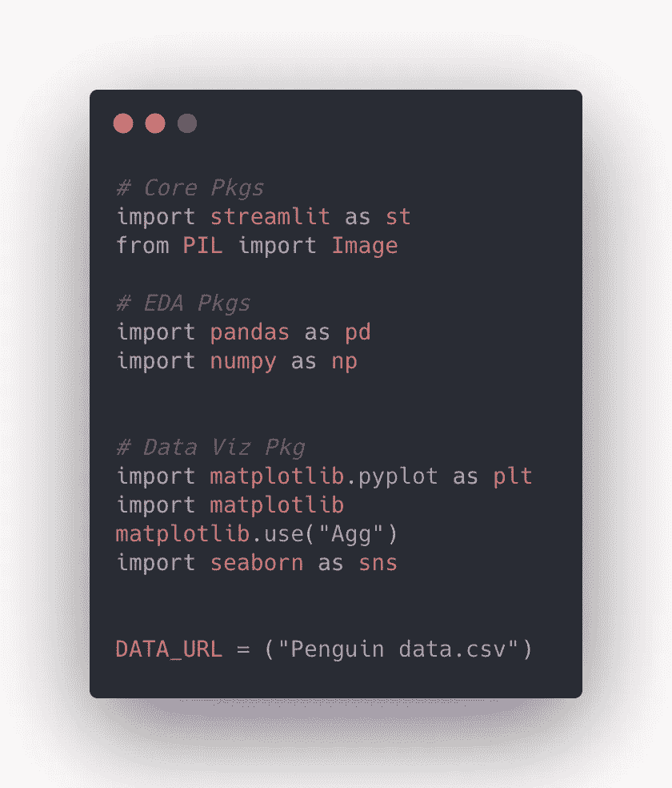

图片作者。

现在，让我们使用减价来给出一些标题和一些信息(*你一定会觉得哇，是的，减价是被接受的，^_^* )。此外，让我们添加一个图像。

请记住，您可以使用 *st.markdown( )* 而不是 *streamlit.markdown( )* ，因为我们将 streamlit 导入为' *st'* 。

```
st.markdown("# Self Exploratory Visualization on palmerpenguins")
st.markdown(“Explore the dataset to know more about palmerpenguins”)img=Image.open('images/palmerpenguins.png')
st.image(img,width=100)st.markdown(“**Penguins** are some of the most recognizable and beloved birds in the world and even have their own holiday: **World Penguin Day is celebrated every year on April 25**. Penguins are also amazing birds because of their physical adaptations to survive in unusual climates and to live mostly at sea. Penguins propel themselves through water by flapping their flippers.  Bills tend to be long and thin in species that are primarily fish eaters, and shorter and stouter in those that mainly eat krill.”)st.markdown(“The data presented are of 3 different species of penguins - **Adelie, Chinstrap, and Gentoo,** collected from 3 islands in the **Palmer Archipelago, Antarctica.**”)
```

要在终端或命令提示符下运行应用程序:

```
$ streamlit run app.py
```

一旦你运行应用程序，这是结果。

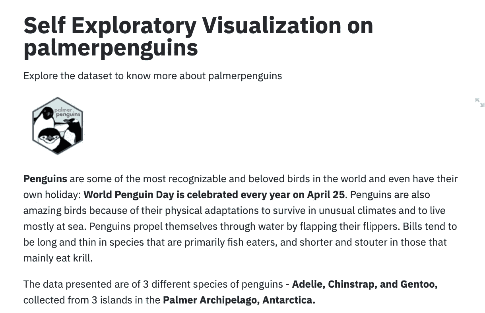

图片作者。

现在，为了使过程更具交互性，让我们使用 *st.button* 添加一个按钮，一旦用户点击它，我们将使用 *st.balloons( )* 显示一个带有一些气球效果的图像

```
if st.button("Meet the Palmer Penguins"):
    img=Image.open('images/lter_penguins.png')
    st.image(img,width=700, caption="We are  Penguin 🐧")st.markdown(
    "The data was collected and made available by **[Dr. Kristen Gorman]([https://www.uaf.edu/cfos/people/faculty/detail/kristen-gorman.php)**](https://www.uaf.edu/cfos/people/faculty/detail/kristen-gorman.php)**) and **[Palmer Station, Antarctica, LTER]([https://pal.lternet.edu/)**](https://pal.lternet.edu/)**).")
    images=Image.open('images/meet.png')
    st.image(images,width=600)
    #Ballons
    st.balloons()
```

在这里，您不需要重新运行应用程序，因为 Streamlit 会自动更新。您将看到一个带有文本的按钮:*遇见帕尔默企鹅*

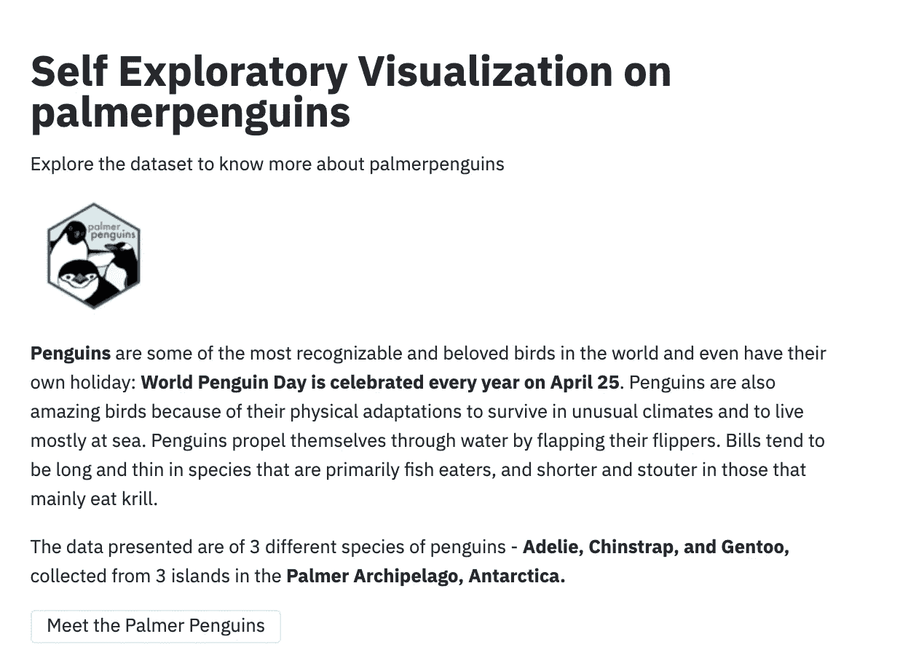

图片作者。

一旦你点击按钮，我们就会看到这些可爱的企鹅和飞行气球的图片。

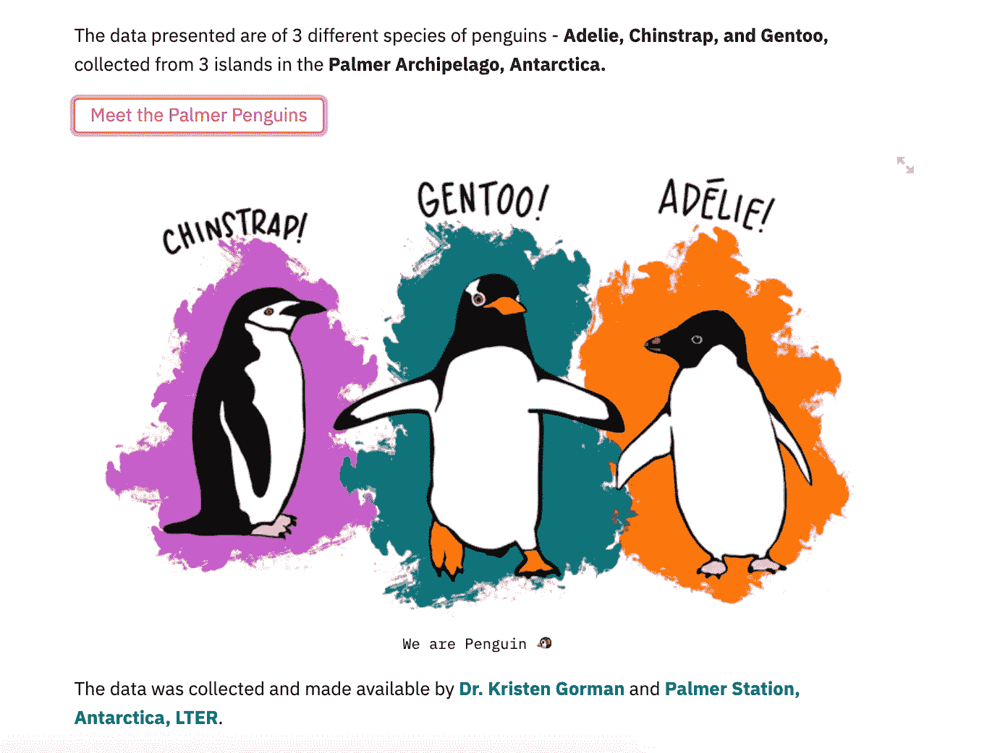

图片作者。Allison Horst 的作品。

现在，让我们使用 *st.info( )* 突出显示数据中的内容，并再次添加一些图片。

```
st.info(“ The dataset contains the different aspect between the species like Body Mass (g), Flipper Length (mm), Culmen Length (mm), Culmen Depth (mm) etc.”)
img=Image.open(‘images/beak.jpg’)
st.image(img,width=700)
```

它呈现出

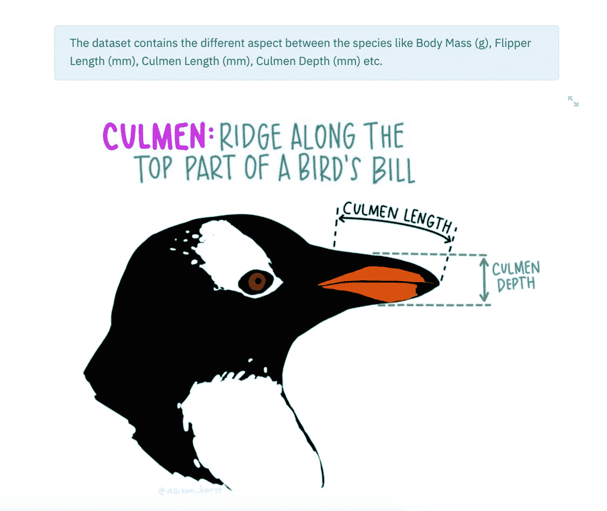

图片作者。由[艾莉森·霍斯特](https://twitter.com/allison_horst)创作的艺术品。

现在，允许用户探索数据的时刻到来了。我们将使用 *st.sidebar* 创建一个侧面板，并使用 *st.sidebar.markdown( )* 在其上添加一些 markdown，我们将添加一些按钮来根据他们的需要浏览数据。我们还需要用 *nrows* 选项加载数据，解析它，并在数据完成时向用户显示信息。

```
st.sidebar.markdown("## Side Panel")
st.sidebar.markdown(“Use this panel to explore the dataset and create own viz.”)df = pd.read_csv(DATA_URL, nrows = nrows)
    lowercase = lambda x:str(x).lower()
    df.rename(lowercase, axis='columns',inplace=True)
    return dfst.header(“Now, Explore Yourself the Palmer Penguins”)
# Create a text element and let the reader know the data is loading.
data_load_state = st.text('Loading palmerpenguins dataset...')
    # Load 10,000 rows of data into the dataframe.
df = load_data(100000)
    # Notify the reader that the data was successfully loaded.
data_load_state.text('Loading palmerpenguins dataset...Completed!')images=Image.open('images/meet.png')
st.image(images,width=600)
```

在我们的侧边栏上工作，我们为用户的自我探索添加选项和信息。
我们在此添加:

*   标题带 *st.title( )*
*   副标题为 *st.subheading( )*
*   带 *st.checkbox()的复选框*
*   用 *st.write()* 在屏幕上写入输出

```
# Showing the original raw data
if st.checkbox("Show Raw Data", False):
    st.subheader('Raw data')
    st.write(df)st.title('Quick  Explore')
st.sidebar.subheader(' Quick  Explore')
st.markdown("Tick the box on the side panel to explore the dataset.")
if st.sidebar.checkbox('Basic info'):
    if st.sidebar.checkbox('Dataset Quick Look'):
        st.subheader('Dataset Quick Look:')
        st.write(df.head())
    if st.sidebar.checkbox("Show Columns"):
        st.subheader('Show Columns List')
        all_columns = df.columns.to_list()
        st.write(all_columns)

    if st.sidebar.checkbox('Statistical Description'):
        st.subheader('Statistical Data Descripition')
        st.write(df.describe())
    if st.sidebar.checkbox('Missing Values?'):
        st.subheader('Missing values')
        st.write(df.isnull().sum())
```

它呈现出

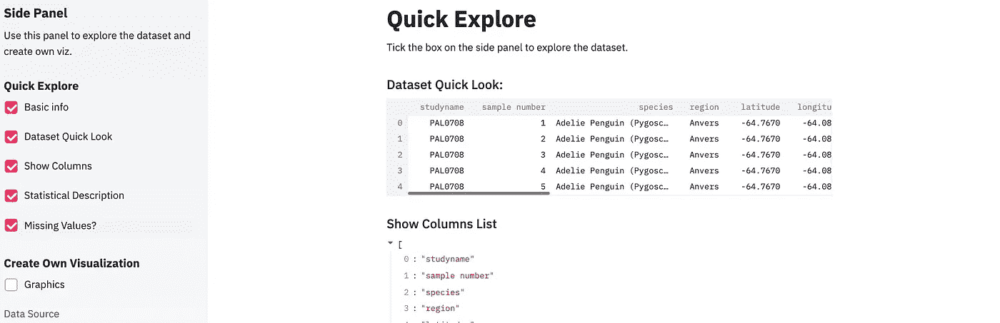

图片作者。

如您所见，我们使用了 Streamlit 语法，并在其中加入了 Python 数据操作和可视化代码。

**例如:**为了看一下 jupyter 笔记本中的数据集，我们这样做:

```
df.head()
```

在 Streamlit 中，我们还允许用户选中复选框，使用 *if 语句*查看原始数据:

```
if st.sidebar.checkbox('Dataset Quick Look'):
        st.subheader('Dataset Quick Look:')
        st.write(df.head())
```

现在，我们将深入创建图形。概念与上面的例子相同，即我们将使用 Streamlit 中的 seaborn 库来显示图形，由 *if 语句*控制。我们正在创建计数图，直方图或散点图和箱线图。

```
st.title('Create Own Visualization')
st.markdown("Tick the box on the side panel to create your own Visualization.")
st.sidebar.subheader('Create Own Visualization')
if st.sidebar.checkbox('Graphics'):
    if st.sidebar.checkbox('Count Plot'):
        st.subheader('Count Plot')
        st.info("If error, please adjust column name on side panel.")
        column_count_plot = st.sidebar.selectbox("Choose a column to plot count. Try Selecting Sex ",df.columns)
        hue_opt = st.sidebar.selectbox("Optional categorical variables (countplot hue). Try Selecting Species ",df.columns.insert(0,None))

        fig = sns.countplot(x=column_count_plot,data=df,hue=hue_opt)
        st.pyplot()

    if st.sidebar.checkbox('Histogram | Distplot'):
        st.subheader('Histogram | Distplot')
        st.info("If error, please adjust column name on side panel.")
        # if st.checkbox('Dist plot'):
        column_dist_plot = st.sidebar.selectbox("Optional categorical variables (countplot hue). Try Selecting Body Mass",df.columns)
        fig = sns.distplot(df[column_dist_plot])
        st.pyplot()

    if st.sidebar.checkbox('Boxplot'):
        st.subheader('Boxplot')
        st.info("If error, please adjust column name on side panel.")
        column_box_plot_X = st.sidebar.selectbox("X (Choose a column). Try Selecting island:",df.columns.insert(0,None))
        column_box_plot_Y = st.sidebar.selectbox("Y (Choose a column - only numerical). Try Selecting Body Mass",df.columns)
        hue_box_opt = st.sidebar.selectbox("Optional categorical variables (boxplot hue)",df.columns.insert(0,None))
        # if st.checkbox('Plot Boxplot'):
        fig = sns.boxplot(x=column_box_plot_X, y=column_box_plot_Y,data=df,palette="Set3")
        st.pyplot()
```

它呈现出

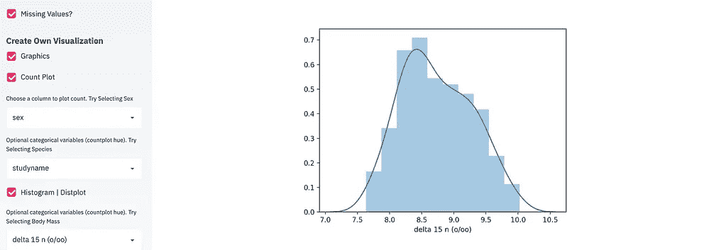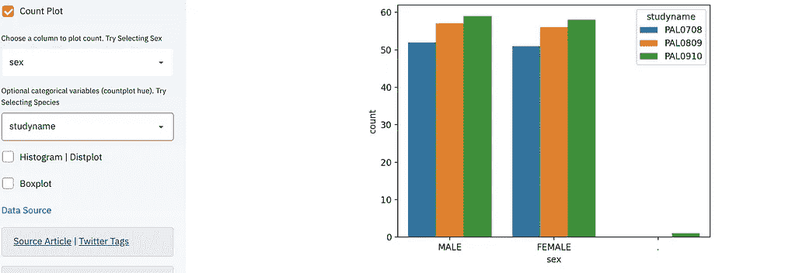

图片作者。

现在，稍微润色一下，添加数据源信息，艺术品确认。

```
st.sidebar.markdown("[Data Source]([https://data.world/makeovermonday/2020w28](https://data.world/makeovermonday/2020w28))")
st.sidebar.info(" [Source Article]([https://github.com/allisonhorst/palmerpenguins](https://github.com/allisonhorst/palmerpenguins)) | [Twitter  Tags]([https://twitter.com/allison_horst/status/1270046399418138625](https://twitter.com/allison_horst/status/1270046399418138625))")
st.sidebar.info("Artwork by [Allison Horst]([https://twitter.com/allison_horst](https://twitter.com/allison_horst)) ")
st.sidebar.info("Self Exploratory Visualization on palmerpenguins - Brought To you By [Mala Deep]([https://github.com/maladeep](https://github.com/maladeep))  ")
st.sidebar.text("Built with  ❤️ Streamlit")
```

它呈现出

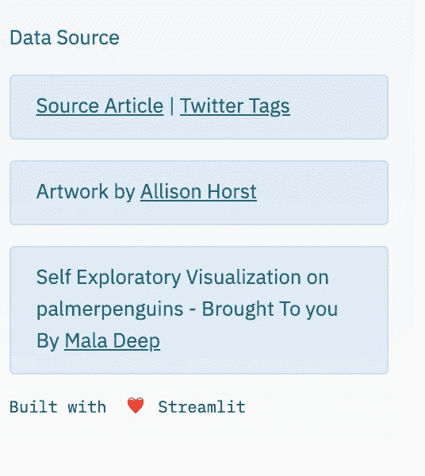

图片作者。

这结束了我们的过程。这是本教程的[完整代码](https://github.com/maladeep/palmerpenguins-streamlit-eda)，这是你刚刚和我一起开发的[最终产品](https://explore-palmer-penguins.herokuapp.com/)。

在短短 20 分钟内，你已经开发了一个自我探索的可视化应用程序。在这里，我们已经讨论了交互式小部件、数据框、标题、图像、降价、绘图渲染。现在，您可以尝试不同的数据集来创建交互式数据可视化应用程序，我将更高兴地看到您在 Streamlit 上的进展。

> ***Streamlit 社区论坛* 每周综述 [*精选*](https://discuss.streamlit.io/t/weekly-roundup-how-to-make-a-checkbox-february-rewind-bone-segmentators-and-more/10677)**

*[点击此处，了解更多关于从 DataCamp 免费创建此类应用的信息](https://bit.ly/3hNtmBj)。*(附属链接)**

> **如果你对这篇文章有任何疑问，或者想在你的下一个 Streamlit 项目上合作，请在*[*LinkedIn*](https://www.linkedin.com/in/maladeep/)*上 ping 我。**

# *推荐读物*

*   *[细流超越烧瓶](https://itnext.io/streamlit-kills-flask-1773c33fdc88)*
*   *[Streamlit 教程](https://streamlit.io/docs/tutorial2/)*
*   *[知道这 5 个 HCI 的原则会让你的数据可视化看起来很惊艳](/knowing-these-5-hcis-principles-will-make-your-data-visualization-look-amazing-efbf22f05ab8)*
*   *[鲜为人知的数据可视化方法](/little-known-ways-to-make-your-data-visualization-awesome-890d71b6e365)*
*   *[Streamlit + Heroku = Magic？](/streamlit-heroku-magic-5e4a7192929a)*