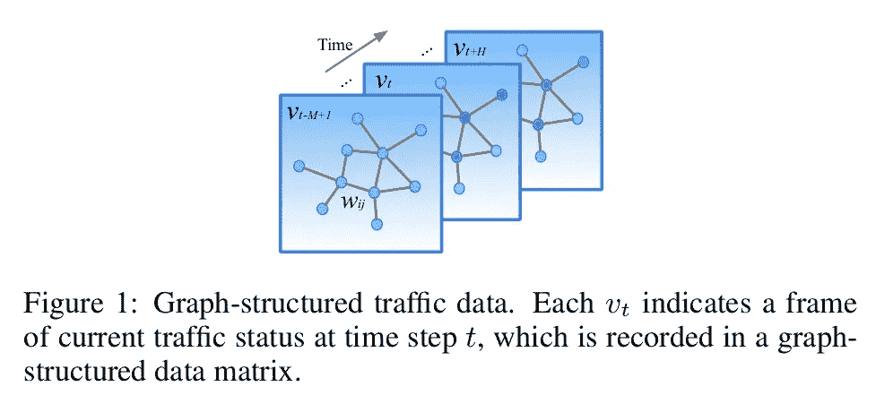
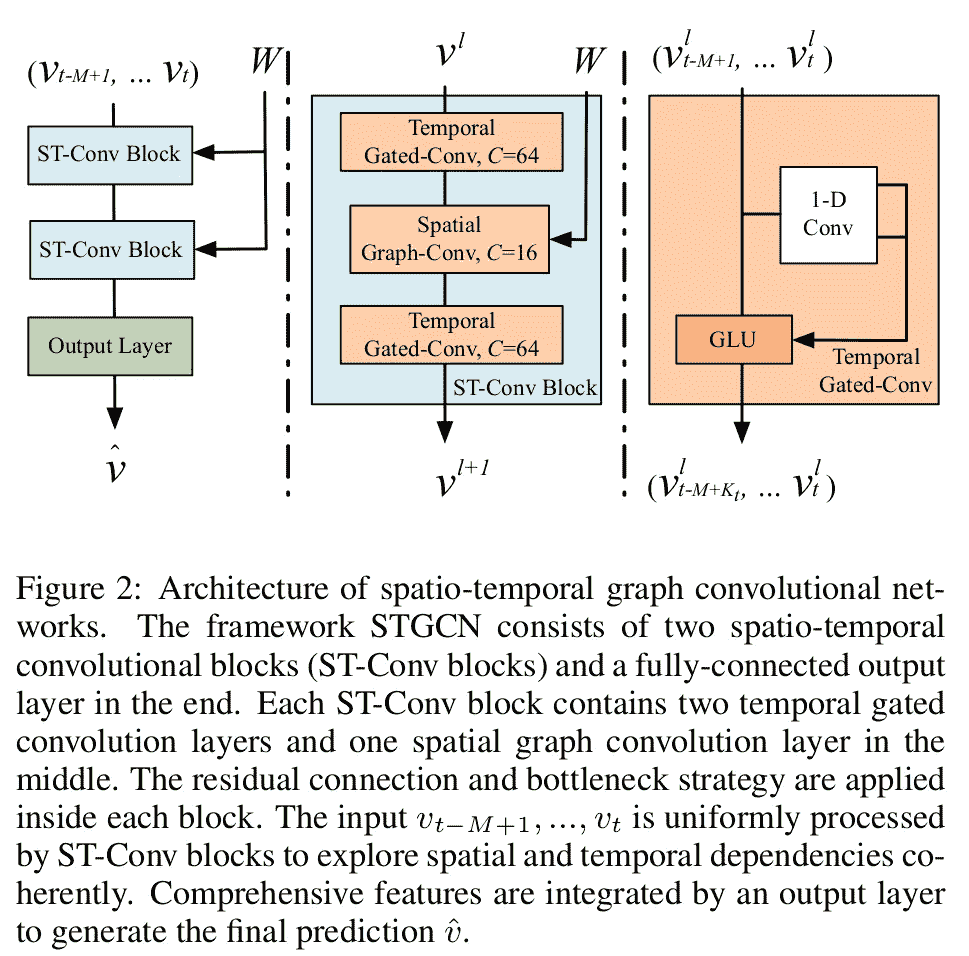
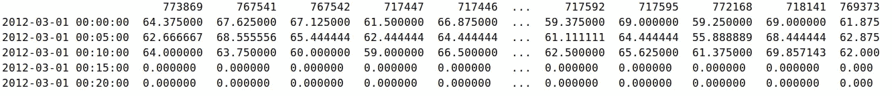
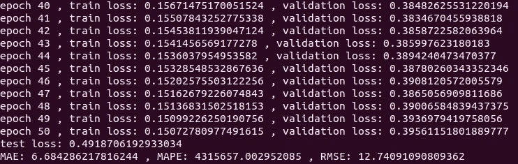

# 建立您的第一个图形神经网络模型来预测 20 分钟内的交通速度

> 原文：<https://towardsdatascience.com/build-your-first-graph-neural-network-model-to-predict-traffic-speed-in-20-minutes-b593f8f838e5?source=collection_archive---------7----------------------->

## [实践教程](https://towardsdatascience.com/tagged/hands-on-tutorials)

## 循序渐进的编码实践

图形神经网络(GNN)是深度学习的一个活跃前沿，有很多应用，例如交通速度/时间预测和推荐系统。在这篇博客中，我们将建立第一个 GNN 模型来预测旅行速度。我们将使用来自 [dgl 库](https://github.com/dmlc/dgl/tree/master/examples/pytorch/stgcn_wave)的示例代码运行时空 GNN 模型。


图片由 [Caleb Oquendo](https://www.pexels.com/@caleboquendo) 从 [Pexels](https://www.pexels.com/photo/cellphone-on-a-stand-with-navigation-map-application-open-7738879/)

## **时空 GNN 模型**

我们将训练一个在 IJCAI'18 发表的论文中提出的 GNN 模型:
[**时空图卷积网络:流量预测的深度学习框架**](https://www.ijcai.org/proceedings/2018/0505.pdf) **。**

本文的总体思想是使用历史速度数据来预测未来时间步长的速度。



图来源:参考文献[1]

参见图 1。每个节点代表一个记录交通速度的传感器站。连接两个节点的边意味着这两个传感器站连接在道路上。代表一个地区交通速度的地理图随时间而变化。我们的任务是使用历史数据，例如从 *v_{t-M+1}* 到 *v_{t}* ，来预测未来时间步的速度，例如 *v_{t+H}* 。这里的 *M* 是指之前的 *M* 交通观测值( *v_{t-M+1}，…，v_{t}* )，而 *H* 是指下一个 *H* 时间步，例如，在接下来的 30 分钟内。



图来源:参考文献[1]

该模型由一组圣 Conv 块和一个输出层组成。每个圣 Conv 区块由两个时间门控 conv 图层和位于两者之间的空间图形 conv 图层组成。输出图层由 conv、诺姆、conv 和一个完整的 conv 图层组成。

## 准备洛杉矶 METR 数据集

我们先准备数据集，接下来我会解释。

```
mkdir <your working directory>
cd <your working directory>
# clone dgl source code
git clone [git@github.com](mailto:git@github.com):dmlc/dgl.git
# clone DCRNN_PyTorch repo, because we need the data folder from it
git clone [git@github.com](mailto:git@github.com):chnsh/DCRNN_PyTorch.git
# copy the data folder from DCRNN_PyTorch repo to dgl repo 
cp -r DCRNN_PyTorch/data dgl/examples/pytorch/stgcn_wave/
# go to the stgcn_wave folder
cd dgl/examples/pytorch/stgcn_wave/
```

然后从[这个 Google drive](https://drive.google.com/open?id=10FOTa6HXPqX8Pf5WRoRwcFnW9BrNZEIX) 下载 metr-la.h5 文件，放在 data 的文件夹里。最后，您的目录结构应该是这样的:

```
.
├── data
│   ├── metr-la.h5
│   └── sensor_graph
│       ├── distances_la_2012.csv
│       ├── graph_sensor_ids.txt
├── load_data.py
├── main.py
├── model.py
├── README.md
├── sensors2graph.py
└── utils.py
```

请注意，在数据文件夹中，我们只需要 metr-la.h5、graph_sensor_ids.txt 和 distances_la_2012.csv 文件。数据文件夹中的其他文件无关紧要。

**METR-拉**交通数据集广泛用于交通速度预测。它包含从洛杉矶县高速公路的环形检测器收集的交通信息。选择了 207 个传感器，数据集包含从 2012 年 3 月 1 日到 2012 年 6 月 30 日收集的 4 个月的数据。

文件 **graph_sensor_ids.txt** 包含传感器的 id。文件 **distances_la_2012.csv** 包含传感器之间的距离。这两个文件用于创建一个邻接矩阵，然后使用 dgl 库创建一个图。


METR-洛杉矶数据集的传感器分布(图来源:参考文献[2])

文件 **metr-la.h5** 包含一个形状为[34272，207]的数组，其中 34272 是时间步长的总数，207 是传感器的数量。该数组仅包含速度数据，这意味着 GNN 模型使用历史速度来预测未来速度。不涉及其他特征(道路类型、天气、节假日)。用传感器每 5 分钟记录一次速度。207 个传感器分布在区域内的道路上。分布见上图。每 5 分钟收集一次速度。所以一天应该有 24*(60/5)=288 条记录。因此，一天的数据只是一个形状数组[288，207]，其中 288 是总时间步长，207 是传感器的数量。由于数据是在 4 个月内收集的，在可选的数据清理之后，总共有 34272 个时间步长。下面是前 5 行。标题是传感器的 id，内容的值是速度。



文件 metr-la.h5 的标题和前 5 行

为了使数据适应机器学习，我们需要准备特征 *X* 和目标 *Y* 。对于每个样本(时间步长 *t* )，特征 *X* 是其从 *t-144* 到 *t-1* (12 小时)的过去 144 个时间步长的速度历史。假设我们有 *N 个*样本，那么 *X* 的形状就是 *N，144，207* 。目标 *Y* 是未来时间步的速度，比如说 *t+4* ，那么 *Y* 的形状就是 *N，1，207* 。现在我们有了( *X，Y* )对，我们可以把它们馈送给 ML。

## 培训、验证和测试

现在我们已经准备好训练、验证和测试了。

首先，创建一个虚拟环境并安装软件包。你需要访问[这个链接](https://www.dgl.ai/pages/start.html)来选择你合适的 dgl 包。

```
conda create -n stgcn_wave python=3.6
conda activate stgcn_wave
pip install dgl-cu102 -f [https://data.dgl.ai/wheels/repo.html](https://data.dgl.ai/wheels/repo.html)
pip install torch
pip install pandas
pip install sklearn
pip install tables
```

然后我们可以通过以下方式运行 main.py

```
# maybe you need to adapt your batch size to suit your GPU memory
python main.py --batch_size 10
```

main.py 一次性完成训练、验证和测试。它使用 pytorch 作为 ML 框架。总的来说，使用 NVIDIA GeForce GTX 1080 显卡需要将近一天的时间。

作为评估行驶速度预测模型的常用方法，脚本中使用了平均绝对误差(MAE)、平均绝对百分比误差(MAPE)和均方根误差(RMSE)。下面是我日志的结尾:



我的日志截图

MAE (6.68)接近于 dgl 库的自述文件中声称的版本(~5.76)。如果我能够使用默认的批处理大小(50)运行，我可能会得到更接近的结果。

**参考文献:**

[1]冰雨，郝腾银，朱占兴，[时空图卷积网络:一个用于流量预测的深度学习框架](https://www.ijcai.org/proceedings/2018/0505.pdf)，2018，IJCAI。

[2]，Rose Yu，Cyrus Shahabi，，[扩散卷积递归神经网络:数据驱动的交通预测](https://arxiv.org/pdf/1707.01926.pdf)，2018，ICLR。