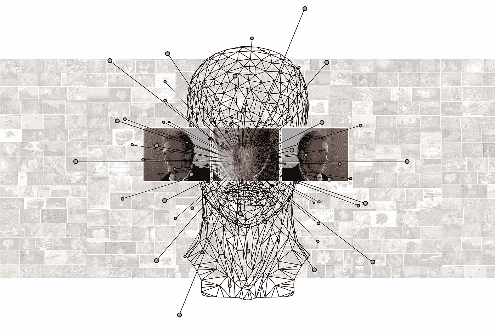
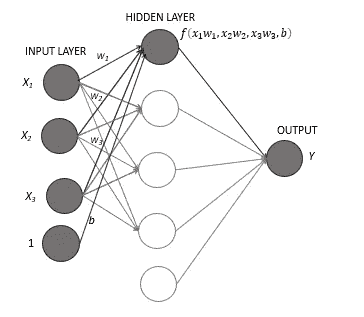
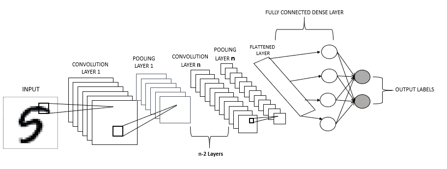
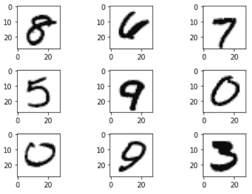
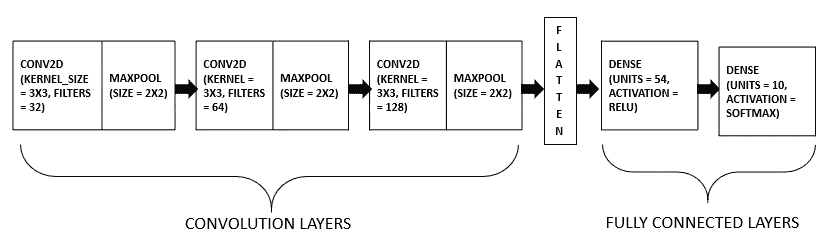
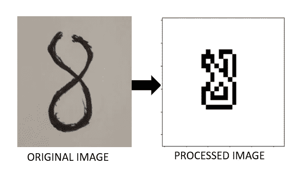

# 用卷积神经网络(CNN)构建您的第一个图像分类器

> 原文：<https://towardsdatascience.com/build-your-first-image-classifier-with-convolution-neural-network-cnn-b4e9034ec5cb?source=collection_archive---------12----------------------->

## CNN tensor flow 初学者指南

图片由[皮克斯拜](https://pixabay.com/?utm_source=link-attribution&utm_medium=referral&utm_campaign=image&utm_content=3859537)的 Gerd Altmann 提供

卷积神经网络(CNN)是一种深度神经网络，主要用于图像分类和计算机视觉应用。本文将通过使用 Python 中的 TensorFlow 包实现 CNN，引导您创建自己的图像分类模型。

一个简单的神经网络有一个输入层、一个隐藏层和一个输出层。深度神经网络可以有两个或多个隐藏层。卷积神经网络具有卷积层，其后是完全连接的神经网络。层的类型及其功能将在后续章节中解释。

## 简单的神经网络或完全连接的层

简单的神经网络(图片由作者提供)

上图中突出显示的部分显示了一个神经元。神经元是神经网络的基本元素。神经元接受输入，对其应用权重来预测输出。隐藏层中的每个节点都是前一层(在本例中为输入层)输出的函数。用于获得隐藏层输出的函数被称为*激活函数*。最后，输出 ***y*** 通过将权重应用于隐藏层的每个节点并通过应用适当的激活函数将它们组合而获得。

## CNN 的架构

基本 CNN 的架构(图片由作者提供)

卷积层从图像(输入)中提取特征。一个小的过滤器或内核扫描整个图像并提取特征，例如，一条垂直线或一条水平线，并创建一个特征图。卷积层之后的层是池层。汇集图层实质上是对卷积图层提取的要素地图进行缩减采样。由卷积图层提取的要素地图包含要素的准确位置。这可能会导致过度拟合。池图层在整个要素地图中运行过滤器。它只从该筛选器中获取特定信息，根据所选的池化方法，可以是筛选器下的平均值，也可以是最大值。这减小了要素地图的空间大小，并将要素的精确空间信息转换为粗略信息。这有助于防止过度拟合。根据输入数据集的复杂程度，任何卷积和池化图层都可以堆叠在一起。最终的池层随后被展平并转换为一维数组，然后被提供给预测输出的完全连接的层。这是卷积神经网络架构的总结。在接下来的步骤中，我们将使用该算法实现它来构建我们的第一个图像分类器。

## 履行

我们将使用 Keras 的 MNIST 数据库来训练该模型，以对手写数字进行分类。MNIST 数据库由大小为 28x28 的手写数字的黑白图像组成。让我们从导入和可视化数据集开始。此外，我们还通过将整个数据集除以 255 来标准化数据。这是因为数据集中的值范围是从 0 到 255。进行归一化是为了使整个数据集达到共同的比例。

下面是存储在数据库中的图像示例。

存储在 MNIST 数据集中的手写数字图像(作者提供的图像)

现在我们已经完成了数据集的导入和规范化，让我们继续构建模型。下面是我们将要建立的模型的示意图。

我们的模型将包含三组卷积和池层以及两个完全连接的层。上一节解释了每种类型层的功能。上面的示意图可以用 python 实现，如下所示。

“过滤器”参数定义卷积层的深度:叠加在一起形成一个卷积层的特征地图的数量。我们使用的内核大小为 3x3，除了最后一层，所有层的激活函数都被设置为 **relu，简称**为**整流线性** **激活函数。**我对最后一个密集层使用的是 softmax 激活，基本上给出了每一类的概率分布，根据其概率可以预测出正确的类。点击 链接 [***可以了解更多关于激活函数的信息请注意，只有第一层需要“input_shape”参数。这必须是输入的大小。在这种情况下，input_shape 参数是(28，28，1)，这是输入图像的大小。密集层中的“单位”参数是节点的数量。最后一层中单元的数量必须基本上等于输出类的数量。在我们的例子中，输出类的数量是 10 (0 到 9)。***](https://keras.io/api/layers/activations/)

我们已经定义了一个函数来构建模型。下一步将是优化模型，调整权重以最小化损失。我们将定义一个函数来编译带有优化器和损失函数的模型，以获得最佳权重。你可以从[***这里***](https://keras.io/api/optimizers/) 了解更多关于优化器的知识

好了，我们已经定义了一个函数来建立模型并编译模型。我们唯一剩下的就是用我们的数据集来训练模型。在下一步中，我们将定义一个函数来训练模型。在下面的代码片段中，“epochs”是算法遍历整个数据集的次数。“x”和“y”是训练数据集和相应的标签。

让我们通过使用合适的参数调用每个相应的函数来总结所有三个部分(构建、编译和训练)。在将数据集输入模型之前，我们必须执行一些小的数据预处理。MNIST 的输入数据是 28x28 的形状。然而，灰度图像是 28×28×1 的形状。因此，我们必须将训练和测试数据调整为 28x28x1。此外，存储在 train_y 和 val_y 变量中的数字的标签是数字的。这些数字必须被视为绝对的，因为我们有 10 个不同的类别(0 到 9)。因此，我们将把标签编码成二进制；例如，0 将编码为[0，0，0，0，0，0，0，0，0]，1 将编码为[1，0，0，0，0，0，0，0]，2 将编码为[0，1，0，0，0，0，0，0，0]等等。

唷…在没有强大 GPU 的情况下，花了一段时间来训练模型(我没有使用 google collab 这样的云服务)。在上面的代码片段中,“model.save”命令将训练好的模型保存在根文件夹中，稍后可以加载该模型来预测输入，而无需再次重新训练整个模型。所以，我们的模型被建立和训练。让我们来看看它的性能。

该模型经过训练，上面的图显示它表现得相当好。任务完成了吗？还没有。在我们知道如何使用模型来解决问题之前，模型是没有用的。在下一节中，我简要介绍了如何使用之前训练过的模型对手写数字进行分类。为了实际测试该模型，我在一张纸上草草写了一个数字，使用 OpenCV 处理图像，使其与我们用来训练模型的图像一致，并将其传递给模型。可以看到原始图像和处理后的图像。我承认我本可以在图像处理方面做得更好😬。但目的是测试模型，我相当有信心 CNN 将能够对处理后的图像进行分类(相信我，神经网络相当强大)。

输入图像的处理和图像类别的预测

瞧啊。现在你知道用卷积神经网络建立一个图像分类器。您可以随意选择层数和相关参数、时期数等。，并决定什么是最好的。类似的方法可以应用于更复杂类型的图像。一旦你习惯了对手写数字进行分类，你就可以将这种方法应用到来自“*”的 MNIST 时装数据集中。*

*我希望这篇文章对你有用。从[https://www.linkedin.com/in/vipul-kumar-03241b102/](https://www.linkedin.com/in/vipul-kumar-03241b102/)通过 LinkedIn 与我联系，分享和讨论更多与数据科学相关的技能。*