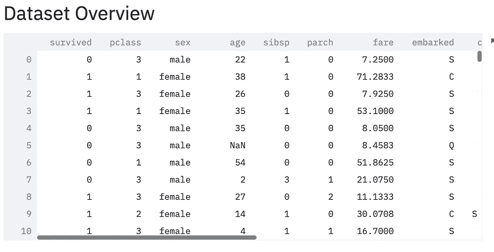
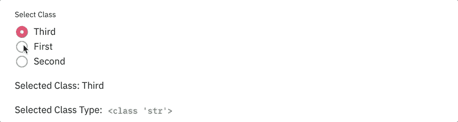
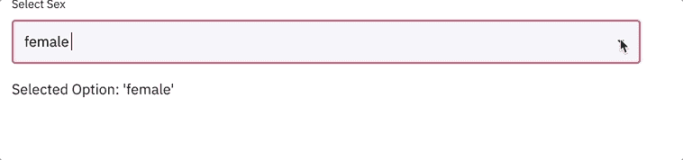
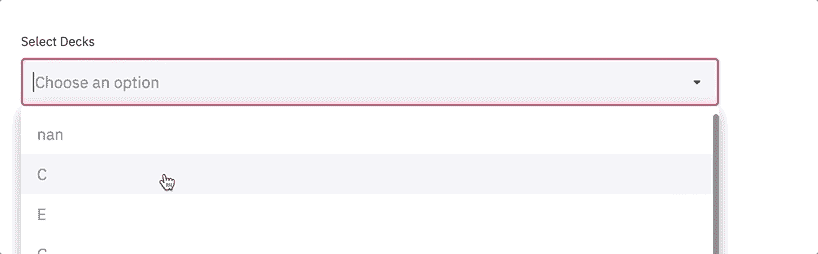
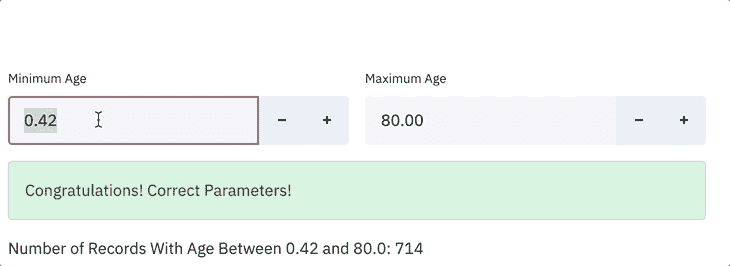
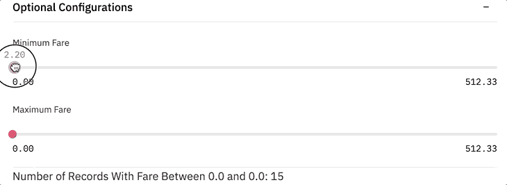
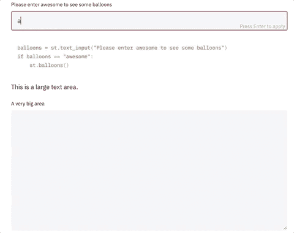
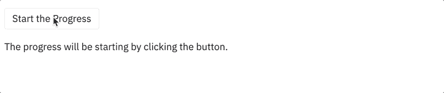
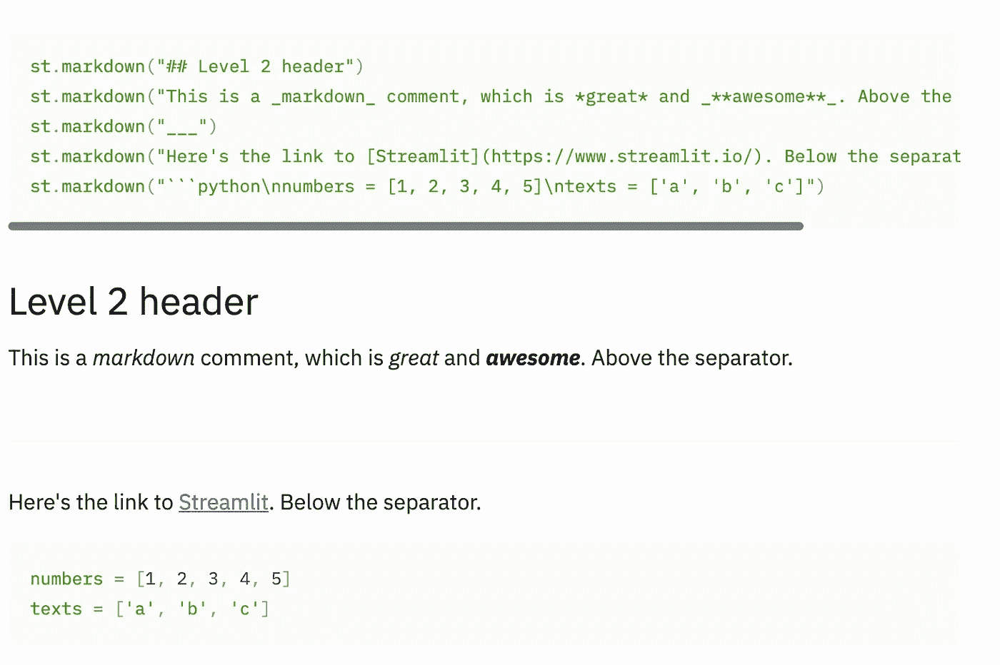
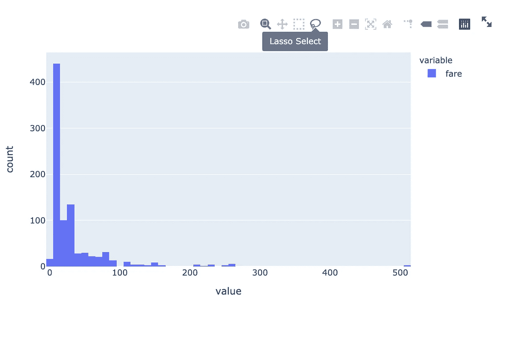

# 使用 Streamlit 构建您的首个交互式数据科学 Web 应用

> 原文：<https://towardsdatascience.com/build-your-first-interactive-data-science-web-app-with-streamlit-d4892cbe4792?source=collection_archive---------11----------------------->

## 突出一些最常见的特征


照片由[石页康让](https://unsplash.com/@omgitsyeshi?utm_source=medium&utm_medium=referral)在 [Unsplash](https://unsplash.com?utm_source=medium&utm_medium=referral) 拍摄

Web 应用程序是展示您的数据科学工作的最便捷的方式之一。对于许多没有任何 web 开发经验的数据科学家来说，构建 web 应用程序可能会令人望而生畏。然而，有了 streamlit 框架，web 应用程序对数据科学家来说不再困难——如果你了解 Python，你可以用 streamlit 构建交互式 web 应用程序——这个令人敬畏的框架为我们在幕后制作和布局 web 元素做了艰苦的工作。我们将只关注数据部分。

要安装 streamlit 框架，请使用 pip 工具。

```
pip install streamlit
```

一旦安装完毕，你就可以检查它的版本。

```
streamlit --version
```

如果您已经正确安装了 streamlit，您可以通过运行以下命令来运行演示应用程序。在应用程序中，您将有机会看到使用 streamlit 框架可以实现的各种可能性。

```
streamlit hello
```

在演示应用程序中，你会发现 streamlit 框架支持这么多很酷的功能，而这些功能是数据科学家通常需要的。在这篇文章中，我想提供一个简短的教程来开始使用这个令人敬畏的 web 框架。我敢打赌，如果你了解 Python，你只需要几个小时就能对这个工具有一个合理的理解。

如果你想跟随这个教程，你可以在 GitHub 页面[这里](https://github.com/ycui1/Medium_Python_Tutorials/blob/a93420d17873e35dceacda609045997081b0967e/streamlit_titanic.py)找到这个脚本。出于本教程的目的，我们将使用 Titanic 数据集来展示一些常见的 streamlit 技术，重点是交互式小部件。

在适用的地方，我还会集成一些可选的小部件，这样您就可以在这个过程中了解更多。

## 项目设置

每个 streamlit web 应用的核心都是一个 Python 脚本。在文件的顶部，我们导入必要的依赖项。在这种情况下，我们将使用多个模块，如下所示。

```
import pandas as pd
import time
import streamlit as st
import plotly.express as px
```

在数据集方面，我们将使用泰坦尼克号数据集，我们将从互联网上下载。

加载数据

一个值得注意的特性是装饰器`st.cache`的使用，这将提高 web 响应能力，因为缓存了之前获取的数据。在这种情况下，titanic 数据集将只被获取一次，并且随着网页的刷新，它将不会被再次获取。与此相关，应该注意的是，一旦代码中有任何更改，脚本将再次运行，因此利用缓存功能对于改善用户体验至关重要。

要查看数据，我们可以简单地运行`st.dataframe(titanic_data)`，您将看到如下所示的内容。



数据概述

## 1.组织元素(如标题)

在 streamlit 中，有几种方法可以给你的网页添加标题。要给页面添加标题，可以运行:`st.title(“My First Streamlit App”)`。

要在两个不同的级别添加额外的标题，您可以使用`st.header()`和`st.subheader()`。

或者，你可以利用减价功能，你可以添加像`st.markdown(“#Just like a header”)`和`st.markdown(“#Just like a subheader”)`这样的标题。

除了标题之外，streamlit 中一个重要的组织元素是侧边栏，您可以在其中添加配置元素来修改主页上显示的元素。要添加侧边栏，只需在脚本中添加`st.sidebar`。值得注意的是，您可能会在侧边栏中添加更多的元素。因此，与其使用`st.sidebar`来引用侧边栏，不如创建一个对侧边栏的引用，类似于`sidebar = st.sidebar`。

## 2.多选择小工具

为了收集用户的反馈，我们有几个选项来创建多选择小部件。第一个小部件是**单选按钮**。

单选按钮代码

您将看到如下所示的内容。请注意，所选选项将是所显示选项的实际值，而不是所选的数字索引。在这种情况下，它将是文本。



用单选按钮选择选项

第二个小部件是`**selectbox**`，它提供了一个下拉列表，您可以从中进行选择。代码会是这样的。

```
selected_sex = st.selectbox("Select Sex", titanic_data['sex'].unique())
st.write(f"Selected Option: {selected_sex!r}")
```

交互将如下所示。



用选择框选择选项

当您要求用户输入*多选*时，您应该使用`**multiselect**`小部件，如下所示。

```
selected_decks = st.multiselect("Select Decks", titanic_data['deck'].unique())
st.write("Selected Decks:", selected_decks)
```

对于这个小部件，您将看到类似下面的内容。



多选小工具

## 3.与数字相关的部件

当您需要收集数字作为输入时，我们可以使用`**number_input**`小部件。和往常一样，您可以命名小部件并为其设置一个值。

数字输入码

在代码中，我还在 streamlit 中包含了一个“通知”特性。当你想显示一条错误消息时，你使用`st.error()`，而要显示一条成功消息，你使用`st.success()`。另一个包含的特性是使用列(st.beta_columns)，这在您拥有彼此密切相关的并行小部件时非常有用。在这种情况下，将收集最小和最大年龄的两个小部件组合在一起是合理的。

使用上面的代码，我们将看到一个如下所示的小部件。



数字输入

除了这个小部件之外，streamlit 还提供了一个 slider 小部件，允许用户在不键入任何内容的情况下指定数字输入。这是代码。

滑块

使用`slider`小部件，您可以指定小部件的名称。同时，设置最小值和最大值。除了 slider 小部件，上面的代码还包含了另一个叫做 expander 的特性(`st.beta_expander`)。当您想要隐藏一些可选的小部件时，这个特性非常有用。您可以指定是否希望扩展器默认扩展。

下图向您展示了这样一个交互式滑块小部件。



滑块和扩展器

## 4.文本相关的小部件

为了收集文本数据，我们可以使用`**text_input**`和`**text_area**`小部件。主要区别在于,`text_input`小部件适合收集简短的文本字符串，而如果您想要收集大量的文本数据，则首选`text_area`小部件。

文本输入部件

上面的代码向您展示了如何显示这些小部件。我还包括了两个额外的特性。一个是代码显示小部件(`st.echo`)，除了小部件之外，它还将显示包含在`with`语句中的代码。另一个特色是一个复活节彩蛋，就是发射一堆气球(`st.balloons`)。这样的功能见下图。



文本输入部件

## 5.一些其他功能的亮点

**进度条**代码如下所示。

进度条—代码

这是进度条在应用程序中的样子。



应用程序中的进度条

**Markdown**Streamlit 支持 Markdown 条目，为我们创造了很多可能性。要使用这个特性，您只需使用`st.markdown`。要了解更多关于 markdown 语法的信息，你可以去 [GitHub](https://guides.github.com/features/mastering-markdown/) 。

下面是一些常用的例子。



降价示例

**Plots** 这里有一个列表，摘自其官方文档。

```
write(mpl_fig): Displays a Matplotlib figure.
write(altair): Displays an Altair chart.
write(graphviz): Displays a Graphviz graph.
write(plotly_fig): Displays a Plotly figure.
write(bokeh_fig): Displays a Bokeh figure.
```

下图是用 Plotly 制作的一个图形。



Plotly 制作的直方图

## 结论

在本文中，我们回顾了一些有用的特性，您应该将它们包含在您的交互式 web 应用程序中。正如您所看到的，streamlit 提供了各种功能，允许您收集数字、文本、多项选择选项，并显示代码、降价和数字。有了 streamlit，您几乎不用担心 web 元素。你只需要专注于构建网络应用的内容。