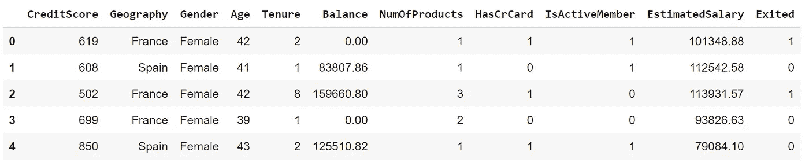
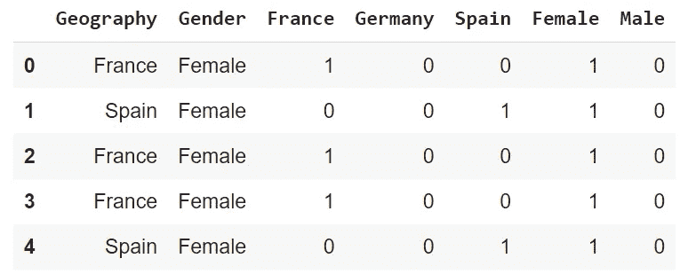
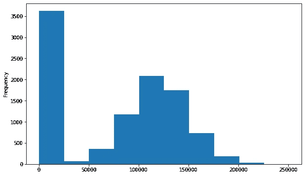
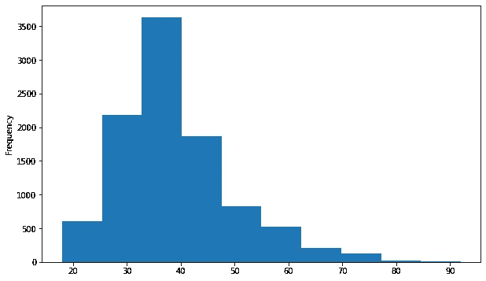

# 用 Python 在 7 分钟内构建您的第一个机器学习模型

> 原文：<https://towardsdatascience.com/build-your-first-machine-learning-model-with-python-in-7-minutes-30b9e1a3eafa?source=collection_archive---------10----------------------->

## 使用熊猫、NumPy 和 Scikit-学习


马塞尔·埃伯勒在 [Unsplash](https://unsplash.com/s/photos/seven?utm_source=unsplash&utm_medium=referral&utm_content=creditCopyText) 上的照片

当我刚开始学习数据科学时，机器学习听起来像是一门极其困难的学科。我正在阅读一些有着奇特名字的算法，比如支持向量机、梯度推进决策树、逻辑回归等等。

我很快就意识到，所有这些算法本质上都是在捕捉变量之间的关系或数据中的底层结构。

有些关系非常清楚。例如，我们都知道，在其他条件相同的情况下，汽车的价格会随着车龄的增长而下降(经典款除外)。然而，有些关系并不那么直观，不容易被我们注意到。

> 想简单点，先学基本面。

在本文中，我们将创建一个简单的机器学习算法来预测客户流失。我也会解释一些你需要额外注意的基本要点。因此，我们不仅要练习，还要学习一些理论。

我们将使用 Python 库。更具体地说，Pandas 和 NumPy 用于数据争论，Scikit-learn 用于预处理和机器学习任务。

[数据集](https://www.kaggle.com/shubh0799/churn-modelling)可以在 Kaggle 上以无版权的知识共享许可获得。让我们从读取数据集开始。

```
import numpy as np
import pandas as pddf = pd.read_csv("/content/Churn_Modelling.csv")print(df.shape)
(10000, 14)df.columns
Index(['RowNumber', 'CustomerId', 'Surname', 'CreditScore', 'Geography', 'Gender', 'Age', 'Tenure', 'Balance', 'NumOfProducts', 'HasCrCard','IsActiveMember', 'EstimatedSalary', 'Exited'],
      dtype='object')
```

数据集包含 10000 行和 14 列。我们应该使用其他 13 列来预测客户流失(即退出= 1)。退出的列称为目标变量或独立变量。其他列称为特征或因变量。

行号、姓氏和客户 id 是多余的特性，所以我们可以删除它们。客户的 id 或他们的姓氏对客户流失没有影响。

```
df.drop(["RowNumber","CustomerId","Surname"], axis=1, inplace=True)df.head()
```



df(作者图片)

## 编码分类变量

典型的数据集包含分类变量和数值变量。很大一部分机器学习算法只接受数字变量。因此，对分类变量进行编码是一项常见的预处理任务。

我们的数据集包含两个分类变量，即地理和性别。让我们检查这些列中的不同值。

```
df.Geography.unique()
array(['France', 'Spain', 'Germany'], dtype=object)df.Gender.unique()
array(['Female', 'Male'], dtype=object)
```

将这些值转换成数字的一种方法是给每个值分配一个整数。例如，法国是 0，西班牙是 1，德国是 2。这个过程称为标签编码。

这种方法的问题在于，算法可能会将这些数字视为一种层级关系。德国被认为比法国有更高的优先权。

为了克服这个问题，我们可以使用一种叫做一键编码的方法。每个不同的值都表示为一个二进制列。如果“地理”列中的值是“法国”，则只有“法国”列的值为 1。其他的变成零。

熊猫的 get_dummies 函数可以用来完成这个任务。

```
geography = pd.get_dummies(df.Geography)gender = pd.get_dummies(df.Gender)df = pd.concat([df, geography, gender], axis=1)df[["Geography","Gender","France","Germany","Spain","Female","Male"]].head()
```



一键编码(图片由作者提供)

## 探索性数据分析

在设计和实现模型之前，探索性数据分析是至关重要的一步。目标是全面了解手头的数据。

我们将通过一些控制来完成这一步。随着经验的积累，您将花费越来越多的时间来探索数据。

探索性数据分析的典型任务是检查数值变量的分布。您还可以用这种方法检测异常值(即极值)。

直方图对于检查变量的分布非常有用。您可以使用 Seaborn 或 Matplotlib 等数据可视化库。我更喜欢用熊猫，因为制作基本情节很简单。

让我们从平衡栏开始。

```
df.Balance.plot(kind="hist", figsize=(10,6))
```



余额列的直方图(作者提供的图片)

好像很多顾客都是零余额。将该列转换为二进制可能更好，0 表示无余额，1 表示正余额。

我们可以使用 NumPy 的 where 函数来完成这项任务，如下所示:

```
df.Balance = np.where(df.Balance==0, 0, 1)df.Balance.value_counts()
1    6383 
0    3617 
Name: Balance, dtype: int64
```

三分之一的客户余额为 0。

我们也来画年龄栏的直方图。

```
df.Age.plot(kind="hist", figsize=(10,6))
```



年龄列的直方图(按作者分类的图像)

它接近正态分布。高于 80 的值可能会被视为异常值，但我们现在不会关注检测异常值。

随意探索其他数字变量的分布，如任期、产品数量和估计工资。

## 缩放数值变量

您可能注意到，数值变量的取值范围非常不同。年龄值小于 100，而估计工资超过 1 万。

如果我们按原样使用这些特性，模型可能会赋予具有较高值的列更多的重要性。因此，最好将它们缩放到相同的范围。

一种常见的方法是最小-最大缩放。最高值和最低值分别缩放为 1 和 0。介于两者之间的部分会相应地缩放。

还有更高级的扩展选项。例如，对于具有极值的列，mix-max 缩放不是最佳选择。然而，我们现在将坚持简单的情况。这里的重点是强调特征缩放的重要性。

在引入另一个非常重要的主题后，我们将执行特征缩放。

## 列车测试分离

机器学习模型通过训练来学习。我们向模型输入数据，它学习变量之间的关系或数据中的结构。

一个模型训练好之后，就要进行测试。但是，用模型训练的数据来测试模型是不可接受的。这类似于作弊。一个模型可能只是记住数据中的一切，并给你 100%的准确性。

因此，在训练模型之前，通常的做法是留出一部分数据用于测试。应该使用测试数据来评估模型性能。

这里重要的是，一个模型不应该有任何关于测试数据的信息。因此，我们在上一步中讨论的特征缩放应该在分割训练集和测试集之后进行。

我们可以手动或使用 Scikit-learn 的 train_test_split 函数来完成此操作。

```
from sklearn.model_selection import train_test_splitX = df.drop(["Exited","Geography","Gender"], axis=1)y = df["Exited"]X_train, X_test, y_train, y_test = train_test_split(X, y, random_state=42)
```

X 包含特性，y 包含目标变量。默认情况下，整个数据的 25%被留出用于测试。您可以使用 test_size 或 train_size 参数来更改此比率。

```
X_train.shape
(7500, 13)X_test.shape
(2500, 13)
```

我们现在可以进行特征缩放。Scikit-learn 的 MinMaxScaler 函数可用于此任务。我们将创建一个 Scaler 对象，并用 X_train 训练它。

然后，我们将使用经过训练的缩放器来变换(或缩放)X_train 和 X_test。因此，模型不会得到任何关于测试集的提示或信息。

```
from sklearn.preprocessing import MinMaxScalerscaler = MinMaxScaler()scaler.fit(X_train)X_train_transformed = scaler.transform(X_train)X_test_transformed = scaler.transform(X_test)
```

## 模特培训

这部分其实包括两个步骤。第一个是选择算法。有几种机器学习算法。它们都有一些优点和缺点。

我们无法在一篇文章中涵盖所有算法。所以我们会选一个继续。[逻辑回归](/logistic-regression-explained-593e9ddb7c6c)算法是二元分类任务的常用算法。

Scikit-learn 的这一过程如下:

*   创建一个逻辑回归对象，这是我们的模型
*   用训练集训练模型
*   基于特定的度量在训练集和测试集上评估其性能

以下代码将执行所有这些步骤:

```
from sklearn.linear_model import LogisticRegression
from sklearn.metrics import accuracy_score# Create a model and train it
model = LogisticRegression()
model.fit(X_train, y_train)# Make predictions
y_train_pred = model.predict(X_train)
y_test_pred = model.predict(X_test)# Evaluate model performance
print(accuracy_score(y_train, y_train_pred))
0.78print(accuracy_score(y_test, y_test_pred))
0.80
```

我们的模型在训练集和测试集上分别达到了 78%和 80%的准确率。肯定是可以改进的。

提高模型性能的一些方法有:

*   收集更多数据
*   尝试不同的算法
*   超参数调谐

在本文中，我们将不讨论模型改进。我认为最有效的方法是收集更多的数据。其他两种方法的潜在改进是有限的。

## 结论

我们已经介绍了创建机器学习模型的基本工作流程。在真实案例中，每一步都更加详细和深入研究。我们只是触及了表面。

一旦你熟悉了基本的工作流程，你就可以专注于改进每一步了。

建立一个像样的机器学习模型是一个迭代的过程。性能评估后，您可能需要多次修改模型或特征。

你如何评价一个分类模型也是非常关键的。在许多情况下，我们不能只使用一个简单的准确性指标。我之前写过一篇关于[如何最好地评估分类模型](/how-to-best-evaluate-a-classification-model-2edb12bcc587)的文章。

感谢您的阅读。如果您有任何反馈，请告诉我。