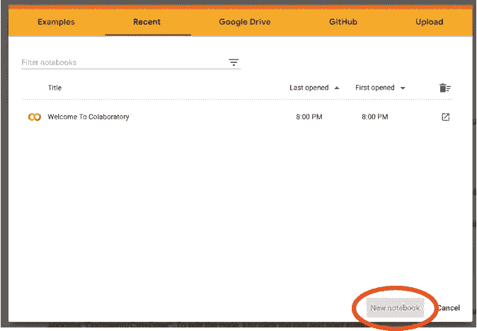
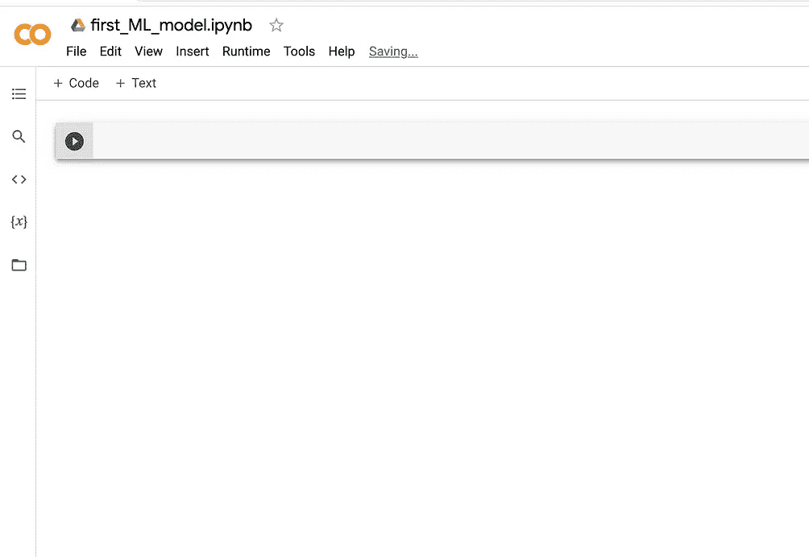
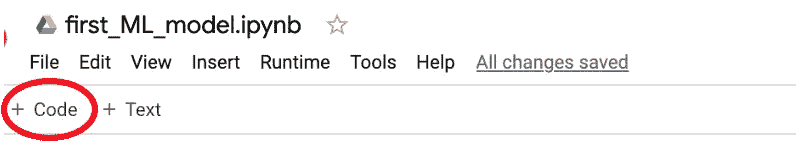
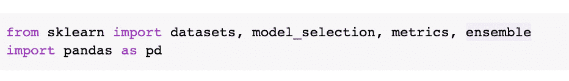
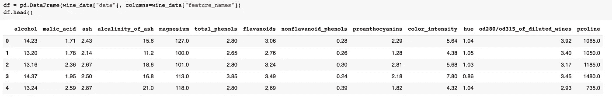
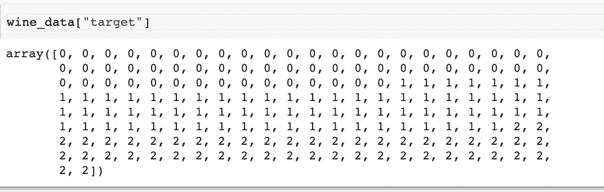
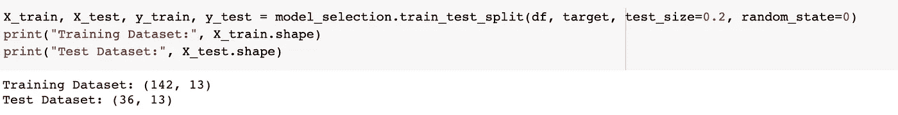
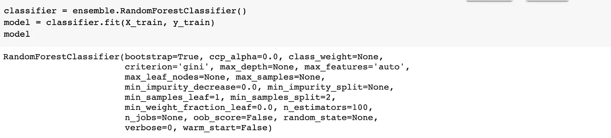
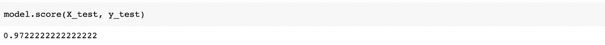
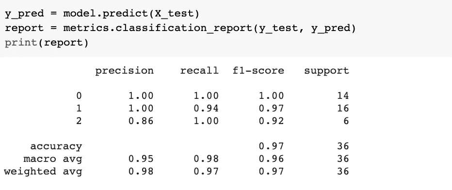

# 零配置构建您的第一个机器学习模型——探索 Google Colab

> 原文：<https://towardsdatascience.com/build-your-first-machine-learning-model-with-zero-configuration-exploring-google-colab-5cc7263cfe28?source=collection_archive---------9----------------------->

## 开始你的机器学习之旅就是这么简单。

[雷锐](https://unsplash.com/@ray30?utm_source=medium&utm_medium=referral)在 [Unsplash](https://unsplash.com?utm_source=medium&utm_medium=referral) 上拍照

机器学习(ML)是一种趋势，每个公司都希望利用 ML 来帮助他们改善产品或服务。因此，我们一直在观察对 ML 工程师不断增长的需求，这种需求已经吸引了许多人的注意。然而，对于许多人来说，ML 可能听起来令人生畏，尤其是对于那些几乎没有编码或数据相关工作经验的人。

一个可能的原因是设置计算机需要大量的努力，允许他们开发任何 ML 模型。在本文中，我想介绍 Google Colab，这是一个用于学习和构建 ML 模型的免费工具(尽管有付费升级选项)。更重要的是，你会发现，它对你来说是零配置——现在就可以使用——唯一的要求是你有一个谷歌账户。如果你还没有，请注册，这样你就可以跟随教程。

我假设你不太了解 ML，但是非常热衷于学习 ML。你懂多少 Python 其实并不重要。我会尽可能用外行人的语言解释主要步骤。

事不宜迟，让我们开始吧。如果你想看源代码，你可以使用[链接](https://colab.research.google.com/drive/1ySRFbWp70zKibCauvBV9hbbgMGhBbCLx?usp=sharing)访问笔记本。

## 第一步。在 Colab 中创建笔记本

在 Colab 中，您使用笔记本(*。ipynb)，就像你处理文档(*。docx)在微软 Word 中。所以，使用 Colab 的第一步是创建一个新的笔记本，方法是转到:[https://colab.research.google.com/](https://colab.research.google.com/)。

Colab 中的新笔记本(图片由作者提供)

点击“新建笔记本”按钮后，您会看到 Colab 创建了一个新的笔记本，默认名称为`Untitled1.ipynb`。为了现在的教程，姑且称之为`first_ml_model.ipynb`。

从现在开始，我们将在这个笔记本上工作。

## 第二步。导入依赖关系

当我们构建模型时，我们需要经验丰富的 ML 开发人员开发的代码库。本质上，这些库通过提供用于处理数据和构建模型的预定义功能来充当工具集。在本教程中，我们将主要使用以下库。

*   [scikit-learn](https://scikit-learn.org/stable/) :一个 ML 库，由各种数据处理函数和 ML 算法(例如回归、分类和聚类)组成。这个库也称为 sklearn，我们将使用 sklearn 作为参考。
*   [pandas](https://pandas.pydata.org/) :一个数据科学库，主要用于在构建 ML 模型之前预处理类似电子表格的数据。

在 Google Colab 的笔记本中，每个工作单元被称为一个细胞，我们使用一系列细胞来完成我们的 ML 工作。在每个细胞中，我们通常做一个特定的任务。要添加单元格，只需点击顶部的`+ Code`，如下所示。您可以点击`+ Text`添加自己的代码注释。

添加代码单元格(图片由作者提供)

使用创建的代码，通过运行下面的单元，您可以导入本教程所需的库。

导入依赖项(按作者排序的图像)

顺便提一下，如果您试图为 ML 配置一台计算机，您需要在配置 Python 的基础上安装所有这些依赖项。

## 第三步。工作数据集

在当前教程中，我们将使用红酒质量数据集。你可以在[kaggle.com](https://www.kaggle.com/uciml/red-wine-quality-cortez-et-al-2009)找到关于这个数据集的更多信息，这是一个流行的数据科学和 ML 网站，以一系列比赛为特色。您还可以在领先的 ML 数据存储库 [UCI](https://archive.ics.uci.edu/ml/datasets/wine+quality) 上找到数据集的信息。

wine 数据集经常被用作展示 ML 模型的例子，因此，在 sklearn 中可以方便地获得它。请注意，sklearn 中的数据集已被修改，以更好地作为 ML 训练和学习的玩具数据集。数据如下所示。

葡萄酒数据框架(图片由作者提供)

上面的截图向您展示了数据的特征。在 ML 中，我们使用**特征**来研究哪些因素对于正确的预测可能是重要的。正如你所看到的，有 12 种特性可供选择，它们对红酒的质量有潜在的重要性，比如酒精和苹果酸。

一个特定的 ML 与分类有关。每个数据记录都有一个显示其类别的标签，所有记录的类别都被称为数据集的“目标”。在红酒数据集中，标签有三类，我们可以检查标签，如下所示:

红酒数据集—目标(图片由作者提供)

请注意，在典型的管道中，我们通常需要花费大量时间来准备数据集。一些常见的准备工作包括异常值识别和移除/重新编码、缺失数据处理、一键重新编码(某些模型需要)、降维、特征选择、缩放等。因为数据集在 sklearn 中已经被清理为玩具数据集，所以我们不需要担心这些准备工作。

## 第四步。训练模型

下一步是训练 ML 模型。你可能想知道训练一个 ML 模型有什么意义。嗯，对于不同的用例，有不同的用途。但总的来说，训练一个 ML 模型的目的或多或少是为了对他们从未见过的东西做出预测。这个模型是关于如何做出好的预测。创建模型的方法称为训练，即使用现有数据来确定进行预测的适当方法。

有许多不同的方法来建立一个模型，如 K-最近邻、SVC、随机森林和梯度推进，仅举几例。为了让本教程向您展示如何使用 Google Colab 构建 ML 模型，我们只使用 sklearn 中现成的模型——随机森林分类器。

需要注意的一点是，因为我们只有一个数据集。为了测试模型的性能，我们将数据集分成两部分，一部分用于训练，另一部分用于测试。我们可以简单地使用`train_test_split`方法，如下所示。训练数据集有 142 条记录，而测试数据集有 36 条记录，比例大约为 4:1(请注意，`test_size=0.2`表示原始数据集的 20%(如果需要，可以取整)用于测试)。

分割数据集(按作者分类的图像)

sklearn 的好处是，它通过预先配置许多分类器来为我们做大量繁重的工作，这样我们只需几行代码就可以使用它们。在下面的截图中，我们首先创建一个随机森林分类器。本质上，它为我们建立了一个框架，我们可以将数据放入其中来构建模型。

创建随机森林分类器

使用 classifier.fit，我们正在训练该模型以生成该模型的参数，以便该模型可用于未来预测。

## 第五步。做出预测

通过 sklearn 的训练模型，我们可以在我们之前创建的测试数据集上测试模型的性能。如下所示，我们实现了 97.2%的预测准确率。请注意，在玩具数据集中达到这样的高水平并不罕见，但在实际项目中被认为是非常高的。

预测准确度(图片由作者提供)

如果您想更仔细地查看我们模型的预测，您可以运行下面的代码，这样我们就有了一个更完整的预测模型性能报告。

分类报告(图片由作者提供)

您可能会注意到，有几个术语您可能不熟悉，比如精度和召回。您可能会发现关于这些术语和分类模型的相关讨论。

</an-introduction-to-the-roc-auc-in-classification-tasks-94c2a147dd04>  

## 结论

在本文中，我使用 Google Colab 作为代码编辑器，向您展示如何构建 ML 模型来对玩具数据集进行预测。它甚至可能没有触及所有重要的 ML 概念的表面。然而，它确实向您展示了 Google Colab 是一个易于使用的工具，只需要最低限度的配置就可以开始您的 ML 学习之旅。

当您熟悉 Google Colab、Python 和 ML 相关的术语和概念时。您可以探索其他 Python IDEs，如 PyCharm，以获得更高级的 ML 工作和更好的编码体验。

感谢阅读这篇文章。通过[注册我的简讯](https://medium.com/subscribe/@yong.cui01)保持联系。还不是中等会员？通过[使用我的会员链接](https://medium.com/@yong.cui01/membership)支持我的写作(对你没有额外的费用，但是你的一部分会费作为奖励由 Medium 重新分配给我)。