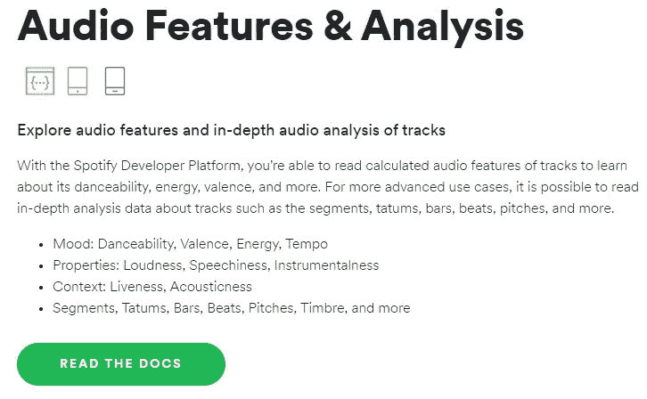
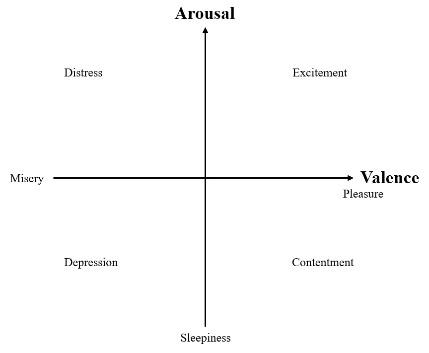
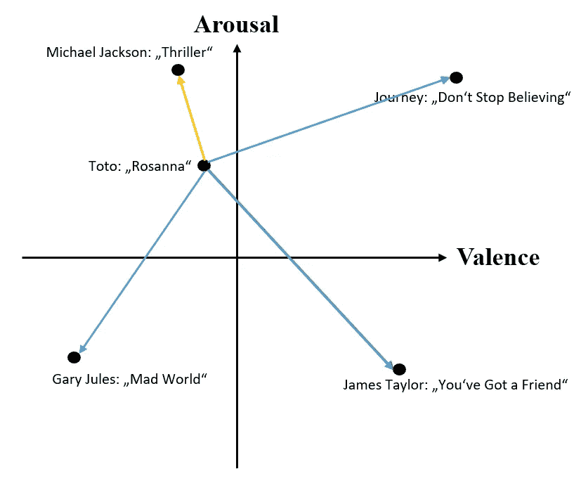
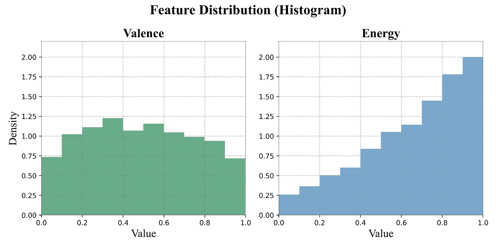
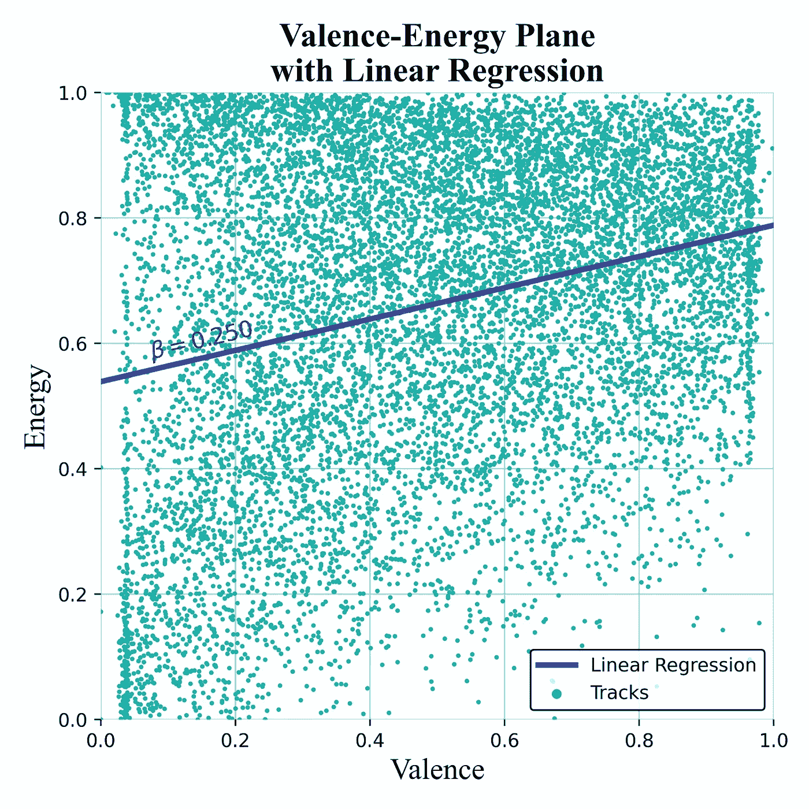
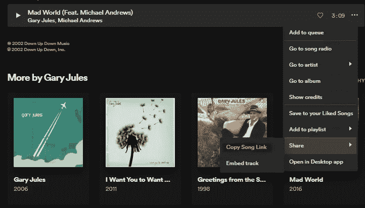

# 用 Python 构建你的第一个基于情绪的音乐推荐系统

> 原文：<https://towardsdatascience.com/build-your-first-mood-based-music-recommendation-system-in-python-26a427308d96?source=collection_archive---------4----------------------->

## [实践教程](https://towardsdatascience.com/tagged/hands-on-tutorials)

## 使用 Spotify API 从头开始基于音频的推荐


照片由[阿莱娜·达梅尔](https://www.pexels.com/de-de/@a-darmel)拍摄

# 为什么要建立基于情绪的推荐系统？

虽然音乐流派在建立和展示社会身份方面发挥着巨大的作用，但在音乐偏好领域，歌曲的情感表达以及更重要的是，它对听众的情感印象往往被低估。

## 流派是不够的

仅仅几十年前，按流派和/或艺术家选择音乐是唯一的选择。想听现场音乐？好吧，选择一个艺术家或者一个典型的基于流派的节日。想买音乐？好吧，看看我们按流派分类的 CD 架，挑一张你喜欢的艺术家的专辑。随着数字音乐平台上定制或预先策划的播放列表和个人推荐的出现，这种情况发生了巨大变化。

因此，如果你的目标是建立一个音乐推荐系统，你将需要找到一种超越流派标签的思维方式，并且——更困难的是——找到量化的方法来将你的想法实现为一个真正有用的推荐工具。推荐方法有两个主要分支:

## **协同过滤:**

在这里，我们对用户行为进行建模，以预测在特定情况下特定用户在统计上可能喜欢什么。这包括“其他人也买了 X”以及考虑到整体受欢迎程度。最后，一个随机的用户很可能比活结更喜欢德雷克。尤其是如果我们已经知道他喜欢其他说唱艺人。

## 基于内容的过滤

另一种方法是从音乐对象本身检索数据。这可以是元数据，如发行日期、指定的流派或歌曲发行时使用的标签。另一方面，我们也可以从音频本身检索出或多或少的抽象音乐特征。这包括明显的方面，如音调或速度，但也包括高度抽象的数学特征，如 MFCCs，在某种程度上，它是对音乐音色的测量(GER:“Klangfarbe”，EN:“声音的颜色”)。

在这篇文章中，我将向你展示一种无需任何机器学习就能构建有效推荐系统的简单方法。嗯……至少你那边没有。

# **从哪里获取音频数据？**

使用现有算法或机器学习模型从 *MIR* ( *音乐信息检索*)研究中提取音频数据，对于该领域的初学者来说是一件困难的事情。幸运的是，一些聪明人构建了 API 来与我们分享他们的数据，这样我们就可以用它来构建创新技术。



**图 1:** 节选 Spotify Web API 关于[可用音频功能的文档](https://developer.spotify.com/discover/)。

Spotify Web API 是一个很好的起点。它可以免费使用，正如你在**图 1** 中看到的，它提供了多种情绪特征，这些特征是从它们内部的机器学习模型中提取出来的。但是，我们究竟如何用“可跳舞性”、“效价”、“能量”和“节奏”(后者很难被视为情绪特征)来模拟情绪的复杂性呢？实际上，**我们只需要其中的两个**。

# 心理学:效价唤醒平面



**图 2:** 价唤醒平面和其上几种情绪/心境的位置(改编自 Russel，1980)

情绪的因素结构(即情绪存在多少个独立维度)的一个占主导地位的心理学模型是**价-唤醒平面(图 2)。**这是一个二维模型，将每一种现有的情绪或心情还原为其唤醒成分(这种感觉是高能还是低能？)及其化合价成分(感觉好还是不好？).尽管这种模式并非没有问题(例如，恐惧和愤怒在这里会被放在一起)，但它被广泛采用，因为它在复杂性和预测能力之间取得了巨大的平衡。

这里令人惊讶的是，我们可以很好地采用价-唤醒平面模型，使用 Spotify API 的“价”和“能量”功能。在本文的其余部分，我将介绍如何从 API 抓取数据，以及如何用它实现一个简单有效的推荐系统。

# **如何使用 Spotify API 创建数据集**

## **授权(烦人的部分)**

让我们从最无趣的部分开始:要访问 Spotify API，你需要按照本指南[注册一个应用程序](https://developer.spotify.com/documentation/general/guides/authorization-guide/)。或者，看看[这篇中型文章](https://medium.com/@maxtingle/getting-started-with-spotifys-api-spotipy-197c3dc6353b)，其中很好地说明了这个过程。我知道你只是想开始，但不幸的是，你必须先通过认证。一旦您有了自己的客户 ID 和客户机密 ID，我将为您提供创建推荐数据集所需的所有代码。这听起来像交易吗？

## 代码准备

为了建立一个推荐系统，我们需要一个曲目数据库，从中我们可以挑选出最适合给定曲目的曲目。为此，您只需要 Python 包 [*tekore*](https://github.com/felix-hilden/tekore) ( < pip 在您的终端中安装 tekore >)、您的 Spotify 客户端 ID 和 Secret ID，以及我将向您提供的代码。

首先，请在项目目录中创建一个名为“authorization.py”的新 python 脚本，并用以下代码填充它:

```
import tekore as tkdef authorize():
 CLIENT_ID = “ENTER YOUR CLIENT ID HERE”
 CLIENT_SECRET = “ENTER YOUR CLIENT SECRET HERE”
 app_token = tk.request_client_token(CLIENT_ID, CLIENT_SECRET)
 return tk.Spotify(app_token)
```

只需输入您的客户 ID 和客户密码 ID，代码中会这么说。这个脚本只做一件事:它授权您访问 Spotify API，并返回一个允许您访问 API 的对象。该脚本充当我们的主程序的助手脚本。然而，主要的是，它确保你的客户 ID 和秘密 ID 对主程序的读者/用户是隐藏的。只有这样我才能和你分享我的全部代码。

## 获取 Spotify 数据集

当然，有很多方法可以收集数据集。我们将使用一种方法，从超过 120 个流派中抽取 100 首曲目，从而产生一个包含各种风格音乐的约 12000 首曲目的曲目数据库。

如果你还没有安装软件包*熊猫*和 *tqdm* 的话，你需要通过< pip install【软件包名称】>来安装它们。从那里，只需复制并运行下面的代码和/或按照我的代码快速概述。

## 如果您只想复制代码，请跳过这一步

算法是这样工作的:我们使用助手脚本来授权我们的 API 访问。然后，我们使用<sp.recommendation_genre_seeds>获取 Spotify 的所有 120 个流派标签，并将每个流派的推荐数量设置为 100(这是可能的最大数量)。下一步，我们建立一个字典，它可以保存我们想要抓取的所有数据。接下来，我们循环播放每个流派，然后播放该流派的每首曲目。对于这些音轨，我们抓取元数据和音频信息，并将它们存储在我们之前创建的<data_dict>中。然后，我们将字典转换成 pandas 数据帧，删除重复的 id，最后将数据帧导出到我们的工作目录。</data_dict></sp.recommendation_genre_seeds>

**惊艳！**你知道你的工作目录中有一个名为“valence _ 唤醒 _ 数据集. csv”的数据集。接下来，我们将使用这个数据集来构建我们的推荐系统。

# 如何使用效价和唤醒度进行推荐

## 基本思想:向量距离



**图 3:** 应用于一些知名歌曲的价唤醒平面上的距离(仅估计位置)

如果你看一下**图 3** ，我们的相似性度量就很容易理解。在那里，我估计了几首著名歌曲在效价唤醒平面上的位置。在这个平面上，每个向量(一条轨迹，其坐标为“价”和“唤醒”)，在这个例子中是托托的“罗莎娜”，可以通过一条线与其他轨迹相连。从视觉上看，很明显，迈克尔·杰克逊的“颤栗”的情感轮廓更类似于“罗珊娜”，而不是平面上更远的所有其他曲目。

数学上，连接每条轨道的线也是向量，我们可以测量它们的长度。2D 向量(a，b)的长度或“范数”被定义为 *sqrt(a +b )* 。假设一个轨道有 0.5 个“价”和 1 个“能”，因此坐标是(0.5，1)。那么，它的长度，也就是它到坐标系原点(点(0，0))的距离，等于 *sqrt((0.5) + 1* ，大约是 1.12。因此，我们所需要的是找到连接一个给定轨迹和所有其他轨迹的所有向量(箭头)，应用公式并取具有最低范数/长度的箭头。

从点 *p1* 到点 *p2* 的这个“箭头向量”由 *p2-p1 给出。*因此，轨迹 T1 和轨迹 t2 之间基于情绪的“距离”等于 norm(t2-t1)。换句话说，从 t2 中减去 t1，然后使用上面的公式计算得到的向量的范数。在 Python 代码中，这很容易实现:

```
def distance(p1, p2):
    distance_x = p2[0]-p1[0]
    distance_y = p2[1]-p1[1]
    distance_vec = [distance_x, distance_y]
    norm = (distance_vec[0]**2 + distance_vec[1]**2)**(1/2)
    return norm
```

在我的代码中，我使用 numpy.linalg.norm(p2-p1)，它做同样的事情。

## 一些统计问题

在我们进入推荐系统的实际实现之前，我想向您指出我们的系统将要面临的两个统计问题。如果你真的不在乎，就跳过这一部分，或者以后再来。



**图 4:** “化合价”和“能量”特征的分布。

正如您在图 4 中看到的，这两个特性的分布完全不同。虽然“化合价”似乎遵循某种近似非常平坦的正态分布，但“能量”却严重左倾。这对于我们的模型来说有一个主要的缺点:在不涉及太多统计细节的情况下，这意味着:“化合价”0.2 的“跳跃”并不总是与“能量”0.2 的跳跃是一回事。然而，我们的模型假设向量(0.5，0.5)与(0.7，0.5)一样接近。如果你想解决这个冲突，应用一个 [*z 变换*](https://medium.com/analytics-vidhya/z-score-in-detail-9dd0f0afa142) 会有所帮助。出于本文的目的，我们将忽略这个问题。



**图 5:** “化合价”与“能量”的相关性与线性回归线。

另一个问题如图 5 所示。在心理学理论中，效价和唤醒被认为是情绪的两个统计上独立的维度。然而，如果我们将数据集中的所有 12，000 首曲目绘制成“能量-价”平面，我们会看到随着“价”的增加，“能量”也会增加。事实上，发现回归斜率为 0.250，这表明两个特征之间存在不可忽略的相关性。不幸的是，这个问题没有解决方案，因为这个错误(至少对我们来说)是内置在 Spotify API 中的。

# 最终推荐算法

从这一点开始，构建最终的推荐算法就很简单了。我将指导您完成本部分的最后几个步骤。你也可以跟着[一起看这个笔记本](https://github.com/MaxHilsdorf/mood-based-music-recommendation-system/blob/main/recommendation_system.ipynb)。

首先，我们导入一些模块:

```
import pandas as pd
import random
import authorization # this is the script we created earlier
import numpy as np
from numpy.linalg import norm
```

接下来，我们读入大约 12000 个磁道的数据帧:

```
df = pd.read_csv("valence_arousal_dataset.csv")
```

现在，我们将“价”和“能量”列组合起来，形成每个音轨的单个向量“情绪 _vec ”:

```
df["mood_vec"] = df[["valence", "energy"]].values.tolist()
```

我们实施推荐算法之前的最后一步是授权您的 Spotify API 访问，就像我们之前做的那样:

```
sp = authorization.authorize()
```

最后，是时候实现我们的基于向量距离的推荐算法了。该算法采取的步骤是:

1.  从 Spotify API 抓取输入音轨的“价”和“能量”值
2.  计算输入轨迹和参考数据集中所有其他轨迹之间的距离。
3.  从最低到最高距离对参考轨迹进行排序。
4.  返回 n 条最近的轨迹。

代码是:

# 测试推荐算法

剩下要做的就是测试我们的算法是否产生有意义的结果！每个 Spotify 曲目作为一个 ID，您可以像这样简单地从 web 浏览器中提取:



这就给你带来了 https://open.spotify.com/track/3JOVTQ5h8HGFnDdp4VT3MP?的[si=96f7844315434b0a](https://open.spotify.com/track/3JOVTQ5h8HGFnDdp4VT3MP?si=96f7844315434b0a) "其中" [3JOVTQ5h8HGFnDdp4VT3MP](https://open.spotify.com/track/3JOVTQ5h8HGFnDdp4VT3MP?si=96f7844315434b0a) "为曲目 ID。

## 加里·朱尔斯的《疯狂的世界》

那么我们把加里·朱尔斯的《疯狂的世界》("化合价" = 0.30，"能量" = 0.06)扔到我们的推荐者里怎么样？

Spotify 嵌入加里·朱尔斯的《疯狂世界》。

```
mad_world = "3JOVTQ5h8HGFnDdp4VT3MP"
recommend(track_id = mad_world, ref_df = df, sp = sp, n_recs = 5)
```

“化合价”= 0.31，“能量”= 0.05 的最佳推荐是亨瑞·贝拉方特的《荣耀经理》。

Spotify 嵌入亨瑞·贝拉方特的《光荣的马槽》。

还不错！虽然“荣耀经理”来自完全不同的流派，但我们的算法已经匹配了这些歌曲，因为它们都具有相似的“价”和“能量”水平。

## 托托的《罗珊娜》

让我们再举一个例子！托托的《罗珊娜》“化合价”为 0.739，“能量”为 0.513。

Toto 的《罗珊娜》的 Spotify 嵌入。

最受欢迎的推荐是由 Duelo 创作的“Sentimientos De Chartón ”,其“化合价”为 0.740，“能量”为 0.504。

Spotify 嵌入 Duelo 的“Sentimientos De Chartón”。

再一次，音乐类型非常不同，更像是“拉丁”而不是“流行摇滚”。然而，《Sentimientos De Cartón》捕捉到了这种“浪漫渴望”的感觉，同时仍传达出一种运动感和最佳状态，就像《罗珊娜》一样。

# 结论和最终想法

**恭喜你！**如果你一直关注这篇文章，那么你要么已经建立了你的第一个基于情绪的推荐系统，要么至少已经了解了一点如何编写这样一个系统。然而，仍有一些事情值得简要地思考或讨论。

## 我们取得了什么成就？

我们一起建立了音乐推荐系统的基础，该系统使用“价-唤醒平面”的适应以及向量距离测量来匹配传达相似类型情感/情绪的曲目。这种方法从根本上不同于协作过滤方法(“其他用户也购买了[…]”)，因为它试图提取歌曲的内在品质，而不依赖于用户数据。这对于你们(像我一样)没有运营大型音乐平台，拥有数十亿相关用户数据点的人来说，尤其有帮助。另一个好处是，这种方法的实现是快速和免费的，从收集数据到实现实际的推荐算法。最后，跨流派类别推荐音乐是任何现实世界推荐系统的期望品质，因为这支持用户参与新类型的音乐并发展他们的个人音乐品味。

## 我该如何改进这个推荐系统？

正如在统计一节中提到的，**对“价”和“能量”特征进行“z 变换”**将使您的距离测量更准确，从而使您的推荐更准确。

Spotify API 提供了更多功能，如“可跳舞性”、“声音”和“速度”。试着想出合理的方法来**扩展“价-唤醒平面”**或者从零开始开发你自己的变量集。

将基于情绪的方法与协作过滤方法结合起来也是一种有趣的探索。怎么样，在我们使用“价”和“能量”计算出前 10 个推荐之后，我们**按照“流行度”**对推荐重新排序(这也是 Spotify API 中的一个功能)。

你可以让用户**决定一组所有推荐都必须是**的类型，或者一组不应该出现在推荐中的类型。

最后，你可以通过探索 Spotify API 的可能性和分析越来越多的歌曲来扩展你的参考数据集。较大的数据库更有可能为每个输入轨迹准备一个近乎完美的匹配。

> **非常感谢你阅读这篇文章！如果您有任何问题或意见，或者有任何不正常的地方，请告诉我。我目前正在探索创造性的方法，使用自建的机器学习模型来扩展这里显示的推荐系统。如果你想看的话，请继续关注！**