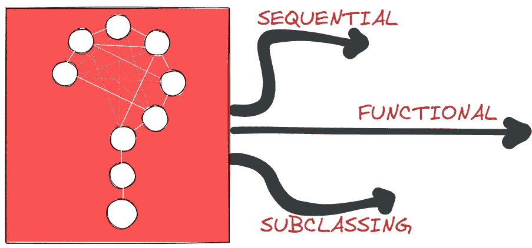
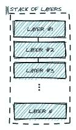

# 用 Keras 以三种方式建立你的神经网络

> 原文：<https://towardsdatascience.com/build-your-neural-networks-with-keras-in-three-ways-553cea182c6b?source=collection_archive---------13----------------------->

## 如何、为什么以及何时使用每种方法



如何使用 Keras API[图片由作者提供]

我仍然清晰而痛苦地记得我第一次面对神经网络及其实现的情景。好像我的困惑还不够大，试图让我的思想围绕着神经网络的内部工作方式，如何使用 Keras API 的不同方式使混乱更加彻底。所以我坐下来，拼命寻找这个问题的最终答案:实现神经网络的最佳方式是什么？

在接下来的几节中，我们将解开这些乱七八糟的东西。避免不同语法带来的不必要的麻烦，因此我们可以专注于更重要的问题，如使用哪种架构或如何提高模型的性能。

Keras 或者更具体地说是[模型 API](https://keras.io/api/models/) 可以分为三个部分，因此可以通过多种方式创建模型。接下来，我们将学习如何以及何时利用 API 的哪一部分。

我们将使用良好的 MNIST 数据集，以三种不同的方式构建相同的全连接神经网络。

# 顺序模型

使用`Sequential Model`非常简单。我们既可以通过向构造函数传递一个层列表来构建模型，也可以通过多次调用`add()`方法来逐步构建模型。

顺序模型的作用类似于一个*线性*或*普通* *层的堆叠*，其中每一层恰好有一个输入张量和一个输出张量。这使得我们一方面很容易使用和调试，而另一方面，我们失去了很多灵活性。



层叠[图片由作者提供]

因此，当我们的模型或我们的一个层具有多个输入或输出时，顺序模型是不合适的，我们需要进行层共享，或者我们想要使用非线性拓扑，例如剩余或跳过连接。

我们现在可以编译、训练并获得我们模型的摘要。

```
>> Total params: 119,306
>> Trainable params: 118,794
>> Non-trainable params: 512
```

# 功能 API

`functional API`为我们提供了一种建立模型的方法，比顺序模型更加灵活。它使我们能够创建非线性拓扑、共享层，甚至多个输入或输出。作为功能 API 的基础，主要思想是构建一个*层图*。

我们可以通过用输入维度(28x28 像素)定义一个输入节点来构建一个图层图。

接下来，我们定义更多的节点来重新创建之前的模型。然后，通过将前一个节点作为输入传递给下一个节点来连接这些节点。这些连接为我们提供了构建非线性拓扑所需的灵活性，例如通过连接非相邻节点和创建跳过连接。

我们还可以编译、训练并获得我们的模型的摘要，它与序列模型具有相同的结构。

```
>> Total params: 119,306
>> Trainable params: 118,794
>> Non-trainable params: 512
```

# 模型子类化

用子类化创建模型为我们提供了最大的灵活性。然而，这种灵活性的代价是复杂性和冗长性的增加。

`Layer Class`是 Keras 中的核心抽象之一。一个层保存状态(*层的权重*)和从输入到输出的转换(*来自调用的前向传递*)。当模型的复杂性增加时，创建定制层特别有用，它为我们提供了在模型架构中创建可重用“块”的方法。

在我们的模型中，我们可以使用一个定制层来创建一个在我们的架构中多次出现的基本构建块。下面的类继承自 layer 类，初始化两层:Dense 和 BatchNormalization。然后，这两层都在正向传递中被简单地调用。

接下来，我们利用上面的自定义层创建我们的模型。我们的类继承自`Keras Model Class`，因此得名子类化。我们基于`hidden_layer = [128,128]`初始化我们的自定义图层，以及另外两个图层:展平和我们的最终输出图层。然后，在模型的正向传递中，所有的层都被简单地调用。

然后，我们可以再次编译、训练并获得模型的摘要，这应该与之前相同。

```
>> Total params: 119,306
>> Trainable params: 118,794
>> Non-trainable params: 512
```

# 结论

在 Keras 中有三种创建模型的方法。根据我们要解决的问题和我们需要构建的模型，一种方法可能比另一种更适合，但一般来说没有绝对最好或正确的方法。

简单、线性和直观的模型可以而且可能应该用顺序 API 或函数 API 来构建。然而，更复杂、非线性和高度定制的模型将从子类化中受益匪浅。

总之，一个人应该知道并尝试以上所有的方法，扩大他们的工具箱，以便有效地解决问题。

> 感谢您的阅读！确保保持联系&在 [Medium](https://medium.com/@marvinlanhenke) 、 [Kaggle](https://www.kaggle.com/mlanhenke) 上关注我，或者在 [LinkedIn](https://www.linkedin.com/in/marvin-lanhenke-11b902211/) 上说声“嗨”

喜欢这篇文章吗？成为 [*中等会员*](https://medium.com/@marvinlanhenke/membership) *继续无限学习。如果你使用下面的链接，我会收到你的一部分会员费，不需要你额外付费。*

[](https://medium.com/@marvinlanhenke/membership) [## 通过我的推荐链接加入 Medium-Marvin Lanhenke

### 作为一个媒体会员，你的会员费的一部分会给你阅读的作家，你可以完全接触到每一个故事…

medium.com](https://medium.com/@marvinlanhenke/membership)