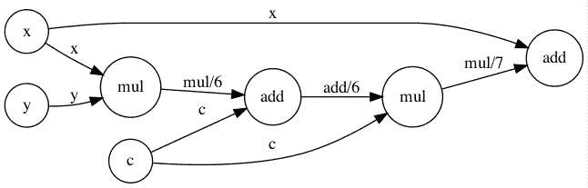

# 构建您自己的自动差异化程序

> 原文：<https://towardsdatascience.com/build-your-own-automatic-differentiation-program-6ecd585eec2a?source=collection_archive---------3----------------------->

## [实践教程](https://towardsdatascience.com/tagged/hands-on-tutorials)

对于那些完全不知道如何使用图形计算导数的人，或者只想知道张量流在基本层面上是如何工作的人，这是你的指南。


照片由在 [Unsplash](https://unsplash.com?utm_source=medium&utm_medium=referral) 上拍摄

深度学习如今如此流行，如此广泛，人们很容易问这样一个问题，“为什么人们花了这么长时间才弄明白这个问题？”原因有很多，进入深度学习的历史真的不是这篇文章的重点(参考文献[1]的[介绍](https://www.deeplearningbook.org/contents/intro.html)做得很好)，但使这场革命滚动的关键进步之一是**自动微分(AutoDiff)** 。

> 如果您想直接了解技术细节，请跳到“构建自动挖掘”一节，如果您只想了解代码，请跳到“用 Python 实现自动挖掘”一节
> 
> 关于本文所用代码的配套 Jupyter 笔记本，请参见以下链接:[https://github.com/Jmkernes/Automatic-Differentiation](https://github.com/Jmkernes/Automatic-Differentiation)

你问自动微分有什么了不起的？假设你正在研究一个函数，你很想知道它的导数。如果这是一个相对简单的函数，你大概可以很快给出答案。如果 *f(x)=x，*那么我们可以很快得出 *df/dx=3x* 。如果它更复杂，而你不仅仅知道答案呢？好吧，你没有太多的选择。

选项 1:如果你想要数值答案，你可以回到基础，直接计算有限差分，使用公式如下


以及他们更复杂、更精确的表亲。但这并不令人满意。也许我们想要象征性的答案，用 x*和 y*之类的东西来表示，在这种情况下，一个数字答案是不够的。或者，也许我们的微分变量 *x* 实际上是一个大的多维张量，为那个东西的每个条目逐个计算数值差将是非常低效和耗时的。

选项二:*求导*求导。这应该是元的。求导是什么意思？我们之前是怎么知道 *df/dx=3x* 的答案的？事实证明，只有两种方法可以算出导数。如果这是一个全新的函数，你只需要通过上面显示的极限表达式来得到答案。然而在现实中，大多数函数都不是新的，它们实际上只是其他函数的组合。在这种情况下，我们可以通过**链式法则**算出新的衍生品:


## 但是，比如，什么是功能？

我从事的第一个物理项目涉及到一些特殊函数的使用，叫做[广义超几何函数](https://en.wikipedia.org/wiki/Generalized_hypergeometric_function)。如果你不知道那些是什么，不要担心，这才是重点。像每一个特殊函数一样，它们很难处理，并且包含足够多的身份和特殊情况，足以填满一本哈利波特魔法书。所以，心灰意冷的我去找我的导师，直接问他，“嘿，这到底是什么东西？”

他的回答非常简单——“这只是我们知道的一些功能。”这似乎是一个无用的答案，但它实际上很有深度。然后他问我“你知道余弦是什么，对吗？”对此我尖刻地回应道:“是的，当然，我知道余弦是什么。”他毫不犹豫地回击道，“但是你怎么知道余弦是什么？知道什么是超几何函数和*知道*什么是余弦有什么不同？最后，你知道余弦是什么，因为你能说出一些恒等式，你能画出一个漂亮的图。就是这样。”

此时，我被难住了。我正面临一场数学生存危机，并重新评估我所学的一切。“我知道余弦是什么，因为我知道它的导数是 *-sin(x)* ！”，我想。“而且，我知道正弦是什么！因为它的导数是 *cosi…* "，哦不，一个无限循环。

从我的生存危机中恢复过来后，我开始意识到世界上有两种类型的功能:我们熟悉的东西，如 *x* 或 *x+5，*和我们不熟悉的东西，但可以由熟悉的东西组成——如 *(x+5)* 。自动微分以后一个概念为中心。我们可以把它的使命描述为:

> 给定一组初等函数，比如 e^x *、* cos(x) *、*或 x *、*，然后使用微积分规则，就有可能确定由这些初等函数的组成的*的任何函数的导数。*

因为我们可以用各种方式表示函数，比如幂级数、傅立叶级数等等。这是一个非常有力的声明。这一切都是通过链式法则起作用的。自学的奇妙之处在于，它在数学上相当于零计划地环游世界。您可以随心所欲地不断组合和堆叠函数，越来越深入，始终确保 AutoDiff 能够跟踪面包屑并为您计算导数。

在这篇文章的其余部分，我们将假设我们想要求导的每一个函数都可以分解成初等函数(如果你想要第二类修正贝塞尔函数的导数，你将不得不去别处寻找

# 建立我们的自动挖掘系统

在这篇文章结束时，你将能够生成如下图:


来源:现作者。一个非常简单的计算图

但是你喜欢多复杂就有多复杂。我们来分解一下这个图的意思。假设我们被赋予了这个函数


我们想计算 *f* 对其变量 *x，y，*和 *z* 的偏导数。我们可以将这个函数分解成一组非常基本的函数，即函数 **add(x，y)=x+y** 接受两个数并将它们相加，函数 **multiply(x，y)=x*y** 接受两个数并将它们相乘。基本的，对吧？在这种新形式中，我们有


这是一个更罗嗦的表述，但是…这并没有错。


资料来源:knowyourmeme.com。我们冗长陈述的理由。

这种形式很有用，因为我们立即知道了**的导数加上**和**乘以**。此外，我们将它重写为两个初等函数的组合,因此我们可以应用链式法则。我们获得


利用基础微积分，我们得到 1*y=y，这显然是正确答案。虽然你可能没有注意到，但是每当你计算导数的时候，你都会隐式地执行上面的操作。现在，让我们让计算机来做这件事。

## 计算图

为了说明这个过程，我们需要做两件事:1)告诉计算机什么是基本构件 2)告诉它如何把这些构件放在一起计算导数。

让我们先集中讨论第一部分。有四种基本类型的块，我们用图论的语言称之为节点 T21。这些包括

1.  **变量** —我们想要知道其梯度的可变对象(张量)。
2.  **常量** —不可变对象(张量)，其值一旦指定就不会改变。
3.  占位符 —这些基本上是空的容器，一旦我们决定了未来变量或常数的值应该是什么，它们就指定了未来变量或常数的位置。
4.  **操作符**——这些是概念上最难描绘的，但也是最重要的。

前三个应该相对简单。需要一段时间来适应的计算图有一点令人困惑，那就是图中的**节点**实际上是**操作符**，而不是变量、常数或占位符。直觉上，我们喜欢认为函数是由它们的值组成的。我们写 *f(x，y，z)* 的时候用的是 *x，y，z.* 没有写 *f(* ***加，乘)*** *。然而，这正是我们的计算机要寻找的。通常，操作符节点接受输入并返回输出。我们假设节点只发出*一个*输出；虽然张量包含许多项，但它可以被认为是一个单一的输出*


来源:现作者。操作符节点的特写。

我们现在可以理解本节开头的图表了。我们只使用了数字，但是这些数字也可以被认为是标量张量。因此，图表显示了张量是如何在计算中流动的。明白了吗？张量…流…张量流。现在让我们考虑相反的方向，计算梯度。

为了计算输出 *f(x，y，z)* 的实际值，我们沿着箭头的方向向前运行图形，从变量 *x，y，z，*开始，流经**操作符**。现在让我们用图形来思考这个方程。我们将添加一个额外的、琐碎的计算


这将帮助我们初始化反向传播程序。检查我们的方程对 f 的偏导数，需要注意的一点是*导数也是一个函数！*这意味着链式法则导数也是函数的组合。记住，函数的组合=图形。这是规矩。真正好的是，我们的图形结构是相同的，但反向运行。你可以看到下面的结构:


来源:现作者。红线表示梯度的流动。

红色箭头表示从最终输出到开始的导数流是一个反向计算图。它可以用完全相同的方式计算，其中我们使用平凡的恒等式 df/df=1，为第一个节点提供 1 的导数。我们的目标现在应该很明确了:

*   指定图表中的所有变量、占位符和常量
*   使用运算符将它们组合在一起，形成最终的标量输出
*   计算一个*前向传递*，它输入值并流经运算符以获得输出。将每个节点的输出值存储在该节点中。
*   计算一个*反向传递*来计算梯度，从最后一个节点(输出)的梯度 1 开始。

实现这一点是本文剩余部分的目标。

## 在 Python 中实现自动搜索

我们想预先警告读者这涉及到全局变量。全局变量是禁忌，但是我们使用它们的原因有望随着我们的深入而变得清晰。**图**是我们的全局对象(好吧，不是一个全局变量，实际上是一个全局对象，很抱歉我说谎了)，我们将向其中添加节点。据我所知，没有一种简单的方法可以明确地确定对象的范围，我相信 TensorFlow，至少在 V1，也使用了全局图形变量。如果有人有避免全局变量的解决方案，请在评论中发表！

好了，先不说警告，我们开始吧。我们首先需要定义默认的图形类。这将是一个基本的结构，只跟踪当前的节点和它们的类型。

一些事情:所有在 __init__ 方法之后的事情你都可以忘掉。它不影响代码，只是试图使创建本地化的图形变得稍微容易一些。您也可以删除它，并确保运行`Graph()`来初始化全局默认图，运行`del _g`来在定义一组节点之前和之后删除它。此外，我们并不真的需要 numpy，它是为了帮助我们以后做矩阵乘法。

太好了，我们有工作图了。现在让我们来定义我们之前讨论的四个类。它们或多或少都是一样的，每个都包含一些独特的功能

Operator 类需要一个*输入*属性，Constant 类需要保护它的值，其余的类似。我们使用了一些默认的名字，比如 Var1，Var2，…这是描述性的最低水平。name 字段对于以后从图中检索节点很重要，因为我们没有任何其他方法来标识它们

此外，跟踪占位符的名称也很重要，否则我们真的无法在计算图中找到它们。

我们放入了一些其他东西，比如 __repr__ 函数，以类似“Operator: name:mul/2，value:3.875”的格式自动将节点显示为字符串。这应该能帮助我们马上知道我们正在处理的是哪个节点。

现在，为了让我们的图做点什么，我们需要给它一些真正的操作符。这些正是我们一直在谈论的**基本操作**。像加减乘除之类的东西。我们将定义其中的一些，为了使事情更容易编码，我们将重载所有这些操作符(注意:我想不出更好的方法来做到这一点，既不重复大量的代码，也不需要以奇怪的方式向基本节点类添加方法。接受更好的建议)。一个棘手的运算符是 __neg__。记住 x - > -x 实际上是一个乘法运算符，所以图形需要知道这一点。

现在，我们所有的基础设施都已就绪。我们只需定义变量、常量或占位符，并执行常规计算，就可以轻松构建图表。操作员将负责向图中添加节点和其他一切。我们可以创建一个图`g`并通过下面的语法添加一些操作

```
with Graph() as g:
  x = Variable(1.3)
  y = Variable(0.9)
  z = x*y+5g.variables # Will output {Variable: name:Var/0, value:1.3, Variable: name:Var/1, value:0.9}g.operators # Will output {Operator: name:add/0, Operator: name:mul/0}g.constants # Will output {Constant: name:Const/0, value:5}
```

如您所见，该图正确地创建了一个常数，并且还记录了两个操作，x*y 乘法以及常数 5 的加法。如果我们再次运行`with Graph() as g`，它应该会删除当前的默认图形，并开始重新构建。酷，一切正常。现在，我们必须使用一点算法知识来计算我们的向前和向后传球。

目前，我们的默认图表只跟踪当前节点。它没有结构。最终，我们想要向前运行我们的图形，这意味着我们给它输入所有的变量、常量和占位符，然后这些通过操作符流到我们的输出。我们这样做的顺序是一个经典的算法问题。我们需要执行一个**拓扑排序**(CLRS 的书【3】总是好的，或者只是使用[维基百科](https://en.wikipedia.org/wiki/Topological_sorting))。我们的图是一个**有向无环图**，意味着每个节点都有一个起点和终点。没有循环。拓扑排序保证了如果我们按顺序运行每个节点，我们将永远不会缺少计算节点的信息。就像点了课前提；您将时间表调整为在 Calc III 之前学习 Calc I。

经过拓扑排序，我们的图真正成为了一个图。它终于有了一些坚实的结构！即使这个结构只是有序节点的数组。为了完成我们的程序，我们执行通行证。向前传球真的很简单；只需按顺序计算每个节点的值，并将其值存储在该节点中，以便将来的节点可以在需要时访问它。

向后传球稍微难一点，但也不算太难。用值 1 初始化根节点(回想一下使用 df/df=1 的讨论)。然后，只通过它的**操作符**遍历图形。换句话说，计算当前操作符的所有输入的梯度，然后递归地对那些也是操作符的输入做同样的事情。代码如下:

就是这样！我们已经完成了程序的主要部分。剩下的就是摆弄它，并对它进行一点分析。这里有一个例子，说明如何计算一个简单函数的梯度


它取决于两个变量和一个常数。我们可以很容易地手工计算它的导数，并检查我们的代码是否正确。首先向前传球:

```
val1, val2, val3 = 0.9, 0.4, 1.3with Graph() as g: x = Variable(val1, name='x')
  y = Variable(val2, name='y')
  c = Constant(val3, name='c')
  z = (x*y+c)*c + x order = topological_sort(z)
  res = forward_pass(order)
  grads = backward_pass(order) print("Node ordering:")
  for node in order:
      print(node)  print('-'*10)
  print(f"Forward pass expected: {(val1*val2+val3)*val3+val1}")
  print(f"Forward pass computed: {res}")
---------------------------------------------------""" Output:
Node ordering:
Variable: name:x, value:0.9
Variable: name:y, value:0.4
Operator: name:mul/6
Constant: name:c, value:1.3
Operator: name:add/6
Operator: name:mul/7
Operator: name:add/7
----------
Forward pass expected: 3.0580000000000003
Forward pass computed: 3.0580000000000003
"""
```

对于向后传球:

```
dzdx_node = [a for a in order if a.name=='x'][0]
dzdy_node = [a for a in order if a.name=='y'][0]
dzdc_node = [a for a in order if a.name=='c'][0]print(f"dz/dx expected = {val3*val2+1}")
print(f"dz/dx computed = {dzdx_node.gradient}")print(f"dz/dy expected = {val1*val3}")
print(f"dz/dy computed = {dzdy_node.gradient}")print(f"dz/dc expected = {val1*val2+2*val3}")
print(f"dz/dc computed = {dzdc_node.gradient}")---------------------------------------------------""" Output:
dz/dx expected = 1.52
dz/dx computed = 1.52
dz/dy expected = 1.1700000000000002
dz/dy computed = 1.1700000000000002
dz/dc expected = 2.96
dz/dc computed = 2.96
"""
```

# 测绘

好吧，所以我答应你在这结束之前你会拍出漂亮的照片。这是我信守的承诺。我们将使用 python 库 **Graphviz** 。你可能不得不`pip install graphviz`这就是为什么我把这个留到最后。要构建图，我们只需为图中的每个节点创建一个节点，然后使用运算符绘制边。操作符决定了图的流向，所以就像我们做 backward_pass 时一样，我们只需要操作符的边。通过使用下面的代码

我们可以制作如下漂亮的图片



它代表了我们之前运行的测试代码的图表。

# 结论

如果你已经做到了这一步，感谢你的阅读！总而言之，我们已经展示了自动微分是建立在两个理念之上的

1.  我们通常对计算导数感兴趣的所有函数都可以表示为**初等函数**的组合
2.  这些**初等函数**很简单，或者至少有已知的导数，我们可以用它们来提供我们的自动探索程序

从那里，我们可以创建一个图形，拓扑排序，然后运行一个向前向后传递来获得梯度。我希望这是有用的，也是对像 TensorFlow 这样的自动挖掘系统如何工作的很好的介绍。有时候，如果你只是稍微努力思考一些你已经非常了解的东西，你可能会发现一些有趣的东西！

# 参考

[1] Goodfellow，Ian 等*深度学习*。第一卷。№2.剑桥:麻省理工学院出版社，2016 年。

[2][https://en.wikipedia.org/wiki/Five-point_stencil](https://en.wikipedia.org/wiki/Five-point_stencil)

[3]科尔曼、托马斯·h 等著*算法导论*。麻省理工学院出版社，2009 年。