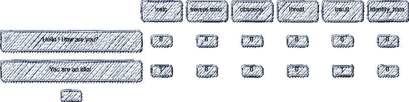
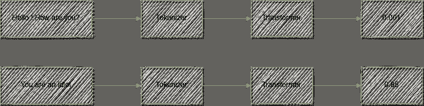
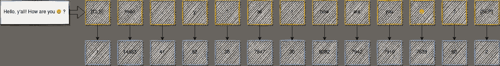
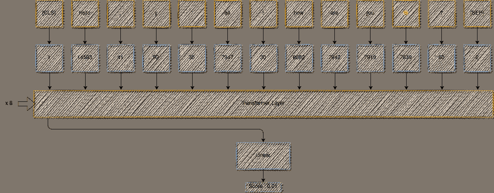
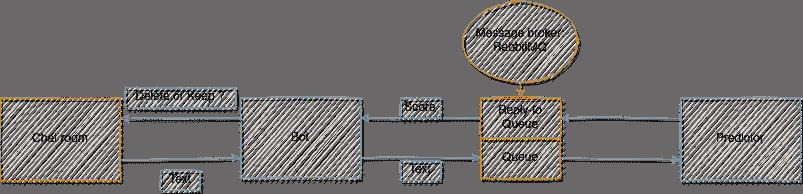
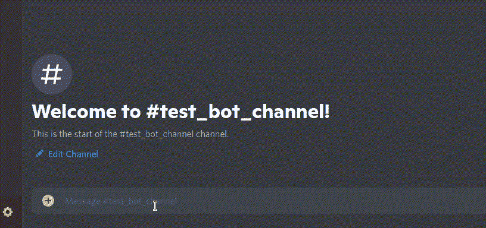

# 使用 Python 和深度学习构建自己的不和谐调节机器人

> 原文：<https://towardsdatascience.com/build-your-own-discord-moderation-bot-using-python-and-deep-learning-4386fc43e45e?source=collection_archive---------22----------------------->

## 建立一个自主机器人，删除所有有毒信息。


在 [Unsplash](https://unsplash.com/s/photos/chat?utm_source=unsplash&utm_medium=referral&utm_content=creditCopyText) 上由 [Clément Falize](https://unsplash.com/@centelm?utm_source=unsplash&utm_medium=referral&utm_content=creditCopyText) 拍摄的照片

# 介绍

鉴于互联网用户生成的文本规模，内容审核可能很困难。简化这一过程的一个解决方案是使用机器学习来自动化它。一个 ML 模型训练了版主不想看到的例子，如有毒内容、侮辱或种族主义评论，然后可以用来自动过滤掉这些消息。

在这个项目中，我们将使用 Jigsaw 毒性评论数据集训练这样的模型:[https://www . ka ggle . com/c/Jigsaw-Toxic-Comment-class ification-challenge/Data](https://www.kaggle.com/c/jigsaw-toxic-comment-classification-challenge/data)

然后，我们将使这个模型可以从一个 [Discord bot](https://discord.com/developers/docs/intro) 中调用，该 bot 将删除该模型标记为有毒的所有消息。

# 数据

Jigsaw 毒性数据包括 159，000 个样本，每个样本都可以贴上多个类别的标签，如“有毒”、“侮辱”…



数据集格式-按作者分类的图像

为简单起见，我们使用所有这些类别来创建一个二进制目标，如下所示:

```
data["label"] = (
    data[
        ["toxic", "severe_toxic", "obscene", "threat", "insult", "identity_hate"]
    ].sum(axis=1, skipna=True)
    > 0.5
).astype(int)
```

# 机器学习步骤



机器学习步骤-作者图片

## 标记器

我用 huggingface 的库训练了我自己的 BPE 分词器，你可以用我的 Github 库中的脚本做同样的事情:

```
python bleach_bot/ml/train_tokenizer.py --files YOUR_TEXT_FILES
```

这个记号赋予器将句子分解成小记号，然后将每个记号映射成整数:



标记器—按作者分类的图像

## 分类者

我们使用变压器网络作为分类器:



变压器网络—图片由作者提供

通过使用 torch.nn.TransformerEncoderlayer 和 torch . nn . transformer encoder 类，实现变得很容易。

```
 class TextBinaryClassifier(pl.LightningModule):
    def __init__(
        self,
        vocab_size,
        channels=256,
        dropout=0.4,
        lr=1e-4,
    ):
        super().__init__()

        self.lr = lr
        self.dropout = dropout
        self.vocab_size = vocab_size

        self.embeddings = torch.nn.Embedding(self.vocab_size, embedding_dim=channels)

        self.pos_embedding = torch.nn.Embedding(1024, embedding_dim=channels)

        encoder_layer = nn.TransformerEncoderLayer(
            d_model=channels, nhead=4, dropout=self.dropout, dim_feedforward=1024
        )

        self.encoder = torch.nn.TransformerEncoder(encoder_layer, num_layers=8)

        self.linear = Linear(channels, 1)

        self.do = nn.Dropout(p=self.dropout)

        self.loss = torch.nn.BCEWithLogitsLoss()

    def forward(self, x):
        batch_size, sequence_len = x.size(0), x.size(1)

        embedded = self.embeddings(x)

        pos_x = (
            torch.arange(0, sequence_len, device=x.device)
            .unsqueeze(0)
            .repeat(batch_size, 1)
        )

        pos_x = self.pos_embedding(pos_x)

        embedded += pos_x

        embedded = self.do(embedded)

        embedded = embedded.permute(1, 0, 2)

        transformed = self.encoder(embedded)

        transformed = transformed.permute(1, 0, 2)

        out = self.linear(transformed[:, 0])

        return out
```

# 预言者

## **火炬至 onnx**

出于实际原因，我们将模型从 torch 转换。ckpt 格式到. onnx.
我们还使用 onnxruntime 库在我们的预测中使用这个模型。

为此，我们运行:

```
torch.onnx.export(
    model,  # model being run
    ids,  # model input (or a tuple for multiple inputs)
    filepath,  # where to save the model (can be a file or file-like object)
    export_params=True,  # store the trained parameter weights inside the model file
    opset_version=10,  # the ONNX version to export the model to
    do_constant_folding=True,  # whether to execute constant folding for optimization
    input_names=["input"],  # the model's input names
    output_names=["output"],  # the model's output names
    dynamic_axes={
        "input": {0: "batch_size", 1: "sequence_len"},  # variable length axes
        "output": {0: "batch_size"},
    },
)
```

执行此过程可以将模型的大小减少 66%，并将 CPU 上的预测速度提高 68%(从 2.63 毫秒到 0.85 毫秒，以生成一个小句的预测)。

## 预测服务器

我们使用一个带有 RabbitMQ 和 pika 的排队系统来处理来自机器人的预测查询。



预测架构—作者图片

这种架构允许将机器人逻辑与机器学习/NLP 逻辑隔离开来，并且如果需要的话，可以更容易地横向扩展到多个预测器。

您可以使用我的存储库中的 docker-compose 文件来运行整个架构:

首先，按照本教程获取您的 bot 令牌:

```
[https://www.freecodecamp.org/news/create-a-discord-bot-with-python/](https://www.freecodecamp.org/news/create-a-discord-bot-with-python/)
```

然后，下载模型和标记器:

```
wget https://github.com/CVxTz/bleach_bot/releases/download/v1/toxicity_model.onnx -P ./data/wget https://github.com/CVxTz/bleach_bot/releases/download/v1/tokenizer.json -P ./data/
```

最后，运行 docker-compose

```
docker-compose up --build
```

# 机器人演示

该机器人删除分类模型给出的分数大于 0.8 的所有邮件。

接下来是演示。我使用 docker-compose 在我的机器上运行这个机器人。我们可以看到，机器人删除了所有令人讨厌的负面消息，保留了常规消息。不要眨眼，因为它真的很快😉



# 结论

这个项目详细介绍了使用深度学习构建一个仲裁机器人所需的第一步。该机器人经过训练，可以检测有毒或侮辱性信息，并自动删除它们。下一步将是进一步改进机器人的机器学习部分，以减少误报的数量，并致力于其部署。

## 来源

```
[1] [https://www.freecodecamp.org/news/create-a-discord-bot-with-python/](https://www.freecodecamp.org/news/create-a-discord-bot-with-python/)
```

密码

[https://github.com/CVxTz/bleach_bot](https://github.com/CVxTz/bleach_bot)