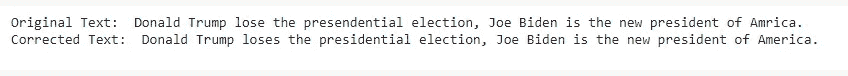

# 用 Python 构建自己的语法

> 原文：<https://towardsdatascience.com/build-your-own-grammarly-in-python-6fb4297c189c?source=collection_archive---------8----------------------->

## Python 中的拼写和语法纠正工具


图片由[洛伦佐·卡法罗](https://pixabay.com/users/3844328-3844328/?utm_source=link-attribution&amp;utm_medium=referral&amp;utm_campaign=image&amp;utm_content=1870721)来自[皮克斯拜](https://pixabay.com/?utm_source=link-attribution&amp;utm_medium=referral&amp;utm_campaign=image&amp;utm_content=1870721)

良好的语法和正确拼写的单词有助于你清楚地写作和交流，并得到你想要的东西。无论你是在写一篇文章、短文还是电子邮件，用清晰正确的语言表达你的想法会给你的读者留下好印象。在打电子邮件、短文、文章等的时候，人们经常会犯很多语法和拼写错误。

Grammarly 是一家总部位于美国的技术公司，提供基于人工智能和自然语言处理的数字写作评估工具。它提供了许多免费和付费的工具，包括语法检查、拼写检查、写作辅助等。在本文中，我们将使用一个开源包`**gingerit**`来实现一个可以纠正文本中拼写和语法错误的模型。

# GingerIt:


来自 [Pixabay](https://pixabay.com/?utm_source=link-attribution&amp;utm_medium=referral&amp;utm_campaign=image&amp;utm_content=1868496) 的[像素](https://pixabay.com/users/pexels-2286921/?utm_source=link-attribution&amp;utm_medium=referral&amp;utm_campaign=image&amp;utm_content=1868496)的图像

GingerIt 是一个开源的 Python 包，它是 gingersoftware.com API 的包装器。Ginger 是人工智能支持的写作辅助工具，可以根据完整句子的上下文来纠正文本中的拼写和语法错误。

使用此软件包，您可以:

*   消除语法错误
*   纠正拼写错误
*   纠正标点错误
*   提高你的写作水平

这个包并不完全是 Grammarly 的克隆，但可以被看作是它的基础版本，因为它提供了一些通用的特性。目前，gingerit 只支持英语。

## 拼写检查和语法检查算法是如何工作的？

拼写检查器运行各种算法来纠正错别字。该算法如下:

*   首先，它扫描文本以标记出单个或一对单词。
*   它涉及字典中单词列表的标记/单词。
*   如果这些单词与任何单词都不匹配，那么它会运行编辑距离算法来建议最接近的单词或单词列表。

与拼写检查算法类似，语法检查算法也从文本中提取一个句子，并对照句子检查每个单词，根据句子中的位置查看诸如词性之类的信息。同样依赖于几个规则，该算法检测时态一致、数字、词序等方面的错误。

## 安装:

可以使用以下命令从 PyPl 安装 Gingerit:

```
**pip install gingerit**
```

## 用法:

*   在安装和导入 gingerit 包之后，它可以用来纠正给定输入文本的语法和拼写错误。
*   将文本传递给 gingerit 包中的 parse()函数，它返回一个输出字典，关键字为:“更正”、“文本”、“结果”。

```
**Value of the corresponding keys:****Corrections:** List of mistakes in dictionary format as starting index, mistaken text, corrected text, the definition of the corrected text.
**Text:** Original Text
**Result:** Corrected text free from grammatical and spelling mistakes
```

(作者代码)

从上面的代码片段可以看出，使用 gingerit 包纠正了一个不正确的语句。



(图片由作者提供)，输入输出文本

# 结论:

在本文中，我们使用开源 Python 包实现了一个基本版本的语法和拼写检查器。gingerit 软件包的结果没有达到标准，因为它可以纠正拼写错误和轻微的语法错误。Gingerit 是一个围绕[gingersoftware.com](https://www.gingersoftware.com/)API 的包装器，这是一个付费版本，在纠正语法错误方面可能会有很好的效果。

[language_tool](https://pypi.org/project/language_tool/) 是另一个开源包，工作方式与 gingerit 包非常相似。

> 感谢您的阅读