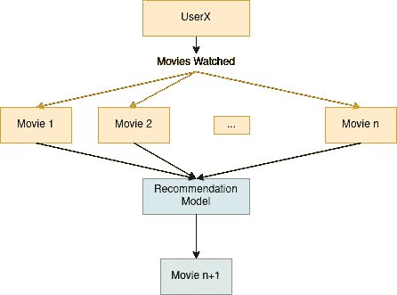
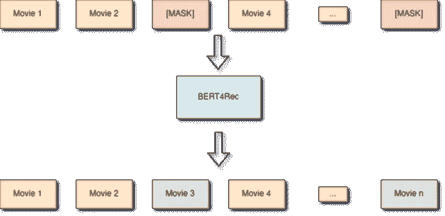
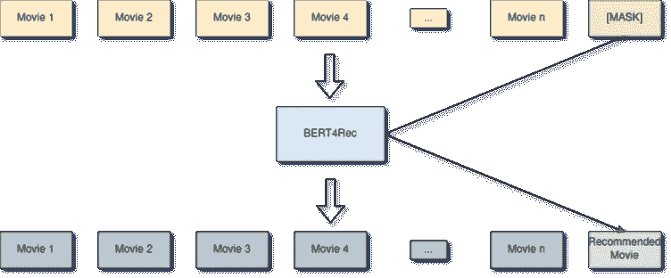
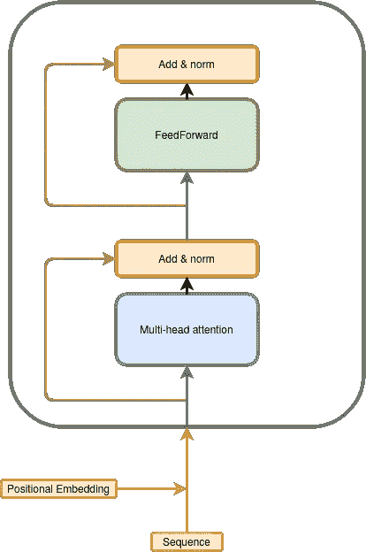
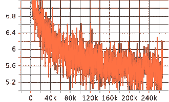

# 使用 BERT4Rec 构建您自己的电影推荐系统

> 原文：<https://towardsdatascience.com/build-your-own-movie-recommender-system-using-bert4rec-92e4e34938c5?source=collection_archive---------9----------------------->

## PyTorch 中基于变压器的推荐系统的分步实现


在 [Unsplash](https://unsplash.com/s/photos/movie?utm_source=unsplash&utm_medium=referral&utm_content=creditCopyText) 上由 [Myke Simon](https://unsplash.com/@myke_simon?utm_source=unsplash&utm_medium=referral&utm_content=creditCopyText) 拍摄的照片

推荐算法是我们每天使用的许多服务的核心部分，从 YouTube 上的视频推荐到亚马逊上的购物项目，不要忘记网飞。
在这篇文章中，我们将实现一个简单而强大的推荐系统，名为 [BERT4Rec:来自 Transformer](https://arxiv.org/abs/1904.06690) 的双向
编码器表示的顺序推荐。
我们将在约 60，000 部电影的数据库上，将该模型应用于电影推荐。

# 任务

我们的目标是向用户推荐他们过去看过的电影。该推荐直接从数据中学习，并且针对每个用户进行个性化。



作者图片

# 数据

我们将使用 MovieLens-25m 数据集([https://grouplens.org/datasets/movielens/25m/](https://grouplens.org/datasets/movielens/25m/))。这是一个记录 162541 个用户和 62423 部电影之间互动的数据集。

我们可以为每个用户构建他们互动的电影的时间排序序列。我们将使用这些序列来训练我们的推荐系统。

# 模型

BERT4Rec 很像 NLP 的常规 BERT。这是一个变形金刚网络，它被训练来从用户的历史中预测“屏蔽”的电影。

第一步是以按时间排序的电影列表的形式构建用户的历史记录。


作者图片

其中一些电影被一个符号[面具]所取代。


作者图片

然后对 BERT4Rec 模型的任务进行训练，以尝试预测[MASK]项的正确值。通过这样做，模型将学习每部电影的有用表示，以及电影之间存在的重要模式。



作者图片

然后为了进行推断，我们可以在用户序列的末尾添加一个[MASK]来预测他们将来最有可能想要的电影。



作者图片

BERT4Rec 是一种常规的转换器架构，类似于 NLP 中使用的架构:



变压器层

序列中的每个电影都被映射到一个嵌入向量。

```
src_items = self.item_embeddings(src_items)
```

然后，自我关注是允许这种架构对输入序列的元素之间的长期依赖性进行建模的原因。

顺序通过位置嵌入来建模，其中我们在每个时间步学习一个“位置向量”。

```
 batch_size, in_sequence_len = src_items.size(0), src_items.size(1)
pos_encoder = (
    torch.arange(0, in_sequence_len, device=src_items.device)
    .unsqueeze(0)
    .repeat(batch_size, 1)
)
pos_encoder = self.input_pos_embedding(pos_encoder)

src_items += pos_encoder
```

最后，在每个时间步，模型从 62423 部电影中输出每个可能选项的预测分数。我们使用这些分数来优化分类交叉熵损失。



培训日志

# 模型使用示例

现在，我们将使用经过训练的模型，根据三种情况提出建议:

## 场景 1:冒险/幻想

用户历史-->

*   《哈利·波特与魔法石》(又名《哈利·波特与魔法石》)(2001 年)
*   哈利·波特与密室(2002)
*   哈利·波特与阿兹卡班的囚徒(2004)
*   哈利·波特与火焰杯(2005)

车型推荐->

```
['**Ice Age (2002)**',
 "**Pirates of the Caribbean: Dead Man's Chest (2006)**",
 '**Avatar (2009)**',
 'Star Wars: Episode III - Revenge of the Sith (2005)',
 'Shrek 2 (2004)',
 'Ratatouille (2007)',
 'Bruce Almighty (2003)',
 'I, Robot (2004)',
 'Last Samurai, The (2003)',
 'Up (2009)',
 'Matrix Revolutions, The (2003)',
 'Men in Black II (a.k.a. MIIB) (a.k.a. MIB 2) (2002)',
 'Iron Man (2008)',
 '**Spirited Away (Sen to Chihiro no kamikakushi) (2001)**',
 '300 (2007)',
 'Big Fish (2003)',
 "Bridget Jones's Diary (2001)",
 'My Big Fat Greek Wedding (2002)',
 'Pianist, The (2002)',
 'Interstellar (2014)',
 'Shaun of the Dead (2004)',
 'Moulin Rouge (2001)',
 'Juno (2007)',
 'WALL·E (2008)',
 'Casino Royale (2006)',
 'School of Rock (2003)',
 '40-Year-Old Virgin, The (2005)',
 '**Harry Potter and the Order of the Phoenix (2007)**',
 'Bourne Supremacy, The (2004)',
 'Miss Congeniality (2000)']
```

我们可以看到，该模型在冒险/幻想流派中提出了一些有趣的建议。请注意，该模型无法访问电影的类型。

## 场景 2:动作/冒险

用户历史-->

*   黑豹(2017 年)
*   复仇者联盟(2012)
*   复仇者联盟 3：无限战争—第一部分(2018 年)
*   洛根(2017)
*   蜘蛛侠(2002)
*   蜘蛛侠 3 (2007)
*   《蜘蛛侠:远离家乡》(2019)

车型推荐->

```
['**Avengers: Infinity War - Part II (2019)**',
 '**Deadpool 2 (2018)**',
 '**Thor: Ragnarok (2017)**',
 '**Spider-Man: Into the Spider-Verse (2018)**',
 '**Captain Marvel (2018)**',
 'Incredibles 2 (2018)',
 '**Untitled Spider-Man Reboot (2017)**',
 'Ant-Man and the Wasp (2018)',
 'Guardians of the Galaxy 2 (2017)',
 'Iron Man 2 (2010)',
 'Thor (2011)',
 'Guardians of the Galaxy (2014)',
 'Captain America: The First Avenger (2011)',
 'X-Men Origins: Wolverine (2009)',
 "Ocean's 8 (2018)",
 'Wonder Woman (2017)',
 'Iron Man 3 (2013)',
 'Pirates of the Caribbean: The Curse of the Black Pearl (2003)',
 'Amazing Spider-Man, The (2012)',
 'Aquaman (2018)',
 'Dark Knight, The (2008)',
 'Mission: Impossible - Fallout (2018)',
 'Avengers: Age of Ultron (2015)',
 'Jurassic World: Fallen Kingdom (2018)',
 'Iron Man (2008)',
 'Coco (2017)',
 'Lord of the Rings: The Two Towers, The (2002)',
 'Rogue One: A Star Wars Story (2016)',
 'X-Men: The Last Stand (2006)',
 'Venom (2018)']
```

这些建议完全正确！大部分来自漫威宇宙，就像用户的历史一样。

## 场景 3:喜剧

用户历史-->

*   疯狂动物城(2016)
*   玩具总动员 3 (2010)
*   玩具总动员 4 (2019)
*   海底总动员(2003)
*   《料理鼠王》(2007)
*   乐高电影(2014)
*   捉鬼敢死队(又名捉鬼敢死队)(1984)
*   艾斯·文图拉:当自然召唤(1995)

车型推荐->

```
['**Home Alone (1990)**',
 "**Bug's Life, A (1998)**",
 '**Toy Story 2 (1999)**',
 'Nightmare Before Christmas, The (1993)',
 'Babe (1995)',
 '**Inside Out (2015)**',
 '**Mask, The (1994)**',
 '**Toy Story (1995)**',
 'Back to the Future (1985)',
 'Back to the Future Part II (1989)',
 'Simpsons Movie, The (2007)',
 'Forrest Gump (1994)',
 'Austin Powers: International Man of Mystery (1997)',
 'Monty Python and the Holy Grail (1975)',
 'Cars (2006)',
 'Kung Fu Panda (2008)',
 'Groundhog Day (1993)',
 'American Pie (1999)',
 'Men in Black (a.k.a. MIB) (1997)',
 'Dumb & Dumber (Dumb and Dumber) (1994)',
 'Back to the Future Part III (1990)',
 'Big Hero 6 (2014)',
 'Mrs. Doubtfire (1993)',
 'Clueless (1995)',
 'Bruce Almighty (2003)',
 'Corpse Bride (2005)',
 'Deadpool (2016)',
 'Up (2009)',
 "Ferris Bueller's Day Off (1986)"]
```

在这种情况下，该模型能够推荐一些很棒的电影，如《玩具总动员 1》或《独自回家》，这些电影符合用户历史的主题。

# 结论

在这个项目中，我们构建了一个强大的电影推荐系统，名为 BERT4Rec。这是一个基于 transformer 层的模型，使用与 BERT 非常相似的方案进行训练，其中我们屏蔽了用户电影历史序列的一些元素，然后尝试预测这些项目的真实值。

你看看下面代码中的实现细节-->

代号:[https://github.com/CVxTz/recommender_transformer/](https://github.com/CVxTz/recommender_transformer/blob/main/notebooks/inference.ipynb)