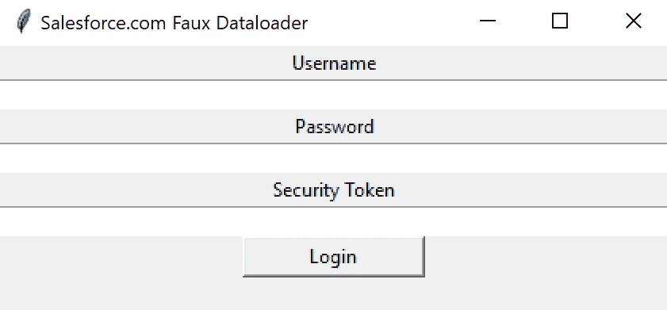
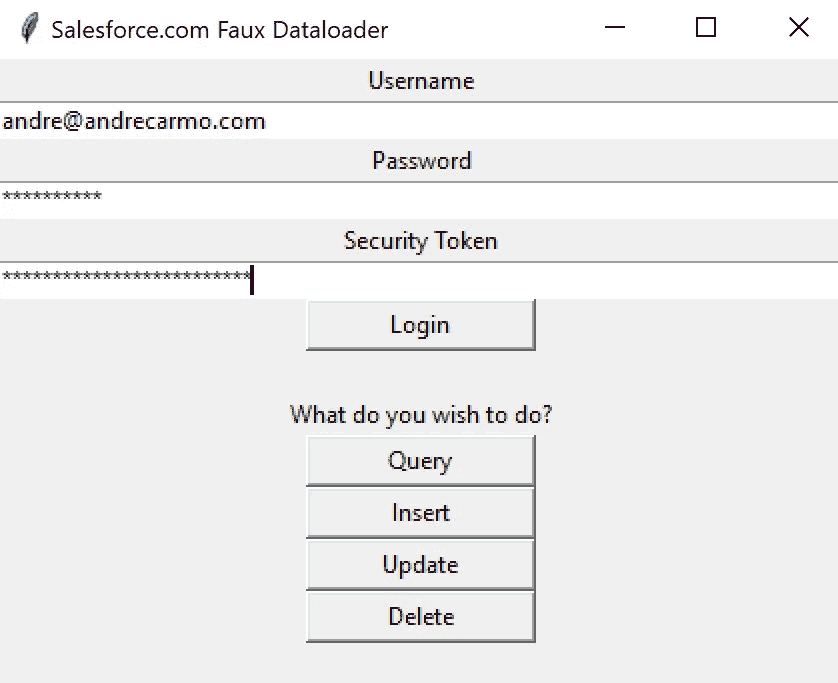
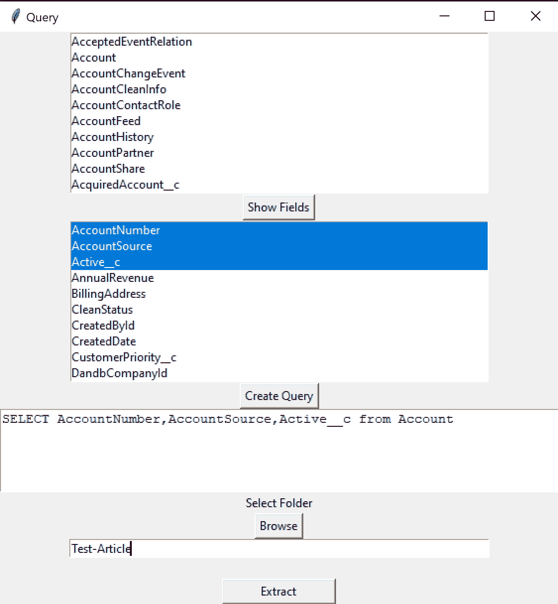
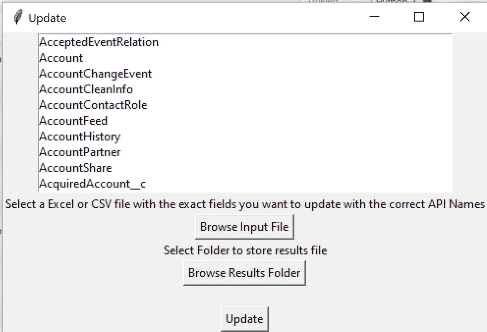

# 构建您自己的 Salesforce 数据加载器

> 原文：<https://towardsdatascience.com/build-your-own-salesforce-dataloader-c39f291cfb32?source=collection_archive---------22----------------------->

## 使您的用户能够使用 Salesforce Dataloader 的强大功能，但具有可定制的用户体验

[莫兰](https://unsplash.com/@apollo_y?utm_source=medium&utm_medium=referral)在 [Unsplash](https://unsplash.com?utm_source=medium&utm_medium=referral) 上的照片

作为全球领先的客户关系管理(CRM)平台，Salesforce 是一款能够存储大量数据的出色工具。因此，管理这些数据是平台管理员的日常工作。其中一种方法是通过 [*数据加载器*](https://help.salesforce.com/articleView?id=sf.data_loader.htm&type=5) *，*一个能够提取、插入、更新和删除 Salesforce 记录的客户端应用程序。

当我在 2018 年夏季实习期间第一次开始与 Salesforce 合作并使用 Dataloader 时，我记得我很害怕不小心做错事情。一打开它，所有我能接触到的物品就出现在我面前，即使我一开始并不知道它们的存在或对它们感兴趣。虽然可以限制哪些用户可以使用该工具，但我感兴趣的是能够在其中定制用户体验，并创建一个更可控和优化的环境。这样，我可以选择只向销售团队显示业务机会、销售线索和客户，或者向开发团队显示自定义元数据类型和自定义设置，而不是显示组织内的所有对象。选项是无限的，在本文中，我将介绍一个尝试完整模拟 Salesforce 数据加载器的应用程序，它可以作为构建更多定制体验的垫脚石。它的一些限制是，它在一个作业中最多只能插入、更新和删除 10k 条记录，输入 Excel/Csv 文件中的列名必须与您尝试写入的字段的“API 名称”完全匹配，并且登录需要从您在 Salesforce 中的个人设置中获得的[安全令牌](https://help.salesforce.com/articleView?id=sf.user_security_token.htm&type=5)。该解决方案使用 simple_salesforce 和 salesforce_bulk Python 包来处理数据，并使用 Tkinter 来构建用户界面。

# 应用程序

*我只在文章正文中包含了部分代码。要检查整个事情，导航到*[*https://github.com/soravassi/FauxSFDCDataloader*](https://github.com/soravassi/FauxSFDCDataloader)

## 登录窗口

当用户第一次打开应用程序时，他们会发现一个简单的 Tkinter 窗口，必须在其中插入用户名、密码和安全令牌。按下“登录”后，将调用 Login()函数并构建主菜单。

## 炙单

认证后，将出现操作选项。

query 按钮调用查询操作特有的顶层 Tkinter 窗口，因为它的用户体验与其他操作稍有不同。插入、更新和删除按钮都调用同一个窗口模板，通过函数“open_secondary(operation)”上的关键字参数指定动作

## 动作窗口

该应用程序有两个主要的操作窗口模板:一个用于查询，另一个用于写操作(插入、更新、删除):

**查询窗口**

查询页面利用两个 Tkinter 列表框来帮助用户构建他们的 [SOQL](https://developer.salesforce.com/docs/atlas.en-us.soql_sosl.meta/soql_sosl/sforce_api_calls_soql.htm) 查询。第一个列表框是 SOQL 查询的结果，它包含 Salesforce 中所有对象的名称，而第二个列表框是 SOQL 查询的结果，它包含第一个列表框中所选对象内的所有字段名称。在这里，用户可以按“创建查询”，这将根据他们的列表框选择编译查询，或者直接在文本框中编写查询，然后单击“提取”以生成包含所需数据的 Excel 文件。

用于编译“open_query()”函数中的对象名的代码段，该函数打开查询顶层窗口

分别按下“显示字段”、“创建查询”和“提取”时运行的功能

**更新/插入/删除窗口:**

此窗口的行为类似于查询窗口，因为在打开它时，列表框将显示您可以在其中执行所需操作的对象。主要区别在于，对于写操作，应用程序利用 salesforce_bulk 包而不是 simple_salesforce，并且用户必须输入从中选择字段的 CSV/Excel 文件，而不是在第二个列表框中选择受影响的字段。

提示用户选择输入文件，并将其保存在数据帧上

“动作(操作)”功能的一部分，启动批量数据作业并编译结果。

# 将这一切结合在一起

使用 Tkinter 构建这样一个应用程序的好处在于，您可以快速推出它的不同版本。例如，您可以使应用程序的某些方面(如他们可以访问的对象列表)以用户的配置文件为条件。

其他选项可能只显示查询按钮，或者隐藏删除按钮。根据我自己的个人经验，我创建了该应用程序的多个版本，帮助产品所有者提取选项列表值及其依赖关系，并帮助质量保证用户更改他们自己的配置文件，以便从业务用户的角度测试新功能，而无需授予他们“管理用户”权限或“登录身份”功能。正如我说过的，天空是无限的，具体的应用将因 Salesforce 的实施而异。希望这有助于帮助用户以更加定制化和定制化的体验处理数据。

威廉·冈克尔在 [Unsplash](https://unsplash.com?utm_source=medium&utm_medium=referral) 上拍摄的照片

*感谢您的阅读！这是我尝试分享一些代码和我试图解决的一个问题的解决方案的第一篇文章。我很感激你所有的建设性反馈，从文章的结构到代码本身。*

*更多项目，我邀请您参观*[*andrecarmo.com*](https://andrecarmo.com)