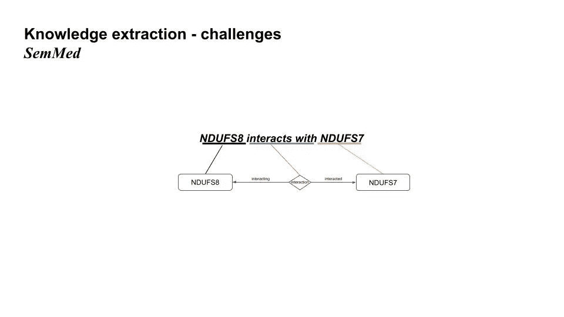
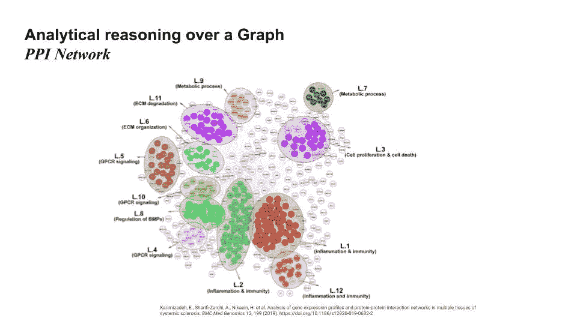

# 构建生物医学知识图谱

> 原文：<https://towardsdatascience.com/building-a-biomedical-knowledge-graph-2930c7e05760?source=collection_archive---------21----------------------->

## 使用公开可用的数据集对复杂的生物医学数据进行分析推理

听取 Vaticle 社区讲座的汇报—主讲人是罗氏系统生物学科学家 Konrad myliwiec。这个演讲是四月份在轨道 2021 上虚拟发表的。

像许多 TypeDB 社区成员一样，Konrad 来自不同的工程背景。自从为 GSK 开发企业知识图以来，知识图一直是他工作范围的一部分。他加入 TypeDB 社区已经大约 3 年了。虽然他的大部分职业生涯都在生物医药行业度过，但他也花时间研究商业智能应用程序，开发移动应用程序，目前是罗氏制药公司 RGITSC(罗氏全球 IT 解决方案中心)的数据科学工程师。

去年，康拉德开始注意到网上的一种趋势，无论是 LinkedIn 上的文章还是他的生物医学网络；知识图表到处都是。鉴于世界正处于与新冠肺炎·疫情的斗争中，他想知道知识图谱是否能帮助他的生物同龄人的努力。

在开发 BioGrakn Covid 的过程中，他试图将这两个主题结合在一起，以提供一种更容易理解和有用的方法来支持疫情期间的研究和生物医学斗争。在这个演讲中，他描述了他和一组 TypeDB 社区成员如何处理一些技术开发领域。

## 外卖:

*   biog rakn Covid——它是什么，项目的目标是什么
*   公开可用的数据源和本体——什么数据被加载到 BioGrakn Covid 中
*   知识提取—处理非结构化数据
*   分析推理——如何在知识图上进行一些分析

# 建筑 BioGrakn Covid

[BioGrakn Covid](https://github.com/vaticle/biograkn-covid) 是由 Konrad、Vaticle 的 Tomás Sabat 和 GSK 的 Kim Wager 共同发起的开源项目。这是一个以新冠肺炎为中心的数据库。

## 用图表表示生物医学数据

一旦我们认识到生物医学数据的自然表示倾向于类似图形，将生物医学数据建模为图形就成了显而易见的选择。图形数据库传统上将数据表示为二进制节点和边。想想标签属性图，其中两个节点通过有向边连接。康拉德和他的同事很快意识到，用超图来表示生物医学数据变得更简单，最终也更自然，就像在 TypeDB 中发现的那样。


图表与超图模型—经许可使用的幻灯片

> 超图通过放宽边的定义来概括图的一般概念。图中的边只是一对顶点。相反，超图中的超边是一组顶点。这种顶点集可以进一步结构化，遵循超图的不同可能定义中涉及的一些附加限制。

在 TypeDB 中，模型使用矩形来表示实体(节点),菱形表示关系或超关系(一个关系中有 n 个角色)。


TypeDB 图表示例—经许可使用的幻灯片

## 使用的数据源

目前，在 BioGrakn Covid 中有相当多的公开数据集。简而言之，以下是数据库中包含的一些数据集和映射:


BioGrakn Covidslides 中使用的数据集经许可使用

*   <https://www.uniprot.org/>**—实体(转录本、基因、蛋白质)，关系(翻译、转录、基因-蛋白质编码)**
*   **[**人类蛋白质图谱**](https://www.proteinatlas.org/) —实体(组织)、关系(表达)**
*   **<https://reactome.org/>**—实体(通路)，关系(通路——参与)****
*   ****[**DGldb**](https://www.dgidb.org/) —实体(药物)，关系(药物-基因-相互作用)****
*   ****<https://www.disgenet.org/>**—实体(疾病)，关系(基因-疾病关联)******
*   ********冠状病毒** —实体(病毒)、关系(生物体-病毒宿主、基因-病毒关联、蛋白质-病毒关联)******
*   ****[**ClinicalTrials.gov**](http://clinicaltrials.gov)**—实体(临床-试验，组织)，关系(临床-试验-协作，临床-试验-药物-关联)******

********保持数据质量** 我们很多人都知道，从上述来源获取数据并将其加载到数据库中并不简单。首先需要考虑数据质量。正如 Konrad 在他的演讲中指出的，保持数据质量是这项工作的一个重要方面。******

> ****你不希望有任何数据差异，你不希望有几个节点代表相同的实体，因为这将影响和偏见你的分析在未来。****

****他们解决数据质量问题的方法是使用像 UMLS(统一医疗语言系统)这样的数据源。UMLS 提供了一些有助于维护数据质量的结构和上下文。在演讲中，康拉德关注了 UMLS 的两个子集。第一个，UMLS 的“Metathesaurus ”,包含了各种类型不同层次的生物医学实体，如蛋白质、基因、疾病、药物以及它们之间的关系。****

****作为可用的例子，我们有两种蛋白质:`protein-1`和`protein-2`，它们通过`interact-with`边缘连接。****

********

****将 UMLS 映射到 TypeDB 架构—经许可使用的幻灯片****

****第二个子集是语义网络数据。这集中在分类法上。每个概念都在一个分类法中给出，例如，我们有一个概念`compound`，而`protein`是`compound`的一个子类型。这个子集的好处将在以后变得更加明显。****

****使用 UML 作为初始或基线本体给了我们信心，我们可以在没有数据质量问题的情况下前进——显然，这不是解决数据质量挑战的唯一方法。尽管如此，UML 在生物医学领域仍然是有效的。****

## ****定义 TypeDB 架构****

****TypeDB 中的 Schema 为我们的数据提供了结构和模型，并且知道所有被接收到数据库中的数据都将遵守这个模式，这是安全的。****

****在 Konrad 的案例中，他们正在创建一个具有实体的生物医学模式:`protein`、`transcript`、`gene`、`pathway`、`virus`、`tissue`、`drug`、`disease`；以及它们之间的关系。应该注意的是，这些决策中的大部分都可以从您使用的数据源中推导出来。****

****以下是该模式的摘录:****

```
**define
gene sub fully-formed-anatomical-structure,    
  owns gene-symbol,       
  owns gene-name,      
  plays gene-disease-association:associated-gene;
disease sub pathological-function,    
  owns disease-name,    
  owns disease-id,    
  owns disease-type,    
  plays gene-disease-association:associated-disease;
protein sub chemical,    
  owns uniprot-id,    
  owns uniprot-entry-name,    
  owns uniprot-symbol,    
  owns uniprot-name,    
  owns ensembl-protein-stable-id,      
  owns function-description,    
  plays protein-disease-association:associated-protein;
protein-disease-association sub relation,    
  relates associated-protein,    
  relates associated-disease;
gene-disease-association sub relation, 
  owns disgenet-score,    
  relates associated-gene,    
  relates associated-disease;**
```

****现在我们有了模式，可以开始加载数据了。****

## ****摄取结构化数据****

****在讲座中，Konrad 演示了如何从 UniProt 加载数据，其中也包含来自 Ensembl 的数据。首先要做的是识别相关的列，然后根据我们的模式，识别要用数据填充的相关实体。从这里开始，为每个概念添加属性就相当简单了。****

********

****将 UniProt 映射到 TypeDB 模式—经许可使用的幻灯片****

****加载数据很简单——使用 Python、Java 或 Node.js 中的客户端 API。Konrad 为 UniProt 数据构建了这个迁移器——可通过 BioGrakn Covid [repo](https://github.com/vaticle/biograkn-covid/blob/master/Migrators/Uniprot/UniprotMigrator.py) 获得。****

****那些积极使用这些类型的公开可用数据集的人知道，它们不会像我们希望的那样频繁更新。其中一些是每年更新的，所以我们需要用相关的当前数据来补充这些数据源。这里的问题是，这些数据通常来自论文、文章和非结构化文本。要使用这些数据，需要一个子域模型。这使我们能够更有表现力地处理文本，并最终将其与我们的生物医学模型联系起来。这两种型号如下所示:****

********

****在 TypeDB 模式中一起使用两个域模型—经许可使用的幻灯片****

## ****知识抽取****

****随着模式集和发布的确定，需要解决一些挑战。Konrad 强调了其中的两个:从文本中提取生物医学实体，并在一个中心知识图中链接不同的本体。****

******从文本中提取生物医学实体******

****在应对这一挑战时，Konrad 提醒我们不要重新发明轮子，而是要利用现有的命名实体识别语料库。在这个项目中，康拉德公司使用了 NER 科德公司和 SemMed 公司。****

> ****命名实体识别是在文本中识别命名实体的自然语言处理算法。****

******软线 NER******

****绳索 NER 是预先计算的命名实体识别输出的数据源。CORD NER 的优点是 NLP 工作的输出，来自文本的实体，被映射到 UML 中的概念。这有助于在知识图中提供一致性和数据质量。有了概念及其类型，我们现在可以映射到 TypeQL 中的模式。****

********

****经许可使用的幻灯片****

******SemMed******

****SemMed 包含从 PubMed 中可用的出版物派生的实体，这些实体存储在语义三元组中。CORD NER 的问题是它不包含命名实体之间的任何链接，而 SemMed 确实提供了这些链接。这些语义三元组由主语、谓语和宾语组成。所有这些都与 UMLS 元霸王龙相对应，这再次帮助我们在知识图谱中保持一致的命名惯例。****

****下面你可以看到一个例子，说明 Konrad 如何处理 SemMed 中的数据。这是两个表的简单连接，我们看到主语、谓语和宾语:`NDUFS8`是基因组，`NDUFS7`也是基因或基因组，`interacts-with`是它们之间的谓语或关系。SemMed 自然地从文本中导出这些联系，并且当涉及到将这些实体映射到定义的模型时，这为我们提供了所需的大部分内容。事实上，Konrad 注意到大约有 18 种不同的谓词可以映射到模式中的关系。****

********

****经许可使用的幻灯片****

********

****经许可使用的幻灯片****

******使用 SciSpacy 进行文本处理******

****很多时候，我们需要自己从论文中的非结构化文本中提取结构化数据。对于 Konrad 来说，这里的挑战是处理临床试验数据，这些数据通常以 XML 数据的形式出现。****

****问题在于有时输出并不直接。它可以提供一种以上的药物、化合物或化学品以及其他信息。为了对这些数据进行 NER，康拉德推荐使用[科学软件](https://spacy.io/universe/project/scispacy/)。SciSpacy 是一个 Python 库，构建于 Spacy 之上，它使用一个在公开出版物上训练过的 transformer 模型来执行 NER。用它来对照上面的例子，它可以识别两个命名实体，更好的是，它提供了 UMLS 的映射。****

******生物数据中的 ID 解析******

****另一种可能出现的情况是当本体中的 ID 不存在于您正在处理的数据中时。为了解决这个问题，我们可以使用实体的规范名称，并使用类似于 [RxNorm](https://www.nlm.nih.gov/research/umls/rxnorm/index.html) 的 API 来获取一个 RxNorm ID，然后可以用它来查找丢失的 ID。****

********

****经许可使用的幻灯片****

# ****转换图表****

****一旦加载了数据，我们如何开始遍历图表以生成一些见解和/或新信息？在下面的截图中，Konrad 浏览了一个查询的可视化结果。****

********

****TypeDB studio 查询可视化—经许可使用的幻灯片****

****更高层次的问题是:****

*****找出在与 SARs 病毒的关系中起* `*host*` *作用的、受另一个基因刺激的任何基因；以及与刺激基因相互作用的药物；最后，提到基因之间关系的出版物。*****

****在 TypeQL 中，该查询如下所示:****

```
**match
$gene isa gene;
$virus isa virus, has name "SARs";
$r(host: $gene, virus: $virus) isa gene-virus-host;
$gene2 isa gene;
$r2(stimulating: $gene2, stimulated: $gene) isa gene-gene-interaction;
$r3(mentioned: $r2, publication: $pub) isa a mentioning;
get $gene, $gene2, $pub;
$drug isa drug;
$r4 (interacted: $gene2, interacting: $drug) isa gene-drug-interaction;**
```

****这个问题在 TypeDB 中变得非常容易查询，并且代表了在限制探索空间的同时遍历图是多么简单。****

****其他查询可以帮助我们从临床试验数据中了解更多信息。我们能够识别临床试验的潜在目标、赞助组织的标识符，并将这些信息与我们对药物、药物-基因关系和药物-疾病关系的了解联系起来。****

****其他查询示例可在 Github 上的 BioGrakn Covid repo 中找到。****

# ****图的分析推理****

****因为 BioGrakn Covid 是一个开源数据库，任何人都可以自己使用它；如果不提及获取价值的其他方式，那将是我们的失职。****

****众所周知，给定网络中的社区——尤其是生物医学网络中的社区——倾向于聚集在一起，在特定网络或整个系统中创建共享功能的社区。给定网络中节点的这个函数可以从它们的 n 跳 egonet 或邻居中导出。例如，在蛋白质-蛋白质相互作用网络中，蛋白质倾向于与共享类似功能(如代谢过程或免疫信息)的其他节点聚集在一起。****

********

****PPI 网络—经许可使用的幻灯片****

****我们可能有一个关系的假设，但我们需要确认这个关系是否应该存在于数据库中。我们可以使用图形神经网络来实现****

****为了创建或识别这些类型的集群，我们可以执行一些任务:*节点分类、链路预测和图形分类*。Konrad 选择将本次演讲的重点放在链接预测上，因为他觉得这是继续探索 BioGrakn Covid 的最令人兴奋的途径。****

## ****链接预测****

****在 BioGrakn Covid 中，我们已经实例化了现有的关系，但是，Konrad 想要识别隐含的、未发现的关系。这是由于生物医学知识图表是出了名的不完整。找到自动完成它们的方法是非常令人兴奋的。这样做之后，可以直接从图表中得出新的见解。****

********

****经许可使用的幻灯片****

****他使用的方法是假设关系存在，并使用图形神经网络(ML 中的一个新的热门话题)来确认这一点。****

## ******接近******

****使用图邻接矩阵的特征向量加上图的结构特征作为特征，Konrad 能够训练平面图卷积神经网络。要预测的新关系是现有节点之间的假设的“疾病-基因”和“疾病-药物”关系，并且通过从所有可能和不可能的关系类型中进行负采样来获得负样本。****

****在机器学习中，术语负采样描述了从不存在的数据中抽取随机样本作为负样本的行为。在不完整的图中，负样本可能确实是正的，但根据经验，Konrad 发现这种方法效果很好。****

## ******结果******

****Konrad 使用模型上的最终 Softmax 层来生成关系存在的概率。****

****他发现，随着阈值的变化，精确度和回忆的行为如下图所示。他对 85%的回忆值感兴趣，这在两条曲线上都标有一个红点。令人高兴的是，我们可以看到，在这个性能点附近，我们看到了精确度和召回率的平衡。****

********

****经许可使用的幻灯片****

****从另一个角度来看结果，我们可以看到固定召回率为 85%时的混淆矩阵。在这一点上，他给出了 91.16%的精确度。我们还可以注意到矩阵是相当平衡的。我们看到有 50，160 个假阴性，略多于 31，007 个假阳性。作为比较，我们看到 303，393 个真阴性和 264，240 个真阳性。****

********

****经许可使用的幻灯片****

## ******基因关系预测******

****Konrad 对所做的基因关系预测进行了特别分析，他对是否所有这些预测都能被正确分类表示怀疑。为了进一步研究，Konrad 对靶向另一个节点(化合物或另一个基因)的基因的前 5 个关系预测进行了抽查。他发现这些预测的关系中有 3 个已经在文献中的一篇或多篇论文中进行了研究。****

## ******药物关系预测******

****对网络预测的前 5 种药物-疾病相互作用进行抽样检查，他在文献中发现其中 2 种已经确定存在。****

********

****经许可使用的幻灯片****

********

****经许可使用的幻灯片****

****康拉德自然对他使用这些方法所取得的成就感到非常兴奋，并对如何扩大该方法的范围和准确性有很多想法，正如他在演讲视频中概述的那样。****

> ****6 月 30 日，我们将举办一场关于加速药物发现和在 TypeDB 中建立生物医学数据模型的网络研讨会。你可以通过[变焦](https://us02web.zoom.us/webinar/register/5816248986479/WN_lARkQcxDTkKMnJ3fDt7J-w)加入。****

# ****你能提供什么帮助****

****这是一个正在进行的项目，我们需要你的帮助！如果您想做出贡献，您可以帮助我们，包括:****

*   ****迁移更多数据源(如临床试验、药物库、Excelra)****
*   ****通过添加相关规则来扩展模式****
*   ****创建网站****
*   ****撰写教程和文章，供研究人员入门****

****如果您希望取得联系，请通过#biograkn 频道联系我们的 Discord ( [链接此处](https://vaticle.com/discord))。****

****特别感谢康拉德的辛勤工作、热情、灵感和透彻的解释。****

****你可以在 Vaticle YouTube 频道[点击](https://www.youtube.com/watch?v=e-3BITuDgu8&list=PLtEF8_xCPklY3P5NLSQb1SyIYLhQssxfY&index=24&t=1s)找到完整的演示文稿。****