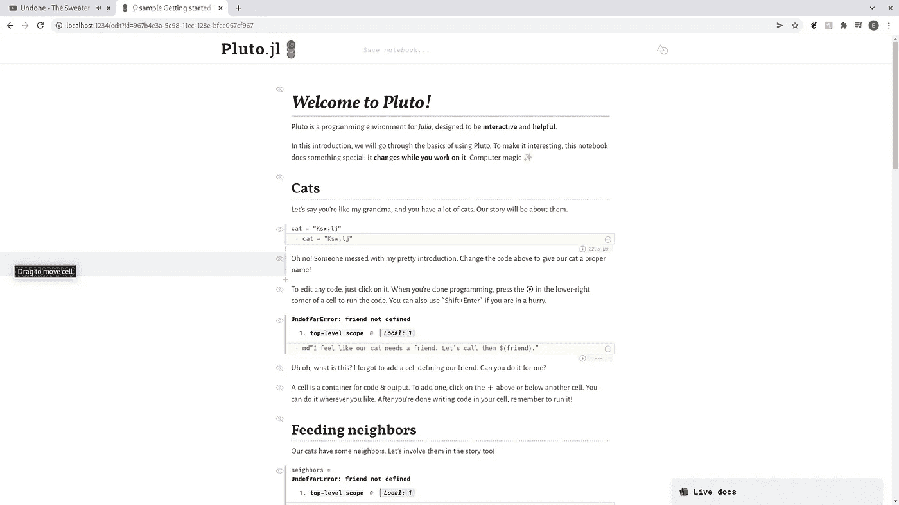
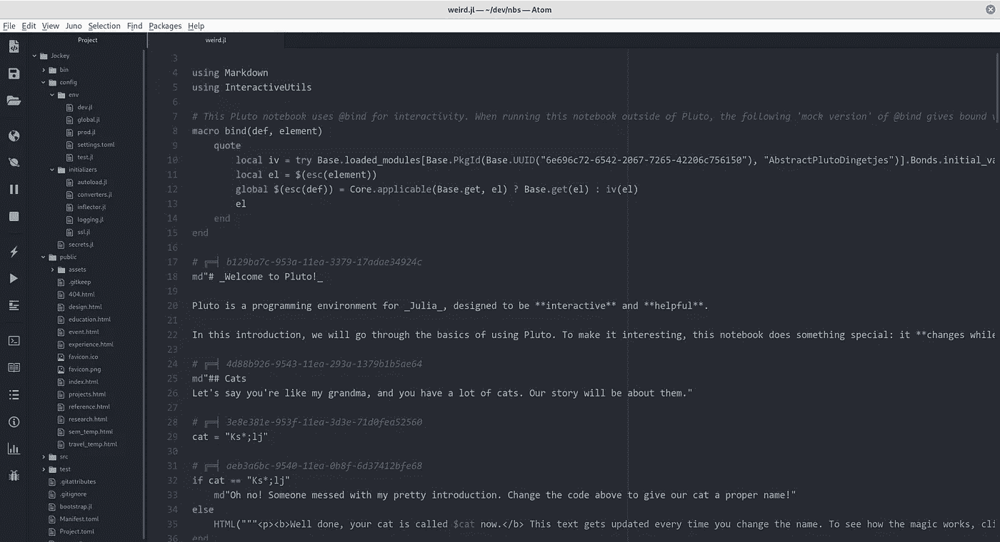

# 为我的定制笔记本服务器构建单元数据格式

> 原文：<https://towardsdatascience.com/building-a-cell-data-format-for-my-custom-notebook-server-aaa963c858?source=collection_archive---------47----------------------->

## Jockey.jl

## 在 Jockey.jl 中为我的单元格构建新的数据格式


(图片由[像素栏](http://pixabay.com)上的[像素向量](https://pixabay.com/vectors/grid-chart-cells-columns-rows-27206/)生成)

# 介绍

我最近参与的一个相当酷的项目，让我非常兴奋的是新的 Jockey 笔记本编辑器。该编辑器可用于处理整个技术堆栈范围内的笔记本电脑，并计划提供各种功能，远远超出标准单元环境。有几个组件需要为后端构建，今天我将为我们的单元编辑器制作后端。这也将与我之前编程的骑师会议和配置设置相关联，因此如果您想阅读我编程所有这些内容的文章，您可以在此处进行:

[](/building-a-server-settings-configuration-for-my-notebook-server-b0a7258e50f3) [## 为我的笔记本电脑服务器构建服务器设置配置

### 使用 Jockey.jl 创建服务器配置

towardsdatascience.com](/building-a-server-settings-configuration-for-my-notebook-server-b0a7258e50f3) 

另外，这里有一个 Github 上 Jockey 的链接。Github 可能会让您对这个项目的构建方向、包组成和目标有更好的了解。

[](https://github.com/ChifiSource/Jockey.jl) [## GitHub-chifi source/Jockey . JL:Jockey IDE/笔记本服务器

### 骑师 IDE/笔记本服务器。在 GitHub 上创建一个帐户，为 ChifiSource/Jockey.jl 的开发做出贡献。

github.com](https://github.com/ChifiSource/Jockey.jl) 

今天，我们正在为后端会话制作一个关键组件，它将成为一种基础数据格式，我们将把它加载到文件中，并在将来使用它。还会有一篇后续文章介绍我如何为这些数据创建保存/加载算法。

# 参考点

为了确保这种格式正是我想要的，我将参考 Pluto.jl 文件。这是因为我认为将它作为第一种读/写文件格式是最有意义的。将来，我可能会编写一个算法，通过。IPYNB 文件，但现在是常规的。Pluto 笔记本自带的 jl Julia 格式可能是最佳选择。记住这一点，在下一篇文章中，我将创建一个阅读器来将这些类型的文件解析到我的新结构中。本文将只讨论如何创建结构。

所以让我们快速创建一个新环境，放一个冥王星笔记本进去。

```
([@v1](http://twitter.com/v1).6) pkg> activate PLTO
  Activating new environment at `~/dev/nbs/PLTO/Project.toml`(PLTO) pkg> add Pluto
    Updating registry at `~/.julia/registries/General`
```

我将我的环境命名为 PLTO，我们真正需要添加的是 Pluto.jl。我们的目标只是获得一个. jl 文件，其中包含一些可以读取的特性。我对 Pluto 如何处理保存 Julia 文件有一些痛苦的怀疑，让我们看看它可能是下面的哪一个(或者可能是别的什么东西)。

*   文档字符串？
*   评论？
*   真正的朱利安类型？

让我们开始一个快速的笔记本会话，看看！

```
julia> using Plutojulia>julia> Pluto.run()
```

当我写这篇文章并启动这台笔记本服务器时，有一件事我肯定会注意到——服务器慢得令人难以置信。这不是执行，这只是在不同的端点之间导航，尝试得到一个示例笔记本，我注意到页面加载需要多长时间。对我来说，我讨厌等待加载东西——这就是为什么我编写加载时间更短的东西，我可以肯定地告诉你，jl 会比这更快。我跑题了，因为谢天谢地，我现在把它做成笔记本了！



(图片由作者提供)

另一个注意是，我认为管理文件的 Pluto.jl 很奇怪。很奇怪，我不喜欢。最终，我觉得在某些方面，很多焦点从来没有传递到这样的事情上，我想要一个 GUI 或终端中的目录浏览器，而不是一个放 URI 的文本框。现在应该注意的是，这个方法没有障碍，默认情况下目录实际上是 Julia 的目录(服务器的目录)，我仍然认为可以有一个更好的方法，比如 IJulia/Jupyter 如何处理它——这只是一个例子。

现在，我可以关闭这个会话及其合作服务器，我们可以继续了解这样做的全部目的，也就是更好地了解 Pluto 文件以及代码和 markdown。



(图片由作者提供)

> 哦，我的天啊—

看来正确的答案是答案 3:这些细胞使用朱莉娅类型的一切。我认为这可能会面临一些问题。首先也是最重要的一点，很明显，UUID 在评论中被用于某种阅读算法。解析器使用注释来跟踪 UUID，以及那些单元格内的内容。对于我的实际格式，我想改变这种方法的很多东西。另一件我觉得奇怪的事情是，输出细胞也有 UUID 和各自的朱莉娅代码。

当然，我有能力简单地匹配这种格式，但我认为这最终弊大于利。我的计划更像是将数据保存到文本中，然后加载数据的典型路线——不需要 UUID，只需要代码。问题是我想让我的单元格以这种数据格式可读——尽管这不是我最喜欢的。或者，我也可以创建自己的程序来使用它，但是考虑到这两种类型的笔记本都使用。jl 扩展名，我们可能希望寻找某种标识符来区分这两个文件。

# 回到骑师

对这种格式做了一些研究后，我们准备对 Jockey.jl 包本身做一些工作。我要做的第一件事是为新文件中的单元添加一个新的代码文件，我将把这个文件称为“Cells.jl”。鉴于这个组件是 Jockey 会话的一部分，我们将把它包含在相应的目录中。之后，我将创建另一个名为“Formats.jl”的新文件

```
(PLTO) pkg> activate Jockey
  Activating environment at `~/dev/Jockey/Project.toml`shell> cd Jockey
/home/emmac/dev/Jockeyshell> cd src
/home/emmac/dev/Jockey/srcshell> ls
Jockey.jl  ServerControllershell> touch Formats.jlshell> touch ServerController/Cells.jl
```

目前，我们不打算使用 Formats.jl，这将在未来的文章和提交中迭代。在这段代码中，我们要做的是编写新的单元结构，这实际上会有点复杂。因为我们要保存并加载到 Pluto.jl 格式中，所以我们要跟踪 UUID 的。也就是说，在我们创建这个小的附加物之前，让我们添加依赖关系:

```
(Jockey) pkg> add UUIDs
   Resolving package versions...
    Updating `~/dev/Jockey/Project.toml`
  [cf7118a7] + UUIDs
  No Changes to `~/dev/Jockey/Manifest.toml`
```

在新的 Cells.jl 文件中，我要做的第一件事是为模块的这一部分定义类型层次的顶层。让我们继续这样做:

```
abstract type Cell end
```

现在我们将为这个类型添加两个子类型，分别是输入和输出单元格。

```
abstract type Cell end
mutable struct InputCellendmutable struct OutputCellend
```

我们可能需要在这些单元格中添加一些数据。我要添加第一个东西是 UUID。添加了这些基本 ID 后，我将把注意力转向输入单元格。我想给这个单元格添加一些不同的东西，最好一次只关注一个构造函数。

```
mutable struct InputCell
    ID::
end
```

我必须承认，我相信类型将是 UUID，但我们可能会测试它或在添加它之前在文档中查找它。我最终决定，至少对于这个迭代，我应该有以下内容:

```
abstract type AbstractCell end
mutable struct InputCell <: AbstractCell
    ID::UUID
    Text::String
    env::Dict
    hidden::bool
end
```

注意这只是针对输入，不是针对输出。输出非常简单，只包含一个 ID 和一些输出:

```
mutable struct OutputCell <: AbstractCell
    ID::UUID
    output::String
end
```

最终，无论选择什么，输出都是 HTML。我认为这是给定的，所以输出单元格在这个例子中并没有太大的关系。最后，我将创建顶层单元格。还需要注意的是，我将抽象类型 Cell 更改为抽象 Cell。然后将这些细胞装入更大的细胞类型中，这将非常方便地容纳它们。

```
using UUIDs, TOMLabstract type AbstractCell end
mutable struct InputCell <: AbstractCell
    ID::UUID
    Text::String
    env::Dict
endmutable struct OutputCell <: AbstractCell
    ID::UUID
    output::String
endmutable struct Cell <: AbstractCell
    input::Cell
    output::Cell
    hidden::bool
end
```

所以有一些功能需要添加到这个单元中… Jockey.jl 意味着有一些非常好的环境跟踪，我也将在这里添加一些这样的空实现。以下是我得出的这些类型的最终版本:

```
using UUIDs, TOMLabstract type AbstractCell end
mutable struct InputCell <: AbstractCell
    ID::UUID
    Text::String
    env::Dict
endmutable struct OutputCell <: AbstractCell
    ID::UUID
    output::String
endmutable struct Cell <: AbstractCell
    input::Cell
    output::Cell
    hidden::bool
    lang::Symbol
    env::UUID
end
```

# 结论

还有一件事我们必须要做，那就是将这一点纳入到一揽子计划的其余部分。一些简单的代码，但是这些新的类型将成为我们 Jockey.jl 会议如何处理代码的基础。我们需要修改的代码与我们上次使用的代码相同。我们正在寻找的文件被称为 Session.jl。这将是在这个类型之上的另一个类型，它将控制单元格。我们只是将单元格添加到那个会话对象中，作为一个字典，这样我们就可以按正确的顺序排列单元格。

```
include("Cells.jl")
mutable struct Identifier
  id::Int64
  auth::Int64
  username::Int64
  status::Int64
end
mutable struct JSession
  ID::Identifier
  KeyBindings::Dict
  Extensions::Dict
  username::String
  Cells::Dict
end
```

非常感谢您的阅读！我希望这个项目对我的文章来说是有趣的，也许这给了我一个坚实的视角来看这个东西是如何开发的，以及我在这样的开发过程中所看到的。我真的很感谢你的阅读，并希望在这个项目的下一部分看到你！