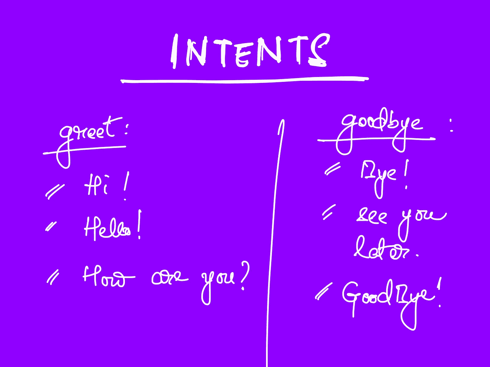

# 用 Rasa 构建聊天机器人

> 原文：<https://towardsdatascience.com/building-a-chatbot-with-rasa-3f03ecc5b324?source=collection_archive---------1----------------------->

## 入门指南


作者图片

聊天机器人是模拟人类对话的程序。这些机器人可以是简单的基于规则的聊天机器人，用户只能点击按钮或机器人提供的建议回复，也可以是成熟的机器人，可以处理上下文、聊天和其他复杂的事情，这些在人类对话中非常常见。

从数量上来说，对话式人工智能有 5 个层次，从简单的基于规则的系统到真正自适应的聊天机器人，它们可以处理复杂的场景，比如当用户甚至不确定他们想要什么时，可以根据他们想要的详细程度来回复用户。

```
**Table of Contents**

- Rasa
- Intents, Entities, Slots and Responses
- Setting up Rasa
- Creating training data
- Building our bot -- training and testing
```

# 罗砂

Rasa 是一个开源框架，用于构建基于文本和语音的聊天机器人。它在对话式人工智能的第 3 层工作，机器人可以理解上下文。第三级对话代理可以处理诸如用户改变主意、处理上下文甚至意外查询之类的事情。

如果你想建立一个聊天机器人，Rasa 不是唯一可用的工具，但它是最好的工具之一。还有其他几个，像 DialogFlow，虽然我们不会在这篇文章中讨论它们。

# 意图、实体、位置和响应

这些是任何聊天机器人对话的主要组成部分。我们将通过一个示例对话来更好地理解这些术语。假设我们正在构建一个收集用户联系信息的机器人。

## 意图

用户所暗示的被称为`intent`。例如，如果用户说出以下内容之一来开始聊天:

*   早上好！
*   嗨！
*   嘿！
*   你好。

用户本质上是在说问候。因此，我们可以将这些组合成一个称为`greet`的单一意图。现在，每当机器人收到类似于`greet`中其他短语的用户消息，机器人就会将其归类为属于`greet`意图。



意图示例—作者提供的图片

```
**user**: Hi. (bot classifies this message as "greet")
```

## 实体

实体是可以从用户消息中提取的数据片段。

继续我们的例子，在用户问候机器人之后，机器人询问他们的联系信息。大概是这样的:

```
**user**: Hi.    (bot classifies this message as "greet")
**bot**: Hello! Could you please provide your contact information?
```

然后，用户将输入他们的详细信息，如他们的姓名和电子邮件 id。

```
**user**: Sure. It's John Doe. My email is johndoe@email.com.
```

上面的消息包含两条信息——姓名和电子邮件。这些可以被提取为实体。你的机器人将根据你训练数据的质量提取它们。

假设您已经为姓名和电子邮件定义了两个实体。这是机器人将提取的内容。

```
**name**: John Doe
**email**: johndoe@email.com
```

这里的一个重要问题是:机器人如何知道要提取什么？用户可以潜在地输入信息的任意组合。所有这些都是有效的用户输入:

*   我叫约翰·多伊。电子邮件:johndoe@gmail.com
*   姓名:无名氏电子邮件:johndoe@gmail.com
*   是啊，当然。我是无名氏。我的电子邮件是 johndoe@gmail.com。
*   约翰·多伊，johndoe@gmail.com

人类可以很容易地提取姓名和电子邮件 id。但是聊天机器人是怎么做到的呢？

这个问题的答案在于我们的训练数据有多好，我们稍后会谈到这一点。

## 时间

插槽是机器人的记忆。任何需要在整个对话中保持的信息，比如用户的名字或者他们的目的地(如果你正在构建一个机票预订机器人),都应该存储为 slots。

由于我们已经有了两个实体(姓名和电子邮件)，我们可以创建具有相同名称的槽，因此当提取姓名或电子邮件 id 时，它们会自动存储在各自的槽中。这是因为默认情况下有两个属性是`True`。

*   `auto_fill`
*   `store_entities_as_slots`

我们将如何设置这些位置，我们将在稍后讨论。

## 反应

响应是机器人对用户说的话。自然，对于一个机器人来说，要给出一个适当的响应，它必须弄清楚用户想要说什么。

在我们的例子中，当用户向机器人打招呼时，它理解消息本身，并通过问好和询问他们的联系方式做出适当的响应。

继续我们的示例对话，在机器人提供他们的信息后，假设我们对机器人进行编程，让它在用户提供他们的详细信息后说“谢谢”。

```
**user:** Hi.    (bot classifies this message as "greet")
**bot**: Hello! Could you please provide your contact information?
**user**: Sure. It's John. My email is john@email.com.
**bot**: Thanks John for the info!
```

# 一些先决条件

1.  使用`pip install rasa==2.6.2`安装 Rasa 开源

> 你可以安装最新的版本，但是这篇文章是基于 v2.6.2 的，所以任何 v2.x 都应该可以很好地适应这里介绍的内容。

2.运行`rasa init`来设置演示项目。

# 创建培训数据

回到我们的问题，如何创建能够以多种形式提取有用信息的机器人。

这对我们来说很容易，因为我们得到了自然语言的语义，但聊天机器人做不到这一点。机器人不知道“电子邮件”是什么。它也不知道约翰可能是一个名字，电子邮件包含“@”符号。

我们的目标是提供各种数据，以便机器人能够理解单词之间的一些关联，比如单词“email”后面的内容可能是电子邮件 id，或者形式为`<some_text>@<some_text>.com`的单词可能是电子邮件。

当然，不可能涵盖所有场景，但我们可以教会聊天机器人最常见的场景，确保我们添加了通用的单词和短语，这些单词和短语可能代表了机器人可能看到的很大一部分信息。

正如你可能猜到的，这更多的是一个迭代过程，我们评估我们的机器人在现实世界中的性能，并使用它来提高其性能。

## 密码

我们会一个文件一个文件的来，这样更容易理解。出于本文的目的，我们将讨论三个文件:

*   `nlu.yml`
*   `domain.yml`
*   `stories.yml`

## NLU 培训数据

为了`supply_contact_info`的意图，我们来处理下面的案例。

*   我叫约翰·多伊。电子邮件:johndoe@gmail.com
*   姓名:无名氏电子邮件:johndoe@gmail.com
*   是啊，当然。我是无名氏。我的电子邮件是 johndoe@gmail.com。
*   约翰·多伊，johndoe@gmail.com
*   当然可以。是无名氏。我的电子邮件是 johndoe@email.com。

**这个训练数据被称为 NLU 数据**，它包含了我们期望从用户那里得到的短语和对话(`intents`)。请注意，这不包括机器人的响应或我们的对话流程。这将存在于我们项目的一个单独的部分。

YAML 文件用于此目的。

## 添加意图— nlu.yml

接下来，我们将为这个意图命名。姑且称之为`supply_contact_info`。

用这个替换`nlu.yml`的内容。改变名称和电子邮件 id 本身是一个好主意，这样机器人可以更好地概括。

```
version: "2.0"
nlu:- intent: supply_contact_info
  examples: |
    - My name is John. email's john@gmail.com
    - name: David email: david@email.com
    - Yeah sure. I’m Barbara. My email is barbara@email.com.
    - Susan, susan@email.com
    - Sure. It's Fred. My email is fred@email.com.
```

`version`键是指 rasa 支持的训练数据格式。所有`2.x`版本的 Rasa 都支持`2.0`。

## 标记实体 nlu.yml

上面的 NLU 数据会让机器人知道用户可以说什么。但是我们仍然没有标记任何`entities`，这是一个快速提醒，是机器人应该收集的关键信息。

首先，让我们定义一些实体。让我们创造性地将表示客户名称的实体称为`name`。类似地，对于电子邮件，我们将使用一个名为`email`的实体。

标记实体的语法是`[entity_value](entity_name)`。所以对于这条线:

```
My name is John. email's john@email.com
```

我们把它写成:

```
My name is [John](name). email's [john@email.com](email)
```


标记实体-按作者分类的图像

这样，我们最终得到了用于`supply_contact_info`目的的最终 NLU 数据。

```
version: "2.0"
nlu:- intent: supply_contact_info
  examples: |
    - My name is [John](name). email's [john@email.com](email)
    - name: [David](name) email: [david@email.com](email)
    - Yeah sure. I'm [Barbara](name). My email is [barbara@email.com](email)
    - [Susan](name), [susan@email.com](email)
    - Sure. It's [Fred](name). My email is [fred@email.com](email).
```

我们还有另一个意图，叫做`greet`意图，当用户开始对话并说“嗨”或“你好”之类的话时。**最后，** `**nlu.yml**` **应该是这个样子。**

```
nlu:- intent: greet
  examples: |
    - hi
    - hello- intent: supply_contact_info
  examples: |
    - My name is [John](name). email's [john@email.com](email)
    - name: [David](name) email: [david@email.com](email)
    - Yeah sure. I'm [Barbara](name). My email is [barbara@email.com](email)
    - [Susan](name), [susan@email.com](email)
    - Sure. It's [Fred](name). My email is [fred@email.com](email).
```

## 添加插槽— domain.yml

现在我们有了意图和实体，我们可以添加我们的插槽。

头到文件`domain.yml`。用这个替换`slots`键的内容。

```
slots:
  name:
    type: text
  email:
    type: text
```

因为姓名和电子邮件都是字符串，所以我们将类型设置为`text`。

## 添加响应 domain.yml

就像我们想要抽象出用户想说什么一样，我们也有反应来代表机器人会说什么。

简单的响应是基于文本的，尽管 Rasa 允许您添加更复杂的功能，如按钮、备选响应、特定于频道的响应，甚至自定义操作，我们将在后面介绍。

在我们的例子中，在用户问候机器人(`intent: greet`)之后，机器人向用户询问他们的联系信息。这可以表示为机器人响应或发声。按照惯例，我们在每个机器人发声前添加一个“绝对”前缀——就像这样:

```
utter_ask_for_contact_info
```

用我们的响应替换`domain.yml`中`responses`键的内容。

```
responses:utter_ask_for_contact_info:
- text: Hello! Could you please provide your contact information?
```

类似地，我们可以在用户提供他们的信息后添加响应。姑且称之为:`utter_acknowledge_provided_info`(粗体，如下)。

```
responses:utter_ask_for_contact_info:
- text: Hello! Could you please provide your contact information?**utter_acknowledge_provided_info****:
- text: Thanks for provided your info!**
```

我们可以通过在确认信息中提到用户的名字来让用户体验稍微好一点，比如“谢谢 John 提供的信息！”

为此，我们将修改上面的`utter_acknowledge_provided_info`，为`name`插槽添加一个占位符，如下所示:

```
utter_acknowledge_provided_info:
- text: Thanks {name} for provided your info!
```


对话示例—作者提供的图片

# 故事

故事让我们的机器人知道对话应该如何进行。回到我们的例子，机器人向用户询问他们的联系方式，对话是这样的:

```
**user:** Hi.    (bot classifies this message as "greet")
**bot**: Hello! Could you please provide your contact information?
**user**: Sure. It's John. My email is john@email.com.
**bot**: Thanks John for the info!
```

这可以分解为如下的意图和回应:

```
intent: greet
action: utter_ask_for_contact_info
intent: supply_contact_info
action: utter_acknowledge_provided_info
```

## 添加故事— `stories.yml`

让我们把这个变成 rasa 能理解的语法。用这里将要讨论的内容替换文件`stories.yml`的内容。让我们称这个故事为“用户提供客户信息”。

> 故事名称不会影响机器人的工作方式。

```
version: "2.0"stories:
- story: user supplies customer info
  steps:
  - intent: greet
  - action: utter_ask_for_contact_info
  - intent: supply_contact_info
  - action: utter_acknowledge_provided_info
```

但是还有一件事。

我们还必须指出用户意图可能提供的实体，这样机器人就更容易知道如何响应。

在意图下，只需列出可能出现在该意图中的实体。

```
version: "2.0"stories:
- story: user supplies customer info
  steps:
  - intent: greet
  - action: utter_ask_for_contact_info
 **- intent: supply_contact_info
    entities:
    - name
    - email** - action: utter_acknowledge_provided_info
```

# 建造我们的机器人

现在我们已经准备好了数据和故事，我们必须遵循一些步骤来让我们的机器人运行起来。

## 代码设置

我们对演示机器人中的文件做了一些修改。让我们回顾一下。

`**nlu.yml**` **—保存我们模型的 NLU 训练数据**

在这个文件中，我们为我们的两个目的保留标记数据:

*   `supply_contact_info`
*   `greet`

`**stories.yml**` **—让机器人知道对话应该如何进行**

我们的单`story`就设在这里。

`**domain.yml**` **—所有意图、响应和实体的完整信息**

这个文件比其他两个文件稍微复杂一点。如果你看看演示机器人(post running `rasa init`)提供的`domain.yml`文件，你会注意到`intents`、`actions`、`responses`、`entities`等键。

我们已经在我们的`domain.yml`中添加了`slots`和`responses`。我们现在需要做的就是提到我们的`intents`和`entities`。最后，该文件将如下所示:

```
version: '2.0'intents:
- greet
- supply_contact_infoentities:
- name
- emailslots:
  name:
    type: text
  email:
    type: textresponses:
  utter_ask_for_contact_info:
  - text: Hello! Could you please provide your contact information?
  utter_acknowledge_provided_info:
  - text: Thanks {name}, for the info!
```

## 训练机器人

**验证数据**

在训练机器人之前，一个好的做法是检查故事和规则中的任何不一致，尽管在这么简单的项目中，这不太可能发生。

```
$ rasa data validate
```

截断的输出如下所示。没有发现冲突，所以我们可以很好地训练我们的模型。

```
The configuration for policies and pipeline was chosen automatically. It was written into the config file at 'config.yml'.
2021-09-12 18:36:07 INFO     rasa.validator  - Validating intents...
2021-09-12 18:36:07 INFO     rasa.validator  - Validating uniqueness of intents and stories...

  ...

2021-09-12 18:36:08 INFO     rasa.validator  - No story structure conflicts found.
```

> 注意:您可能会收到以下警告:
> 
> UserWarning: model_confidence 设置为“softmax”。建议尝试使用“model_confidence=linear_norm”来更容易地调整回退阈值。
> 
> **这只是一个建议，可以忽略。**

**培训**

为了训练机器人，我们只需使用`rasa train`命令。为了更好地组织，我们将为模型提供一个名称，但这不是必需的。

```
$ rasa train --fixed-model-name contact_bot
```

这个的输出要大得多，所以我不会在这里展示。

> 注意:您可能会收到以下警告:
> 
> 用户警告:在您的管道中找到基于规则的策略，但没有基于规则的培训数据。请将基于规则的案例添加到您的培训数据中，或者从您的 pipeline 中删除基于规则的策略(` RulePolicy `)。
> 
> 我们不会在这篇文章中讨论规则，但它们本质上就是它们听起来的样子。它们需要一个称为 RulePolicy 的东西，默认情况下，它会添加到您的 bot 管道中。暂时可以忽略。这将在以后的帖子中讨论。

## 和我们的机器人聊天

与我们的新机器人聊天很简单。打开一个新的终端窗口并启动一个 rasa shell。

```
$ rasa shell
```

这将让你在终端上与你的机器人聊天。但是如果你想清理 UI 和更多的信息，比如识别了什么意图，提取了什么实体，你可以使用 **Rasa X.**

关于 Rasa X 有一点很简单:它可以让你测试你的机器人，修复机器人的错误响应，更重要的是，你可以和其他人分享你的机器人，以更好地了解它在现实世界中的表现。

要使用它，请在本地模式下安装它。

```
$ pip3 install rasa-x --extra-index-url https://pypi.rasa.com/simple
```

然后，运行它。

```
$ rasa x
```

前往左边菜单中的“与你的机器人交谈”,开始与你的机器人交谈。

下面，你可以看到我们的机器人表现如何。


在 Rasa X 中与我们的机器人对话——图片由作者提供

## 注意

在上面的对话中，除了对话，你会注意到一些灰色的信息。在每条用户消息下面，您可以看到用户消息的意图和可信度，以及提取了哪些实体。

在每条 bot 消息的上方，您可以看到 bot 以什么样的信心决定采取什么样的行动，以及设置了什么样的槽。

`action_listen`是一个内置动作，意味着聊天机器人需要用户输入。

# 示例代码和资源

本文中使用的所有代码都可以在以下位置获得:

<https://github.com/Polaris000/BlogCode/tree/main/RasaChatbot>  

## 链接

*   [拉莎](https://rasa.com/)
*   [5 级对话人工智能](https://rasa.com/blog/5-levels-of-conversational-ai-2020-update/)

# 最后

Rasa 是对话式人工智能的一个伟大工具。它的灵活性和定制深度使它成为一个很好的工具选择。在这篇文章中，我们制作的机器人非常简单。

有很多东西我无法在一篇文章中描述，比如动作、表单、规则、正则表达式、同义词、交互式学习、配置文件、管道等等。但是这篇文章中的内容应该足以让你开始。

我们将在以后的文章中介绍其余的内容。我会在这里添加所有未来帖子的链接。希望有帮助！

## 该系列的下一部分

> 第二部分:[槽和实体一样吗？](/are-slots-and-entities-the-same-f98a38ac328d)
> 
> 第三部分:[处理聊天机器人故障](/handling-chatbot-failure-gracefully-466f0fb1dcc5)
> 
> 第四部分:[聊天机器人如何理解？](/how-do-chatbots-understand-87227f9f96a7)

## 更新

> 20.3.2022

向该系列的其余部分添加链接