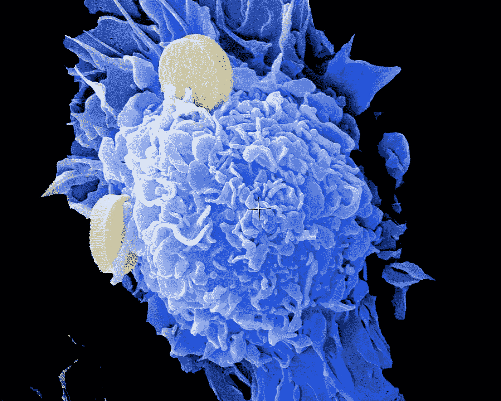

# 构建一个从经验中学习的国际象棋人工智能

> 原文：<https://towardsdatascience.com/building-a-chess-ai-that-learns-from-experience-5cff953b6784?source=collection_archive---------15----------------------->

## 不需要数据！

拉胡尔·帕博卢在 [Unsplash](https://unsplash.com/s/photos/chess?utm_source=unsplash&utm_medium=referral&utm_content=creditCopyText) 上拍摄的照片

在像国际象棋这样的规则定义的环境中应用机器学习技术已经成为掌握像国际象棋或围棋这样的策略游戏的稳定手段。这些技术通常涉及使用某种数据来训练模型，以做出最佳举措。

作为一个挑战，我想尝试创建一个完全不需要任何数据的引擎。尽管这会减慢模型的训练过程，但它会解决基于数据的模型所面临的一个关键问题。

模型的好坏取决于它的数据。在这种情况下，根据数据训练的象棋模型只能和数据源一样好。通过从方程中移除数据，算法的理论上限将被移除，这将给予模型(理论上)无限的潜力。

# 概念:

我打算怎么做？这可以通过结合我以前用过的两种技术来实现。该模型将由两部分组成:一个支配性的遗传算法和一个用于遗传算法中每个主体的蒙特卡罗搜索树。

## 遗传算法:

照片由[国立癌症研究所](https://unsplash.com/@nci?utm_source=unsplash&utm_medium=referral&utm_content=creditCopyText)在 [Unsplash](https://unsplash.com/s/photos/genetic?utm_source=unsplash&utm_medium=referral&utm_content=creditCopyText) 上拍摄

遗传算法将由一定数量的代理组成。代理人将相互竞争，获胜者将获得一定数量的分数。

前 20%的玩家将被保留，而其余玩家的数据将被删除。前 20%的玩家之间的权重会发生交叉，从而产生一组新的玩家。这应该有希望产生越来越好的球员。

将遗传算法用于该项目的原因有两个:遗传算法可以在没有数据的情况下进行优化，并且还具有非常灵活的适应度函数。该适应度函数可以被改变以微调模型的结果，并且它还可以涉及抽象的非数值运算。

## 蒙特卡罗搜索树:

在 [Unsplash](https://unsplash.com/s/photos/tree?utm_source=unsplash&utm_medium=referral&utm_content=creditCopyText) 上由[理查德·装载机](https://unsplash.com/@fhfpix?utm_source=unsplash&utm_medium=referral&utm_content=creditCopyText)拍摄的照片

蒙特卡洛搜索树用于进行每一步棋:引擎从给定的位置随机进行一系列的移动。最终位置然后由神经网络评估，其返回单个值。这个过程重复一定次数。汇总每次迭代的所有评估将导致位置分析。从初始位置开始的每一次合法移动都要重复这个过程。

然后将进行具有最高评估分数的移动。理论上，随着评估模型的改进，这些举措将是最优的。

当使用蒙特卡罗树时，需要在灵活性和速度之间进行权衡。理论上，可以使用单个深度神经网络直接评估电路板。然而，这个模型将更加难以优化，因为它需要自己“学习”许多概念，这对于遗传算法来说尤其缓慢。

蒙特卡洛搜索树是一种具有内置深度概念的神经网络，允许训练更快。

# 实施:

我提供的代码只是片段，肯定会出错。该项目的完整代码可以在我的 Github 上的[链接](https://github.com/victorsimrbt/chess_mc_ga/tree/master)中找到。

## 1.健身功能:

这是用于评估每个代理的适应度的适应度函数。

最初，我想让每个代理扮演每个其他代理，但发现这将花费太长时间。一些快速的计算让我得出结论，用那个设置，我需要 400 多个小时才能得到像样的结果。

原始算法的一个关键变化是在评估函数中。Model(input)比 model.predict(input)快 106 倍，每代节省 9 个多小时。

通过让每个代理只玩一个其他代理，它将减少每一代(p+1)/2 倍(p 是玩家的数量)所用的时间。

为了简单起见，我只是将代理的当前适应度乘以某个值来改变他们的适应度。如果我决定做一个 Elo 系统，这将会很有趣，并且可能会产生更好的结果。然而，我决定反对它，因为实现它会降低算法的速度。

## 2.评估网络

评估网络是每个代理背后的大脑。左边的代码展示了两种模型架构:

complex_eval 定义了一个复数卷积模型，常用于 Pix2Pix GAN 的编码部分。然而，这种复杂性使其难以部署，因为进行预测需要太多时间。

simple_eval 是一个基本的概念验证模型，它需要大约 0.004 秒来进行预测。低数量的权重也将导致更快的收敛。

模型的输入形状是(8，8，12)，因为棋盘是 8 乘 8，并且有 12 个可能的棋子(每边 6 个)

## 3.遗传算法

遗传算法的大脑是适应度函数，心脏是交叉和变异函数。

交叉函数很容易理解，但实现起来有点困难。

从人口的前 20%中随机选择两个父母代理。这两个父代理的基因被合并以形成子代理。以下是对的逐步解释

1.  它们的权重是扁平的，因此值可以改变。
2.  找到一个随机的交点。这个点是父母一方的遗传信息结束的地方，也是父母一方的遗传信息开始的地方。
3.  父母的基因结合在一起，然后一个新的子代理拥有这个操作产生的权重。

这有望让好父母的优良品质传递给他们的后代。

变异过程非常相似:随机代理的权重变平，其中一个权重变为随机值。实施遗传算法的突变，以便最终形成不是在第一种群中随机产生的有利性状。

# 结论:

这个项目非常有趣:没有算法理论限制的成本是由成功训练算法所花费的时间来支付的。

我的想法的实现并不完美，只是我未来工作的一个框架。

以下是可以改善/改变它的一些事情:

## 1.更改健身功能:

即使蒙特卡罗搜索树是最快的移动，最现实的搜索算法是找到哪一步移动结束时对手的平均评价最低。

## 2.改变评估模式:

尽管这看起来很容易，但它必须足够快，以允许执行时间存在于可能性的范围内

## 3.使用并行:

对于足够强大的 CPU，并行性(同时运行脚本)可以大大加快处理速度。如果这个问题得到解决，项目的限制将被移除，从而允许更好的结果。

# 我的链接:

如果你想看更多我的内容，点击这个 [**链接**](https://linktr.ee/victorsi) 。