# 构建象棋引擎:第 2 部分

> 原文：<https://towardsdatascience.com/building-a-chess-engine-part2-db4784e843d5?source=collection_archive---------17----------------------->

## 结合 AlphaGo 和变形金刚学习象棋

大家好，这将是我构建象棋引擎系列教程的第二部分。这一课将着重于建立一个我们可以玩的人工智能代理。这一课比第一部分更专业，所以请耐心听我说。我试图提供方程式和图表来帮助使事情变得简单一点。

既然我们已经完成了构建我们的国际象棋游戏，我们可以开始设计一个玩它的人工智能了。国际象棋人工智能已经成功很多年了，从[深蓝](https://en.wikipedia.org/wiki/Deep_Blue_%28chess_computer%29)到 [stockfish](https://en.wikipedia.org/wiki/Stockfish_%28chess%29) 。然而，有一个新的程序已经成为使用深度学习的最先进的技术。 [AlphaZero](https://deepmind.com/blog/article/alphazero-shedding-new-light-grand-games-chess-shogi-and-go) 是一个由 [DeepMind](https://deepmind.com/) 开发的强化学习代理，它已经在众多游戏(象棋、松木、围棋)中取得了超人级别的结果。

由于这一成功，我们将建立在 AlphaZero 的基础上，并使用其强大的思想来指导具有深度学习模型的[蒙特卡罗树搜索](https://en.wikipedia.org/wiki/Monte_Carlo_tree_search) (MCTS)算法。我们将使用一个转换器，而不是像他们论文中使用的那样使用[卷积神经网络](https://en.wikipedia.org/wiki/Convolutional_neural_network) (CNN)。变形金刚最近在自然语言处理(NLP)和计算机视觉(CV)等许多领域取得了巨大成功。因此，我们可以尝试在这里使用一个。

## 蒙特卡洛树搜索(MCTS)

在所有的游戏中，都有一系列的动作。在博弈论中，在博弈树中表示这些动作是很常见的。

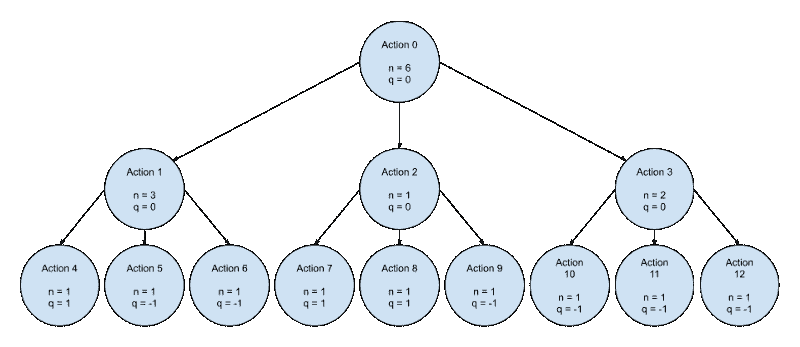

游戏树示例|作者图片

在简单的游戏中，游戏树很小，可以被暴力搜索。对于小博弈树，我们可以使用贪婪算法，比如" [MiniMax](https://en.wikipedia.org/wiki/Minimax) "搜索算法。大多数游戏都不简单，尽管这导致暴力方法在现代计算极限下被认为是不可行的。正因为如此，像 MCTS 这样的其他搜索算法被证明是更有益的。

MCTS 首先检查当前状态是否是叶节点(游戏结束)。如果当前状态是叶节点，搜索算法返回游戏结果。

游戏结果|作者图片

*   sw =白色胜利(0 或 1)
*   st =平局(0 或 1)
*   sb =黑色胜利(0 或 1)

如果动作不是叶节点，并且这是第一次看到它，则使用神经网络(NN)来确定当前状态的值(v)和所有可能动作的概率(p)。当前状态节点奖励值是新预测的值。使用预测的概率分布来更新所有可能的有效动作的概率。我们返回要更新的先前节点的值(v)和概率(p)。

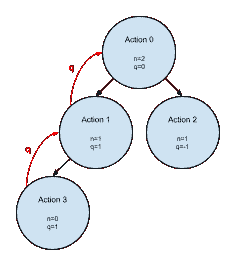

节点反向传播示例|作者图片

如果我们以前见过当前状态，我们递归地搜索具有最高 UCB 的动作。

UCB 是一个试图平衡开发和探索的强大公式。等式的前半部分利用了人工智能的游戏知识。后半部分通过将超参数(c)乘以概率(p)来增强探索。

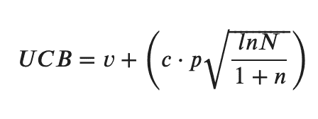

置信上限(UCB) |作者图片

*   v =结束游戏值
*   c =探索超参数[0–1]
*   p =行动概率
*   N =父节点访问
*   n =行动节点访问

当搜索游戏树时，如果当前深度等于最大允许深度，则返回当前深度处的值(v)和概率(p ),以更新之前的节点。

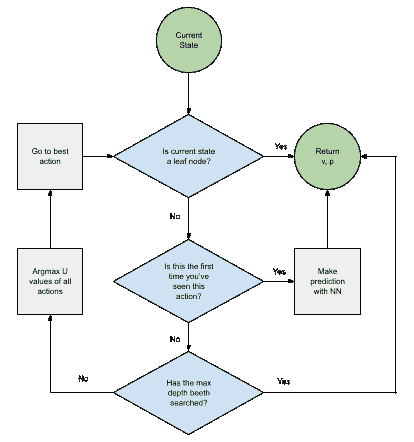

MCTS 流程图|作者图片

## 模型架构

了解了 MCTS 之后，让我们来谈谈我们的模型。我们的模型将获得游戏状态作为输入，并返回预期的游戏结果以及动作概率分布。

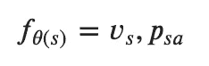

模型公式|作者图片

*   vs =基于当前状态的游戏结果的概率分布
*   psa =当前状态下所有行为的概率分布

我们模型的主要组件是变压器。变压器最近被谈论了很多，并越来越多地出现在最先进的系统中。通过使用注意力机制(多头比例点积注意力)，变形金刚非常有效。

注意力是一个强大的等式，允许模型学习哪些事情是重要的，值得更多的关注。它通过获取一个查询和一个关键字的比例点积来确定两者的相似性。点积通过找出输入之间的角度来确定相似性。然后 Softmax 在 0-1 之间缩放结果。对结果和值进行点积，以确定两者的相似性。第二个点积有另一个有用的特性，有助于输出保持其初始形状。

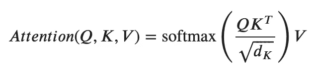

缩放的点积注意力|作者图片

*   Q = Q(E) =查询(向量/矩阵)
*   K = K(E) = key(向量/矩阵)
*   V = V(E) =值(向量/矩阵)
*   E =嵌入

多头注意力将输入分成多个头，并行处理不同的组块。人们认为多头注意力通过创建不同的子空间来获得其优势。然后将每个头的结果连接在一起，并传递到一个线性层，该层将输入映射回其原始维度。

多头缩放点积关注|图片来自[https://arxiv.org/abs/1706.03762](https://arxiv.org/abs/1706.03762)

普通变压器具有简单的编码器和解码器架构。

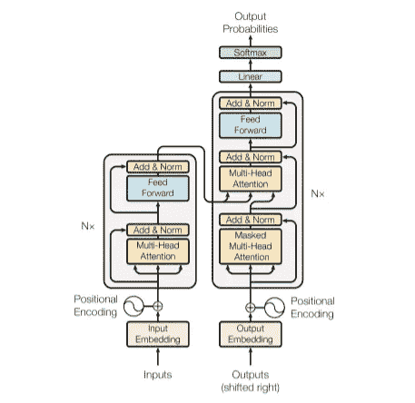

变压器架构(编码器-解码器)|图片来自 https://arxiv.org/abs/1706.03762

然而，我们不打算使用这种架构，而是打算使用一个仅支持解码器的转换器。一个只有解码器的变压器看起来就像“[注意是你需要的全部](https://arxiv.org/abs/1706.03762)”论文中的变压器架构图中的编码器。当您比较上面的编码器模块和解码器模块时，您会发现只有一个区别，即编码器中缺少编码器-解码器关注层。在一个只有解码器的转换器中不需要这个编码器-解码器关注层，因为没有编码器，这意味着我们可以利用编码器块来创建一个只有解码器的模型。

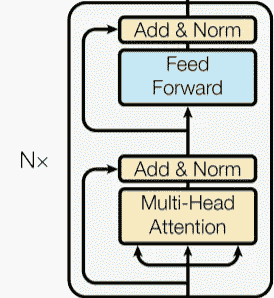

纯解码器变压器架构|图片来自[https://arxiv.org/abs/1706.03762](https://arxiv.org/abs/1706.03762)

在变压器模块之后，我们模型的其余部分相当简单。我们添加一个线性层来映射我们的转换器层的输出到我们需要的维度(1D)。

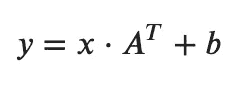

线性图层|作者提供的图像

*   x =输入(向量/矩阵)
*   A =层权重(矢量/矩阵)
*   b =层偏差(矢量/矩阵)

该模型然后分叉成两个平行的线性层(v，p)。这些线性图层用于将每个输出映射到所需的大小。其中一层将是游戏结果的大小(v)，而另一层是动作状态的大小(p)。在线性层之后，softmax 独立应用于两个输出，以将其结果转换为概率分布。

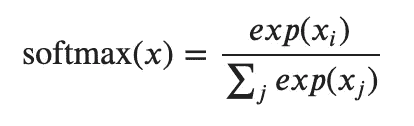

Softmax |作者图片

*   x =输入(向量/矩阵)

## 输入编码

既然我们知道了我们正在使用的模型架构，我们可能应该讨论一下输入数据。该模型将接收游戏的状态作为输入，但不能直接处理它。对于要处理的游戏状态，需要对其进行编码。为此，我们将通过标记化的方法使用嵌入。这些嵌入是代表每一部分的唯一向量。嵌入允许我们的模型获得每个游戏片段之间的相关性的强表示。

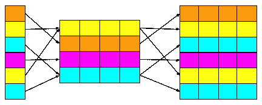

符号化嵌入|作者图像

转换器模型并行处理输入序列，导致它们丢弃位置信息。幸运的是，我们可以在输入中添加一个[位置编码](https://kazemnejad.com/blog/transformer_architecture_positional_encoding/)来帮助恢复这些附加信息。位置编码允许模型根据其在输入序列中的位置从每个嵌入中提取额外的信息。这些额外的信息代表了每个棋子和它在游戏棋盘上的位置之间的关系。

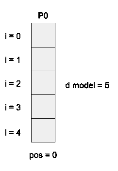

嵌入示例|作者图片

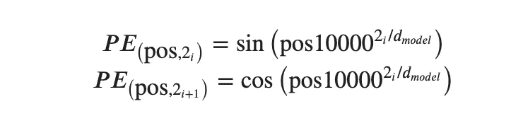

位置编码公式|作者图片

## 输出编码

有了对输入的这种理解，我们来谈谈输出。该模型将有两个输出值。一个代表可能结果的概率分布(奖励)，另一个代表行动的概率分布(政策)。

在我们的国际象棋游戏中，可能的结果是白棋赢，平手和黑棋赢。由于这些结果是在名义规模上，我们知道这是一个分类问题。[独热](https://en.wikipedia.org/wiki/One-hot)编码在分类问题中很流行，因为每一位可以代表不同的结果。为了确定游戏最可能结果的指数，我们可以取输出的 argmax。由此，我们现在知道了游戏最有可能的结果和预测的可信度。

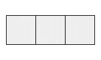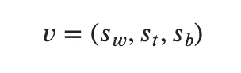

预测的游戏结果|作者图片

*   sw =白色胜利(0 或 1)
*   st =平局(0 或 1)
*   sb =黑色胜利(0 或 1)

在国际象棋中，棋子不断移动。这种移动使得我们很难将有效的动作映射回当前状态。为了缓解这个问题，我们将把动作想象成哪个方块移动到哪个方块。这里我们有效地简化了解码过程，因为棋盘上的方块在整个游戏中保持不变。我们可以用一个扁平的 64x64 矩阵来表示。展平矩阵是必要的，因为这又是一个分类问题，因为我们的行动是名义上的。正因为如此，我们将希望使用一键编码来表示我们的动作空间。为了确定最可能采取的动作的索引，我们过滤掉无效的动作，并取输出的 argmax。由此，我们现在知道了最有可能的有效动作和该预测的置信度。

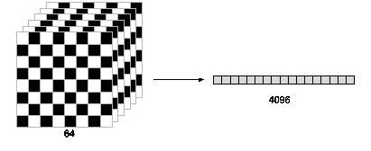

游戏动作编码|作者图片

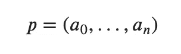

动作概率分布|作者图片

*   a=行动概率(0–1)

## 培训模式

与 AlphaZero 类似，我们的模型完全通过自我游戏来学习。在我们的版本中，我们通过让两个模型(活动的，新的)在循环赛系列中相互竞争，为自我游戏添加了一个进化的方面。在我们的循环赛系列赛中，新型号在每场比赛后都要训练。如果新模型是循环赛的获胜者，它将成为活动模型。这样，我们可以将自我游戏导致的潜在收益递减最小化。

该模型根据每场比赛的结果进行训练，以使预测的比赛结果和预测的行动(奖励和政策网络)的损失最小化。为此，该模型使用两个输出的二元交叉熵(BCE)。BCE 是损失函数，因为它能很好地处理多变量分类问题。

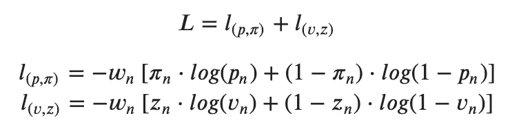

损失函数公式|作者图片

*   p =行动概率分布
*   pi =所采取行动的一次性编码
*   v =游戏结果概率分布
*   z =游戏结果的一次性编码

## 谢谢

就这样，我们成功地创造了一个国际象棋人工智能。这个 AI 会在没有任何知识的情况下开始学习国际象棋的游戏。它玩的训练游戏越多，表现就越好。我希望您喜欢阅读本系列的第 2 部分。你可以在我的 GitHub 上查看完整版本的代码。你也可以看到这个系列的第一部分[在这里](https://medium.com/@bellerb/building-a-chess-engine-part1-9758da877be7)和我的新机器人结合穆泽罗和感知者 IO [在这里](https://medium.com/mlearning-ai/playing-chess-with-a-generalized-ai-b83d64ac71fe)。

感谢阅读。如果你喜欢这样，可以考虑订阅我的账户，以便在我最近发帖时得到通知。

## 参考

*   [https://en . Wikipedia . org/wiki/Deep _ Blue _(chess _ computer)](https://en.wikipedia.org/wiki/Deep_Blue_(chess_computer))
*   [https://en . Wikipedia . org/wiki/stock fish _(chess)](https://en.wikipedia.org/wiki/Stockfish_(chess))
*   [https://deep mind . com/blog/article/alpha zero-shedding-new-light-grand-games-chess-shogi-and-go](https://deepmind.com/blog/article/alphazero-shedding-new-light-grand-games-chess-shogi-and-go)
*   [https://deepmind.com/](https://deepmind.com/)
*   [https://en.wikipedia.org/wiki/Monte_Carlo_tree_search](https://en.wikipedia.org/wiki/Monte_Carlo_tree_search)
*   [https://en.wikipedia.org/wiki/Convolutional_neural_network](https://en.wikipedia.org/wiki/Convolutional_neural_network)
*   [https://en.wikipedia.org/wiki/Minimax](https://en.wikipedia.org/wiki/Minimax)
*   https://jalammar.github.io/illustrated-transformer/
*   [https://kazemnejad . com/blog/transformer _ architecture _ positional _ encoding/](https://kazemnejad.com/blog/transformer_architecture_positional_encoding/)
*   [https://en.wikipedia.org/wiki/One-hot](https://en.wikipedia.org/wiki/One-hot)
*   [https://arxiv.org/abs/1706.03762](https://arxiv.org/abs/1706.03762)