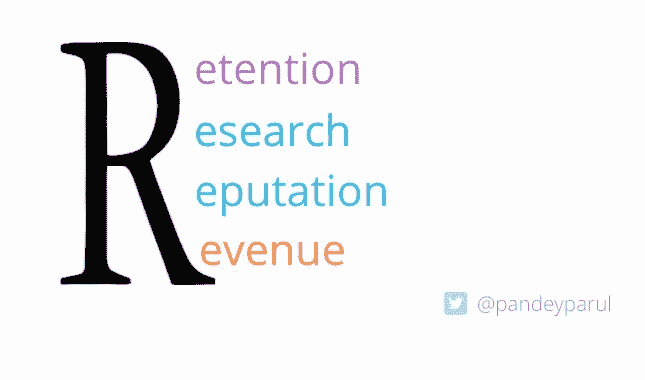

# 通过写作构建引人注目的数据科学产品组合

> 原文：<https://towardsdatascience.com/building-a-compelling-data-science-portfolio-with-writing-daceec1cd0fe?source=collection_archive---------18----------------------->

## 数据科学写作不仅可以在你的旅程中，也可以在你的职业生涯中产生变革性的影响。

照片由 [Aaron Burden](https://unsplash.com/@aaronburden?utm_source=medium&utm_medium=referral) 在 [Unsplash](https://unsplash.com?utm_source=medium&utm_medium=referral)

> 我参加了由[Weights&bias](https://wandb.ai/)组织的[快速阅读会议](https://twitter.com/pandeyparul/status/1409749276121440266)，讨论数据科学写作的好处。我写这篇文章是为了总结我在那里讨论的内容。这篇文章最初发表在他们的论坛上，但是我在这里分享了一个编辑过的版本。它主要讨论了为什么写作在数据科学中很重要，以及如何将其作为一种工具来利用您的投资组合。

学习任何概念的最佳方式，尤其是在数据科学中，是通过写下它。它有助于你详细理解这个主题，反过来，你的工作也可以帮助别人。但这说起来容易做起来难。即使许多人想写作，他们也需要几个月甚至几年的时间来克服最初的自我怀疑。雷切尔·托马斯的博客文章《为什么你(是的，你)应该写博客》非常恰当地触及了这个问题。事实上，它涵盖了你开始写作时应该记住的所有要点。我的职业生涯是从写作开始的，在这篇文章中，我将分享你如何运用你的写作技巧来创作一个引人注目的作品集。

# 写作为什么有用？

写作，尤其是在数据科学领域，是一项重要的技能。它给你声音和能见度。依我看，写作的好处可以总结如下:

写作的好处|作者图片

*   记忆:写作帮助你记住一个新概念。
*   研究:写作有助于培养研究思维。
*   声誉:写作有助于在社区中建立声誉。人们引用你的文章，在他们的谈话中提到你，等等。
*   收入:写作本身也可以是一种自给自足的职业。随着创作者经济的蓬勃发展，写作可以带来潜在的工作机会。

# 如何开始你的写作之旅

当你决定写一篇文章时，你就成功了一半。然而，第二部分是决定写什么，在哪里写，主题，长度等等。最好是自己创造自己的写作道路。从最舒服的概念开始；这会给你必要的信心开始。逐渐多样化你的写作组合。开始接触新事物，并尝试写下它们。写作是一个反复的过程。写得越多，学得越多，写得越好。

## 你可以写的东西

*   [如何使用数据科学库](/pandasgui-analyzing-pandas-dataframes-with-a-graphical-user-interface-36f5c1357b1d?sk=d7f8f67ed76d07fbe3265f6362b74572)
*   [研究论文摘要](https://www.linkedin.com/posts/parulpandeyindia_efficientnets-compoundscaling-efficientnetv2-activity-6800042593867571201-rBKT)
*   [课程点评](/reviewing-the-recently-released-huggingface-course-a6b4ace16167?sk=43cdf302bdb0b3c07d1c1bbe421e3955)
*   [采访社区里的人](/meet-the-data-scientist-who-just-cannot-stop-winning-on-kaggle-dfc0e6fe88f8?sk=bd58ca871ab26ab13917b338020c4a0c)
*   [阐明概念](/reducing-memory-usage-in-pandas-with-smaller-datatypes-b527635830af?sk=55b417ed722bc364a141a9862ee33893)
*   [总结技术视频/网络研讨会](/how-to-effectively-employ-an-ai-strategy-in-your-business-d43f41aa3b04)
*   [将您的 Kaggle 笔记本转换为](/geek-girls-rising-myth-or-reality-81e1897433c8)博客文章等

这些只是一小部分，但可以作为一个很好的起点。

# 展示你的作品

无论你是为一个人还是为一千个人写一篇文章，付出的努力是一样的。因此，一定要在其他平台上分享它们，比如 Linkedin、Twitter 和其他你所在的社区团体。请不要要求他们喜欢或分享本身。这是因为在分享你的作品和发送垃圾邮件之间只有一线之隔。如果人们喜欢它，觉得它有趣，相信我，他们会想自己分享它。

展示你作品的另一种方式是在聚会、演示和会议中使用它们。内容创建很有挑战性，但是一旦完成，就可以以多种方式重用。

# 创建公共投资组合

你可以在开放的博客平台上写作或者创建自己的网站。这完全取决于你。但是确保从一开始就建立一个好的投资组合。Github 页面、Kaggle 配置文件、堆栈溢出等。，可以支持你的简历。

# 为社区做贡献

社区是数据科学的支柱。加入当地的 Meetup 社区。在会议上发言——从地方到地区，甚至国家。你甚至可以指导这个领域的新手。在论坛回答和帮助别人。尝试为开源库的文档做贡献。

# 这些都很好，但是有人会读我的文章吗？

这是我遇到的最常见的问题。不仅在数据科学领域，而且在几乎所有领域，甚至在开始之前就自我怀疑是相当普遍的。人们的一些常见疑虑是:

> 已经有很多关于这个话题的文章了。我的文章会有什么不同？

假设你想写一个图书馆。你快速搜索了一下，发现还有十多篇关于这个话题的好文章。所以你会放弃这个想法吗？不，绝对不是。尝试通过使用有趣的数据集和关注库中鲜为人知的方面来对您的文章进行不同的处理。例如，我写了一篇关于[**Lux——一个 Python 库**](/intelligent-visual-data-discovery-with-lux-a-python-library-dc36a5742b2f) 的文章，在那里我展示了 Simpson 使用这个库的效果。库的创建者喜欢它，并把它作为文档的一部分。

来自 Lux 的 Github 知识库的片段| [来源](/intelligent-visual-data-discovery-with-lux-a-python-library-dc36a5742b2f)

这是另一个例子。我最近写了一篇文章[可解读还是准确？为什么不两者都要？](/interpretable-or-accurate-why-not-both-4d9c73512192)，在那里我解释了可解释的助推机器的概念——*模型被设计成具有与助推树相当的准确性，同时具有高度的可理解性和可解释性。* EBM 是微软的开源库。我收到了团队写这篇文章的个人信息。

作者图片

这些只是几个例子，突出了写作不仅可以给你的简历带来巨大的价值，而且可以在社区内建立人际网络。

# 入门资源

既然你已经决定冒险一试，这里有一些开源工具可以帮助你开始。

*   **blog site**:[fast pages](https://github.com/fastai/fastpages)—一个易于使用的博客平台，支持 Jupyter 笔记本、Word 文档和 Markdown。另一个选项可以是[中](https://medium.com/)。
*   **Images** : [Unsplash](https://unsplash.com/) 、 [Pixabay](https://pixabay.com/) 和 [Pexels](https://www.pexels.com/) 是一些提供免费图片和照片的网站，你可以下载并用于任何项目。
*   **插图:** [unDraw](https://undraw.co/) 为可定制的开源插图。
*   **自定义图像** : [Canva](https://www.canva.com/) 用于设计和发布几乎任何内容。
*   **校对** : [Grammarly 的](https://app.grammarly.com/)免费增值版，用于拼写检查和捕捉最基本的语法错误。[小型 SEO 工具](https://smallseo.tools/)则提供除了检查语法之外的免费抄袭检查。

# 反馈是必不可少的，但不要气馁。

领导力专家肯·布兰查德恰如其分地创造了这个短语:“反馈是冠军的早餐。”。获得批评性的反馈是提高的必要条件，这同样适用于写作。然而，给予反馈是重要的，但是谴责某人的工作(尤其是公开地)是完全错误的。可悲的是，很多时候，你会遇到这样的情况。有些人在你的文章上留下非常令人反感的评论，没有给出任何理由。

[苏珊娜在推特上的绝妙建议](https://twitter.com/i/web/status/1365199139391307778)

然而，我给你的建议是不要让消极情绪战胜你的激情。我和上面苏珊娜的推文产生共鸣。创造任何东西都是困难的，需要大量的耐心、毅力和坚持。

# 结论

在我看来，最重要的是找到你感兴趣的话题，这个话题产生了你想要回答的问题。我们倾向于拖延很多事情，比如写作。我们相信我们的第一个博客一定是最好的。就像我上面提到的，写作是一个迭代的过程，我们写的每一篇文章都会让我们成为更好的作家。所以，走出去，弄脏你的手，享受写作的乐趣。