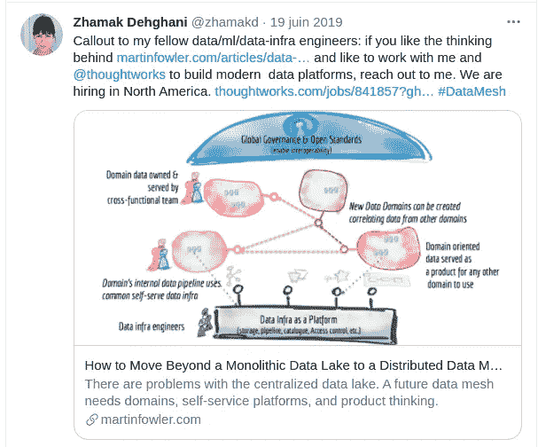
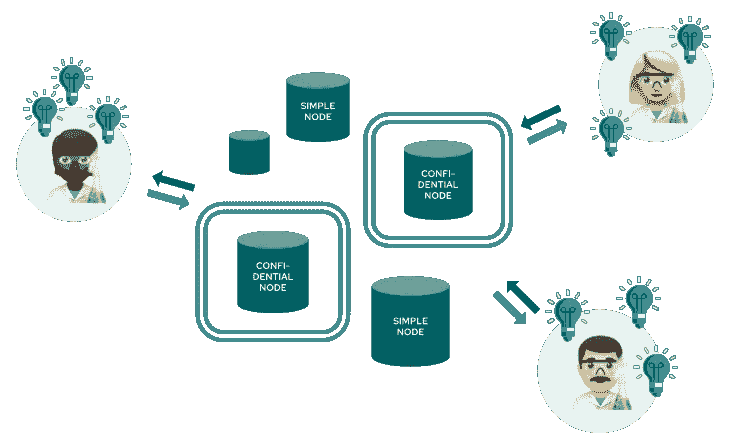

# 构建机密数据网

> 原文：<https://towardsdatascience.com/building-a-confidential-data-mesh-1a4a103471dc?source=collection_archive---------30----------------------->

## 数据网格架构和差分隐私技术如何帮助您以安全的方式实现对机密数据的访问民主化

里卡多·戈麦斯·安吉尔在 [Unsplash](https://unsplash.com?utm_source=medium&utm_medium=referral) 上的照片

最常见的数据工程架构是数据湖和数据仓库。两者都是集中式系统:来自每个数据产生实体的数据被集中到一个位置，由一个数据工程师团队负责。它带来了许多挑战和限制:

*   数据工程师没有特定的领域知识。产生数据的系统可能变化很快，由一个单独的团队负责集成到一个集中的系统中会增加复杂性和延迟。数据湖/仓库不太灵活。
*   很难添加大量数据源，因为集中式工程团队很难扩展。
*   将数据移动到一个中央存储库在法律上可能具有挑战性，尤其是跨业务线或地理边界。
*   当数据被复制到中央存储库时，数据泄露的风险就更大了

# 为什么数据网格现在如此受关注？

数据网格架构是 Zhamak Dehghani ( [@zhamakd](https://twitter.com/zhamakd) )(在这篇[论文](https://martinfowler.com/articles/data-monolith-to-mesh.html))在 2019 年 5 月提出的。这是数据架构设计中的一个重大转变，克服了集中式方法的局限性，并提供了可伸缩性和敏捷性。

Zhamak Dehghani 介绍她关于数据网格的论文(来源:Twitter)

数据网格的核心原则是:

— **分布式、面向领域的数据**:与许多实体(比如营销、运营、R&D……)推送数据的集中式存储库相反，数据网格意味着数据是按领域组织的。这意味着数据工程师拥有领域知识，因此可以更加高效和敏捷

— **数据即产品**:数据消费者的用户体验必须是域名所有者的主要关注点。任何人(当然是经过授权的)都应该能够自主地消费数据，而不需要领域数据团队的帮助。数据应该是高质量的、可发现的、自我描述的，并且通常易于消费

— **自助式数据平台**:为了支持领域数据团队，组织必须提供自助式数据基础架构，为数据团队提供工具，如大数据存储、联合身份管理或数据访问日志记录

— **分散化&联合治理**:全球(在组织级别)标准应该通过联合机制定义，并有领域代表。这些标准是在平台中通过计算实现的。

围绕数据网格有一个活跃的社区，你可以在这里加入。

## 文化和组织的变化:当数据成为产品

现在，每个数据生产实体都应该通过一个定义明确、记录完善的标准来提供其数据。数据工程师现在就来自这个领域，所以更容易扩展:领域的数量不会影响集中的数据团队，变得无关紧要。

领域数据团队现在必须考虑他们的资产，他们的产品，以及数据的消费者，他们的客户。必须衡量和跟踪客户满意度，以推动数据团队的工作。

## 软件和数据工程架构和哲学的可喜融合

数据网格的引入与软件工程中从单片到微服务的转变有一些相似之处。它强调了域所有者和互操作性的重要性，旨在在高度复杂的环境中进行扩展。

# 机密数据网格简介

在大多数组织中，许多数据集是高度敏感的，并受到限制(出于监管或商业原因)。例如，可能无法将个人数据移出法律实体或国家/地区。这些数据集不能添加到网格中，原始域之外的分析师也不能利用它们。

这是一个重大的错失机会。传统的补救策略依赖于数据屏蔽，但它需要定制的数据争论，无法解决大规模的合规性挑战，并可能对数据效用产生重大影响(更多关于数据屏蔽缺点的信息[此处](https://medium.com/sarus/overcoming-the-limitations-of-data-masking-636e082ab29c))。**为了充分利用数据网格的力量，我们需要大规模解决机密数据访问。**

**输入隐私保护技术，尤其是差分隐私。**

**差分隐私**是定义数据分析中隐私风险的数学框架。它提供了在处理数据时保护私有信息的机制和算法。它是由 Cynthia Dwork 在 2006 年推出的，并在商业应用中慢慢部署(还有很多工作要做)。它主要被谷歌、苹果或微软用于内部需求，抓住机会利用数据，同时保护隐私。这里有[一个很好的资源](https://privacytools.seas.harvard.edu/files/privacytools/files/pedagogical-document-dp_0.pdf)，不用太多数学就可以学习 DP。为了更系统地回顾它，这是参考书:[差分隐私的算法基础](https://www.cis.upenn.edu/~aaroth/Papers/privacybook.pdf)(德沃克，罗斯)。

差分隐私可以被认为是匿名计算结果的定义。它被认为是匿名的，因为它不会透露任何特定个人的重要信息。它适用于任何类型的计算，但机器学习或 SQL 分析是显而易见的候选。对一行数据应用差分隐私没有太大意义，因为结果不应该取决于数据行本身！但幸运的是，没有人在一行数据上做 ML 或 BI。在数据网格体系结构中，整个数据集位于一个位置，因此可以对所有行执行每个分析，这是差异隐私的完美匹配。

有了差分隐私，我们现在可以设计一个真正可扩展的**机密数据网格**。当一些域具有不能在整个组织内共享的敏感或管控数据时，这是传统数据网格的扩展。每个域都实施与其监管约束相关的隐私政策。

在**机密数据网格**中，不能从节点中提取敏感数据，但是仍然可以在其上执行计算。因为它实现了与经典数据网格相同的互操作性需求，所以数据源可以被同样地编目。需要提取数据样本甚至流式传输数据的应用程序总是可以访问模拟源属性的合成数据，这些数据是通过差分私有深度学习算法生成的。可以使用 SQL 查询的不同私有实现来查询节点级数据库。机器学习可以在原始数据上进行训练，仍然具有差分隐私保证。

最后，从数据从业者的角度来看，**机密数据网格**的行为与原始数据网格完全一样。主要区别在于所有权原则还扩展到了遵从标准和隐私政策的实现。

一个**机密数据网**混合了敏感域和开放域。敏感域必须只公开不同私有 API(由 Sarus technologies 绘制)

## 构建您自己的机密数据网(CDM)

清洁发展机制的组成部分是:

*   在 SQL 查询或 ML 作业中实现不同隐私的远程执行框架
*   跟踪数据集上所有影响隐私的查询的会计师
*   差分专用合成数据发生器
*   实现互操作性标准的 API(包括目录、数据导出、SQL 驱动程序……)
*   还有把所有东西粘在一起的胶水。

没有一种开源解决方案可以一键部署 CDM，但幸运的是，一些基本的构建模块是可用的。大多数开源项目仍处于试验阶段，但它们是一个很好的开始资源。最有趣的是:

*   [OpenDP](https://github.com/opendp) :这是哈佛和微软的共同努力，为差分私有计算提供了主要的工具箱。主要贡献是一组 DP 原语( [smartnoise-core](https://github.com/opendp/smartnoise-core) )和一个运行 SQL 查询的 SDK([smart noise-SDK](https://github.com/opendp/smartnoise-sdk))
*   [Google Differential Privacy](https://github.com/google/differential-privacy):与 OpenDP 类似，Google DP 提供了 DP 原语，可以在 Apache Beam、Differential-private SQL 引擎和隐私会计师之上运行
*   [TensorFlow/privacy](https://github.com/tensorflow/privacy) :允许训练具有差分隐私的 TensorFlow 模型。请注意，这段代码已经打包在 OpenMined 中。
*   PyTorch Opacus :来自脸书的一个库，用来训练 PyTorch 模型的不同隐私

通过将这些库安装在机密域上，用户可以在不同的隐私保证下对机密数据进行查询。

这是一个良好的开端，但我们仍远未找到可行的解决方案，因为缺少许多关键部分:

*   **API**:数据网格非常强大，因为所有与外部用户的通信都是通过标准化的 API 进行的。CDM 提供与其他节点的互操作性也是如此。
*   **加强隐私合规性**:开源库是为科学家设计的，他们可以访问原始数据，并希望发布私人成果。用户有责任使用差分隐私的安全参数化。在 CDM 中，这应该是强制的，这样用户就不能执行任何暴露隐私的查询。
*   **优化隐私消费** : DP 伴随着隐私预算的概念。但是如果孤立地考虑每个查询，这个预算会很快用完。为了获得最佳的准确性，人们希望利用所有的公共信息来建立有用的先验知识，以及之前已经发布的任何信息。实现记忆化是执行连续查询或学习作业的重要部分。
*   **合成数据**:数据从业者会希望看到一些原始数据的样本。因为揭示原始数据不是一个选项，所以合成数据是必须的。它必须用差分隐私来生成，以保持隐私保证。
*   **使用策略和会计的隐私治理**:如何控制多个请求的隐私泄露？(提示:这不是微不足道的，因为差异隐私的关键指标ε不是可加的:如果你花了ε= 1，那么ε= 2，你没有花ε= 3:()。管理员如何为不同的用户设置不同的策略？

如果没有单一的开源库可以将 CDM 带入生活，一些初创公司和大型组织正在慢慢地将所有的碎片汇集在一起，使 CDM 成为大规模利用敏感数据的最有效方式。

*在 Sarus，我们让以数据为中心的组织在以完全合规的方式处理敏感数据时更加高效和敏捷。如果您想了解更多关于机密数据网格、Sarus 如何提供帮助、获取演示并亲自尝试，请联系 hello@sarus.tech.*

*如果你对用最先进的技术解决隐私问题感兴趣，我们正在招聘，所以快来加入我们吧！*