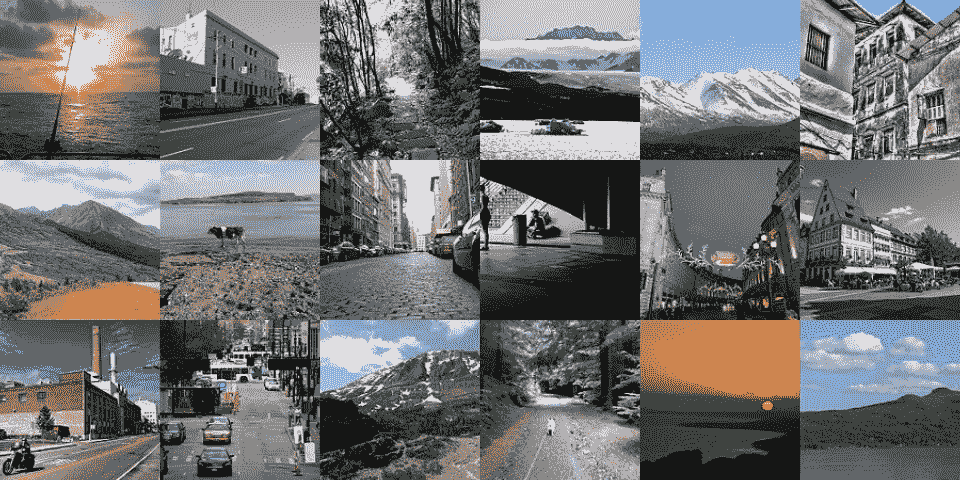
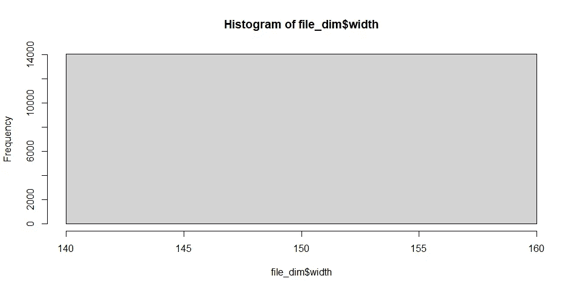
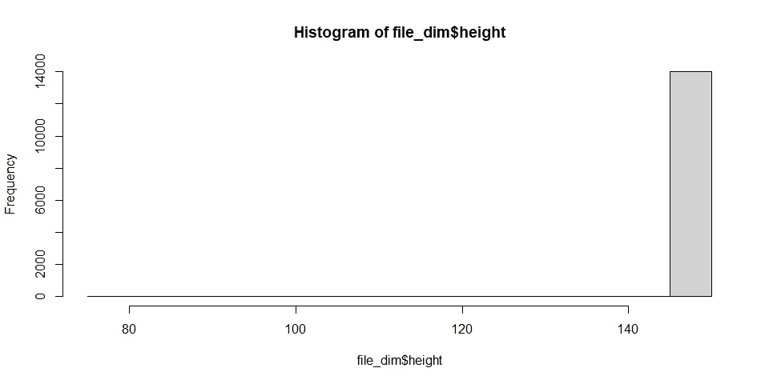
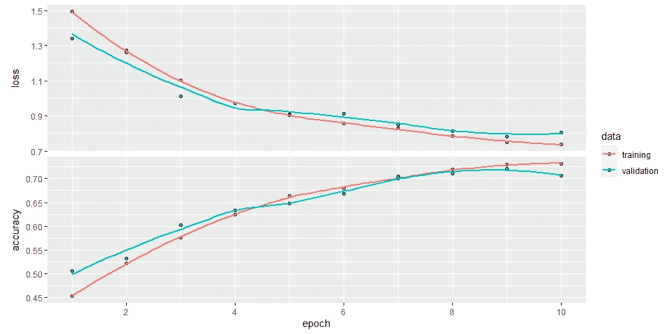
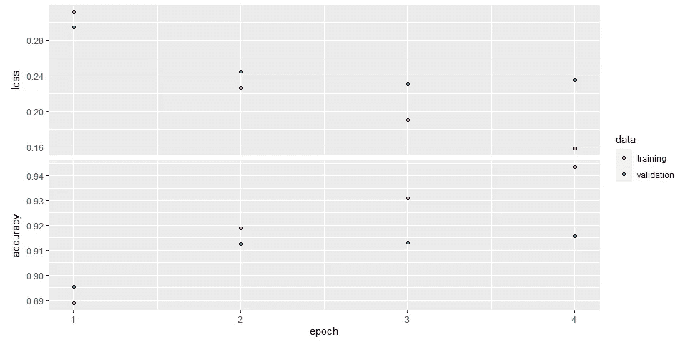

# 构建卷积神经网络模型以理解场景

> 原文：<https://towardsdatascience.com/building-a-convolutional-neural-network-model-to-understand-scenes-1673abd9884d?source=collection_archive---------18----------------------->

## R 中的数据科学

## 一个完整的循序渐进的数据扩充和转移学习教程


照片由[索拉萨克](https://unsplash.com/@boontohhgraphy)、[迈克尔·克拉恩](https://unsplash.com/@michael_g_krahn)、[肖恩·皮尔斯](https://unsplash.com/@prevailz)、[纪尧姆·布里亚德](https://unsplash.com/@mister_guiz)、[希法兹·沙蒙](https://unsplash.com/@sotti)和[岩田良治](https://unsplash.com/@ryoji__iwata)在 [Unsplash](https://unsplash.com/?utm_source=medium&utm_medium=referral)

```
**Table of Contents**· [Library](#dcd8)
· [Dataset](#44f0)
· [Exploratory Data Analysis](#7f82)
· [Data Preprocessing](#e848)
· [Modeling](#8635)
  ∘ [Simple CNN](#a08c)
  ∘ [Deeper CNN](#161c)
  ∘ [Deeper CNN with Pretrained Weights](#0f40)
· [Conclusion](#fb48)
```

自从我开始在[介质](https://medium.com/u/504c7870fdb6?source=post_page-----1673abd9884d--------------------------------)上写作，我就非常依赖 [Unsplash](http://unsplash.com) 。这是一个美丽的地方，创造高品质的图像。但是你知道 Unsplash 用机器学习来帮助标记照片吗？

> 对于上传到 Unsplash […]的每张图片，我们都会通过一系列机器学习算法来理解照片的内容，从而消除了投稿人手动标记照片的需要。— [Unsplash 博客](https://unsplash.com/blog/introducing-unsplashs-new-uploaders/)

给照片贴标签是一项非常重要的任务，可以由机器快速完成。因此，我们将建立一个模型，可以从图像中提取信息，并给出正确的标签，以根据主题位置对图像数据库进行分类。我们将使用卷积神经网络(CNN)进行预测，以对图像是关于“建筑物”、“森林”、“冰川”、“山”、“海”还是“街道”进行分类。所以，这是一个图像分类问题。

# 图书馆

除了我们通常在 R 中使用的循环库，我们还将利用 [keras](https://keras.rstudio.com/) 。Keras 是一个高级神经网络 API，开发的目的是实现快速实验。

```
library(keras)        # deep learning
library(tidyverse)    # data wrangling
library(imager)       # image manipulation
library(caret)        # model evaluation
library(grid)         # display images in a grid
library(gridExtra)    # display images in a gridRS <- 42              # random state constant
```

注意，我们创建了一个名为`RS`的变量，它只是一个数字，用于未来随机过程的再现性。

# 资料组

数据由带有 6 个不同标签的图像组成:“建筑物”、“森林”、“冰川”、“山”、“海”和“街道”。不像[上一篇](https://medium.com/data-folks-indonesia/hand-gesture-recognition-8c0e2927a8bb)文章中的图像像素数据已经被转换成一个`.csv`文件的列，这次我们使用数据生成器直接读取图像。

[](https://medium.com/data-folks-indonesia/hand-gesture-recognition-8c0e2927a8bb) [## 手势识别

medium.com](https://medium.com/data-folks-indonesia/hand-gesture-recognition-8c0e2927a8bb) 

为此，我们需要知道图像文件夹结构，如下所示。

```
seg_train
└── seg_train
    ├── buildings
    ├── forest
    ├── glacier
    ├── mountain
    ├── sea
    └── streetseg_test
└── seg_test
    ├── buildings
    ├── forest
    ├── glacier
    ├── mountain
    ├── sea
    └── street
```

在每个`buildings`、`forest`、`glacier`、`mountain`、`sea`和`street`子文件夹中，保存有相应的图像。顾名思义，我们将使用`seg_train`进行模型训练，使用`seg_test`进行模型验证。

# 探索性数据分析

首先，我们需要定位每个类别的父文件夹地址。

```
folder_list <- list.files("seg_train/seg_train/")
folder_path <- paste0("seg_train/seg_train/", folder_list, "/")
folder_path#> [1] "seg_train/seg_train/buildings/" "seg_train/seg_train/forest/"    "seg_train/seg_train/glacier/"   "seg_train/seg_train/mountain/" 
#> [5] "seg_train/seg_train/sea/"       "seg_train/seg_train/street/"
```

然后，列出来自每个父文件夹地址的所有`seg_train`图像地址。

```
file_name <- 
  map(folder_path, function(x) paste0(x, list.files(x))) %>% 
  unlist()
```

下面我们可以看到总共有 14034 张`seg_train`图片。

```
cat("Number of train images:", length(file_name))#> Number of train images: 14034
```

作为理智检查，让我们看几张`seg_train`图片。

```
set.seed(RS)
sample_image <- sample(file_name, 18)
img <- map(sample_image, load.image)
grobs <- lapply(img, rasterGrob)
grid.arrange(grobs=grobs, ncol=6)
```



拿第一张图片来说。

```
img <- load.image(file_name[1])
img#> Image. Width: 150 pix Height: 150 pix Depth: 1 Colour channels: 3
```

下面可以看到，这张图的尺寸是 150 × 150 × 1 × 3。这意味着这个特定的图像具有 150 像素的宽度、150 像素的高度、1 像素的深度和 3 个颜色通道(用于红色、绿色和蓝色，也称为 RGB)。

```
dim(img)#> [1] 150 150   1   3
```

现在，我们将构建一个函数来获取图像的宽度和高度，并将该函数应用于所有图像。

```
get_dim <- function(x){
  img <- load.image(x) 
  df_img <- data.frame(
    width = width(img),
    height = height(img),
    filename = x
  )
  return(df_img)
}

file_dim <- map_df(file_name, get_dim)
head(file_dim)#>   width height                                filename
#> 1   150    150     seg_train/seg_train/buildings/0.jpg
#> 2   150    150 seg_train/seg_train/buildings/10006.jpg
#> 3   150    150  seg_train/seg_train/buildings/1001.jpg
#> 4   150    150 seg_train/seg_train/buildings/10014.jpg
#> 5   150    150 seg_train/seg_train/buildings/10018.jpg
#> 6   150    150 seg_train/seg_train/buildings/10029.jpg
```

我们得到了图像的宽度和高度的如下分布。

```
hist(file_dim$width, breaks = 20)
```



```
hist(file_dim$height, breaks = 20)
```



```
summary(file_dim)#>      width         height        filename        
#>  Min.   :150   Min.   : 76.0   Length:14034      
#>  1st Qu.:150   1st Qu.:150.0   Class :character  
#>  Median :150   Median :150.0   Mode  :character  
#>  Mean   :150   Mean   :149.9                     
#>  3rd Qu.:150   3rd Qu.:150.0                     
#>  Max.   :150   Max.   :150.0
```

正如我们所见，数据集包含不同维度的图像。所有的宽度都是 150 像素。但是，最大和最小高度分别为 150 和 76 像素。在适合模型之前，所有这些图像必须在相同的维度上。这一点至关重要，因为:

1.  每个图像像素值所适合的模型的输入层具有固定数量的神经元，
2.  如果图像尺寸太高，训练模型可能会花费太长时间
3.  如果图像尺寸太低，就会丢失太多信息。

# 数据预处理

神经网络模型可能出现的一个问题是，它们倾向于*记忆`seg_train`数据集中的*图像，以至于当新的`seg_test`数据集进来时，它们无法识别它。数据扩充是解决这一问题的众多技术之一。给定一幅图像，数据增强将对其进行轻微转换，以创建一些新图像。然后将这些新图像放入模型中。这样，模型知道原始图像的许多版本，并且希望*理解*图像的意思，而不是*记住*它。我们将只使用一些简单的转换，例如:

1.  随机水平翻转图像
2.  随机旋转 10 度
3.  随机放大 0.1 倍
4.  随机水平移动总宽度的 0.1 分之一
5.  随机水平移动总高度的 0.1 分之一

我们不使用垂直翻转，因为在我们的情况下，他们可以改变图像的意义。这种数据扩充可以使用`image_data_generator()`功能完成。将生成器保存到名为`train_data_gen`的对象中。注意`train_data_gen`仅在训练时应用，我们在预测时不使用它。

在`train_data_gen`中，我们还进行了归一化处理，以减少光照差异的影响。此外，CNN 模型在[0..1]数据比[0..255].为此，只需将每个像素值除以 255。

```
train_data_gen <- image_data_generator(
  rescale = 1/255,            # scaling pixel value
  horizontal_flip = T,        # flip image horizontally
  vertical_flip = F,          # flip image vertically 
  rotation_range = 10,        # rotate image from 0 to 45 degrees
  zoom_range = 0.1,           # zoom in or zoom out range
  width_shift_range = 0.1,    # shift horizontally to the width
  height_shift_range = 0.1,   # shift horizontally to the height
)
```

我们将使用 150 × 150 像素作为输入图像的形状，因为 150 像素是所有图像中最常见的宽度和高度(再次查看 EDA)，并将大小存储为`target_size`。此外，我们将分批训练模型，每批 32 个观测值，存储为`batch_size`。

```
target_size <- c(150, 150)
batch_size <- 32
```

现在，构建生成器以从各自的目录中流动训练和验证数据集。填写参数`target_size`和`batch_size`。由于我们有彩色的 rgb 图像，将`color_mode`设置为“RGB”。最后，使用`train_data_gen`作为`generator`来应用之前创建的数据扩充。

```
# for training dataset
train_image_array_gen <- flow_images_from_directory(
  directory = "seg_train/seg_train/",   # folder of the data
  target_size = target_size,   # target of the image dimension
  color_mode = "rgb",          # use RGB color
  batch_size = batch_size ,    # number of images in each batch
  seed = RS,                   # set random seed
  generator = train_data_gen   # apply data augmentation
)

# for validation dataset
val_image_array_gen <- flow_images_from_directory(
  directory = "seg_test/seg_test/",
  target_size = target_size, 
  color_mode = "rgb", 
  batch_size = batch_size ,
  seed = RS,
  generator = train_data_gen
)
```

接下来，我们将看到目标变量中标签的比例，以检查类不平衡。如果有的话，分类器倾向于做出有偏差的学习模型，与多数类相比，该模型对少数类具有较差的预测准确性。我们可以通过对训练数据集进行上采样或下采样来以最简单的方式解决这个问题。

```
output_n <- n_distinct(train_image_array_gen$classes)
table("Frequency" = factor(train_image_array_gen$classes)) %>% 
  prop.table()#> Frequency
#>         0         1         2         3         4         5 
#> 0.1561208 0.1618213 0.1712983 0.1789939 0.1620351 0.1697307
```

幸运的是，从上面可以看出，所有的职业都相对平衡！我们不需要进一步的治疗。

# 建模

首先，让我们保存我们使用的训练和验证图像的数量。除了训练数据之外，我们还需要不同的数据来进行验证，因为我们不希望我们的模型只擅长预测它已经看到的图像，而且还可以推广到未看到的图像。这种对看不见的图像的需求正是我们也必须在验证数据集上看到模型性能的原因。

因此，我们可以在下面观察到，我们有 14034 个图像用于训练(如前所述)，3000 个图像用于验证模型。

```
train_samples <- train_image_array_gen$n
valid_samples <- val_image_array_gen$n
train_samples#> [1] 14034valid_samples#> [1] 3000
```

我们将从最简单的开始逐步构建三个模型。

## 简单 CNN

该模型只有 4 个隐藏层，包括最大池化和展平，以及 1 个输出层，详情如下:

1.  卷积层:滤波器 16，核大小 3 × 3，相同填充，relu 激活函数
2.  最大池层:池大小 2 × 2
3.  展平图层
4.  密集层:16 节点，relu 激活功能
5.  密集层(输出):6 节点，softmax 激活功能

请注意，我们使用扁平化层作为从网络的卷积部分到密集部分的桥梁。基本上，展平层所做的就是——顾名思义——将最后一个卷积层的维度展平为单个密集层。例如，假设我们有一个大小为(8，8，32)的卷积层。这里，32 是过滤器的数量。展平层将把这个张量整形为大小为 2048 矢量。

在输出层，我们使用 softmax 激活函数，因为这是一个多类分类问题。最后，我们需要指定 CNN 输入层所需的图像大小。如前所述，我们将使用存储在`target_size`中的 150 × 150 像素的图像尺寸和 3 个 RGB 通道。

现在，我们准备好了。

```
# Set Initial Random Weight
tensorflow::tf$random$set_seed(RS)

model <- keras_model_sequential(name = "simple_model") %>% 

  # Convolution Layer
  layer_conv_2d(filters = 16,
                kernel_size = c(3,3),
                padding = "same",
                activation = "relu",
                input_shape = c(target_size, 3) 
                ) %>% 

  # Max Pooling Layer
  layer_max_pooling_2d(pool_size = c(2,2)) %>% 

  # Flattening Layer
  layer_flatten() %>% 

  # Dense Layer
  layer_dense(units = 16,
              activation = "relu") %>% 

  # Output Layer
  layer_dense(units = output_n,
              activation = "softmax",
              name = "Output")

summary(model)#> Model: "simple_model"
#> _________________________________________________________________
#> Layer (type)                                                  Output Shape                                           Param #              
#> =================================================================
#> conv2d (Conv2D)                                               (None, 150, 150, 16)                                   448                  
#> _________________________________________________________________
#> max_pooling2d (MaxPooling2D)                                  (None, 75, 75, 16)                                     0                    
#> _________________________________________________________________
#> flatten (Flatten)                                             (None, 90000)                                          0                    
#> _________________________________________________________________
#> dense (Dense)                                                 (None, 16)                                             1440016              
#> _________________________________________________________________
#> Output (Dense)                                                (None, 6)                                              102                  
#> =================================================================
#> Total params: 1,440,566
#> Trainable params: 1,440,566
#> Non-trainable params: 0
#> _________________________________________________________________
```

建立后，我们编译和训练模型。我们对损失函数使用分类交叉熵，因为这又是一个多类分类问题。我们使用默认学习率为 0.001 的 adam 优化器，因为 adam 是最有效的优化器之一。我们还使用准确性作为简单性的衡量标准。更重要的是，因为我们不喜欢一个类高于其他类，并且每个类都是平衡的，所以与精确度、灵敏度或特异性相比，准确性更受青睐。我们将训练 10 个时期的模型。

```
model %>% 
  compile(
    loss = "categorical_crossentropy",
    optimizer = optimizer_adam(lr = 0.001),
    metrics = "accuracy"
  )

# fit data into model
history <- model %>% 
  fit_generator(
    # training data
    train_image_array_gen,

    # training epochs
    steps_per_epoch = as.integer(train_samples / batch_size), 
    epochs = 10, 

    # validation data
    validation_data = val_image_array_gen,
    validation_steps = as.integer(valid_samples / batch_size)
  )plot(history)
```



从第十个时期的最终训练和验证精度，我们可以看到它们具有相似的值并且相对较高，这意味着没有发生过拟合。接下来，我们将对验证数据集上的所有图像执行预测(而不是像在训练中那样对每批图像执行预测)。首先，让我们将每个图像的路径和它对应的类列表。

```
val_data <- data.frame(file_name = paste0("seg_test/seg_test/", val_image_array_gen$filenames)) %>% 
  mutate(class = str_extract(file_name, "buildings|forest|glacier|mountain|sea|street"))

head(val_data)#>                                file_name     class
#> 1 seg_test/seg_test/buildings\\20057.jpg buildings
#> 2 seg_test/seg_test/buildings\\20060.jpg buildings
#> 3 seg_test/seg_test/buildings\\20061.jpg buildings
#> 4 seg_test/seg_test/buildings\\20064.jpg buildings
#> 5 seg_test/seg_test/buildings\\20073.jpg buildings
#> 6 seg_test/seg_test/buildings\\20074.jpg buildings
```

然后，我们将每个图像转换成一个数组。不要忘记将像素值归一化，即除以 255。

```
image_prep <- function(x, target_size) {
  arrays <- lapply(x, function(path) {
    img <- image_load(
      path, 
      target_size = target_size, 
      grayscale = F
    )
    x <- image_to_array(img)
    x <- array_reshape(x, c(1, dim(x)))
    x <- x/255
  })
  do.call(abind::abind, c(arrays, list(along = 1)))
}

test_x <- image_prep(val_data$file_name, target_size)
dim(test_x)#> [1] 3000  150  150    3
```

接下来，预测。

```
pred_test <- predict_classes(model, test_x) 
head(pred_test)#> [1] 4 0 0 0 4 3
```

现在，将每个预测解码到相应的类别中。

```
decode <- function(x){
  case_when(
    x == 0 ~ "buildings",
    x == 1 ~ "forest",
    x == 2 ~ "glacier",
    x == 3 ~ "mountain",
    x == 4 ~ "sea",
    x == 5 ~ "street",
  )
}

pred_test <- sapply(pred_test, decode)
head(pred_test)#> [1] "sea"       "buildings" "buildings" "buildings" "sea"       "mountain"
```

最后，分析混淆矩阵。

```
cm_simple <- confusionMatrix(as.factor(pred_test), as.factor(val_data$class))
acc_simple <- cm_simple$overall['Accuracy']
cm_simple#> Confusion Matrix and Statistics
#> 
#>            Reference
#> Prediction  buildings forest glacier mountain sea street
#>   buildings       348     24      14       20  35    106
#>   forest            8    418       3        4   4     19
#>   glacier           7      5     357       53  38      5
#>   mountain         19      6      98      381  61      5
#>   sea              13      1      75       65 363      6
#>   street           42     20       6        2   9    360
#> 
#> Overall Statistics
#>                                                
#>                Accuracy : 0.7423               
#>                  95% CI : (0.7263, 0.7579)     
#>     No Information Rate : 0.1843               
#>     P-Value [Acc > NIR] : < 0.00000000000000022
#>                                                
#>                   Kappa : 0.6909               
#>                                                
#>  Mcnemar's Test P-Value : 0.0000000001327      
#> 
#> Statistics by Class:
#> 
#>                      Class: buildings Class: forest Class: glacier Class: mountain Class: sea Class: street
#> Sensitivity                    0.7963        0.8819         0.6456          0.7257     0.7118        0.7186
#> Specificity                    0.9224        0.9850         0.9559          0.9236     0.9357        0.9684
#> Pos Pred Value                 0.6362        0.9167         0.7677          0.6684     0.6941        0.8200
#> Neg Pred Value                 0.9637        0.9780         0.9227          0.9407     0.9407        0.9449
#> Prevalence                     0.1457        0.1580         0.1843          0.1750     0.1700        0.1670
#> Detection Rate                 0.1160        0.1393         0.1190          0.1270     0.1210        0.1200
#> Detection Prevalence           0.1823        0.1520         0.1550          0.1900     0.1743        0.1463
#> Balanced Accuracy              0.8593        0.9334         0.8007          0.8247     0.8238        0.8435
```

从混淆矩阵中可以看出，该模型很难区分每个类别。我们在验证数据集上获得了 74%的准确率。有 106 个街道图像被预测为建筑物，这超过了所有街道图像的 20%。这是有意义的，因为在许多街道图像中，建筑物也存在。

我们可以通过各种方式来提高模型的性能。但是现在，让我们通过简单地改变架构来改进它。

## 深度 CNN

现在我们用更多的卷积层制作一个更深的 CNN。这是它的架构:

1.  块 1: 2 个卷积层和 1 个最大汇集层
2.  块 2: 1 个卷积层和 1 个最大池层
3.  块 3: 1 个卷积层和 1 个最大池层
4.  块 4: 1 个卷积层和 1 个最大池层
5.  展平图层
6.  一个致密层
7.  输出层

```
tensorflow::tf$random$set_seed(RS)

model_big <- keras_model_sequential(name = "model_big") %>%

  # First convolutional layer
  layer_conv_2d(filters = 32,
                kernel_size = c(5,5), # 5 x 5 filters
                padding = "same",
                activation = "relu",
                input_shape = c(target_size, 3)
                ) %>% 

  # Second convolutional layer
  layer_conv_2d(filters = 32,
                kernel_size = c(3,3), # 3 x 3 filters
                padding = "same",
                activation = "relu"
                ) %>% 

  # Max pooling layer
  layer_max_pooling_2d(pool_size = c(2,2)) %>% 

  # Third convolutional layer
  layer_conv_2d(filters = 64,
                kernel_size = c(3,3),
                padding = "same",
                activation = "relu"
                ) %>% 

  # Max pooling layer
  layer_max_pooling_2d(pool_size = c(2,2)) %>% 

  # Fourth convolutional layer
  layer_conv_2d(filters = 128,
                kernel_size = c(3,3),
                padding = "same",
                activation = "relu"
                ) %>% 

  # Max pooling layer
  layer_max_pooling_2d(pool_size = c(2,2)) %>% 

  # Fifth convolutional layer
  layer_conv_2d(filters = 256,
                kernel_size = c(3,3),
                padding = "same",
                activation = "relu"
                ) %>% 

  # Max pooling layer
  layer_max_pooling_2d(pool_size = c(2,2)) %>% 

  # Flattening layer
  layer_flatten() %>% 

  # Dense layer
  layer_dense(units = 64,
              activation = "relu") %>% 

  # Output layer
  layer_dense(name = "Output",
              units = output_n, 
              activation = "softmax")

summary(model_big)#> Model: "model_big"
#> _________________________________________________________________
#> Layer (type)                                                  Output Shape                                           Param #              
#> =================================================================
#> conv2d_5 (Conv2D)                                             (None, 150, 150, 32)                                   2432                 
#> _________________________________________________________________
#> conv2d_4 (Conv2D)                                             (None, 150, 150, 32)                                   9248                 
#> _________________________________________________________________
#> max_pooling2d_4 (MaxPooling2D)                                (None, 75, 75, 32)                                     0                    
#> _________________________________________________________________
#> conv2d_3 (Conv2D)                                             (None, 75, 75, 64)                                     18496                
#> _________________________________________________________________
#> max_pooling2d_3 (MaxPooling2D)                                (None, 37, 37, 64)                                     0                    
#> _________________________________________________________________
#> conv2d_2 (Conv2D)                                             (None, 37, 37, 128)                                    73856                
#> _________________________________________________________________
#> max_pooling2d_2 (MaxPooling2D)                                (None, 18, 18, 128)                                    0                    
#> _________________________________________________________________
#> conv2d_1 (Conv2D)                                             (None, 18, 18, 256)                                    295168               
#> _________________________________________________________________
#> max_pooling2d_1 (MaxPooling2D)                                (None, 9, 9, 256)                                      0                    
#> _________________________________________________________________
#> flatten_1 (Flatten)                                           (None, 20736)                                          0                    
#> _________________________________________________________________
#> dense_1 (Dense)                                               (None, 64)                                             1327168              
#> _________________________________________________________________
#> Output (Dense)                                                (None, 6)                                              390                  
#> =================================================================
#> Total params: 1,726,758
#> Trainable params: 1,726,758
#> Non-trainable params: 0
#> _________________________________________________________________
```

剩下的和之前做的一样。

```
model_big %>%
  compile(
    loss = "categorical_crossentropy",
    optimizer = optimizer_adam(lr = 0.001),
    metrics = "accuracy"
  )

history <- model_big %>%
  fit_generator(
    train_image_array_gen,
    steps_per_epoch = as.integer(train_samples / batch_size),
    epochs = 10,
    validation_data = val_image_array_gen,
    validation_steps = as.integer(valid_samples / batch_size)
  )plot(history)
```


```
pred_test <- predict_classes(model_big, test_x)
pred_test <- sapply(pred_test, decode)
cm_big <- confusionMatrix(as.factor(pred_test), as.factor(val_data$class))
acc_big <- cm_big$overall['Accuracy']
cm_big#> Confusion Matrix and Statistics
#> 
#>            Reference
#> Prediction  buildings forest glacier mountain sea street
#>   buildings       390      3      24       24  11     34
#>   forest            3    465      11        7   8     11
#>   glacier           2      0     367       35   9      1
#>   mountain          0      2      82      415  17      1
#>   sea               3      1      57       42 461      6
#>   street           39      3      12        2   4    448
#> 
#> Overall Statistics
#>                                                
#>                Accuracy : 0.8487               
#>                  95% CI : (0.8353, 0.8613)     
#>     No Information Rate : 0.1843               
#>     P-Value [Acc > NIR] : < 0.00000000000000022
#>                                                
#>                   Kappa : 0.8185               
#>                                                
#>  Mcnemar's Test P-Value : < 0.00000000000000022
#> 
#> Statistics by Class:
#> 
#>                      Class: buildings Class: forest Class: glacier Class: mountain Class: sea Class: street
#> Sensitivity                    0.8924        0.9810         0.6637          0.7905     0.9039        0.8942
#> Specificity                    0.9625        0.9842         0.9808          0.9588     0.9562        0.9760
#> Pos Pred Value                 0.8025        0.9208         0.8865          0.8027     0.8088        0.8819
#> Neg Pred Value                 0.9813        0.9964         0.9281          0.9557     0.9798        0.9787
#> Prevalence                     0.1457        0.1580         0.1843          0.1750     0.1700        0.1670
#> Detection Rate                 0.1300        0.1550         0.1223          0.1383     0.1537        0.1493
#> Detection Prevalence           0.1620        0.1683         0.1380          0.1723     0.1900        0.1693
#> Balanced Accuracy              0.9275        0.9826         0.8222          0.8746     0.9301        0.9351
```

这个结果总体上比之前的`model`要好，因为`model_big`更复杂，因此能够捕捉更多的特征。我们在验证数据集上获得了 85%的准确率。虽然对街道图像的预测已经变得更好，但对冰川图像的预测仍然存在。

## 预训练权重的深度 CNN

实际上，研究人员已经为图像分类问题开发了许多模型，从 VGG 模型家族到谷歌开发的最新艺术级 EfficientNet。出于学习目的，在本节中，我们将使用 VGG16 模型，因为它是所有模型中最简单的模型之一，仅由卷积层、最大池层和密集层组成，如我们之前介绍的那样。这个过程叫做迁移学习，将预先训练好的模型的知识进行迁移，来解决我们的问题。

最初的 VGG16 模型是在 1000 个类上训练的。为了使它适合我们的问题，我们将排除模型的顶部(密集)层，并插入我们版本的预测层，该预测层由一个全局平均池层(作为扁平化层的替代)、一个具有 64 个节点的密集层和一个具有 6 个节点的输出层(用于 6 个类)组成。

我们来看看整体架构。

```
# load original model without top layers
input_tensor <- layer_input(shape = c(target_size, 3))
base_model <- application_vgg16(input_tensor = input_tensor, 
                                weights = 'imagenet', 
                                include_top = FALSE)

# add our custom layers
predictions <- base_model$output %>%
  layer_global_average_pooling_2d() %>%
  layer_dense(units = 64, activation = 'relu') %>%
  layer_dense(units = output_n, activation = 'softmax')

# this is the model we will train
vgg16 <- keras_model(inputs = base_model$input, outputs = predictions)
summary(vgg16)#> Model: "model"
#> _________________________________________________________________
#> Layer (type)                                                  Output Shape                                           Param #              
#> =================================================================
#> input_1 (InputLayer)                                          [(None, 150, 150, 3)]                                  0                    
#> _________________________________________________________________
#> block1_conv1 (Conv2D)                                         (None, 150, 150, 64)                                   1792                 
#> _________________________________________________________________
#> block1_conv2 (Conv2D)                                         (None, 150, 150, 64)                                   36928                
#> _________________________________________________________________
#> block1_pool (MaxPooling2D)                                    (None, 75, 75, 64)                                     0                    
#> _________________________________________________________________
#> block2_conv1 (Conv2D)                                         (None, 75, 75, 128)                                    73856                
#> _________________________________________________________________
#> block2_conv2 (Conv2D)                                         (None, 75, 75, 128)                                    147584               
#> _________________________________________________________________
#> block2_pool (MaxPooling2D)                                    (None, 37, 37, 128)                                    0                    
#> _________________________________________________________________
#> block3_conv1 (Conv2D)                                         (None, 37, 37, 256)                                    295168               
#> _________________________________________________________________
#> block3_conv2 (Conv2D)                                         (None, 37, 37, 256)                                    590080               
#> _________________________________________________________________
#> block3_conv3 (Conv2D)                                         (None, 37, 37, 256)                                    590080               
#> _________________________________________________________________
#> block3_pool (MaxPooling2D)                                    (None, 18, 18, 256)                                    0                    
#> _________________________________________________________________
#> block4_conv1 (Conv2D)                                         (None, 18, 18, 512)                                    1180160              
#> _________________________________________________________________
#> block4_conv2 (Conv2D)                                         (None, 18, 18, 512)                                    2359808              
#> _________________________________________________________________
#> block4_conv3 (Conv2D)                                         (None, 18, 18, 512)                                    2359808              
#> _________________________________________________________________
#> block4_pool (MaxPooling2D)                                    (None, 9, 9, 512)                                      0                    
#> _________________________________________________________________
#> block5_conv1 (Conv2D)                                         (None, 9, 9, 512)                                      2359808              
#> _________________________________________________________________
#> block5_conv2 (Conv2D)                                         (None, 9, 9, 512)                                      2359808              
#> _________________________________________________________________
#> block5_conv3 (Conv2D)                                         (None, 9, 9, 512)                                      2359808              
#> _________________________________________________________________
#> block5_pool (MaxPooling2D)                                    (None, 4, 4, 512)                                      0                    
#> _________________________________________________________________
#> global_average_pooling2d (GlobalAveragePooling2D)             (None, 512)                                            0                    
#> _________________________________________________________________
#> dense_3 (Dense)                                               (None, 64)                                             32832                
#> _________________________________________________________________
#> dense_2 (Dense)                                               (None, 6)                                              390                  
#> =================================================================
#> Total params: 14,747,910
#> Trainable params: 14,747,910
#> Non-trainable params: 0
#> _________________________________________________________________
```

哇，这么多层次啊！我们可以直接使用`vgg16`进行训练和预测，但同样，出于学习的目的，让我们自己从头开始制作 VGG16 模型。

```
model_bigger <- keras_model_sequential(name = "model_bigger") %>% 

  # Block 1
  layer_conv_2d(filters = 64, 
                kernel_size = c(3, 3), 
                activation='relu', 
                padding='same', 
                input_shape = c(94, 94, 3),
                name='block1_conv1') %>% 

  layer_conv_2d(filters = 64, 
                kernel_size = c(3, 3), 
                activation='relu', 
                padding='same', 
                name='block1_conv2') %>% 

  layer_max_pooling_2d(pool_size = c(2, 2), 
                       strides=c(2, 2), 
                       name='block1_pool') %>% 

  # Block 2
  layer_conv_2d(filters = 128, 
                kernel_size = c(3, 3), 
                activation='relu', 
                padding='same', 
                name='block2_conv1') %>% 

  layer_conv_2d(filters = 128, 
                kernel_size = c(3, 3), 
                activation='relu', 
                padding='same', 
                name='block2_conv2') %>% 

  layer_max_pooling_2d(pool_size = c(2, 2), 
                       strides=c(2, 2), 
                       name='block2_pool') %>% 

  # Block 3
  layer_conv_2d(filters = 256, 
                kernel_size = c(3, 3), 
                activation='relu', 
                padding='same', 
                name='block3_conv1') %>% 

  layer_conv_2d(filters = 256, 
                kernel_size = c(3, 3), 
                activation='relu', 
                padding='same', 
                name='block3_conv2') %>% 

  layer_conv_2d(filters = 256, 
                kernel_size = c(3, 3), 
                activation='relu', 
                padding='same', 
                name='block3_conv3') %>% 

  layer_max_pooling_2d(pool_size = c(2, 2), 
                       strides=c(2, 2), 
                       name='block3_pool') %>% 

  # Block 4
  layer_conv_2d(filters = 512, 
                kernel_size = c(3, 3), 
                activation='relu', 
                padding='same', 
                name='block4_conv1') %>% 

  layer_conv_2d(filters = 512, 
                kernel_size = c(3, 3), 
                activation='relu', 
                padding='same', 
                name='block4_conv2') %>% 

  layer_conv_2d(filters = 512, 
                kernel_size = c(3, 3), 
                activation='relu', 
                padding='same', 
                name='block4_conv3') %>% 

  layer_max_pooling_2d(pool_size = c(2, 2), 
                       strides=c(2, 2), 
                       name='block4_pool') %>% 

  # Block 5
  layer_conv_2d(filters = 512, 
                kernel_size = c(3, 3), 
                activation='relu', 
                padding='same', 
                name='block5_conv1') %>% 

  layer_conv_2d(filters = 512, 
                kernel_size = c(3, 3), 
                activation='relu', 
                padding='same', 
                name='block5_conv2') %>% 

  layer_conv_2d(filters = 512, 
                kernel_size = c(3, 3), 
                activation='relu', 
                padding='same', 
                name='block5_conv3') %>% 

  layer_max_pooling_2d(pool_size = c(2, 2), 
                       strides=c(2, 2), 
                       name='block5_pool') %>% 

  # Dense
  layer_global_average_pooling_2d() %>%
  layer_dense(units = 64, activation = 'relu') %>%
  layer_dense(units = output_n, activation = 'softmax')

model_bigger#> Model
#> Model: "model_bigger"
#> _________________________________________________________________
#> Layer (type)                                                  Output Shape                                           Param #              
#> =================================================================
#> block1_conv1 (Conv2D)                                         (None, 94, 94, 64)                                     1792                 
#> _________________________________________________________________
#> block1_conv2 (Conv2D)                                         (None, 94, 94, 64)                                     36928                
#> _________________________________________________________________
#> block1_pool (MaxPooling2D)                                    (None, 47, 47, 64)                                     0                    
#> _________________________________________________________________
#> block2_conv1 (Conv2D)                                         (None, 47, 47, 128)                                    73856                
#> _________________________________________________________________
#> block2_conv2 (Conv2D)                                         (None, 47, 47, 128)                                    147584               
#> _________________________________________________________________
#> block2_pool (MaxPooling2D)                                    (None, 23, 23, 128)                                    0                    
#> _________________________________________________________________
#> block3_conv1 (Conv2D)                                         (None, 23, 23, 256)                                    295168               
#> _________________________________________________________________
#> block3_conv2 (Conv2D)                                         (None, 23, 23, 256)                                    590080               
#> _________________________________________________________________
#> block3_conv3 (Conv2D)                                         (None, 23, 23, 256)                                    590080               
#> _________________________________________________________________
#> block3_pool (MaxPooling2D)                                    (None, 11, 11, 256)                                    0                    
#> _________________________________________________________________
#> block4_conv1 (Conv2D)                                         (None, 11, 11, 512)                                    1180160              
#> _________________________________________________________________
#> block4_conv2 (Conv2D)                                         (None, 11, 11, 512)                                    2359808              
#> _________________________________________________________________
#> block4_conv3 (Conv2D)                                         (None, 11, 11, 512)                                    2359808              
#> _________________________________________________________________
#> block4_pool (MaxPooling2D)                                    (None, 5, 5, 512)                                      0                    
#> _________________________________________________________________
#> block5_conv1 (Conv2D)                                         (None, 5, 5, 512)                                      2359808              
#> _________________________________________________________________
#> block5_conv2 (Conv2D)                                         (None, 5, 5, 512)                                      2359808              
#> _________________________________________________________________
#> block5_conv3 (Conv2D)                                         (None, 5, 5, 512)                                      2359808              
#> _________________________________________________________________
#> block5_pool (MaxPooling2D)                                    (None, 2, 2, 512)                                      0                    
#> _________________________________________________________________
#> global_average_pooling2d_1 (GlobalAveragePooling2D)           (None, 512)                                            0                    
#> _________________________________________________________________
#> dense_5 (Dense)                                               (None, 64)                                             32832                
#> _________________________________________________________________
#> dense_4 (Dense)                                               (None, 6)                                              390                  
#> =================================================================
#> Total params: 14,747,910
#> Trainable params: 14,747,910
#> Non-trainable params: 0
#> _________________________________________________________________
```

注意`model_bigger`与`vgg16`每层的参数数量完全相同。迁移学习的优势在于，我们不必从随机权重开始训练模型，而是从原始模型的预训练权重开始。这些预先训练的权重已经针对图像分类问题进行了优化，我们只需要对它们进行微调以符合我们的目的。因此有了这个比喻:

> 我们正站在巨人的肩膀上。

话虽如此，我们还是把`vgg16`的权重全部赋给`model_bigger`吧。

```
set_weights(model_bigger, get_weights(vgg16))
```

这里是我们的`model_bigger`层的总结:

```
layers <- model_bigger$layers
for (i in 1:length(layers))
  cat(i, layers[[i]]$name, "\n")#> 1 block1_conv1 
#> 2 block1_conv2 
#> 3 block1_pool 
#> 4 block2_conv1 
#> 5 block2_conv2 
#> 6 block2_pool 
#> 7 block3_conv1 
#> 8 block3_conv2 
#> 9 block3_conv3 
#> 10 block3_pool 
#> 11 block4_conv1 
#> 12 block4_conv2 
#> 13 block4_conv3 
#> 14 block4_pool 
#> 15 block5_conv1 
#> 16 block5_conv2 
#> 17 block5_conv3 
#> 18 block5_pool 
#> 19 global_average_pooling2d_1 
#> 20 dense_5 
#> 21 dense_4
```

请注意，第 19-21 层仍然具有随机权重，因为它们是由我们创建的，而不是来自原始模型。因此，我们需要先冻结所有层，然后只训练这些层。

```
freeze_weights(model_bigger, from = 1, to = 18)
```

为了训练这些预测层，我们将简单地使用先前的设置。

```
# compile the model (should be done *after* setting base layers to non-trainable)
model_bigger %>% compile(loss = "categorical_crossentropy",
                         optimizer = optimizer_adam(lr = 0.001),
                         metrics = "accuracy")

history <- model_bigger %>%
  fit_generator(
  train_image_array_gen,
  steps_per_epoch = as.integer(train_samples / batch_size),
  epochs = 10,
  validation_data = val_image_array_gen,
  validation_steps = as.integer(valid_samples / batch_size)
)
```

现在，微调模型。要做到这一点，我们应该对优化器应用一个低的学习率，这样就不会打乱预先训练好的权重。我们将使用 0.00001 的学习率。此外，为了节省时间，我们只训练 4 个时期的模型。

在微调之前，不要忘记解冻要训练的层。在我们的例子中，我们将解冻所有层。

```
unfreeze_weights(model_bigger)

# compile again with low learning rate
model_bigger %>% compile(loss = "categorical_crossentropy",
                         optimizer = optimizer_adam(lr = 0.00001),
                         metrics = "accuracy")

history <- model_bigger %>%
  fit_generator(
  train_image_array_gen,
  steps_per_epoch = as.integer(train_samples / batch_size),
  epochs = 4,
  validation_data = val_image_array_gen,
  validation_steps = as.integer(valid_samples / batch_size)
)plot(history)
```



```
pred_test <- predict_classes(model_bigger, test_x)
pred_test <- sapply(pred_test, decode)
cm_bigger <- confusionMatrix(as.factor(pred_test), as.factor(val_data$class))
acc_bigger <- cm_bigger$overall['Accuracy']
cm_bigger#> Confusion Matrix and Statistics
#> 
#>            Reference
#> Prediction  buildings forest glacier mountain sea street
#>   buildings       396      0       2        1   2     13
#>   forest            1    469       2        2   4      0
#>   glacier           1      2     479       61   5      0
#>   mountain          0      0      50      452   4      0
#>   sea               1      1      16        7 492      2
#>   street           38      2       4        2   3    486
#> 
#> Overall Statistics
#>                                               
#>                Accuracy : 0.9247              
#>                  95% CI : (0.9146, 0.9339)    
#>     No Information Rate : 0.1843              
#>     P-Value [Acc > NIR] : < 0.0000000000000002
#>                                               
#>                   Kappa : 0.9095              
#>                                               
#>  Mcnemar's Test P-Value : 0.00281             
#> 
#> Statistics by Class:
#> 
#>                      Class: buildings Class: forest Class: glacier Class: mountain Class: sea Class: street
#> Sensitivity                    0.9062        0.9895         0.8662          0.8610     0.9647        0.9701
#> Specificity                    0.9930        0.9964         0.9718          0.9782     0.9892        0.9804
#> Pos Pred Value                 0.9565        0.9812         0.8741          0.8933     0.9480        0.9084
#> Neg Pred Value                 0.9841        0.9980         0.9698          0.9707     0.9927        0.9939
#> Prevalence                     0.1457        0.1580         0.1843          0.1750     0.1700        0.1670
#> Detection Rate                 0.1320        0.1563         0.1597          0.1507     0.1640        0.1620
#> Detection Prevalence           0.1380        0.1593         0.1827          0.1687     0.1730        0.1783
#> Balanced Accuracy              0.9496        0.9929         0.9190          0.9196     0.9769        0.9752
```

我们已经找到了赢家。`model_bigger`在验证数据集上有 92%的准确率！尽管如此，还是有一些错误的分类，因为没有模型是完美的。以下是预测的摘要:

1.  有些建筑被误预测为街道，反之亦然。再次，这是由于一些建筑物的图像也包含街道，这使模型混淆。
2.  森林预测几乎是完美的。
3.  许多冰川被预测为山脉和海洋，也有许多山脉被预测为冰川。这可能来自冰川、山脉和海洋图像的相同蓝色。
4.  海上的好预测。

# 结论

```
rbind(
  "Simple CNN" = acc_simple,
  "Deeper CNN" = acc_big,
  "Fine-tuned VGG16" = acc_bigger
)#>                   Accuracy
#> Simple CNN       0.7423333
#> Deeper CNN       0.8486667
#> Fine-tuned VGG16 0.9246667
```

我们已经成功地用 6 个类别进行了图像分类:“建筑物”、“森林”、“冰川”、“山”、“海”和“街道”。由于图像是非结构化数据，这个问题可以通过使用神经网络的机器学习来解决，神经网络在没有人工干预的情况下自动进行特征提取。为了获得更好的性能，我们使用卷积神经网络来实现这一点，并继续使用密集层进行预测。最后，我们使用 VGG16 模型和 IMAGENET 权重初始化，达到 92%的准确率。

使用图像分类，拥有大型可视化数据库网站的公司可以轻松地组织和分类他们的数据库，因为它允许对大量图像进行自动分类。这有助于他们将视觉内容货币化，而无需投入大量时间进行手动分类和标记。


🔥*你好！如果你喜欢这个故事，想支持我这个作家，可以考虑* [***成为会员***](https://dwiuzila.medium.com/membership) *。每月只需 5 美元，你就可以无限制地阅读媒体上的所有报道。如果你注册使用我的链接，我会赚一小笔佣金。*

🔖*想了解更多关于经典机器学习模型如何工作以及如何优化其参数的信息？或者 MLOps 大型项目的例子？有史以来最优秀的文章呢？继续阅读:*


[艾伯斯·乌兹拉](https://dwiuzila.medium.com/?source=post_page-----1673abd9884d--------------------------------)

## 从零开始的机器学习

[View list](https://dwiuzila.medium.com/list/machine-learning-from-scratch-b35db8650093?source=post_page-----1673abd9884d--------------------------------)8 stories

[艾伯斯乌兹拉](https://dwiuzila.medium.com/?source=post_page-----1673abd9884d--------------------------------)

## 高级优化方法

[View list](https://dwiuzila.medium.com/list/advanced-optimization-methods-26e264a361e4?source=post_page-----1673abd9884d--------------------------------)7 stories

[艾伯斯乌兹拉](https://dwiuzila.medium.com/?source=post_page-----1673abd9884d--------------------------------)

## MLOps 大型项目

[View list](https://dwiuzila.medium.com/list/mlops-megaproject-6a3bf86e45e4?source=post_page-----1673abd9884d--------------------------------)6 stories

[艾伯斯乌兹拉](https://dwiuzila.medium.com/?source=post_page-----1673abd9884d--------------------------------)

## 我最好的故事

[View list](https://dwiuzila.medium.com/list/my-best-stories-d8243ae80aa0?source=post_page-----1673abd9884d--------------------------------)24 stories

[艾伯斯·乌兹拉](https://dwiuzila.medium.com/?source=post_page-----1673abd9884d--------------------------------)

## R 中的数据科学

[View list](https://dwiuzila.medium.com/list/data-science-in-r-0a8179814b50?source=post_page-----1673abd9884d--------------------------------)7 stories[](https://dwiuzila.medium.com/membership)