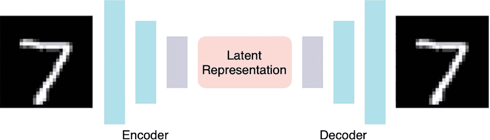
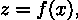
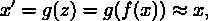
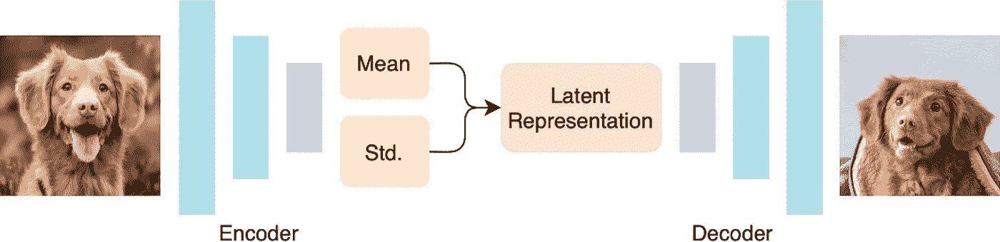
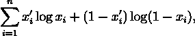
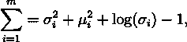
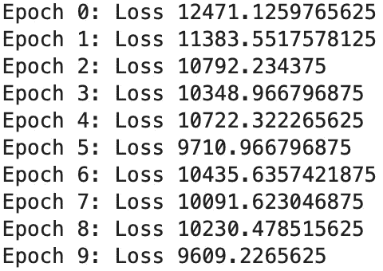
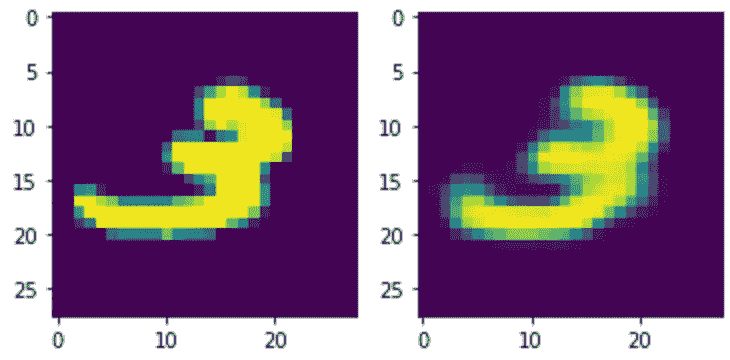

# 在 PyTorch 构建卷积 VAE

> 原文：<https://towardsdatascience.com/building-a-convolutional-vae-in-pytorch-a0f54c947f71?source=collection_archive---------2----------------------->

## 用神经网络生成新图像？

深度学习在计算机视觉中的应用已经从图像分类等简单任务扩展到自动驾驶等高级任务——神经网络揭示的最迷人的领域之一是图像生成。

随着生成对抗网络(GANs)在内容生成方面的能力和成功，我们经常忽略另一种类型的生成网络:变分自动编码器(VAE)。本文讨论了 VAE 的基本概念，包括体系结构和损失设计背后的直觉，并提供了一个简单卷积 VAE 的基于 PyTorch 的实现，以基于 MNIST 数据集生成图像。

# 什么是 VAE？

## 自动编码器

为了理解 VAE 的概念，我们首先描述一个传统的自动编码器及其应用。

图一。传统自动编码器的示意图。

在传统的计算机科学中，我们总是试图找到最佳的方法来将某个文件(无论是图像还是文档)压缩成更小的表示形式。自动编码器是一种特殊类型的神经网络，具有用于降维的瓶颈层，即潜在表示:

其中 *x* 为原始输入， *z* 为潜在表示，*x’*为重构输入，函数 *f* 和 *g* 分别为编码器和解码器。目标是最小化重构输出 *g(f(x))* 和原始 *x* 之间的差异，以便我们知道较小尺寸的潜在表示 *f(x)* 实际上保留了足够的特征用于重构。

除了满足降维的需要，自动编码器还可以用于去噪等目的，即，将扰动的 *x* 输入自动编码器，并让潜在表示学习仅检索图像本身，而不检索噪声。当去噪自动编码器用深度网络构建时，我们称之为堆叠去噪自动编码器。

## **在简单的词语中添加“变化”**

在对自动编码器进行简短描述后，人们可能会问，如何改变这种网络设计来生成内容——这就是“变化”概念的来源。

当我们正则化自动编码器，使其潜在表示不会过度拟合到单个数据点，而是整个数据分布时(关于防止过度拟合的技术，请参考本文[)，我们可以从潜在空间执行随机采样，从而从分布中生成看不见的图像，使我们的自动编码器变得“可变”。为此，我们将 KL 散度的思想融入到我们的损失函数设计中(关于 KL 散度的更多细节，请参考](/8-simple-techniques-to-prevent-overfitting-4d443da2ef7d)[这篇文章](https://wiseodd.github.io/techblog/2016/12/10/variational-autoencoder/))。下面几节将深入介绍使用 PyTorch 从头开始构建 VAE 的具体过程。

# 计算环境

## 图书馆

整个程序仅通过 PyTorch 库(包括 torchvision)构建。在评估结果时，我们还使用 Matplotlib 和 NumPy 库进行数据可视化。这些库可以按如下方式导入:

## 资料组

为了简化演示，我们从最简单的视觉数据集 MNIST 训练了整个 VAE。MNIST 包含 60000 幅训练图像和 10000 幅测试图像，显示从 0 到 9 的手写数字字符。

## 硬件要求

由于 MNIST 是一个相当小的数据集，因此可以纯粹在 CPU 上训练和评估网络。然而，当在其他更大的数据集上使用时，建议使用 GPU 进行计算。为了确定是否使用 GPU 进行训练，我们可以首先根据可用性创建一个可变的*设备* CPU/GPU:

# 网络体系结构

图二。VAE 的示意图。

我们的 VAE 结构如上图所示，它包括一个编码器，一个解码器，在两者之间的潜在表示被重新参数化。

*编码器—* 编码器由两个卷积层组成，后面是两个独立的全连接层，两个层都将卷积后的特征图作为输入。两个全连接层在我们预期的潜在空间的维度上输出两个向量，其中一个是均值，另一个是方差。这是 VAEs 和传统自动编码器之间的主要结构差异。

*重新参数化—* 通过计算平均值和方差，我们随机抽取一个可能出现在给定分布中的点，该点将被用作潜在表示，并输入解码阶段。

*解码器* —该解码器类似于传统的自动编码器，具有一个全连接层，后跟两个卷积层，以基于给定的潜在表示来重建图像。

我们可以使用 PyTorch 构建 VAE 结构的上述组件，如下所示:

# 培训程序

## *损失函数*

VAE 的核心概念之一是其损失函数的设计。简而言之，我们试图设计这样的损失，即它基于给定的图像重建得很好，但也适合整个分布，而不是仅过度适合图像本身。因此，VAE 损失是以下因素的组合:

*二进制交叉熵(BCE)损失—* 计算重建图像与原始图像的像素间差异，以最大化重建的相似性。BCE 损失的计算方法如下:

其中 *xᵢ* 和 *x'ᵢ* 分别表示原始和重建图像像素(总共 *n* 个像素)。

*KL-散度损失—* KL 散度衡量两个分布的相似性。在这种情况下，我们假设分布为正态分布，因此损耗设计如下:

这是通过我们预测的潜在向量(大小为 *m* )中每个值的平均值和 sigma 来计算的。

## 培养

下面的代码显示了培训过程。我们将批量大小设置为 128，学习速率设置为 1e-3，总的时期数设置为 10。

注意，为了简单起见，我们在这里只进行纯训练。然而，建议在每个时期之后，我们在测试集上计算有效性，以防止在训练期间的任何过度拟合。当验证损失达到最低点时，也应该保存检查点。

# (英)可视化(= visualization)

训练之后，我们可以用下面的代码来可视化结果:

图 3。重建结果。左边是原始图像，右边是生成的图像。

从可视化中我们可以看到，我们已经成功地在原始图形的基础上生成了略有不同的数字图形，这就是 VAE 最终要实现的目标！

# 结论

所以你有它！希望这篇文章给你一个基本的概述和指导，告诉你如何从头开始构建你的第一个 VAE。完整的实现可以在下面的 Github 资源库中找到:

 [## ttchengab/VAE

### 此时您不能执行该操作。您已使用另一个标签页或窗口登录。您已在另一个选项卡中注销，或者…

github.com](https://github.com/ttchengab/VAE.git) 

*感谢您坚持到现在*🙏！*我会在计算机视觉/深度学习的不同领域发布更多内容。一定要看看我的另一篇关于一次性学习的文章！*