# 使用 Plotly 和币安 API 构建加密货币仪表板

> 原文：<https://towardsdatascience.com/building-a-cryptocurrency-dashboard-using-plotly-and-binance-api-352e7f6f62c9?source=collection_archive---------1----------------------->

## 轻松跟踪您的投资组合


资料来源:unsplash.com

根据 [CoinMarketCap](https://coinmarketcap.com/) 的数据，截至目前，全球加密货币市场价值超过 1.5 万亿美元。最近，几家银行和信用卡公司批准将加密货币作为其金融产品之一，这预示着加密市场的光明前景。在过去的几年里，越来越多的人开始交易加密货币，全球有许多支持不同加密货币的交易所。在本文中，我们将关注币安交易所，它是当今世界上排名第一的 T2 交易所。它支持几乎所有的加密货币，并在许多国家可用。

在本文中，我们将讨论如何从币安 API 访问数据，并用 Plotly 创建一个仪表板。

**下面是我们将要讲述的内容:**

*   如何设置币安 API
*   如何使用币安 API 获取数据
*   用 Plotly 构建仪表板

# 1.如何设置币安 API

币安提供两种 API 访问:1)实际的币安 API 和 2)测试币安 API。

## 1.1 设置实际的币安 API

实际 API 提供了对您实际账户的直接访问，使用此 API 进行的任何交易都将反映到您的实际账户中。这意味着我们在使用这个 API 时需要小心。

首先，你需要在[https://www.binance.com/en/register?ref=AG3W30LV](https://www.binance.com/en/register?ref=AG3W30LV)注册币安(如果你没有账户的话)(这个链接包括我的推荐代码，会给你 10%的交易费折扣。更多细节可以在[https://www.binance.com/en/activity/referral](https://www.binance.com/en/activity/referral)找到

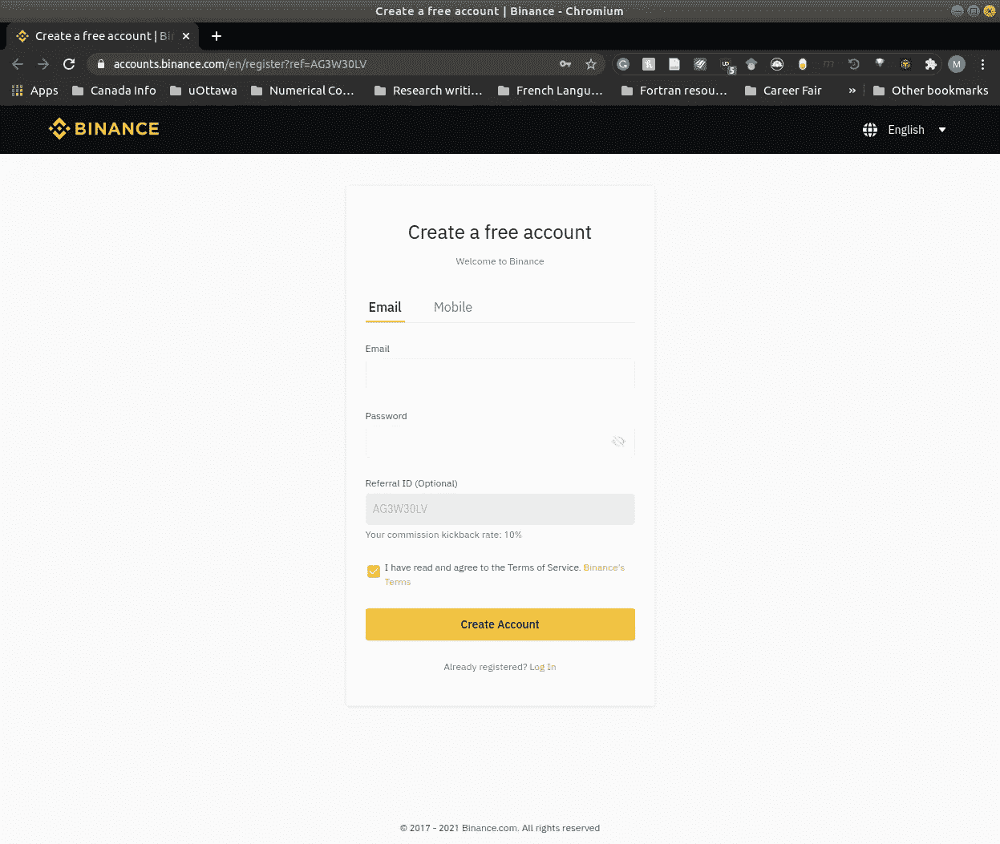

注册后，您将被要求(或者您可以从安全设置中完成)设置双重身份验证以获得额外的安全性。我会推荐选择 Google Authenticator。

设置好 2FA 后，您可以转到“设置”下的“API 管理”选项卡。您将被要求为您的 API 键提供一个标签(当您有多个键与一个帐户相关联时，这将非常有用)。

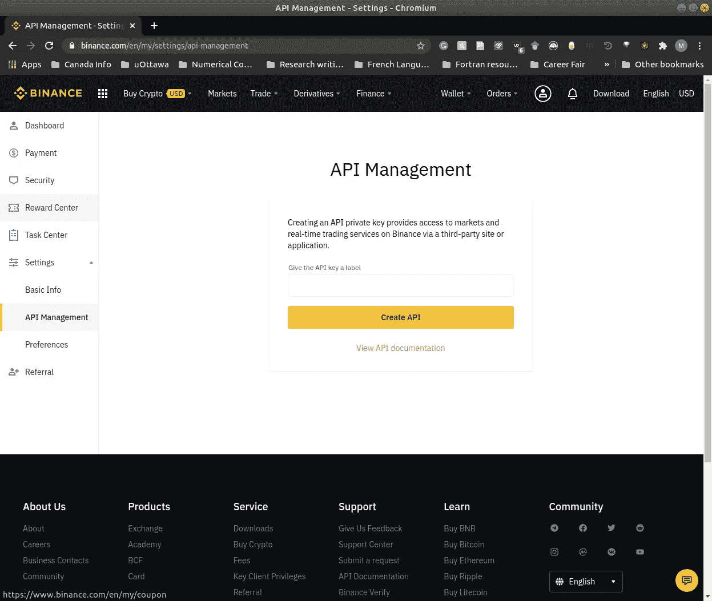

为您的 API 键提供一个标签后，单击 create API。您将被要求再次认证，然后您将能够看到您的“API 密钥”和“秘密密钥”这是你唯一一次看到它，所以把你的钥匙复制到某个安全的地方。默认情况下，这些键将被授予以下访问权限，这些权限是可以更改的。

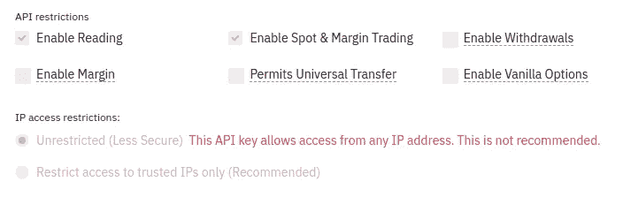

我们将使用实际的 API 和测试 API 键来理解如何使用它们。为此，我们不想搞乱我们的实际帐户，所以我们将把实际的 API keys 权限改为只读。

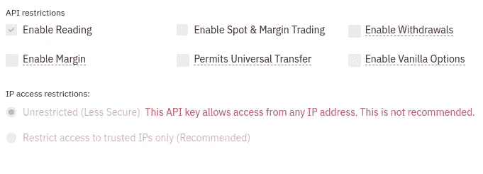

我们将把实际的 API 密匙保存到下面提到的`secret.cfg`文件中(记住，永远不要共享或发布你的`secret.cfg`文件)

## 1.2 设置测试币安 API

测试币安 API 为您提供了与实际 API 交互时相同的感觉。我建议从这个(交易)开始，直到你确信你的应用程序运行良好。

首先，你需要在[https://testnet.binance.vision/](https://testnet.binance.vision/)登录(目前，只有 GitHub 支持登录)

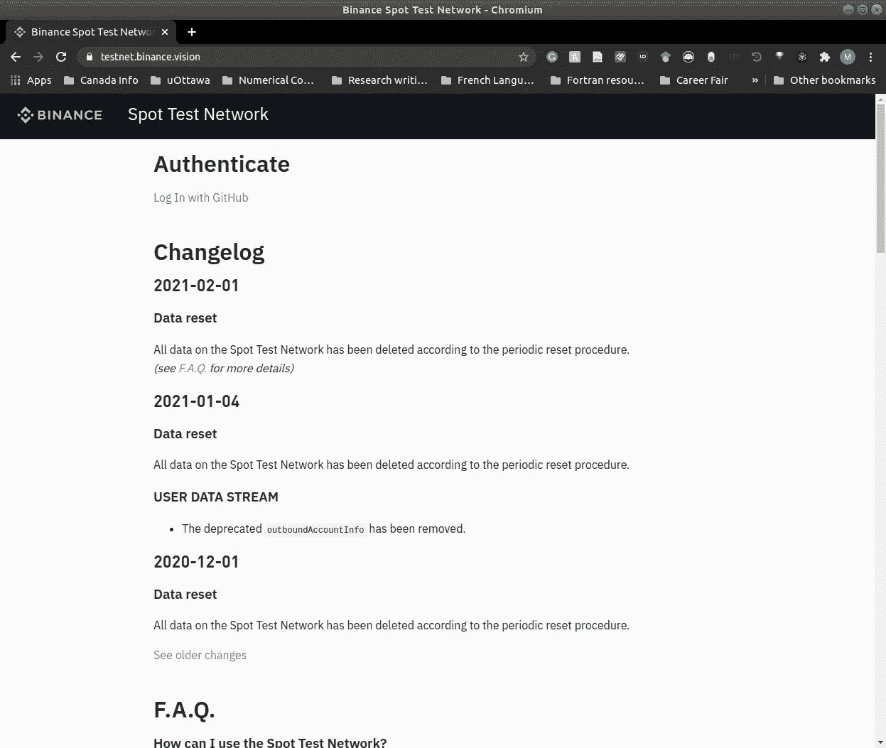

登录后，点击“生成 HMAC_SHA256 密钥”，你将再次被要求提供一个密钥标签。提供标签后，点击 generate，您应该能够看到您的 API 键。把它们复制到某个安全的地方。此外，请阅读主页[上关于测试 API 的所有详细信息。](https://testnet.binance.vision/)

现在，我们将修改`secret.cfg`文件以包含测试 API 键，如下所述

我们已经成功设置了实际和测试 API 密钥，并将其保存到`secret.cfg`文件中。在下一节中，我们将关注使用这些 API 键获取数据。

# 2.如何使用币安 API 获取数据

## 2.1 安装 python-币安库

币安没有提供与 API 交互的 python 库，但是有一个非常著名的第三方库叫做`python-binance`，我们将用它来与 API 交互。

安装`python-binance`库

```
$ pip install python-binance
```

## 2.2 获取账户信息

默认情况下，您将在您的测试帐户中以不同加密货币的形式获得一些余额，我们将在这一部分使用测试 API(因为我不想分享我的帐户信息)。另外，`python-binance`不能访问测试 API，所以我们需要更改端点 URL。

下面是获取测试帐户信息的代码

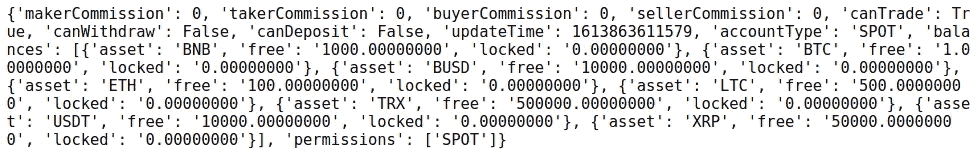

从上面的输出可以看出，它显示了一些重要的东西，比如 accountType、balances、permissions 等。

现在，让我们得到 ETH 平衡。

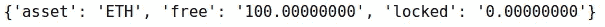

你可以用`python-binance`库做很多事情，详细的文档可以在[这里](https://python-binance.readthedocs.io/en/latest/index.html)找到。

## 2.3 获取历史数据

根据我的观察，测试 API 不提供真实的历史数据；相反，它提供虚拟数据。因此，为了访问真实数据，我们将使用实际的 API 和实际的 API 键。

获取从最早可用日期(币安)到现在的 ETH 价格

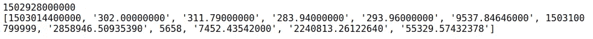

上述输出代表了[币安 API 文档](https://binance-docs.github.io/apidocs/spot/en/#compressed-aggregate-trades-list)中提到的以下参数

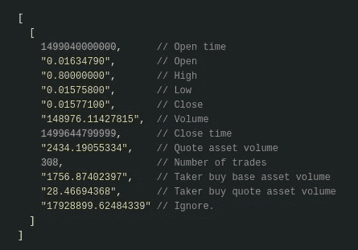

将输出转换为数据框并保存为 CSV 文件

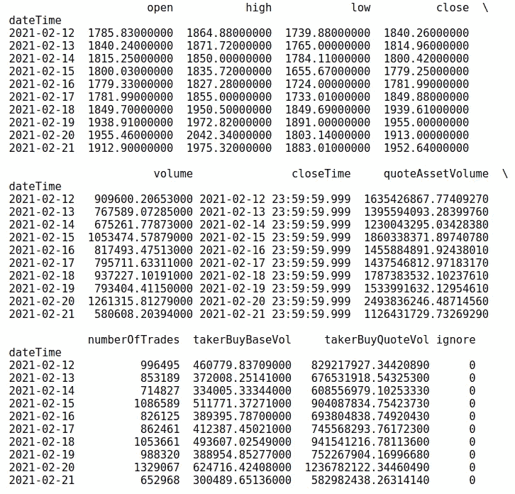

## 2.4 获取实时数据

我们可以使用币安的 WebSocket 来传输实时数据。这是你怎么做的

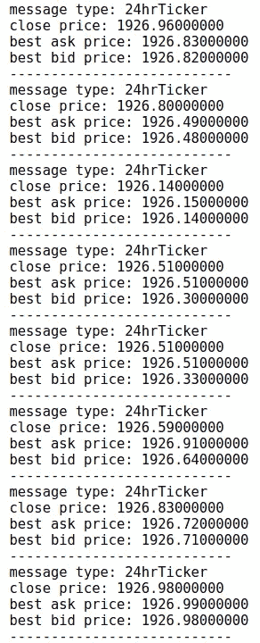

现在，要停止数据流并关闭 WebSocket

看起来我们已经找到了获取数据和信息的不同方法。你可以用`python-binance`库和币安 API 做很多其他的事情。我鼓励你看一看[这个](https://binance-docs.github.io/apidocs/spot/en/#change-log)和[这个](https://python-binance.readthedocs.io/en/latest/index.html)。现在，我们可以在下一节构建一个 Plotly 仪表板了。

# 3.用 Plotly 构建仪表板

在本节中，我们将使用 Plotly 构建一个仪表板，该仪表板将实时跟踪我们的测试帐户组合，并根据实时流数据更改帐户总价值。

这是我们最终的仪表板的样子(不要介意美观，因为您可以在以后更改它)

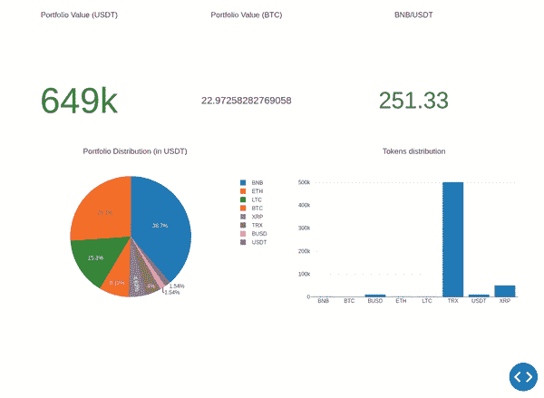

GIF:最终仪表板

如您所见，我们在控制面板中包括了以下功能。

*   指标-USDT 的投资组合总价值
*   指标-BTC 的投资组合总价值
*   指标- BNB/USDT 换算
*   饼图-投资组合分布(在 USDT)
*   条形图-令牌分布

让我们看看代码。

首先，我们将导入所有需要的库。

其次，我们将读取我们的密钥，建立连接，并获得帐户信息。

第三，我们将定义一些函数来处理流数据并基于实时数据计算指标。

第四，我们将开始流式传输数据。

第五，我们将定义我们的仪表板布局、图表并托管它

就这样，你应该能够跟踪你的测试账户投资组合。您可以使用实际的密钥轻松地为实际帐户设置它，而无需更改端点 URL。

这就把我们带到了本文的结尾。你可以访问[这个](https://github.com/mayank311996/blog_code/tree/main/building_cryptocurrency_dashboard_plotly_binanceAPI) GitHub repo 中的所有代码。请随意标记或收藏，以供将来参考。

最近开始用 Python 和机器学习写算法交易系列。你可以在下面找到第一条。

<https://pub.towardsai.net/algorithmic-trading-with-python-and-machine-learning-part-1-47c56706c182>  

更多文章关注我。请随时在 [LinkedIn](https://www.linkedin.com/in/mayankvadsola/) 上联系我。谢谢大家！

***注来自《走向数据科学》的编辑:*** *虽然我们允许独立作者根据我们的* [*规则和指导方针*](/questions-96667b06af5) *发表文章，但我们不认可每个作者的贡献。你不应该在没有寻求专业建议的情况下依赖一个作者的作品。详见我们的* [*读者术语*](/readers-terms-b5d780a700a4) *。*