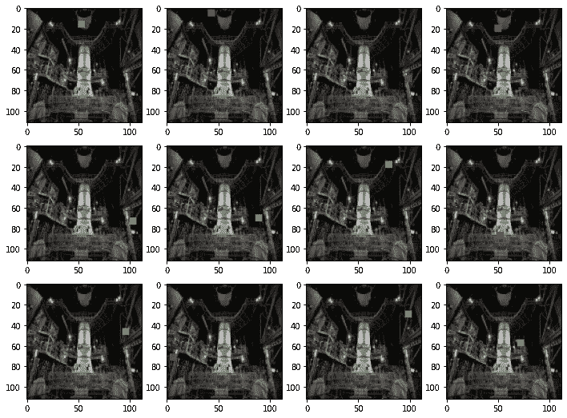

# 为对象检测构建自定义 tf.data 管道

> 原文：<https://towardsdatascience.com/building-a-custom-tf-data-pipeline-for-object-detection-246f5a01d60?source=collection_archive---------25----------------------->

## 从数据生产到模型优化的完整演练


图片来源于 Carol M. Highsmith 的“阿拉斯加管道”，[国会图书馆](https://www.loc.gov/item/2011632949/)，[公共领域](https://www.loc.gov/rr/print/res/482_high.html)

建立有效的输入管道是训练深度神经网络的重要性能优化。除此之外，数据供应甚至需要良好的结构和透明性，以避免成为培训中的错误来源。虽然目前许多开发都在 PyTorch 上运行，但如果您计划使用边缘设备或想要在具有数 TB 数据的大型训练集群上运行，Tensorflow 仍然是一条不错的道路。这就是带有 tf.data.Dataset 的 tf.data API 的用武之地:拥有一个高效的管道来为您提供训练数据，这些数据是通用的，可以扩展到数据中心维度。虽然，将它与您自己的数据一起使用仍然会令人沮丧，因为您可能会碰到现有教程的一些边缘(我碰到过很多)。

这是我给你的建议，也是我从中最大的收获:不要试图使用任何捷径——使用成熟的管道，因为它应该被使用，事情将会非常容易使用和理解。这就是我为您编写本教程的原因——提供一个端到端的示例，其核心很简单，但利用了 tf.data API 的大部分概念(没有使用任何在名为 cats/dogs 的目录结构中用特殊文件名编写文件的快捷方式)。

我们使用以下内容:

*   3000 张图片
*   每个图像包含三种颜色之一的对象(一个点)
*   每个点被放置在图像上的随机位置

当然，我们希望根据给定的图像来预测点在哪里以及它有什么颜色。简单的任务，但是标签可以用目录结构来表示吗——我认为不可能。我是否希望将标签保存在 CSV 文件中，以便再次与基于 UUID 文件名的图像进行匹配——我尝试过，但并不有趣。

我希望我的数据以数据集记录的形式存储图像数据和标签信息，并希望这些数据流入我的模型中进行训练。

如果你也喜欢这个想法，请继续阅读。

在本文中，我主要关注相关代码，以使基于 tf.data 的管道工作。您将在连接的笔记本中获得完整的锅炉板代码:[https://gist . github . com/FHermisch/1a 517121 ECB 11 d0e 0206226 AC 69915 ee](https://gist.github.com/FHermisch/1a517121ecb11d0e0206226ac69915ee)

# 创建图像

“模拟”生成测试数据的大型复杂设置(如数据扩充、机械土耳其等)。)，我选择用一些随机数据生成图像，并使用这些。因此，不会有从一些互联网来源加载的“随时可用”的设置。我们为测试和验证数据创建尽可能简单的图像。对我们来说重要的是，我们使用的数据将具有与自定义图像分类和对象检测任务相当的结构复杂性。如前所述，我们的任务是检测图像中矩形的位置以及矩形的颜色。

我们可以只用纯黑的背景。或者——为了有更多的视觉吸引力，使用一些美国宇航局的图像，因为这些图像通常非常令人印象深刻，而且大多是公共领域使用的。


[*NASA/科里休斯顿*](https://www.nasa.gov/image-feature/artemis-i-stacks-up) ，[公共领域](https://gpm.nasa.gov/image-use-policy)

```
Datatype/shape of base image, web base image: 
uint8 / (112, 112, 3) ,  uint8 / (112, 112, 3)
```

我们继续 NASA 的图像。注意，两个图像都是 112，112 大小，RGB 颜色通道作为“最后通道”(Tensorflow 样式)。

现在，让我们在这个基础上放置一些随机的东西。我们构建了一个函数，将一个给定颜色的对象放在图像上，并返回该对象被放置的位置。这是我们的简单解决方案，生成一些“物体检测”图像。

在“placeobject”函数中，我们初始化要放置在图像上的对象:

*   构建一个 numpy 数组，数组的大小为对象应有的大小
*   乘以颜色值，将每个像素转换为所需的颜色

为了在图像上放置物体，我们选择一个随机的相对 y 和 x 位置。现在，我们可以计算绝对像素位置，并将对象数据复制到基础图像中。

让我们看一看:现在在我们的基本图像上有一个对象，并且打印的位置与图像上的对象位置相匹配。


[*NASA/科里休斯顿*](https://www.nasa.gov/image-feature/artemis-i-stacks-up) ，[公共领域](https://gpm.nasa.gov/image-use-policy)

```
Position 0.9109465116914442 0.13220923689802044
```

我们现在有了一种方法，可以将具有某种颜色的对象放置在我们的基本图像上，并准确地知道我们将该对象放置在什么位置。位置和颜色将是我们以后检测的标签/基础。包含该对象的图像将是我们的训练数据。让我们通过随机选择颜色来自动生成大量的图像和标签。

让我们先生成 5 张图片并打印出标签。

```
Generated data (112, 112, 3) 0.8395090863371965 0.9547828984929204 ObjColorTypes.SPECIAL
Generated data (112, 112, 3) 0.5531254931489215 0.4768844126516376 ObjColorTypes.GREEN
Generated data (112, 112, 3) 0.47239734539676304 0.23156864975331592 ObjColorTypes.RED
Generated data (112, 112, 3) 0.539600313491926 0.14757914149460205 ObjColorTypes.SPECIAL
Generated data (112, 112, 3) 0.6978451492963156 0.5689848230831969 ObjColorTypes.RED
```

我们还应该对数据有一个直观的看法。后来，我们想训练一个人工智能从这些图像中学习一些东西——所以对人工智能好一点，在你把它喂给人工智能之前自己看一下:你能看到你想让人工智能看到的东西吗？！



[*NASA/科里休斯顿*](https://www.nasa.gov/image-feature/artemis-i-stacks-up) ，[公共领域](https://gpm.nasa.gov/image-use-policy)

# 写入 TFRecord 数据

首先，我们设置一个类，它包含了写这些记录所需的所有东西。原谅我，因为我是在 OO 范式中长大的，拥有类和实例化的对象对我来说很自然。您也可以在这里使用带有部分参数或任何其他参数的函数。

```
import randomclass QTFRec():

    def __init__(self, fname):
        self.fname = fname
        self.tfwriter = tf.io.TFRecordWriter(self.fname)

    def _bytes_feature(self, nparr):
        return tf.train.Feature(
            bytes_list=tf.train.BytesList(value=[nparr.tobytes()]))def _float_feature(self, nparr):
        return tf.train.Feature(
            float_list=tf.train.FloatList(value=nparr))def write_record(self, image, poslabel, collabel):feature = {
            'image_raw': self._float_feature(
                image.ravel()),          
            'img_shape': self._bytes_feature(
                np.array(image.shape, dtype=np.uint8).ravel()),
            'poslabel': self._float_feature(
                poslabel.ravel()),
            'collabel': self._float_feature(
                collabel.ravel())
        }tf_example = tf.train.Example(
            features=tf.train.Features(feature=feature))
        self.tfwriter.write(
            tf_example.SerializeToString())

    def close_record(self):
        self.tfwriter.flush()
        self.tfwriter.close()
```

在我们的类中，我们构建了一个 TFRecord writer，它将用于以 TFRecord 格式将数据写入磁盘。TFRecord 是一种以顺序方式存储数据示例的方法。其中每个例子由一组特征组成。
我们将‘write _ record’函数中的特征定义为一个字典。在这种情况下，我们有图像数据、图像上对象的位置、对象的颜色，并且我们还想存储图像数据的形状。
TFRecord 允许为特征选择特定的数据类型。对于我们的特性，我们使用字节列表和浮点列表。

现在，我们将实际数据放入特性中:我们从 numpies 中的数据开始，这非常方便。我们把它们平铺开来。ravel()')并将它们放入各自的功能构造函数中。您可能想知道为什么我们将图像数据存储为浮点数？这是一个设计选择(哎呀！—稍后阅读此设计选择的效果),因此我们已经在 0 <=val<=1 range, so we can later feed this directly to the training. You will see that there are a couple of places suitable for data conversions — if you have saved it here as uINT8 you can later convert it in the feeding pipeline.
中存储了带有颜色值的图像数据。我们需要的最后一件事是关闭 writer，以确保所有内容都已写入磁盘。我们添加了一个 close_writer 方法来完成这项工作(小插件:您可以将其更改为与 python 的‘with’语句一起工作)。

就是这样。还有一件事我们稍后会谈到:我们目前没有将验证数据从训练数据中分离出来。有人可能认为会有一个简单的“split_dataset”函数，我们可以在以后使用，但没有数据集。这是可以理解的，因为 tf.data 是为处理数十亿条记录而构建的，不能简单地以某种方式拆分数十亿条记录。我们稍后将扩展我们的类，以实际写入两组记录。但是让我们先继续训练数据…

我们创建了一个 QTFRec 实例，并构建了另一个小类来封装它，并提供了一个正好适合我们的数据生成回调的函数。好了，这个管用。现在，我们可以为我们的训练集生成合理数量的记录。

```
qtfr = QTFRec(fname)
tfrsaver = TFRsaver( qtfr)
generatedata(baseimg, 3000, tfrsaver.savedata)     
qtfr.close_record()
```

让我们使用这个数据集来设置一个输入管道来训练一个模型。接下来的步骤相当于使用 tfds 的教程，例如来自 tfds 的 MNist。我们将重点关注需要一些转换逻辑的部分，以使我们的数据适应模型训练需求(我们之前也可以用更适合的方式编写数据，但让我们这样做是为了向您展示可以为您的数据和管道放置自定义转换需求的位置)。

# 建造管道

再次打开写入的数据集很容易。

```
tfrds = tf.data.TFRecordDataset(TRAINSET_FNAME)
```

我们可以使用在线文档，但我喜欢使用内置的“帮助(tfrds)”来查看我得到了什么类型以及它提供了什么功能的便捷方式。

不出所料，TFRecordDatasetV2。
值得注意的功能:

*   应用'
    ,在其上映射一个转换函数，并构建一个转换管道:看起来不错——我们稍后会用到它
*   对于研究结构和内容来说，这听起来很方便
*   其他流水线功能，批处理/混洗等。
*   从管道末端取出一定数量的元素

让我们试着看看会发生什么:

```
for npelem in tfrds.as_numpy_iterator():
    print( type(npelem))
    barr = np.frombuffer(npelem, dtype=np.byte )
    print( barr.shape)
    break
```

让我们看看它会打印出什么。

```
<class 'bytes'>
(150629,)
```

我们得到了一个 150629 的数字形状，这应该是大约 112x112x3 = 37632？等等，发生什么事了？好了，我们将图像数据存储为浮点数(出于方便)，因此我们将每个颜色值从一个字节(uint8)扩展到 4 个字节(float32)。我们真的应该改变这一点——所以要经常看看你的数据。想想，明明很清楚却被我错过了。我把它作为一个例子留给你。为了方便起见，有更好的方法来浪费你的磁盘和 IO，然后存储 4 倍的大小。

让我们继续。我们从数据集中得到一个张量，我们可以选择将不同的变换映射到这个集合。我们构建了一个 DataRead 类，作为上面的 writer 类的对等物。

```
class DataRead():
    def __init__(self):
        self.feature_description = {         
            'image_raw': 
                tf.io.VarLenFeature( dtype=tf.float32),
            'img_shape': 
                tf.io.FixedLenFeature([], tf.string),
            'poslabel': 
                tf.io.VarLenFeature( dtype=tf.float32),
            'collabel': 
                tf.io.VarLenFeature( dtype=tf.float32)            
        }def prepdata( self, fmap):
        pmap = tf.io.parse_single_example(
                fmap, self.feature_description)imgraw = tf.sparse.to_dense(pmap['image_raw'])
        imshape =  tf.io.decode_raw(pmap['img_shape'], tf.uint8)
        poslabel = tf.sparse.to_dense(pmap['poslabel'])
        collabel = tf.one_hot( tf.cast( 
            tf.sparse.to_dense(pmap['collabel']), tf.uint8),  tf.constant(3))[0]

        return (tf.reshape( imgraw, tf.cast(imshape, tf.int32)),
                tf.concat( [poslabel,collabel], axis=-1))
```

我们首先要解析张量，因为里面的所有东西都是字节。因此，为不同的元素设置一个 feature_description 字典。我们的“prepdata”函数稍后将被映射到管道。我们解析单个条目，以便能够访问指定记录中的每个特性。这是为数据添加额外转换代码的好时机。我们必须进行转型:

*   将原始图像数据重新整形为结构化的形状:
    我们首先解码形状，并使用它将图像数据重新整形为其原始的 112x112x3 形状
*   将标签数据放在一个张量中:
    我们将位置标签与 colortype 连接在一起，之前我们将其转换为一键表示

现在，我们得到了 1x112x112x3 的漂亮图像数据，用于将目标/地面真相的 a 标签训练为 1x5。

输入管道只是将一堆转换映射在一起。映射我们刚刚构建的解析函数。映射缓存函数。在每一次完整迭代后洗牌。从单个管道项目中形成批次。启动一些预取，以便总是在需要时为培训准备好批次。

```
datar = DataRead()traindat = tfrds.map( 
    datar.prepdata, 
    num_parallel_calls=tf.data.experimental.AUTOTUNE)
traindat = traindat.cache()
traindat = traindat.shuffle(
    1000, seed=1234, reshuffle_each_iteration=True)
traindat = traindat.batch(
    BATCHSIZE, drop_remainder=True)
traindat = traindat.prefetch( 
    tf.data.experimental.AUTOTUNE)
```

由于结果仍然是数据集，我们再次使用 as_numpy_iterator 函数。现在，数据以我们转换后的格式弹出，我们可以轻松地可视化图像数据和标签。


[*NASA/科里休斯顿*](https://www.nasa.gov/image-feature/artemis-i-stacks-up) ，[公共领域](https://gpm.nasa.gov/image-use-policy)

```
[0.602948  0.2850269 0\.        0\.        1\.       ]
```

# 一个非常简单的物体检测

本文的重点不是如何进行对象检测。所以我们没有进入下一步的细节:
建立一个有一些回旋的模型，最后有一些完全连接的层。输出只是一个 sigmoid，它将被训练以匹配我们的标签(这是非常基本的，但适用于这个极其简化的示例)。

```
Model: "functional_1"
_________________________________________________________________
Layer (type)                 Output Shape              Param #   
=================================================================
input_1 (InputLayer)         [(None, 112, 112, 3)]     0         
_________________________________________________________________
conv2d (Conv2D)              (None, 112, 112, 16)      448       
_________________________________________________________________
re_lu (ReLU)                 (None, 112, 112, 16)      0         
_________________________________________________________________
max_pooling2d (MaxPooling2D) (None, 38, 38, 16)        0         
_________________________________________________________________
conv2d_1 (Conv2D)            (None, 38, 38, 32)        4640      
_________________________________________________________________
re_lu_1 (ReLU)               (None, 38, 38, 32)        0         
_________________________________________________________________
max_pooling2d_1 (MaxPooling2 (None, 13, 13, 32)        0         
_________________________________________________________________
flatten (Flatten)            (None, 5408)              0         
_________________________________________________________________
dropout (Dropout)            (None, 5408)              0         
_________________________________________________________________
dense (Dense)                (None, 128)               692352    
_________________________________________________________________
re_lu_2 (ReLU)               (None, 128)               0         
_________________________________________________________________
dense_1 (Dense)              (None, 64)                8256      
_________________________________________________________________
re_lu_3 (ReLU)               (None, 64)                0         
_________________________________________________________________
batch_normalization (BatchNo (None, 64)                256       
_________________________________________________________________
dense_2 (Dense)              (None, 5)                 325       
=================================================================
Total params: 706,277
Trainable params: 706,149
Non-trainable params: 128
_________________________________________________________________
```

用 SGD 作为优化器，MeanSquaredError 作为 loss 进行编译。

运行它…哦，等等…我们没有验证数据！

```
Epoch 1/10
46/46 [==============================] - 1s 15ms/step - loss: 0.1976
Epoch 2/10
46/46 [==============================] - 1s 15ms/step - loss: 0.1801
Epoch 3/10
46/46 [==============================] - 1s 14ms/step - loss: 0.1655
...
```

我们确实需要一个验证集来获得任何有意义的见解。让我们改变写数据的代码。我们希望保留一定比例的图像用于验证，并将它们保存到另一个数据集。
我们需要添加代码来初始化(并在稍后关闭)一个额外的编写器。在“write_record”中，我们添加了一个随机步骤，该步骤生成一个介于 0 和 1 之间的均匀随机数，并根据与提供的验证分割百分比的比较，将生成的数据发送给训练或验证。

在这里，我们随机分割数据，但这也是放置一些更“智能”逻辑的地方，例如，确保在人脸检测场景中，验证集将只包含根本不在训练集中的人。这种分割逻辑应该接近数据的生成，并且不能在以后或在训练期间完成。

我们再次运行并为训练和验证提供文件名以及 20%分割百分比。

```
qtfrec = QTFRecVal(FNAME, 0.2, FNAMEVAL)
tfrsaver = TFRsaver( qtfrec)
generatedata(baseimg, 3000, tfrsaver.savedata)     
qtfrec.close_record()
```

运行以生成 3000 幅图像(20%将放入验证集)。

为验证建立第二个管道(我们不必打乱验证)。

```
tfvalrds = tf.data.TFRecordDataset(FNAMEVAL)
valdat = tfvalrds.map( 
    datar.prepdata, num_parallel_calls=tf.data.experimental.AUTOTUNE)
valdat = valdat.cache()
valdat = valdat.batch(BATCHSIZE, drop_remainder=True)
valdat = valdat.prefetch( tf.data.experimental.AUTOTUNE)
```

生成、编译和运行 100 个时期。

```
...
Epoch 98/100
38/38 [==============================] - 1s 19ms/step - loss: 0.0020 - val_loss: 8.0567e-04
Epoch 99/100
38/38 [==============================] - 1s 20ms/step - loss: 0.0022 - val_loss: 8.2248e-04
Epoch 100/100
38/38 [==============================] - 1s 18ms/step - loss: 0.0021 - val_loss: 7.9342e-04
```

看看损失是如何演变的。这里有一句关于准确性的话:我们不能使用现成的准确性函数，因为它们不能代表我们所做的。如果您想要一些准确性，您必须提供自己的函数:例如，检查是否预测了正确的颜色值，以及目标位置和预测位置之间的欧几里德距离是否低于某个阈值。


# 它能预测吗？

我会说是的——大部分是。颜色值预测得非常好，但我预计位置检测会执行得更好…
好消息:您现在可以使用 tf.data 管道为您的检测构建自己的自定义示例了。


[*NASA/科里休斯顿*](https://www.nasa.gov/image-feature/artemis-i-stacks-up) ，[公共领域](https://gpm.nasa.gov/image-use-policy)

```
Groundtruth label:      [0.5074 0.7342 0\.     0\.     1\.    ]
Prediction from model:  [0.5104 0.7335 0.0157 0.0145 0.9913]
```

完整的笔记本可作为一个要点:

[https://gist . github . com/FHermisch/1a 517121 ECB 11 d0e 0206226 AC 69915 ee](https://gist.github.com/FHermisch/1a517121ecb11d0e0206226ac69915ee)