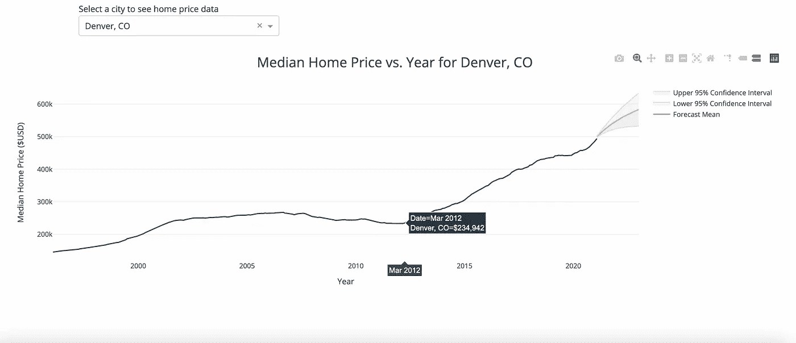
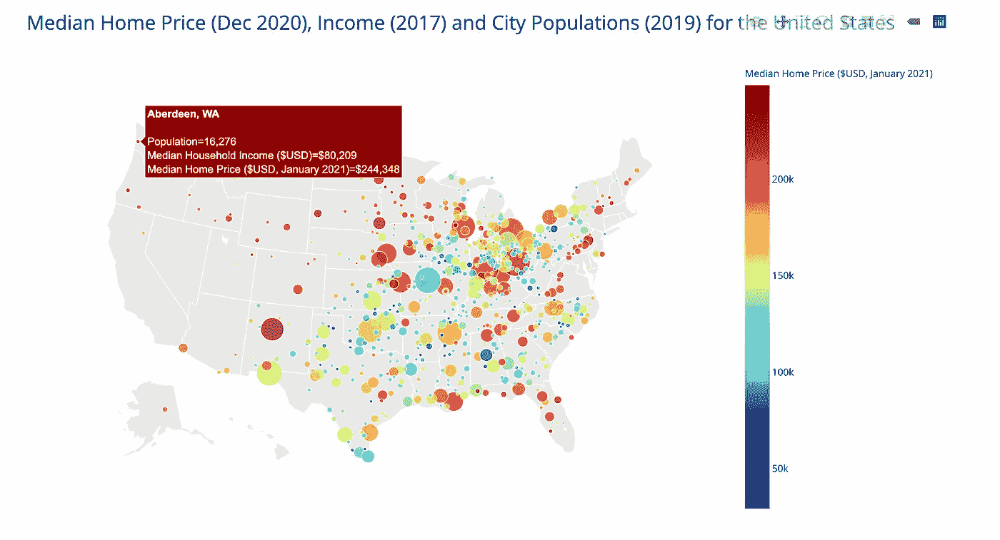
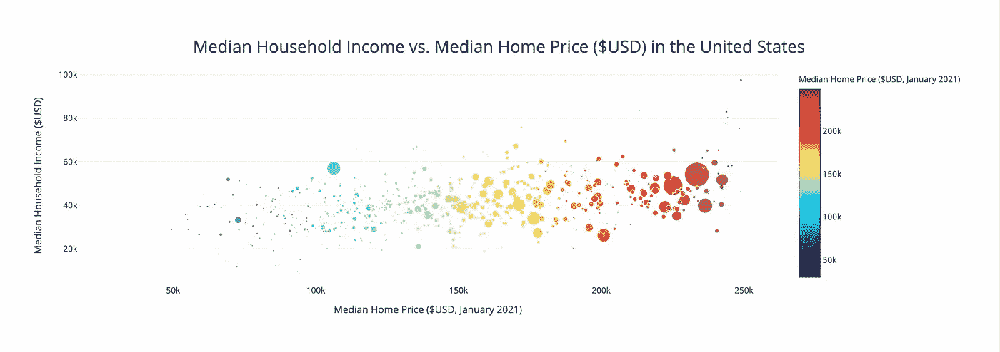

# 使用 Python 中的 Plotly-Dash 构建房价数据仪表板

> 原文：<https://towardsdatascience.com/building-a-data-dashboard-for-housing-prices-using-plotly-dash-in-python-7aca9c49592c?source=collection_archive---------32----------------------->

## 查看美国城市房价、收入数据和人口的仪表板示例


照片由[罗恩·霍维尔](https://unsplash.com/@insolitus?utm_source=medium&utm_medium=referral)在 [Unsplash](https://unsplash.com?utm_source=medium&utm_medium=referral) 上拍摄

以简洁、易于理解的方式向您的受众传达数据项目的结果可能非常困难——当我准备向受众展示数据时，我花费了比我愿意承认的更多的时间来考虑颜色、标记样式、图表格式等。我记得在我作为一名科学家的职业生涯早期，我使用 Excel 制作图表，并思考…为什么为我的数据集选择一种颜色如此困难？如今，数据仪表板似乎风靡一时，这是有原因的——它们可以帮助你以一种美观、易于理解的交付方式传达你的分析结果。虽然我仍然发现自己在制作仪表板时考虑了所有上述的设计因素，但所有这些决定都感觉容易多了。

我不能确切地告诉你为什么，但我发现房子和房价令人着迷。也许这是我多年来一直坚持的 HGTV 饮食习惯😆在考虑我下一篇数据科学文章的主题时，这似乎是一个很好的起点。

虽然我完全赞成尽可能简单地解释事情，但这毕竟是一个编码博客，所以我将在下面解释我创建这个仪表板的工作流程。如果你想跳过技术细节，直奔仪表盘，[点击这里](http://mp-houseprices.herokuapp.com/)。



仪表板中科罗拉多州丹佛市历史和预测房价的时间序列图。图片作者。

对于这个项目，我将使用 Plotly-Dash，这是一个用于创建分析数据 web 应用程序的 Python 库。Plotly 是一个数据可视化库，类似于 matplotlib，但允许您制作交互式图形，并将它们集成到 Dash 中。

我首先前往 Zillow 网站下载房价数据——我使用 Zillow 的所有住宅(单户住宅和公寓)的住宅价值指数(ZHVI)数据集作为原始时间序列数据，这些数据着眼于“中档”价格范围内的住宅。Zillow 将“中间层”定义为价值在第 35 至 65 百分位范围内的房屋，中位数在此范围内。我从 [Kaggle](https://www.kaggle.com/goldenoakresearch/us-household-income-stats-geo-locations) 下载了收入数据——虽然有些人认为 Kaggle 数据集对于数据科学项目来说过于“干净”,但我还是选择了它，因为我实际上是在组合一些不同的数据集，为仪表板创建我自己的数据集。最后，我调用 Geonames API 来下载每个城市的纬度、经度和人口数据。当我进入 Zillow 数据集时，我发现了许多需要重命名的城市，以便使用 Geonames API。在我看来，清理数据并不是这份工作中最吸引人的部分，但却是一个没有得到足够重视的重要部分。一些城市的收入数据也有很多条目，所以我按照每个城市的平均值将它们分组:

经过一点清理后，我将城市放入一个 Python 列表中，并使用 Geonames API 遍历它们，以迭代方式下载每个城市的纬度、经度和人口。注意，你需要在 Geonames.org[网站](http://www.geonames.org/)上注册才能使用他们的 Python API，关键是你的用户名:

有了这些结果，我将人口数据添加到一个 Python 字典中，将城市名作为键，将人口作为值，这样我就可以很容易地确定哪些城市的人口值为零(也就是说，API 不起作用)。我对 API 提取人口数据的成功率进行了快速统计，发现它成功下载了大约 94%的城市的人口数据。我从维基百科手动添加了另外 6%的人口。记住:编码永远不会让你到达目的地。但是在这种情况下，它让我完成了 94%的路程，这节省了我很多时间。编码并不否定对结果进行手动质量控制的需要。

接下来，我对 income 数据集执行了一个左外连接，以将其与 Zillow 数据集合并。这是一个 SQL 概念，意味着 Zillow 数据集的大小将保持不变。如果 Zillow 数据集中存在某个城市的收入数据，则仅将其添加到该数据集中。如果某个城市没有收入数据，它会用 NaN(不是数字)值填充该列。我还最终确定了在 Dash 中作为数据表使用的数据集:

最后，我还在仪表板上完成了一个用于房价时间序列的数据框架(下面的“df_h”)，并在每个城市循环，预测未来两年的房价。我使用了 statsmodels 库中的自回归综合移动平均(ARIMA)模型。对于时间序列数据，这是一个非常好的机器学习算法。如果你对我为什么不使用 Scikit-Learn 来完成这个任务感到好奇，可以在 Github 上查看这个例子。

好吧！我们终于准备好了构建仪表板的所有数据。我是 Jupyter 实验室大多数 Python 开发的忠实粉丝，因为我喜欢在编写代码时能够轻松运行代码。然而，您可能想要切换到某种文本编辑器来在 Dash 中部署您的应用程序——我选择了 Spyder。你可以在 Jupyter 实验室运行 Dash，但我最终更喜欢文本编辑器。

要开始创建应用程序，您需要在计算机上创建一个目录来存储与应用程序相关的所有文件，并且需要在该目录中初始化一个虚拟环境。虚拟环境是您创建的文件夹中 Python 的一个独立实例，您必须重新安装 Python 标准库中未包含的任何库。在您的终端(Mac)中输入以下代码:

```
$ mkdir housing_dash && cd housing_dash
$ python3 -m venv venv
$ source venv/bin/activate(venv) $ python -m pip install dash
(venv) $ python -m pip install plotly
(venv) $ python -m pip install pandas
(venv) $ python -m pip install gunicorn
```

将应用程序需要的数据帧添加到这个文件夹中，并在同一个文件夹中创建一个 python 文件(这里的约定很简单，我选择了“app.py”)。此外，您需要在应用程序文件夹中创建以下文件(粗体文本=文件名):

**requirements.txt'** 您的虚拟环境使用以下版本的库(如果您运行不同的版本，请相应地调整版本):

```
dash==1.19.0 
pandas==1.2.3 
gunicorn==20.0.4
```

**'runtime.txt'** 在您的虚拟环境中运行 Python 版本:

```
python-3.9.0
```

**’。gitignore'** :

```
venv 
*.pyc 
.DS_Store 
.env
```

**‘过程文件’**:

```
web: gunicorn app:server
```

如果需要检查 Python 或 Python 库的版本，可以在终端中调用以下代码:

```
#check Python version
(venv) $ python3 --version
Python 3.9.0#check Pandas version
$ python3
>>>import pandas as pd
>>>pd.__version__
'1.2.3'#check Dash version
$ python3
>>>import dash
>>>dash.__version__
'1.19.0'
```

好了，这就是文件夹设置。下面是我的完整 Dash 应用程序代码。我导入了上面创建的 csv 文件，布置了应用程序，并创建了“应用程序回调”来增加图形的交互性。应用回调使用您定义的函数，并且任何时候输入参数之一改变(例如下拉菜单，用户查询一个表，等等)，回调在你指定的输出上调用函数。注意，在函数和回调函数之间不能有任何空格，函数必须放在回调函数下面的下一行，否则将不起作用。

Dash 在其关键字参数中广泛使用字典和列表，因此在构建 Dash 应用程序时，熟悉这些 Python 概念肯定会有所帮助。

要部署应用程序，建议使用 Git 和 Heroku，尽管还有其他方法来部署您的应用程序，以便任何人都可以查看它。在这一部分，我不会讲太多细节，但是如果你已经做到了这一点，你就已经成功了。 [Dash 有关于如何做到这一点的优秀文档](https://dash.plotly.com/deployment),网上有大量资源可以帮助你部署你的应用。即使你对 Python 很有经验，部署你的应用程序也可能是一个令人抓狂的过程。如果您的应用程序成功部署到 Heroku，您可能会在第一次在浏览器中加载应用程序时收到一条错误消息，感觉就像这样:


功劳:生活大爆炸理论。

我可以提供一些建议:

*   仔细检查你的 **requirements.txt** 和 **runtime.txt** ，确保你用来开发代码的版本与你的。txt 文件。你的 Python 版本也必须完全像这样写:python-3.x.x '，
*   三重检查您的代码，并在您的终端中运行:

```
heroku --tail
```

*   深呼吸，耐心点。你能行的😃

当我在做这个项目时，我无法停止思考《瑞克和莫蒂》中外星人试图通过欺骗杰瑞与他们一起开发应用程序来接管地球的那一集😆

鸣谢:Giphy/RickandMorty.com

下面是我使用该应用程序的视频演示和一些截图。时间序列有一个下拉菜单，显示数据框架中每个城市(总共 913 个)的房价与年份的关系，其中大约一半城市有两年的房价预测。此外，当您筛选数据表时，地图和图形将会更新。您可以输入诸如' > 300000 '或'<100000’, and the table will accept multiple queries:

Video by author.



Image by author.



Image by author.

And there you have it! That is how you build an app using Dash in Python. One of my favorite things about data science is how interdisciplinary it is — this could be financial, medical, sales, engineering, or some other kind of data, but the data portion of the project will approximately be the same, regardless of the discipline.

Thanks for reading!

Martin

## **引用**之类的内容

[1] Zillow，2021，Zillow 房屋价值指数数据(ZHVI)，所有房屋，时间序列，原始中间层:[https://www.zillow.com/research/data/](https://www.zillow.com/research/data/)

[2]金橡树研究集团，2017 年，美国家庭收入统计:

[https://www . ka ggle . com/goldenoakresearch/us-household-income-stats-geo-locations](https://www.kaggle.com/goldenoakresearch/us-household-income-stats-geo-locations)