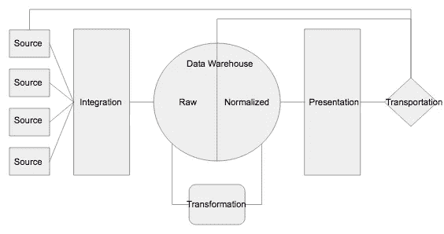

# 2021 年构建数据平台

> 原文：<https://towardsdatascience.com/building-a-data-platform-in-2021-b759f6470426?source=collection_archive---------2----------------------->

## 如何构建一个现代化、可扩展的数据平台来支持您的分析和数据科学项目。

**目录:**

**—** [**站台**](#460c)

**—** [**整合**](#cdb2)

**—** [**数据仓库**](#d5e8)

**—** [**转化**](#4fc4)

**—** [**演示文稿**](#407f)

**—** [**运输**](#1ca4)

**—** [**关闭**](#e6f1)

你知道有句谚语说得好——“给猫剥皮的方法不止一种”

作为一个自豪的猫父母，这对我来说是一个艰难的比喻，但当涉及到 21 世纪的数据时，这种情绪从未如此准确。

诚然，你可以用电子表格、python 脚本或终端命令解决大多数数据问题，但当你开始考虑规模、速度和一致性时，问题很快就会出现。此外，数据领域的一系列工具和流程抑制了协作并推动了工具集的专业化，而不是促进对统计、数据建模和有效可视化等核心数据科学概念的深入理解。

幸运的是，一个一致的框架已经开始出现。构建数据平台的新方法一部分是自己动手，一部分是替我做。它包括将托管服务缝合在一起，并在您的平台中设计足够的灵活性来预测未知。如果操作正确，这种现代基础设施可以让数据专业人员专注于解决复杂的数学和科学问题，而不是简化围绕管理和文档的陈旧流程。

# 站台

这种构建现代数据平台的方法中的一个关键概念是模块化。尽管有聪明的营销和销售活动，目前还没有一个供应商或技术拥有整个数据领域。因此，了解每个组件是为您的特定项目拼凑正确解决方案的关键…组件如下:

*   来源
*   综合
*   数据仓库
*   转换
*   介绍会；展示会
*   运输

# 综合

我们假设源组件是显而易见的。数据源有多种形状和大小，集成层应该足够灵活，能够考虑到所有的数据源。

在这个组件的 DYI 频谱上是流行的工具，例如 [Airflow](https://airflow.apache.org/) ，许多公司用它来构建健壮的端到端数据管道。其他 Apache 产品，如 [Kafka](https://kafka.apache.org/) 提供了一种更基于事件的数据集成方法，可以与 Airflow 结合使用，以进一步扩展定制数据管道。

托管服务在集成领域已经走过了漫长的道路。除了前面提到的 Apache 项目的企业级版本，如[天文学家](https://www.astronomer.io/)(气流)和[汇流](https://www.confluent.io/)(卡夫卡)，这个领域还有几个领导者提供灵活性，但足够固执己见，以有意义的方式帮助加速开发。**从基于事件的角度来看，** [**段**](https://segment.com/) **是不可否认的领导者，而**[**five tran**](https://fivetran.com/)**等解决方案已经成为更传统的基于 ETL/ELT 的数据集成的实际解决方案。**

# 数据仓库

可能现代数据平台中最模糊也是最关键的组件是数据仓库。这部分是因为 SQL Server、Postgres 和 MySQL 等传统数据库技术仍然非常有效。然而，像[雪花](https://www.snowflake.com/)这样的新来者的统治地位已经为未来突出了清晰的道路。基于云的数据仓库，如 Snowflake、RedShift 和 BigQuery，在存储、访问和管理数据的方式上比它们的前辈提供了许多好处。

无论您根据自己的情况选择哪种基于云的数据仓库，将该仓库划分为不同功能层的概念仍然是一个不断发展的概念。最佳实践开始出现，建议您的数据仓库至少有两个不同的“区域”;一个存储原始/非结构化数据，另一个存储规范化/转换后的数据。这个话题有很大的争论空间，但是拥有这两个不同区域的总体好处是能够有效地管理不断变化的规则，将原始数据转换为可消化的信息。

# 转换

如果数据仓库组件是现代数据堆栈中最关键的部分，那么转换组件是最容易被忽略的部分。大多数项目倾向于将转换分散到业务工具、可视化平台和电子表格等人工制品中，但是集中管理数据转换是成熟数据组织的一个明显特征。

随着 ETL 和 ELT 之间的斗争，有效管理转换的想法开始在主流中显现。虽然这看起来有些迂腐，但对一个常见缩写中的字母进行简单重组，开创了一个全新的时代，允许非数据人员参与构建数据产品。这种范式转变也赋予了数据治理和 MDM 等概念新的生命，这些概念严重依赖于业务涉众的输入。

从 DIY 的角度来看，Python 是至高无上的，因为它可以通过像 [SQLAlchemy](https://www.sqlalchemy.org/) 和 Airflow 这样的模块轻松管理简单的基于 SQL/任务的转换，并且是为由 [Tensorflow](https://www.tensorflow.org/) 、 [Scikit-learn](https://scikit-learn.org/stable/) 和更多其他模块驱动的更复杂的机器学习转换量身定制的。

从托管服务的角度来看，很难找到比 [dbt](https://www.getdbt.com/) 更好的产品。虽然所有主要的云提供商(AWS、微软、谷歌)都有自己的一套工具来管理他们平台上的转换，但从平台不可知的角度来看，dbt 似乎走在了前面。

# 介绍会；展示会

到目前为止，我们讨论的大多数组件都是纯基础设施。虽然大多数数据分析师、工程师和科学家将使用来自数据仓库和转换组件的内容，但大多数最终用户在访问表示层的仪表板之前不会看到任何内容。

坦率地说，表示组件是一个庞大的类别。谁说一个 [Jupyter 笔记本](https://jupyter.org/)，同样包含了变身元素，就不能同时作为演示工具？毕竟， [Databricks](https://databricks.com/) 已经非常成功地运用了这一策略，因为它们似乎即将成为 20 年代的下一个大型科技公司 IPO 之一。

从历史的角度来看，可视化工具已经主导了转换和表示类别，像 [Looker](https://looker.com/) 、 [Power BI](https://powerbi.microsoft.com/en-us/) 、 [Qlik](https://www.qlik.com/us/) 、 [Sisense](https://www.sisense.com/) 和 [Tableau](https://www.tableau.com/) 这样的工具证明了管理转换和构建漂亮的可视化并不是互斥的概念。

随着数据堆栈的不断发展，我相信表现空间的冠军将是那些加倍重视可视化能力而较少依赖变革能力的人。随着组织集成更多数据源和数据量呈指数级增长，**在表示层管理转换不仅会带来挑战，还会产生定义不清的信息和不准确的分析。**

# 运输

考虑到交通因素，这种方法变得非常现代。在过去，终端用户通过仪表盘和外部分析工具消费信息是可以接受的，但越来越明显的是**除非数据专业人员能够将他们的洞察力带回记录系统，否则他们的工作可能会毫无意义。**

有时被称为“嵌入式分析”，数据传输的概念很简单，因为它弥合了数据工具和记录系统(即客户关系管理、营销自动化和客户成功平台)之间的差距。然而，很少有托管服务能够有效地解决这一问题，即使是已经出现的托管服务也仍在积极开发中。像 [Hightouch](https://www.hightouch.io/) 、 [Census](https://www.getcensus.com/) 和 [Syncari](https://syncari.com/) 这样的公司似乎是第一批穿墙而过的公司，并且可能是大多数项目的唯一选择，除非他们拥有大量的开发人员资源和自动化信息交换的经验。

# 关闭

就在我写这篇文章的时候，数据格局正在发生变化。围绕数据平台可观察性和安全性的概念正在迅速流行，公司正在一夜之间实现解决这些问题。记住这一点，**理解灵活性和不可知论是这条信息**的主要内容。虽然这将会发生，但我敢打赌，在一个供应商将整个数据堆栈提取到一个统一的平台之前，还需要几年时间。因此，把这个框架带到未来，理解你将不得不改变你的思维，每天接受新的想法。