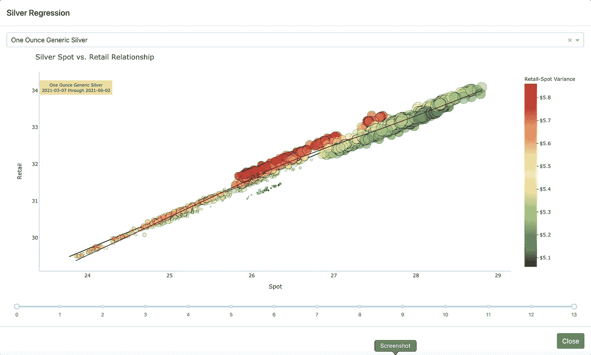
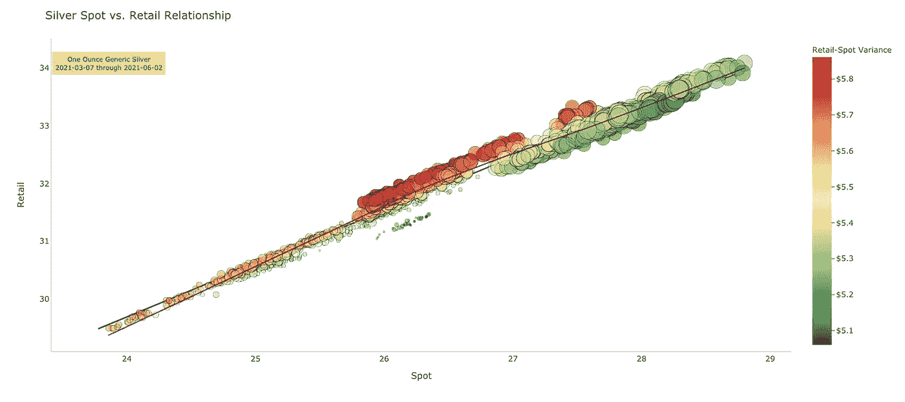

# 使用 Python 和 Dash 构建数据故事

> 原文：<https://towardsdatascience.com/building-a-data-story-with-python-and-dash-98ee4933e700?source=collection_archive---------10----------------------->

## 从数据转向可视化，用更少的资源说更多的话，同时增加一些基本设计的深度。


弗朗西斯科·温加罗摄于[佩克斯](https://www.pexels.com/photo/view-of-wooden-steps-taken-underwater-3634369/?utm_content=attributionCopyText&utm_medium=referral&utm_source=pexels)

> “有些书可以浅尝辄止，有些书可以囫囵吞下，有些书需要咀嚼消化；也就是说，有些书只能读一部分；其他人阅读，但不是好奇地；有几本书必须完整地读完，而且要用心去读。”~弗朗西斯·培根爵士

我们绝大多数的数据探索都是相对简单的。我们需要比较两个值，或者我们需要查看我们的数据在上下文中是如何出现的。因此，我们很快在我们选择的笔记本上做了一个条形图或折线图，会意地哼了一声，然后继续我们清单上的下一个项目。

有时候我们需要潜得更深。我们需要从传递的信息中再挤出一点点。我们需要把我们的视觉呈现给其他人，而不是浪费他们的时间。在其他情况下，我们只需要充分利用有限的空间。

无论如何，它要求我们更长久地思考我们正在做的事情。它可能会伴随我们一段时间。

在这篇文章中，我将带你踏上一个小小的旅程，把一个稍微复杂一点的视觉化图像放在一起，讲述一个故事。别担心。虽然我已经使用了关键字“复杂”，这将是有用的。也许不能像直接复制和粘贴那样全合一，但至少可以作为一种机制来构建自己的工具包，也许还能产生一些创造性的想法。

只是为了管理预期，这不是一个完整的应用程序走查。这将是一项艰巨的任务。这是通过我自己的一个特定应用程序，引导您完成整个过程，以获得功能性的最终结果。我们的目标是强调一些我认为在寻找答案的最常见的地方缺失的关键概念。我只希望它能帮助一些人，哪怕只是一点点。

# 为什么是 Dash？

当我第一次开始用 Python 做数据工作时，我非常喜欢 Matplotlib。这很有意义，也符合我的编程方式。很容易很快就做出一些漂亮的图，可以输出用于其他目的，如出版或发行。有一天，我需要一些东西——具体是什么，我记不清了，但它让我冲了出来。

以前，我在网上旅行时遇到过 Plotly 和 Dash，但并没有太在意。我想把事情做完，而不是花时间去学习另一个库的细微差别。但是这一次不同。介绍快速简单，让我的兴趣达到了顶峰。所以我用 Plotly 蘸了蘸我的脚趾。

我被卖了。在大约三行代码中，我有了一个令人惊叹的(至少对我来说)情节，完成了我所需要的。过了一段时间，我冒险进入 Dash，因为我看到了快速创建自己的仪表盘的好处。

我最初的几次尝试完全失败了。这是一个我力不从心的简单例子。我试图跳过简单和基本，去实现我的复杂和理想。但是，我很快就得到它，并能够为我需要的东西建立一个可用的平台。

Dash 为我提供了一个相对轻量级、响应迅速的平台，不需要大型基础设施或技术管道就能快速获得结果。事实上，它与 Plotly 携手合作是一个意外收获。

我对这个平台的一个抱怨是文档经常缺乏。它有许多跳跃，从非常简单到更高级的中级，中间没有桥梁。追查丢失的东西可能会很有挑战性。就像所有的学习领域一样，答案是从知识守卫者手中夺来的，这是一个值得赢得和奖励的胜利，但也是一个主要的痛苦。

这是我决定把这篇文章放在一起的一个重要原因。

# 关于这个例子

对一些人来说，这可能是一个深奥的例子，但我讨厌使用陈词滥调，如泰坦尼克号生存或植物学或其他一些尝试和真实的比喻。为此，我使用我自己收集的数据存储中的数据。

作为一个金融迷，我对期货市场有一种特殊的亲切感，尤其是贵金属。然而，作为一个商业香肠，我喜欢看到原材料价格和消费者零售价格之间的相互作用。因此，我的数据包括来自多个分销商的市场数据和商品零售价格，涵盖 90 天的时间。市场数据以 5 分钟为间隔收集，而零售数据以 15 分钟为间隔收集。

市场数据来自一个构造为日期时间、开盘、盘高、盘低、收盘、成交量的表(即相当标准的市场数据格式)。零售数据由日期时间、商品、经销商和价格组成。

在很大程度上，我尽了最大努力来确保我的数据是干净的，所以没有太多的摄取处理。我对数据进行的唯一修改是编写视图，将零售价格时间戳时移至最近的 5 分钟间隔。这允许市场和零售数据表之间的清晰连接。出于分析的目的，这是一个无关紧要的变化。

# 获取数据

所有的艺术都需要一些原材料。在这种情况下，我们的原材料就是数据。这是通过一个简单的查询从数据库中获得的:

```
SELECT
  date(silver.datetime) as datetime,
  DATE_PART('week', CURRENT_DATE) - DATE_PART('week', silver.datetime) + 1 AS week_number,
  item,
  price,
  close AS spot
FROM retail_silver_norm_time
  JOIN silver ON (retail_silver_norm_time.datetime = round_time(silver.datetime))
WHERE
  silver.datetime BETWEEN CURRENT_DATE-90 AND CURRENT_DATE+1
ORDER BY datetime
```

我们来分析一下。

From retail_silver_norm_time 是规范化的白银零售价格视图。银表只包含市场数据。这两个表使用它们的日期戳连接在一起。因为它们来自不同的来源，日期戳具有不同的精度，但是使用 round 函数解决了这个问题。

在新的笛卡尔积中，我只想要时间戳覆盖 90 天窗口的数据。我使用 PostgreSQL 数据库，所以我使用内置标识符“CURRENT_DATE”。这是一个便利的特性，大多数数据库都有类似的特性。

请注意，我的窗口延伸到今天以后。我这样做是以防万一，以防我得到一个奇怪的日期戳。虽然这种情况并不常见，但在没有服务质量保证的情况下处理数据时，这种情况时有发生。

现在，定义了查询的整个基础，我具体想从大表中得到什么呢？这里我选择了 silver 表的 datetime，它只提取了日期部分。为了保持一致性，我保留了相同的名称。然后，我计算“周数”的值。这将用于最终产品。之后，我提取其他三个主要数据——商品、零售价格和现货价格。

这给了我一切需要建立我的情节。

# 预处理

当我的数据从数据库中出来时，我试图让它尽可能地直接有用。然而，我有一个令人讨厌的习惯，就是在多个地方使用同一个查询的结果。这没有什么不同，所以我需要做一点数据争论来获得我需要的一切。

对于这一部分，我将查询结果放入 Pandas 数据帧。

注意:现在你可能已经注意到了，我没有深入研究那些在别处很容易找到的项目。如果您不知道如何将查询中的数据放入数据框，在快速搜索的第一页上有一些精彩的教程(比这好得多)。

无论如何，这是我用来运行我的进程的代码:

```
df = dbf.query_return(qu.silver_regression_query1)
df.columns = ['datetime', 'week_number', 'item', 'price', 'spot']
df = df_cleanup(df)
df = silver_normalizing(df)df['ps_gap'] = df.price - df.spot
df.ps_gap = df.ps_gap.round(2)
df['date'] = pd.to_datetime(df['datetime']).sub(pd.Timestamp('2021-03-01')).dt.daysdf.date = df.date / 10
df.date = df.round()silver_reg_item = df['item'].unique()
```

让我浏览一下上面的代码。

第一行和第二行只是在我的函数返回查询结果时设置数据帧。第三行通过一个通用的清理函数发送数据帧，以填补空白并执行一些我希望在这个应用程序中使用的例行程序。第四行是一个转换函数，它将商品价格标准化为一个一致的比例，这样我就可以进行比较。只是应用程序中数据的另一个细微差别。

第 5、6 和 7 行是数据列和格式的补充。第六行为现货价格和零售价格之间的差异创建了一个计算列。第六行将该值四舍五入为两位数。第七行创建一个计算列，表示自 3 月 1 日以来的天数。第 8 行和第 9 行是对第 7 行计算的修改。他们将计算出的日期放入 10 的比例中，然后四舍五入到最接近的整数。

进行这些修改的原因并不清楚，也可能令人困惑，但在我们构建图表时，它们确实有其目的。还要注意的是，其中许多可以通过各种方式进行整合，以便在运行时执行。出于本例的目的，我选择将它们分开，以使整个范围更具迭代性，更容易理解。根据您的选择进行整合。

最后一行创建一个新的 dataframe，它只包含条目列表的唯一值。这提供了一种快速简单的方式来按项目进行过滤，在这里这样做消除了另一个查询的需要。

# 破折号构造

对于某些人来说，这可能有点复杂。但是，我会详细介绍一下。

现在，我们有一个数据集存储在一个经过预处理的数据帧中，其中包括我们的数据群体。这是我们要处理的数据的总和。我已经让你知道了我的数据是如何构建这个的，但是你也可以很容易地使用你自己的数据。重要的部分是获得一组现成的数据。

我们试图得到的是一个过滤后的数据视图，它以图表的形式显示出来。为此，我们需要一些机制。

首先，我们需要一个地方来保存图表。在我的例子中，我使用引导模板(因为我的前端设计技能没有什么值得大书特书的)并填充一个模型。我提出来只是为了说明这是可能的，但实现这一点的核心只是三个基本概念:

1.  dcc。Graph —这提供了一个占位符和一个目标 id。
2.  dcc。drop down——这个控件只是给我们一个选择项目的地方。
3.  dcc。RangeSlider —该控件允许我们按日期进行筛选。

# dcc。下拉式

除了许多教程所涉及的内容之外，这里没有什么特别的。最大的方面是 1)id 和 2)填充值的循环。

```
dcc.Dropdown(
  id="silver_regresssion",
  options=[{
    'label': i,
    'value': i
  } for i in silver_reg_item],
  value='One Ounce Generic Silver')
```

id 被指定为“silver_regression”。请注意这一点，因为它稍后会回来。

该列表由 silver_reg_item 填充，这是我们在预处理的第 10 行中创建的数据帧。

# dcc。范围滑块

rangeslider 不仅可以按项目过滤(从下拉列表中)，还可以按日期限制视图。或者在这种情况下，与其说是日期，不如说是从当前周开始的周数。

```
dcc.RangeSlider(
  id='silver_week_slider',
  min=df['week_number'].min(),
  max=df['week_number'].max(),
  value=[
    df['week_number'].min(), 
    df['week_number'].max()
  ],
  marks={int(n): n-1 for n in df['week_number'].unique()},
  step=None
)
```

像以前一样，这些都是从例子中一字不差地摘录下来的。

这是为什么在预处理中使用硬编码值的一个很好的例子。正如您在最小值、最大值和值字段中看到的，所有这些都是基于 dataframe 列值的函数。这些本来是可以动态执行的，但是这会使代码变得更加不明显。

当你创造各种各样的展示时，为了你自己和你之后的人，试着先思考整个过程。早走一步往往可以避免以后的一些麻烦。

# dcc。图表

```
dcc.Graph(id='silverReg')
```

说真的，正如我之前所说的，Graph 对象只是给了我们一个目标 id。

# 回电

从长远来看，试镜对我来说是最难理解的事情。它们看起来不直观，解释也不充分。只是在经历了大量的尝试和错误之后，终于有所发现。我也知道不能只有我一个人。所以让我试着用一种我希望是在我学习的时候的方式把这说得更清楚。

回调装饰器使用一些语句来创建接口组件和执行的逻辑之间的管道。使用这种安排，我们可以制作一些高度交互的复杂应用程序。

装饰器中的每个语句都由其功能来表示:输入、输出或状态。输入是反馈给回调的数据。输出是离开回调的数据。状态是当前状态。

对于每个语句，我们有两个维度——相关组件的 id 和数据包。这就是为什么所有的组件都需要被清晰地定义和调用。

这是我的回调装饰器:

```
@app.callback(
  dash.dependencies.Output('silverReg', 'figure'),
  [
    dash.dependencies.Input('silver_regresssion', 'value'),
    dash.dependencies.Input('silver_week_slider', 'value')
  ]
)
```

我们可以看到我们有两个输入语句。这些分别与 dropdown id 和 rangeslider id 相关。列表中的第二项是值。

类似地，我们的 output 语句记录了目标 id，返回的数据将是一个数字。这和我们的 dcc 吻合。图形对象。

# 超越室内设计师

一旦我们确定了输入和输出，并在应用程序主体和逻辑语句之间创建了链接，我们就可以构建后端了。可以说，这是金属与道路相遇的地方，并以一种功能的形式出现。

我将把这些拼凑起来，带您浏览逻辑决策，希望您能理解正在发生的事情及其原因:

```
def update_graph(silver_reg_item, week_num):
  if silver_reg_item is None:
    silver_reg_item = "One Ounce Generic Silver"

  if week_num is None:
    first_week = 52
    last_week = 0
  else:
    first_week = week_num[0]
    last_week = week_num[1]
```

我们的第一行是基本的函数定义。它需要两个参数，这很方便，因为我们的装饰者获得了两个输入(请注意幽默)。

其余的顶部行用于设置默认状态。在 Dash 应用程序中，所有回调都在启动时触发，因此您必须考虑这一点。

第一个条件是定义一个默认项目。第二个条件创建一个默认范围。由于组件中有默认值，这应该不是问题，但如果是，它会创建一个不会破坏任何东西的良好的软状态。

# 处理

数据处理似乎永远不会结束，对吗？在这里也是如此。由于我们将数据框架过滤成一个特定于项目和日期的框架，因此我们需要实现所有这些，然后执行一些直接计算:

```
df1 = df[df['item'] == silver_reg_item].copy()
df1 = df1[(df1['week_number'] >= first_week) & (df1['week_number'] <= last_week)]y_max = df1.price.max()
x_min = df1.spot.min()X = df1['price'].values.reshape(-1,1)
Y = df1['spot'].values.reshape(-1,1)linear_regressor = LinearRegression()
linear_regressor.fit(X,Y)df1['Y_pred'] = linear_regressor.predict(X)
```

这一部分做了几件事。首先，上面两行执行过滤。第一行按项目过滤主数据帧并创建一个副本。我们创建一个副本，这样我们就不会丢失原始主数据帧，并可以继续从中提取数据。第二行根据范围值过滤新的数据帧。这就给我们留下了简短的数据框架。

接下来，我想对数据进行线性回归。这是通过 SciKit 学习库完成的，需要将 dataframe 列转换为 numpy 数组。

第三和第四行从数据帧中分离出最小值和最大值的两个值。这些稍后会用到。

第五行和第六行将现货和价格的 dataframe 列重组为必要的数组。第七行和第八行调用函数，第九行生成一个包含基于它的值的列。这也可以在 Plotly 中直接完成，但我想改为像这样执行函数。

# 图表

我们在这里。我们一直在构建的代码:

```
fig = px.scatter(
  df1,
  y='price',
  x='spot',
  size=(df1.date * df1.date) * 2,
  opacity=.5,
  color='ps_gap',
  trendline="lowess",
  trendline_color_override="purple",
  hover_data=["datetime", "price", "spot"],
  color_continuous_scale=px.colors.diverging.RdYlGn_r,
  range_color=[df1.ps_gap.min(),df1.ps_gap.max()]
)
```

这是主要情节。它是一个 plotly express 对象，使用我们在前面的过程中创建的 df1 数据帧。作为散点图，它使用现货对零售价格。

如果我把这个图留在那里，它将是一个非常无聊的散点，会提供信息，但不会尽可能多。这是我添加了一些维度的地方。

使用 size 参数，我建立了一种方法，其中使用经过预处理的数据，大小根据距离而变化。随着日期越来越远(或越来越接近 3 月 1 日)，尺寸会越来越小。越近的数据点越大。我一眼就能看出仅基于规模的相关性。

第二，我想要一个清晰简洁的方法来识别差异。为此，我使用了颜色和颜色渐变。每个标记的颜色基于“ps_gap”值，但是这些颜色是使用“px.colors.diverging.RdYlGn_r”标度专门选择的。这是一个相对较高的对比度，具有良好的区分度。末尾的“_r”反转渐变。最后，该范围是动态的，基于 ps_gap 列中的最小值和最大值。

这一部分的几个细节是，我将不透明度定义为 0.5，以便在聚类组中提供一些强度变化，并且我添加了一条默认的 LOWESS 趋势线。趋势线是一条平滑的趋势线，补充了上面计算的线性回归。

```
fig.add_traces(go.Scatter(
  y = df1['price'],
  x = df1.Y_pred,
  name='Regression',
  showlegend=False,
  line_width=2,
  line_color='black',
))
```

下一个加法是线性回归。为此，我们简单地在图中添加一个轨迹。您可能会注意到这是一个标准 plotly Graph 对象，而不是 plotly express 对象。可以，可以混搭。

此追踪将零售价格作为 Y 值，并将 X 值设置为等于计算的预测值。(是的，我知道那里发生了什么)

当我将图表打印到文件中时，我意识到一个挑战，那就是它往往会丢失上下文。我没有下拉菜单或任何其他标识符来告诉我我在看什么。所以，解决这个挑战的简单方法是用一个注释:

```
fig.add_annotation(
  y=y_max, 
  x=x_min,
  text=silver_reg_item + "<br>" +
    str(df1.datetime.min()) + " through " +
    str(df1.datetime.max()),
  showarrow=False,
  font_size=10,
  bordercolor='rgba(255,255,255,0.8)',
  bgcolor='rgba(235,171,52,0.5)',
  borderpad=5
)
```

该注释根据我们在处理部分定义的最小-最大值来设置位置。这有助于在不修改轴的情况下，没有很多复杂的麻烦地解决问题。

最后一步只是一些格式化:

```
fig.update_traces(marker=dict(
  line=dict(
    width=1,
    color='black')),
  selector=dict(mode='markers'))fig.update_layout(
  title="Silver Spot vs. Retail Relationship",
  plot_bgcolor="#FFFFFF",
  xaxis=dict(
    title="Spot",
    linecolor="#BCCCDC"
  ),
  yaxis=dict(
    title="Retail",
    linecolor="#BCCCDC"
  ),
  coloraxis_colorbar=dict(
    title="Retail-Spot Variance",
    ticks="outside",
    tickprefix="$")
)
```

第一次更新概述了痕迹。这让它们更容易区分。布局的第二次更新设置了标题、轴细节，并格式化了颜色条。

我们做的最后一件事是返回完整的数字:

```
return fig
```

这将获得完整的 Plotly 图形，并将其推到 dcc 中的占位符。装饰器中定义的图形。然后 Dash 完成剩下的工作。

# 最后的结果



辉煌的仪表板

上图是图表在应用程序中的样子。在顶部，我们可以看到下拉菜单，在底部，我们可以看到范围滑块。但是，当我们保存图像时，我们会得到以下结果:



保存的图表

如前所述，保存的图表具有更少的上下文。这使得注释更加重要。

# 最后的想法

我们走了很长一段路才走到今天，但我想确保关注的不仅仅是呈现的数据的维度，还有幕后的东西。最终的图表既简单又复杂。很好的搭配。

粗略地看一下，我们可以看到数据之间的关系，正如我们对这种散点图的预期。然而，如果我们真的检查它，我们不仅会被轴值吸引，还会被大小和颜色吸引。它用更多同样重要的元素来完善这个故事。

作为一个思维实验，如果我们不考虑尺寸和颜色，我们需要什么来呈现这些数据呢？还有多少其他图表？什么类型的图表？会有效果还是房地产成本太贵？

想象就像写作。我们错开句子结构。有些想法是迅速而明显的。其他的比较密集，需要慎重考虑。但是我们调整每件事的节奏，让我们的观众理解我们需要他们做什么。

有时候，一个非常简单直接的视觉就足够了。其他时候，我们需要挖掘复杂性。最好的方法，尤其是在构建一个内聚的仪表板或报告时，是构建我们需要说的内容。这需要以适当的方式优雅地组合我们的数据，让我们的结论被理解——或者让我们的观众得出他们自己的结论。

最后，进行实验。有些想法行得通，有些则会落空。但是，如果您理解了我在这里抛出的内容，那么您就已经有了构建自己的测试环境来探索数据的概念和工具的开端。