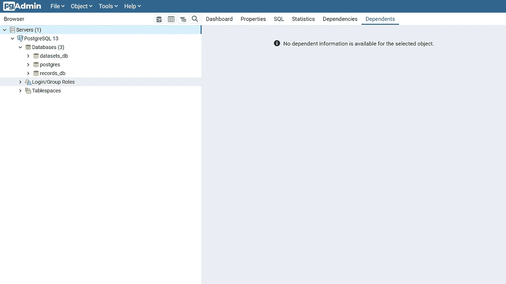
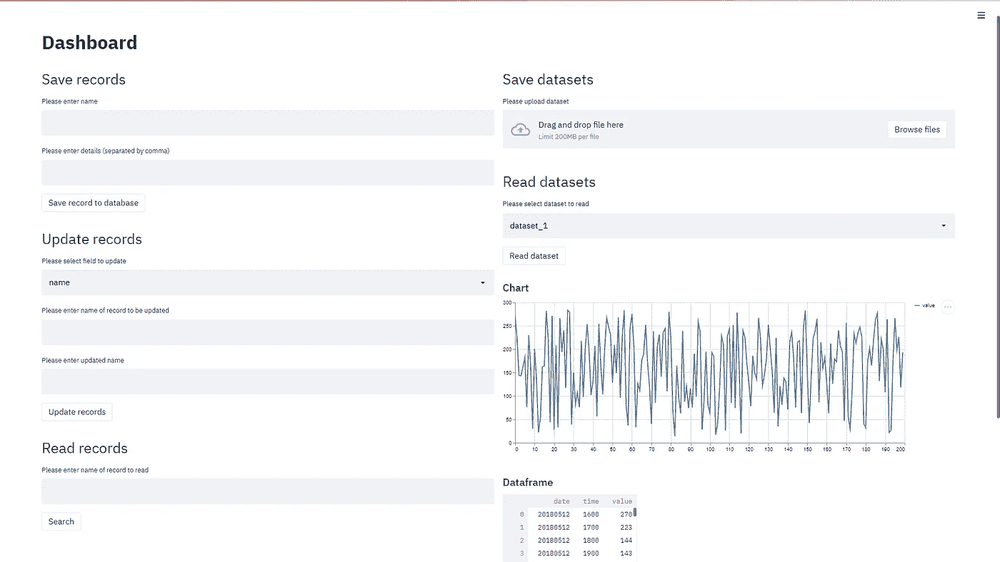

# 使用 PostgreSQL 在 Python 中构建数据仓库

> 原文：<https://towardsdatascience.com/building-a-data-warehouse-in-python-using-postgresql-f10dce22e3aa?source=collection_archive---------2----------------------->

## 一种简化的方法来提供健壮且可扩展的数据仓库


娜娜·斯米尔诺娃在 [Unsplash](https://unsplash.com?utm_source=medium&utm_medium=referral) 上的照片

## 介绍

随着当今时代数据的丰富和激增，有一种以有意义的方式存储和重用这些信息财富的内在需求。这就好比厨房里堆满了各种各样的用具和工具，却没有一种有组织的方式来管理它们。嗯，除非你囤积得很快，否则你很可能会用勺子的后端来打开你的午餐罐头。

数据仓库能够以前所未有的方式按需缓存、标记、分析和重用您管理的数据。就像你母亲在她整洁有序的厨房里导航一样。请注意，没有放之四海而皆准的解决方案，有多少个仓库就有多少种建仓方式。

可以说，实现成功的数据仓库有三个关键因素:

1.  **服务器:**首先，您必须提供一个既健壮又有弹性的分布式数据库系统。
2.  索引:理想情况下，你的数据库系统应该有某种形式的索引，允许你以极快的速度访问记录。拥有一个全文索引将是一个额外的收获。
3.  **Dashboard:** 你应该有一个暂存区，在这里你可以以一种不变的方式导入、导出、可视化和改变你的数据。

在本教程中，我们将通过创建一个数据仓库来解决上面提到的第一点和最后一点，我们可以在其中存储数据集、数组和记录。此外，我们将创建一个仪表板，在那里我们可以用图形界面与我们的仓库加载，检索，变异和可视化我们的数据。或许在另一篇文章中，我们将实现第二点，即全文索引数据库。

## 服务器:PostgreSQL

PostgreSQL，简称 Postgres，是一个开放源代码的关系数据库系统，由于其扩展的功能和相对易用性，它通常是开发人员的首选数据库。尽管它被标榜为结构化数据库管理系统，但它也可以存储非结构化数据，包括但不限于数组和二进制对象。然而，最重要的是，Postgres 的图形用户界面使得动态提供和管理数据库变得太容易了，这是其他数据库系统应该注意的。

在我们的数据仓库实现中，我们将使用本地 Postgres 服务器来存储我们所有的数据。在我们继续之前，请使用[此链接](https://www.postgresql.org/download/)下载并安装 Postgres。在安装过程中，系统会提示您设置用户名、密码和本地 TCP 端口以连接到您的服务器。默认端口是 5432，您可以保持不变，也可以根据需要进行修改。安装完成后，您可以通过运行 **pgAdmin 4** 应用程序登录服务器，该应用程序将在您的浏览器上打开一个门户，如下所示。



PostgreSQL 服务器门户。图片作者。

将会有一个默认的数据库，标签为 **postgres** ，但是您可以通过右击 **Databases** 菜单，然后选择 **Create** 来创建您自己的数据库，以提供一个新的数据库。

## Python 实现

现在您已经提供了您的服务器和数据库，您应该安装软件包 **sqlalchemy** ，它将用于通过 Python 连接到我们的数据库。您可以通过在 Anaconda 提示符下键入以下命令来下载并安装这个软件包:

```
pip install sqlalchemy
```

此外，下载、安装并导入所有其他必要的库到 Python 脚本中，如下所示:

首先，我们需要在我们的 **records_db** 数据库之间建立一个连接，并创建一个可以存储记录和数组的表。此外，我们需要创建另一个到 **datasets_db** 数据库的连接，我们将在其中存储数据集:

按照 Postgres 的命名约定，表名必须以下划线或字母(不是数字)开头，不能包含破折号，并且长度必须少于 64 个字符。对于我们的**记录**表，我们将创建一个数据类型为**文本**的**名称**字段，声明为**主键**，以及一个数据类型为**细节**的**文本[]** 字段，这是一个一维数组的 Postgres 表示法。要获得 Postgres 支持的所有数据类型的详尽列表，请参考此[链接](https://www.postgresql.org/docs/9.5/datatype.html)。我们将使用**名称**字段作为主键，稍后将用于搜索记录。此外，请注意，存储您的数据库凭证的一种更安全的方式是将它们保存在一个[配置文件](https://medium.com/@t.rosen2101/how-to-create-a-gitignore-file-to-hide-your-api-keys-95b3e6692e41)中，然后在您的代码中将它们作为参数调用。

随后，我们将创建以下五个函数来写入、更新、读取和列出数据库中的数据:

将字符串连接到查询时，请注意 SQL 注入漏洞。您可以使用参数化来防止 SQL 注入，如本文[中的](https://www.w3schools.com/sql/sql_injection.asp)所述。

## 仪表板:简化

Streamlit 是一个纯 Python web 框架，允许您在指尖实时开发和部署用户界面和应用程序。在本教程中，我们将使用 Streamlit 来呈现一个仪表板，我们可以用它来与 Postgres 数据库进行交互。

在下面的代码片段中，我们使用了几个文本输入小部件来插入数据集的记录、数组和名称的值。此外，我们正在使用 Streamlit 的功能，以图表和数据框的形式交互式地可视化我们的数据集。

您可以在本地浏览器上运行仪表板，方法是在 Anaconda 提示符下键入以下命令。首先，将根目录更改为保存源代码的位置:

```
cd C:/Users/...
```

然后键入以下内容运行您的应用程序:

```
streamlit run file_name.py
```

## 结果

这就是你要的，一个可以用来实时标记、写入、读取、更新、上传和可视化我们的数据的控制面板。我们的数据仓库的美妙之处在于，它可以扩展到托管您可能需要的尽可能多的数据，所有这些都在我们刚刚创建的同一结构中！如果你想了解更多关于数据仓库的基础知识，我建议你报名参加科罗拉多大学关于[数据仓库](https://click.linksynergy.com/deeplink?id=hOGDdF2uhHQ&mid=40328&murl=https%3A%2F%2Fwww.coursera.org%2Fspecializations%2Fdata-warehousing)的课程。这是提高速度的好方法。



如果您想了解更多关于数据可视化和 Python 的知识，请随时查看以下(附属链接)课程:

## 使用 Streamlit 开发 Web 应用程序:

[](https://www.amazon.com/Web-Application-Development-Streamlit-Applications/dp/1484281101?&linkCode=ll1&tag=mkhorasani09-20&linkId=a0cb2bc17df598006fd9029c58792a6b&language=en_US&ref_=as_li_ss_tl) [## 使用 Streamlit 开发 Web 应用程序:开发和部署安全且可伸缩的 Web 应用程序…

### 使用 Streamlit 开发 Web 应用程序:使用……开发安全且可扩展的 Web 应用程序并将其部署到云中

www.amazon.com](https://www.amazon.com/Web-Application-Development-Streamlit-Applications/dp/1484281101?&linkCode=ll1&tag=mkhorasani09-20&linkId=a0cb2bc17df598006fd9029c58792a6b&language=en_US&ref_=as_li_ss_tl) 

## 使用 Python 实现数据可视化:

[](https://www.coursera.org/learn/python-for-data-visualization?irclickid=xgMQ4KWb%3AxyIWO7Uo7Vva0OcUkGQgW2aEwvr1c0&irgwc=1&utm_medium=partners&utm_source=impact&utm_campaign=3308031&utm_content=b2c) [## 用 Python 实现数据可视化

### “一图胜千言”。我们都熟悉这个表达。它尤其适用于试图…

www.coursera.org](https://www.coursera.org/learn/python-for-data-visualization?irclickid=xgMQ4KWb%3AxyIWO7Uo7Vva0OcUkGQgW2aEwvr1c0&irgwc=1&utm_medium=partners&utm_source=impact&utm_campaign=3308031&utm_content=b2c) 

## 面向所有人的 Python 专业化:

[](https://www.coursera.org/specializations/python?irclickid=xgMQ4KWb%3AxyIWO7Uo7Vva0OcUkGQgW16Ewvr1c0&irgwc=1&utm_medium=partners&utm_source=impact&utm_campaign=3308031&utm_content=b2c) [## 面向所有人的 Python

### 学习用 Python 编程和分析数据。开发收集、清理、分析和可视化数据的程序…

www.coursera.org](https://www.coursera.org/specializations/python?irclickid=xgMQ4KWb%3AxyIWO7Uo7Vva0OcUkGQgW16Ewvr1c0&irgwc=1&utm_medium=partners&utm_source=impact&utm_campaign=3308031&utm_content=b2c) 

## GitHub 资源库:

[](https://github.com/mkhorasani/data_warehouse) [## mkhorasani/数据仓库

### 使用 PostgreSQL 在 Python 中构建数据仓库

github.com](https://github.com/mkhorasani/data_warehouse) 

# 新到中？您可以在此订阅并解锁无限文章[。](https://khorasani.medium.com/membership)