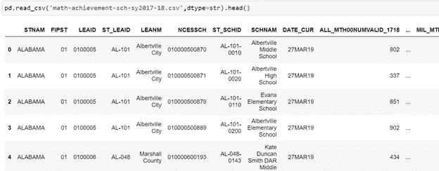
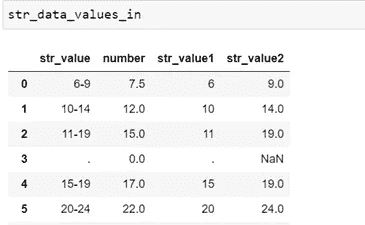
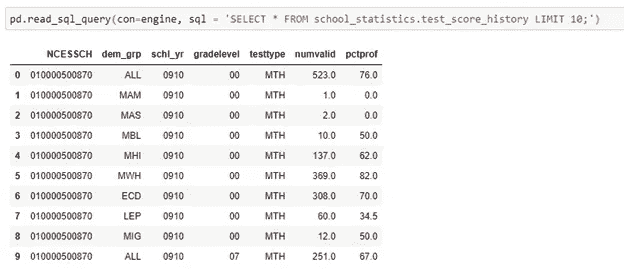
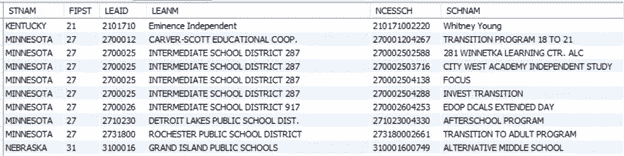

# 从联邦学校测试数据中建立数据库

> 原文：<https://towardsdatascience.com/building-a-database-from-federal-school-test-data-128707fa46e7?source=collection_archive---------23----------------------->

乔治·李在 Unsplash 上的照片

# 在关系数据库中组织国家教育统计中心(NCES)的数据

# 介绍

作为两个孩子的父母，我和妻子研究了美国几个城市的学校质量。这项研究产生了一些流行的网站，这些网站展示了各个学校质量的各种衡量标准。两个最受欢迎的提供学校质量信息的网站是 GreatSchools.org 和 Niche.com。作为一名数据专家，我想知道这些网站从哪里获得数据。这两个网站都使用了美国教育部国家教育统计中心(NCES)提供的数据(GreatSchools.org 也使用了相当多的州教育部门的数据，比联邦数据更详细)。

在这一系列文章中，我将分享我下载和重构大量数据集的过程。首先，我将使用 Python 来重组数据，将其加载到 Mysql 数据库中，然后我将使用 Python 的一些流行的数据科学库来做一些特别的研究项目。

这第一篇文章的主要目标是介绍我如何成功地使用 Pandas 将从 NCES 获得的 10 年学校级考试成绩加载到 MySQL 数据库中。通过将这些数据加载到关系数据库格式中，我的目标是使大量的分析任务更加有效，因为我将在以后的文章中更深入地研究这些数据。希望这对那些对探索 Pandas 的 SQL 能力感兴趣的人有所帮助。

# 工具

本系列中的工作将使用几个流行的 Python 库和 MySQL 来执行，并可能使用一些其他工具来节省我的时间。

对于本文，我将使用 4 个 Python 库:Pandas 将用于数据处理任务，OS 和 GLOB 将用于访问目录和文件，SQLAlchemy 将用于连接我将加载数据的 MySQL 数据库。

# 数据

NCES 每年都会提供一套学校和地区级的绩效档案。每个学校级别的绩效文件显示了每个参与评估的美国学校在评估年度的全部结果。2017–2018 文件共有 265 列。前 9 列包含有关学校和数据收集年份的信息。额外的列包含被评估的学生数量和全校被认为熟练的百分比(熟练百分比),并按各种人口统计和种族群体进行细分。关于文件结构的详细信息可以在美国教育部的 [EDFacts 数据文件](https://www2.ed.gov/about/inits/ed/edfacts/data-files/index.html)网站上找到。对于这个项目，我已经保存了从 2009-2010 学年到 2018-2019 学年的所有学校级绩效文件。

# 构建数据管道

首先，我将导入要使用的库，并建立到 MySQL 数据库的连接。

接下来，我使用 SQLAlchemy 库建立了一个数据库连接，我们稍后将使用它来加载重构的学校级别的性能数据。对于 SQLAlchemy 数据库连接，一个重要的建议是，在建立连接时，将 echo 参数设置为 false，这是我从惨痛的教训中学到的。如果您按照我这里的步骤操作，您将会以 10，000 个数据块的形式向数据库写入数百万行。您不会希望每次成功执行写命令时都将日志写入笔记本。我在一个 jupyter 笔记本上犯了这个错误，写了几个小时数据就用完了内存。对于需要写入数据库的额外任务，我下载了笔记本。py 文件，并从命令行运行它。

最后，本文的主要目标是通过 Pandas 工具将这些数据加载到数据库中。所有重新格式化数据和将字符串值映射到数值的工作都是使用一个类完成的。虽然它们对于让您的程序在 Python 中工作并不重要，但我发现编写类有助于提高代码的可读性和组织不同的函数，以便它们能够很好地协同工作。

在这种情况下，Python 类将完成 5 个主要任务来为我的数据库准备数据:1)读取 csv 文件，2)找到测试分数数据所在的列，3)选择包含学校身份信息(例如，名称、州、机构等)的列，4)处理参与和分数信息并将数据堆叠为垂直格式，5)将测试分数数据中包含的字符串值转换为数值，以便在存储到数据库中时进行分析。

完成这些步骤后，转换后的数据将使用实体属性值(EAV)数据模型存储在我的数据库中。EAV 模型将使我们能够消除数据中的空值，并有效地存储数据以备后用。对于我们的 EAV 模型，每个实体将是一所学校，属性将是学校学生不同分组的测试结果。

处理年度绩效文件的步骤如下:

我用两个参数实例化了这个类。“file”参数将我们引向我们将要处理的文件,“str_replmts”参数是一个字典，它将性能文件的原始版本中包含的字符串值映射到已经定义并存储在字典中的数字替换。

接下来，我创建了一个函数，它识别并构建文件中存储测试分数参与和结果的列的列表。

接下来，有三个不同的函数用于选择包含关于学校的元数据的列。不同的函数需要考虑不同年份之间列名的细微变化。

接下来的两个函数将用于将测试分数数据转换成 EAV 数据格式。在我们的堆栈函数中调用这个转换函数，将字符串值转换成数字。

这个函数利用了将字符串值映射到数字的字典。一旦我们将数据加载到我们的数据库中，以数字形式存储考试分数数据对于促进分析将是非常重要的。这一步是必要的，因为 NCES 文件根据注册参与者的数量存储特定学生统计组的熟练程度分数。采取这项措施是为了保护学生的隐私。例如，为了使这些数据可用于分析目的，必须将字符串值“LE10”(代表“小于或等于 10%的熟练程度”)转换为数值。为了对数据集中的所有字符串值完成这个过程，我收集了所有数据文件中所有字符串值的列表，并在一个 csv 文件中手动执行映射。开发这个映射文件的完整过程超出了本文的范围。映射文件如下所示:

这个文件被转换成一个字典，这样它就可以用来将字符串映射成数字。

类中包含最多功能的函数是最终的 get_scores_data。该函数执行一系列任务，将测试分数数据转换为 EAV 格式，我将使用该格式将数据存储在我的 MySql 数据库中。

这个函数完成 4 个主要任务:1)它选择学校 id 和包含测试分数数据的列，2)它垂直堆叠数据，3)它解析列标题中包含的元数据(例如，什么人口统计组，什么科目，等等。)放入单独的列中，以便在数据加载到数据库中后更容易进行过滤，以及 4)它用上面的“str_replace”字典中的映射值替换非数值。

任务 1:选择学校 id 和包含测试分数数据的列

任务 2:垂直堆叠数据

任务 3:将每一列的元数据解析到单独的字段中。

任务 3:用映射值替换非数字:

在文件准备好写入数据库之前，此函数执行的最后一个操作是过滤/连接操作，该操作创建最终数据集，其中并排显示每个独特年份/人口统计组的参与者数量和熟练程度百分比。

为了对 NCES 文件执行这些操作，我使用了一个 for 循环来处理每个文件，并将其加载到 MySQL 数据库中。

请注意，我在 Pandas 的 to_sql 函数中使用了“chunksize”参数。在后台，SQL Alchemy 正在对 MySQL 数据库执行写语句。需要限制这些语句的长度(原因超出了本文的范围)，将每个写命令的长度限制为 10k 记录似乎会阻止数据库关闭连接。关于这个 for 循环的另一个重要注意事项是，在将 for 循环中的下一个文件放入内存进行处理之前,' del data '语句将删除刚刚加载的数据帧。如果您在内存有限的机器上工作，这可能会很有帮助。

在一台配有 4 个内核和 16GB 内存的 Windows PC 上，对所有文件运行这个 for 循环大约需要 8 个小时。

下面是加载 10 年的性能数据后，我们的最终数据库表的示例。

除了在 EAV 模型中加载学校绩效数据之外。我还需要存储每个学校的附加元数据，以便在不同学校之间和内部进行分析。

我通过调用不同版本的 get_school_index 函数完成了最后一项任务，创建该函数是为了考虑每年文件格式的细微变化，将结果连接到一个数据帧中，然后将该数据帧加载到我的 MySQL 数据库中的一个表中。

一旦加载到数据库中，数据看起来就像这样。

# 概述

概括地说，我们刚刚使用 Pandas 和其他一些库将大量与美国公立学校考试成绩相关的历史数据加载到 MySQL 数据库中。希望本文能帮助您理解这个数据集，并为您提供一些关于如何使用当代数据处理工具和技术转换和加载数据的想法。感谢阅读！